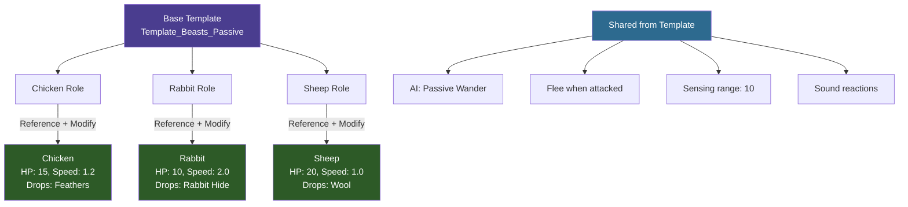
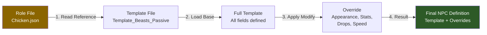

## Descripción general

El sistema de configuración de Hytale utiliza un modelo de herencia de plantillas. En lugar de definir cada campo para cada entidad, creas plantillas base con propiedades compartidas y luego las extiendes con sobrecargas específicas. Este patrón aparece en roles de NPCs, objetos, configuraciones de juego y tipos de daño.

## Cómo funciona la herencia



### Orden de resolución



## Mecanismos de herencia

### Reference + Modify (Roles de NPC)

El patrón más común para NPCs. El campo `Reference` apunta a una plantilla, y `Modify` sobrescribe campos específicos:

```json
{
  "Reference": "Template_Beasts_Passive_Critter",
  "Modify": {
    "Appearance": "Chicken",
    "MaxHealth": 10,
    "MaxSpeed": 3.0,
    "DropList": "Drop_Chicken",
    "NameTranslationKey": "server.npc.chicken.name"
  }
}
```

El NPC resultante hereda todas las propiedades de `Template_Beasts_Passive_Critter` (comportamiento de IA, rango de visión, audición, patrones de manada, etc.) y solo sobrescribe los cinco campos listados en `Modify`.

### Parent (Objetos, Configuraciones)

Los objetos y configuraciones de juego usan un campo `Parent` para herencia de un solo nivel:

```json
{
  "Parent": "Template_Food",
  "TranslationProperties": {
    "Name": "server.items.food_bread.name",
    "Description": "server.items.food_bread.description"
  },
  "Quality": "Uncommon",
  "Recipe": {
    "Input": [{ "ItemId": "Ingredient_Dough", "Quantity": 1 }],
    "Output": [{ "ItemId": "Food_Bread", "Quantity": 1 }],
    "BenchRequirement": { "Type": "Processing", "Id": "Cookingbench" },
    "TimeSeconds": 8
  }
}
```

### Inherits (Tipos de daño)

Los tipos de daño usan `Inherits` para jerarquías de clasificación:

```json
{
  "Inherits": "Physical"
}
```

Esto crea una cadena: `Bludgeoning` hereda de `Physical`, que hereda del tipo base `Damage`.

### Tipo Variant

Algunos archivos de NPC usan `"Type": "Variant"` para definir múltiples variaciones de la misma entidad base:

```json
{
  "Type": "Variant",
  "Reference": "Template_Livestock_Cow",
  "Modify": {
    "Appearance": "Cow_Brown"
  }
}
```

## Parameters y Compute

Las plantillas pueden definir parámetros con valores predeterminados, que las entidades concretas pueden sobrescribir:

```json
{
  "Parameters": {
    "BaseHealth": {
      "Value": 100,
      "Description": "Base health for this NPC tier"
    },
    "SpeedMultiplier": {
      "Value": 1.0,
      "Description": "Movement speed modifier"
    }
  },
  "MaxHealth": { "Compute": "BaseHealth" },
  "MaxSpeed": { "Compute": "4.0 * SpeedMultiplier" }
}
```

Una entidad hija sobrescribe los parámetros para cambiar los valores calculados sin redefinir las fórmulas.

## Jerarquía de plantillas

Las plantillas se organizan típicamente en directorios `_Core/Templates/`:

```
Server/NPC/Roles/
├── _Core/
│   └── Templates/
│       ├── Template_Beasts_Passive_Critter.json
│       ├── Template_Beasts_Hostile.json
│       ├── Template_Livestock_Cow.json
│       └── Template_Intelligent_Villager.json
├── Critter/
│   ├── Chicken.json          (References Template_Beasts_Passive_Critter)
│   └── Rabbit.json           (References Template_Beasts_Passive_Critter)
└── Beast/
    ├── Bear_Grizzly.json     (References Template_Beasts_Hostile)
    └── Wolf.json             (References Template_Beasts_Hostile)
```

## Mejores prácticas

- **Siempre referencia una plantilla** al crear nuevas entidades — no definas cada campo desde cero
- **Solo sobrescribe lo que sea diferente** — mantén los bloques `Modify` pequeños
- **Usa Parameters para ajustes** — facilita el balanceo sin tocar las fórmulas
- **Revisa la plantilla primero** — lee el archivo de plantilla para entender qué valores predeterminados heredas

## Páginas relacionadas

- [Roles de NPC](/hytale-modding-docs/reference/npc-system/npc-roles/) — donde Reference/Modify se usa más
- [Plantillas de NPC](/hytale-modding-docs/reference/npc-system/npc-templates/) — plantillas base disponibles
- [Definiciones de objetos](/hytale-modding-docs/reference/item-system/item-definitions/) — herencia Parent para objetos
- [Tipos de daño](/hytale-modding-docs/reference/combat-and-projectiles/damage-types/) — jerarquía Inherits
