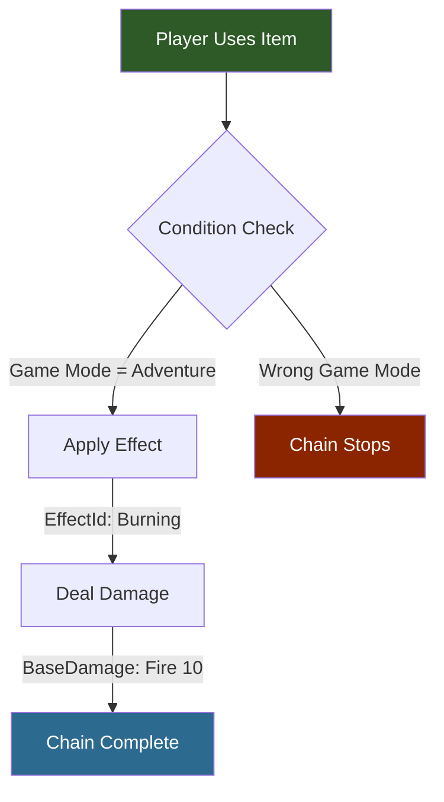
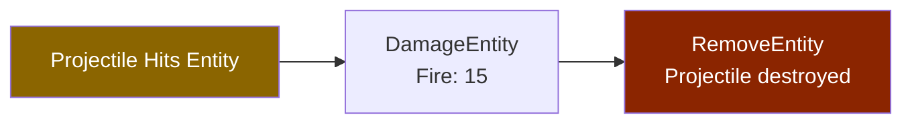
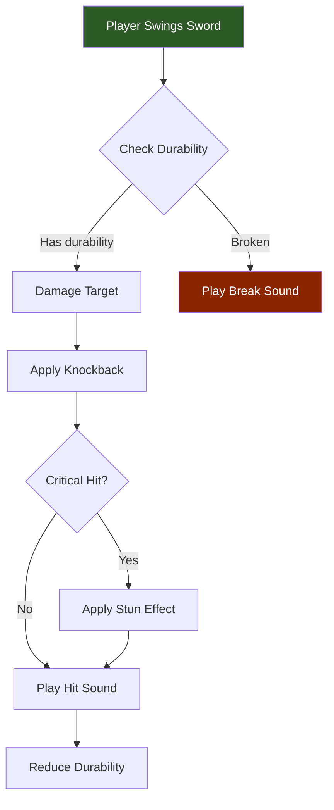

## Descripción general

Hytale construye comportamientos de juego complejos encadenando interacciones simples. Cada interacción tiene un `Type` y un campo opcional `Next` que apunta a la siguiente acción. Esto crea pipelines secuenciales que pueden incluir condiciones, daño, efectos, sonidos y más.

## Cómo funcionan las cadenas de interacción



### Cadena de impacto de proyectil



### Cadena de arma compleja



## Estructura de la cadena

```json
{
  "Type": "Condition",
  "RequiredGameMode": "Adventure",
  "Next": {
    "Type": "ApplyEffect",
    "EffectId": "Burning",
    "Next": {
      "Type": "Damage",
      "DamageCalculator": {
        "BaseDamage": { "Fire": 10 }
      }
    }
  }
}
```

Esta cadena: verifica el modo de juego -> aplica efecto de quemadura -> inflige daño de fuego.

## Tipos de interacción

| Type | Propósito | Campos clave |
|------|-----------|--------------|
| `Condition` | Filtro basado en requisitos | `RequiredGameMode` |
| `ApplyEffect` | Aplica un efecto de estado | `EffectId` |
| `Damage` | Inflige daño | `DamageCalculator`, `BaseDamage` |
| `DamageEntity` | Daño al impactar proyectil | `DamageCalculator` |
| `RemoveEntity` | Destruye la entidad | — |
| `Simple` | Interacción básica | Varía |
| `Consume` | Usa un objeto consumible | `Consume_Charge`, efectos |

## Dónde se usan las cadenas

- **Interacciones de objetos** (`Server/Item/Interactions/`) — romper bloques, uso de herramientas
- **Configuraciones de proyectiles** (`Server/ProjectileConfigs/`) — acciones al impactar y rebotar
- **Acciones de NPC** — secuencias de habilidades de combate

## Ejemplo de interacción de proyectil

```json
{
  "Interactions": {
    "ProjectileHit": {
      "Cooldown": 0,
      "Interactions": [
        {
          "Type": "DamageEntity",
          "DamageCalculator": { "BaseDamage": { "Fire": 15 } },
          "Next": {
            "Type": "RemoveEntity"
          }
        }
      ]
    }
  }
}
```

## Páginas relacionadas

- [Interacciones de objetos](/hytale-modding-docs/reference/item-system/item-interactions/) — cadenas de interacción de bloques y objetos
- [Configuraciones de proyectiles](/hytale-modding-docs/reference/combat-and-projectiles/projectile-configs/) — cadenas de eventos de proyectiles
- [Tipos de daño](/hytale-modding-docs/reference/combat-and-projectiles/damage-types/) — jerarquía de tipos de daño
