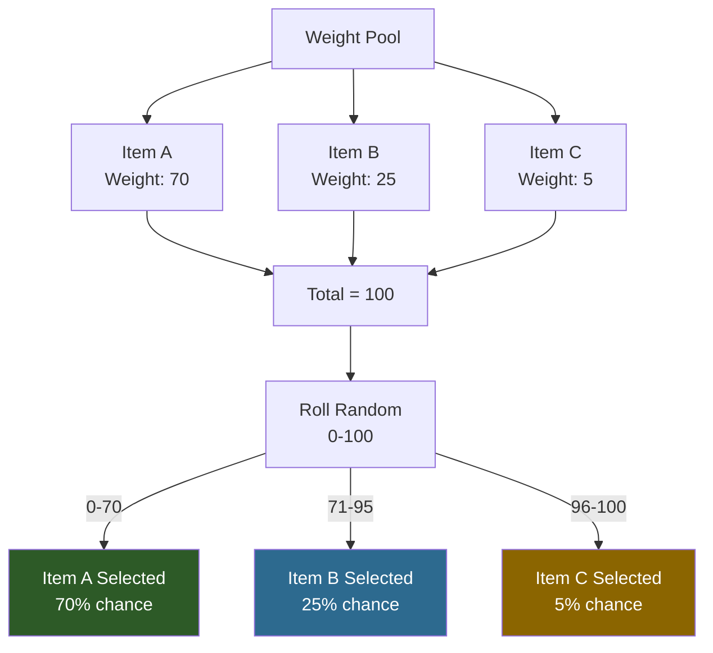
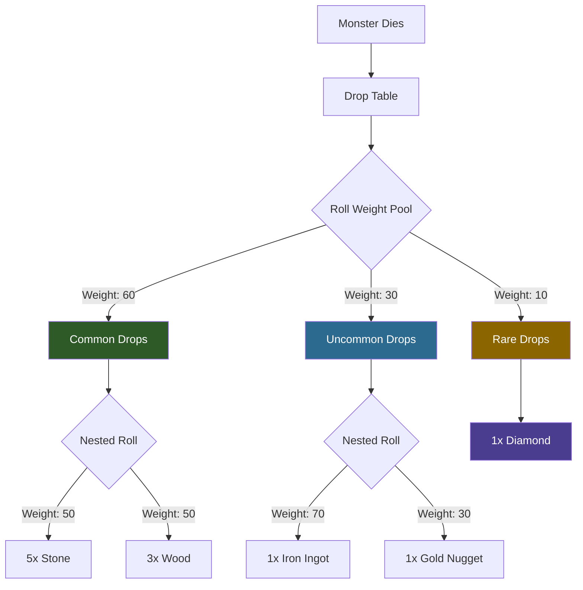

## Descripción general

Muchos sistemas de Hytale usan selección aleatoria ponderada para determinar resultados. Los pesos son números relativos — un peso mayor significa una mayor probabilidad de ser seleccionado. El total no necesita sumar 100.

## Cómo funcionan los pesos

Dados objetos con pesos `[70, 25, 5]`, las probabilidades son:
- Objeto A: 70/100 = 70%
- Objeto B: 25/100 = 25%
- Objeto C: 5/100 = 5%

## Cómo funciona la selección por peso



### Ejemplo de pesos anidados (Tablas de drops)



## Sistemas que usan pesos

### Tablas de drops

Los drops de botín usan pesos dentro de contenedores `Choice`:

```json
{
  "Container": {
    "Type": "Choice",
    "Containers": [
      { "Weight": 80, "Item": { "ItemId": "Coin_Gold", "QuantityMin": 1, "QuantityMax": 3 } },
      { "Weight": 15, "Item": { "ItemId": "Gem_Ruby" } },
      { "Weight": 5, "Item": { "ItemId": "Sword_Rare" } }
    ]
  }
}
```

### Aparición de NPCs

Las reglas de aparición ponderan qué NPC aparece:

```json
{
  "NPCs": [
    { "Weight": 10, "Id": "Chicken", "Flock": "One_Or_Two" },
    { "Weight": 10, "Id": "Rabbit", "Flock": "Group_Small" },
    { "Weight": 5, "Id": "Deer", "Flock": "One_Or_Two" }
  ]
}
```

### Tiendas de trueque (Pool Slots)

Los pools de inventario de tiendas seleccionan intercambios por peso:

```json
{
  "Type": "Pool",
  "SlotCount": 2,
  "Trades": [
    { "Weight": 10, "Trade": { "Output": [{ "ItemId": "Food_Apple" }], "Input": [{ "ItemId": "Coin_Gold", "Quantity": 5 }] } },
    { "Weight": 5, "Trade": { "Output": [{ "ItemId": "Food_Pie" }], "Input": [{ "ItemId": "Coin_Gold", "Quantity": 12 }] } }
  ]
}
```

### Pronósticos del clima

La selección de clima por hora usa pesos:

```json
{
  "WeatherForecasts": {
    "6": [
      { "WeatherId": "Zone1_Sunny", "Weight": 60 },
      { "WeatherId": "Zone1_Cloudy", "Weight": 30 },
      { "WeatherId": "Zone1_Rain", "Weight": 10 }
    ]
  }
}
```

## Páginas relacionadas

- [Tablas de drops](/hytale-modding-docs/reference/economy-and-progression/drop-tables/) — sistema de pesos de botín
- [Reglas de aparición de NPCs](/hytale-modding-docs/reference/npc-system/npc-spawn-rules/) — pesos de aparición
- [Tiendas de trueque](/hytale-modding-docs/reference/economy-and-progression/barter-shops/) — pesos de pools de comercio
