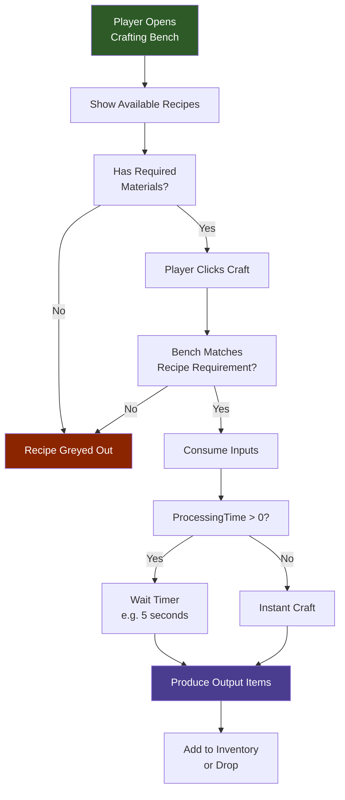
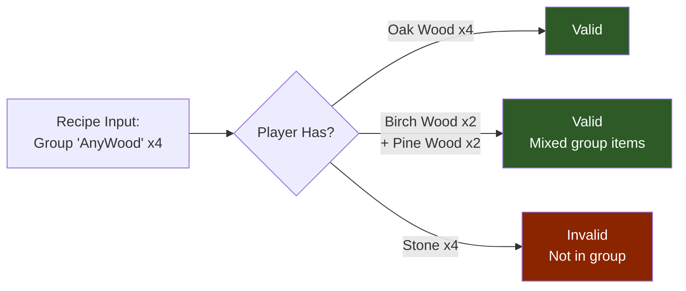

## Descripción General

Las recetas de crafteo definen la transformación de objetos o recursos de entrada en objetos de salida. Cada receta especifica qué materiales se consumen, qué se produce, qué banco (si alguno) debe estar presente y cuánto tarda el crafteo. Las recetas se encuentran bajo `Assets/Server/Item/Recipes/` y son cargadas por el sistema de objetos en tiempo de ejecución.

## Cómo Funciona el Crafteo



### Resolución de Recetas con Grupos



## Ubicación del Archivo

```
Assets/Server/Item/Recipes/
```

Las recetas de desguace están en el subdirectorio:

```
Assets/Server/Item/Recipes/Salvage/
```

Algunos objetos integran su propia receta directamente en su archivo de definición de objeto bajo `Assets/Server/Item/Items/` usando el mismo esquema.

## Esquema

### Campos de nivel superior

| Campo | Tipo | Requerido | Por Defecto | Descripción |
|-------|------|-----------|-------------|-------------|
| `Input` | `InputEntry[]` | Sí | — | Lista de objetos o tipos de recurso consumidos por la receta. |
| `Output` | `OutputEntry[]` | No | — | Lista completa de todos los objetos producidos. Cuando se omite, el objeto que lleva la receta es la única salida. |
| `PrimaryOutput` | `OutputEntry` | No | — | La salida "principal" mostrada en la interfaz de crafteo cuando existen múltiples salidas. |
| `BenchRequirement` | `BenchRequirement[]` | No | `[]` | Bancos (o crafteo de campo) requeridos para realizar el crafteo. |
| `TimeSeconds` | `number` | No | `0` | Cuántos segundos del mundo real tarda el crafteo. |

### InputEntry

| Campo | Tipo | Requerido | Por Defecto | Descripción |
|-------|------|-----------|-------------|-------------|
| `ItemId` | `string` | No* | — | ID específico del objeto a consumir. Mutuamente excluyente con `ResourceTypeId`. |
| `ResourceTypeId` | `string` | No* | — | Etiqueta de recurso a consumir (ej. `"Wood_Trunk"`, `"Rock"`). Cualquier objeto etiquetado con este tipo de recurso satisface la ranura. |
| `Quantity` | `number` | Sí | — | Número de objetos o unidades de recurso consumidas. |

* Exactamente uno de `ItemId` o `ResourceTypeId` debe estar presente por entrada.

### OutputEntry

| Campo | Tipo | Requerido | Por Defecto | Descripción |
|-------|------|-----------|-------------|-------------|
| `ItemId` | `string` | Sí | — | ID del objeto producido. |
| `Quantity` | `number` | No | `1` | Tamaño de pila del objeto producido. |

### BenchRequirement

| Campo | Tipo | Requerido | Por Defecto | Descripción |
|-------|------|-----------|-------------|-------------|
| `Type` | `"Crafting" \| "Processing"` | Sí | — | Si el banco es una estación de crafteo o una estación de procesamiento. |
| `Id` | `string` | Sí | — | El ID del banco (ej. `"Workbench"`, `"Campfire"`, `"Fieldcraft"`). |
| `Categories` | `string[]` | No | — | Lista opcional de ranuras de categoría en el banco que deben estar activas para que esta receta aparezca. |

## Ejemplo

**Receta de desguace** (`Assets/Server/Item/Recipes/Salvage/Salvage_Armor_Adamantite_Chest.json`):

```json
{
  "Input": [
    {
      "ItemId": "Armor_Adamantite_Chest",
      "Quantity": 1
    }
  ],
  "PrimaryOutput": {
    "ItemId": "Ore_Adamantite",
    "Quantity": 6
  },
  "Output": [
    {
      "ItemId": "Ore_Adamantite",
      "Quantity": 6
    },
    {
      "ItemId": "Ingredient_Hide_Heavy",
      "Quantity": 2
    },
    {
      "ItemId": "Ingredient_Fabric_Scrap_Cindercloth",
      "Quantity": 2
    }
  ],
  "BenchRequirement": [
    {
      "Type": "Processing",
      "Id": "Salvagebench"
    }
  ],
  "TimeSeconds": 4
}
```

**Receta en línea en un archivo de objeto** (de `Assets/Server/Item/Items/Bench/Bench_Campfire.json`):

```json
{
  "Recipe": {
    "TimeSeconds": 1,
    "Input": [
      { "ItemId": "Ingredient_Stick", "Quantity": 4 },
      { "ResourceTypeId": "Rubble", "Quantity": 2 }
    ],
    "BenchRequirement": [
      { "Type": "Crafting", "Categories": ["Tools"], "Id": "Fieldcraft" },
      { "Id": "Workbench", "Type": "Crafting", "Categories": ["Workbench_Survival"] }
    ]
  }
}
```

## Páginas Relacionadas

- [Definiciones de Bancos](/hytale-modding-docs/reference/crafting-system/bench-definitions) — Cómo se definen y configuran los bancos
- [Desguace](/hytale-modding-docs/reference/crafting-system/salvage) — Formato de receta específico de desguace
- [Tablas de Botín](/hytale-modding-docs/reference/economy-and-progression/drop-tables) — Botín de contenedores del mundo
