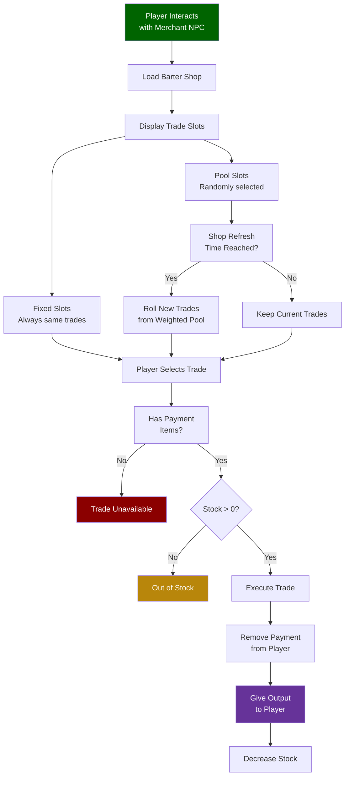

## Descripción general

Las tiendas de trueque definen el inventario de los NPC mercaderes: qué venden, qué aceptan como pago, cuánto stock tienen disponible y cuándo se renueva. Cada archivo de tienda contiene una lista de `TradeSlots` que son `Fixed` (siempre el mismo comercio) o `Pool` (seleccionados aleatoriamente de una lista ponderada de posibles comercios en cada renovación). El stock de la tienda se restablece según un horario diario configurable.

## Cómo funciona el comercio con NPCs



## Ubicación de archivos

```
Assets/Server/BarterShops/
  Klops_Merchant.json
  Kweebec_Merchant.json
```

## Esquema

### Nivel superior

| Field | Type | Required | Default | Description |
|-------|------|----------|---------|-------------|
| `DisplayNameKey` | `string` | Sí | — | Clave de localización para el nombre de la tienda mostrado en la interfaz. |
| `RefreshInterval` | `RefreshInterval` | Sí | — | Con qué frecuencia se restablece el stock de la tienda. |
| `RestockHour` | `number` | Sí | — | Hora del juego (0–23) en la que el stock se renueva cada ciclo. |
| `TradeSlots` | `TradeSlot[]` | Sí | — | Lista ordenada de espacios de comercio mostrados en la interfaz de la tienda. |

### RefreshInterval

| Field | Type | Required | Default | Description |
|-------|------|----------|---------|-------------|
| `Days` | `number` | No | — | Número de días del juego entre reabastecimientos. |

### TradeSlot

| Field | Type | Required | Default | Description |
|-------|------|----------|---------|-------------|
| `Type` | `"Fixed" \| "Pool"` | Sí | — | `Fixed` siempre muestra el mismo comercio. `Pool` elige aleatoriamente comercios de una lista ponderada. |
| `Trade` | `Trade` | No | — | El comercio único para espacios `Fixed`. |
| `SlotCount` | `number` | No | — | Solo para `Pool`. Número de comercios seleccionados aleatoriamente de `Trades` para mostrar. |
| `Trades` | `PoolTrade[]` | No | — | Solo para `Pool`. Lista ponderada de posibles comercios de donde muestrear. |

### Trade (Fixed)

| Field | Type | Required | Default | Description |
|-------|------|----------|---------|-------------|
| `Output` | `TradeItem` | Sí | — | El objeto que recibe el jugador. |
| `Input` | `TradeItem[]` | Sí | — | Objetos que el jugador debe proporcionar como pago (uno o más). |
| `Stock` | `number` | Sí | — | Número de veces que este comercio puede completarse antes de que el espacio se quede sin stock. |

### PoolTrade

| Field | Type | Required | Default | Description |
|-------|------|----------|---------|-------------|
| `Weight` | `number` | Sí | — | Probabilidad relativa de que este comercio sea seleccionado cuando se muestrea el pool. |
| `Output` | `TradeItem` | Sí | — | El objeto que recibe el jugador. |
| `Input` | `TradeItem[]` | Sí | — | Objetos que el jugador debe proporcionar como pago. |
| `Stock` | `number \| [number, number]` | Sí | — | Cantidad fija de stock, o rango `[min, max]` para stock aleatorio en cada renovación. |

### TradeItem

| Field | Type | Required | Default | Description |
|-------|------|----------|---------|-------------|
| `ItemId` | `string` | Sí | — | ID del objeto. |
| `Quantity` | `number` | Sí | — | Tamaño del stack del objeto. |

## Ejemplos

**Tienda fija simple** (`Assets/Server/BarterShops/Klops_Merchant.json`):

```json
{
  "DisplayNameKey": "server.barter.klops_merchant.title",
  "RefreshInterval": {
    "Days": 1
  },
  "RestockHour": 6,
  "TradeSlots": [
    {
      "Type": "Fixed",
      "Trade": {
        "Output": { "ItemId": "Furniture_Construction_Sign", "Quantity": 1 },
        "Input": [{ "ItemId": "Furniture_Construction_Sign", "Quantity": 1 }],
        "Stock": 1
      }
    }
  ]
}
```

**Tienda mixta con espacios fijos y pool** (`Assets/Server/BarterShops/Kweebec_Merchant.json`, condensado):

```json
{
  "DisplayNameKey": "server.barter.kweebec_merchant.title",
  "RefreshInterval": {
    "Days": 3
  },
  "RestockHour": 6,
  "TradeSlots": [
    {
      "Type": "Fixed",
      "Trade": {
        "Output": { "ItemId": "Ingredient_Spices", "Quantity": 3 },
        "Input": [{ "ItemId": "Ingredient_Life_Essence", "Quantity": 20 }],
        "Stock": 10
      }
    },
    {
      "Type": "Pool",
      "SlotCount": 3,
      "Trades": [
        {
          "Weight": 50,
          "Output": { "ItemId": "Plant_Crop_Berry_Block", "Quantity": 1 },
          "Input": [{ "ItemId": "Ingredient_Life_Essence", "Quantity": 30 }],
          "Stock": [10, 20]
        },
        {
          "Weight": 30,
          "Output": { "ItemId": "Plant_Crop_Berry_Winter_Block", "Quantity": 1 },
          "Input": [{ "ItemId": "Ingredient_Life_Essence", "Quantity": 50 }],
          "Stock": [10, 20]
        },
        {
          "Weight": 20,
          "Output": { "ItemId": "Food_Salad_Berry", "Quantity": 1 },
          "Input": [{ "ItemId": "Ingredient_Life_Essence", "Quantity": 15 }],
          "Stock": [4, 8]
        }
      ]
    }
  ]
}
```

En el espacio pool de arriba, se eligen aleatoriamente 3 comercios de la lista ponderada cada vez que la tienda se renueva cada 3 días a la hora 6. El stock se aleatoriza entre los valores mínimo y máximo.

## Páginas relacionadas

- [Tablas de drops](/hytale-modding-docs/reference/economy-and-progression/drop-tables) — botín de contenedores y NPCs
- [Granjas y corrales](/hytale-modding-docs/reference/economy-and-progression/farming-coops) — producción alternativa de recursos
