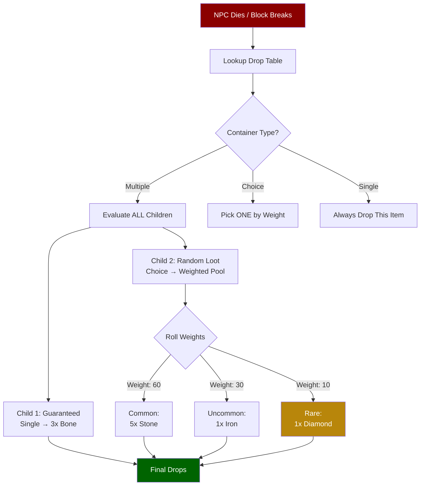
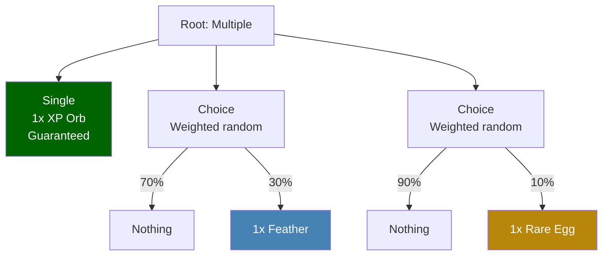

## Descripción general

Las tablas de drops definen qué objetos se producen cuando se abre un contenedor, se mata a un NPC o se cosecha un nodo de recursos. El sistema utiliza una estructura recursiva de `Container` que soporta tres modos de selección: `Single` (siempre produce un objeto), `Choice` (elige aleatoriamente un hijo por peso) y `Multiple` (evalúa todos los hijos). Anidar estos tipos permite crear tablas de botín complejas con drops garantizados y opcionales.

## Cómo funcionan las tablas de drops



### Ejemplo de anidación de contenedores



## Ubicación de archivos

```
Assets/Server/Drops/
  Items/          (contenedores del mundo: barriles, vasijas, ataúdes)
  NPCs/
    Beast/
    Boss/
    Critter/
    Elemental/
    Flying_Beast/
    Flying_Critter/
    Flying_Wildlife/
    Intelligent/
    Inventory/
  Objectives/
  Plant/
  Rock/
  Wood/
```

## Esquema

### Nivel superior

| Field | Type | Required | Default | Description |
|-------|------|----------|---------|-------------|
| `Container` | `Container` | Sí | — | Nodo contenedor raíz que define la lógica de botín. |

### Container

| Field | Type | Required | Default | Description |
|-------|------|----------|---------|-------------|
| `Type` | `"Single" \| "Multiple" \| "Choice" \| "Empty"` | Sí | — | Modo de selección para este nodo contenedor. |
| `Item` | `ItemEntry` | No | — | El objeto a producir. Solo válido cuando `Type` es `"Single"`. |
| `Containers` | `Container[]` | No | — | Contenedores hijos. Usado por los tipos `Multiple` y `Choice`. |
| `Weight` | `number` | No | — | Peso de probabilidad relativa. Usado por contenedores padre `Choice` al seleccionar entre hermanos. |

### Tipos de contenedores

| Type | Comportamiento |
|------|----------------|
| `Single` | Siempre produce exactamente el objeto definido en `Item`. |
| `Multiple` | Evalúa cada contenedor hijo de forma independiente y combina todos los resultados. |
| `Choice` | Selecciona aleatoriamente un contenedor hijo ponderado por el campo `Weight` de cada hijo. |
| `Empty` | No produce nada. Se usa como opción de "sin drop" ponderada dentro de nodos `Choice`. |

### ItemEntry

| Field | Type | Required | Default | Description |
|-------|------|----------|---------|-------------|
| `ItemId` | `string` | Sí | — | ID del objeto a producir. |
| `QuantityMin` | `number` | Sí | — | Tamaño mínimo del stack producido. |
| `QuantityMax` | `number` | Sí | — | Tamaño máximo del stack producido. La cantidad real se elige uniformemente entre min y max. |

## Ejemplos

**Contenedor del mundo con drops de selección ponderada** (`Assets/Server/Drops/Items/Barrels.json`):

```json
{
  "Container": {
    "Type": "Choice",
    "Containers": [
      {
        "Type": "Choice",
        "Weight": 100,
        "Containers": [
          {
            "Type": "Single",
            "Item": {
              "ItemId": "Plant_Fruit_Apple",
              "QuantityMin": 1,
              "QuantityMax": 1
            }
          }
        ]
      },
      {
        "Type": "Choice",
        "Weight": 25,
        "Containers": [
          {
            "Type": "Single",
            "Item": {
              "ItemId": "Weapon_Arrow_Crude",
              "QuantityMin": 1,
              "QuantityMax": 5
            }
          }
        ]
      },
      {
        "Type": "Empty",
        "Weight": 800
      }
    ]
  }
}
```

**Drop de NPC con múltiples drops garantizados** (`Assets/Server/Drops/NPCs/Beast/Drop_Bear_Grizzly.json`):

```json
{
  "Container": {
    "Type": "Multiple",
    "Containers": [
      {
        "Type": "Choice",
        "Weight": 100,
        "Containers": [
          {
            "Type": "Single",
            "Item": {
              "ItemId": "Ingredient_Hide_Heavy",
              "QuantityMin": 1,
              "QuantityMax": 2
            }
          }
        ]
      },
      {
        "Type": "Choice",
        "Weight": 100,
        "Containers": [
          {
            "Type": "Single",
            "Item": {
              "ItemId": "Food_Wildmeat_Raw",
              "QuantityMin": 2,
              "QuantityMax": 3
            }
          }
        ]
      }
    ]
  }
}
```

El `Multiple` raíz asegura que el oso siempre suelte tanto cuero como carne. Cada hijo usa un `Choice` con peso 100 (la única opción no vacía), haciendo que cada drop individual sea garantizado.

## Páginas relacionadas

- [Tiendas de trueque](/hytale-modding-docs/reference/economy-and-progression/barter-shops) — espacios de comercio de mercaderes
- [Granjas y corrales](/hytale-modding-docs/reference/economy-and-progression/farming-coops) — el campo `ProduceDrops` referencia IDs de tablas de drops
- [Recetas](/hytale-modding-docs/reference/crafting-system/recipes) — el crafteo como alternativa a los drops
