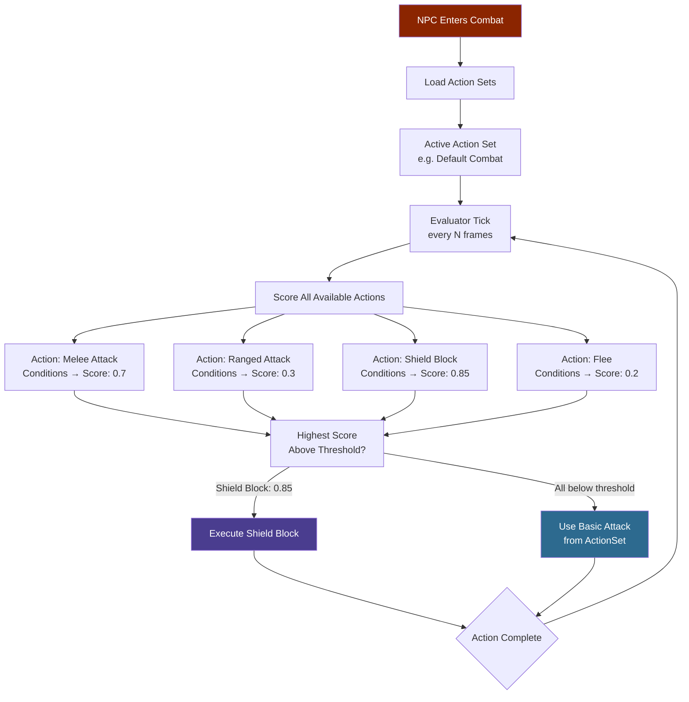
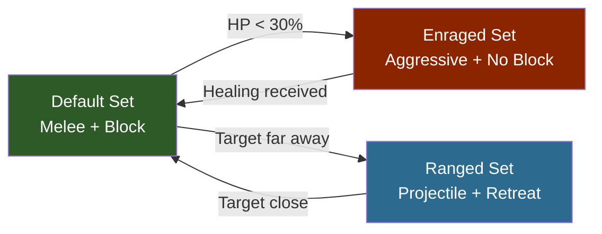

## Descripción general

Los archivos del Combat Action Evaluator (CAE) configuran el sistema de IA de utilidad que impulsa el combate de los NPCs. Cada archivo define la frecuencia de ejecución del evaluador, un conjunto de acciones disponibles con nombre y condiciones de puntuación, y uno o más conjuntos de acciones que agrupan qué acciones y ataques básicos están activos en un estado de combate dado. El evaluador puntúa todas las acciones disponibles en cada tick y ejecuta la que tenga la puntuación más alta por encima de un umbral mínimo.

## Flujo de IA de combate



### Transiciones de conjuntos de acciones



## Ubicación de archivos

- `Assets/Server/NPC/Balancing/Beast/*.json` — CAEs de animales y criaturas
- `Assets/Server/NPC/Balancing/Intelligent/*.json` — CAEs de NPCs de facción
- `Assets/Server/NPC/Balancing/CAE_Test_*.json` — CAEs de prueba y referencia

## Esquema

### Campos de nivel superior

| Field | Type | Required | Default | Descripción |
|-------|------|----------|---------|-------------|
| `Type` | `"CombatActionEvaluator"` | Sí | — | Identifica este archivo como un archivo CAE. |
| `TargetMemoryDuration` | number | No | — | Cuántos segundos el NPC recuerda a un objetivo después de perderlo de vista. |
| `CombatActionEvaluator` | object | Sí | — | El bloque de configuración del evaluador (ver abajo). |

### Bloque CombatActionEvaluator

| Field | Type | Required | Default | Descripción |
|-------|------|----------|---------|-------------|
| `RunConditions` | array | No | — | Condiciones evaluadas antes de ejecutar el evaluador completo. Todas deben pasar para que el evaluador proceda en este tick. |
| `MinRunUtility` | number | No | — | Puntuación de utilidad combinada mínima de `RunConditions` requerida para ejecutar el evaluador. |
| `MinActionUtility` | number | No | — | Puntuación de utilidad mínima que una acción debe alcanzar para ser considerada para ejecución. |
| `AvailableActions` | object | Sí | — | Definiciones de acciones con nombre. Las claves son IDs de acción referenciados por `ActionSets`. |
| `ActionSets` | object | Sí | — | Conjuntos con nombre de acciones activas y ataques básicos. El conjunto activo es controlado por el sub-estado de combate del NPC. |

### Entrada del arreglo RunConditions

Cada entrada es un objeto de condición (ver [Toma de decisiones del NPC](/hytale-modding-docs/reference/npc-system/npc-decision-making)). Comúnmente usados:

| Type | Propósito |
|------|-----------|
| `TimeSinceLastUsed` | Limita la frecuencia de ejecución del evaluador. |
| `Randomiser` | Agrega aleatoriedad para evitar comportamiento perfectamente predecible. |

### Entrada de AvailableActions

Cada clave en `AvailableActions` es una acción con nombre. Los campos del objeto de acción:

| Field | Type | Required | Default | Descripción |
|-------|------|----------|---------|-------------|
| `Type` | string | Sí | — | Tipo de acción. Ver tabla de tipos de acción abajo. |
| `Description` | string | No | — | Descripción legible de la acción. |
| `Target` | string | No | — | Categoría del objetivo: `"Hostile"`, `"Friendly"`, `"Self"`. |
| `WeaponSlot` | number | No | — | Índice del slot de arma usado para esta acción. |
| `SubState` | string | No | — | Sub-estado de combate a activar cuando esta acción se ejecuta (mapea a una clave de `ActionSets`). |
| `Ability` | string | No | — | ID de habilidad a ejecutar. |
| `AttackDistanceRange` | [number, number] | No | — | Distancia `[min, max]` en bloques dentro de la cual esta acción puede usarse. |
| `PostExecuteDistanceRange` | [number, number] | No | — | Rango de distancia que el NPC intenta mantener después de ejecutar. |
| `ChargeFor` | number | No | — | Segundos de carga antes de ejecutar. |
| `WeightCoefficient` | number | No | `1.0` | Multiplicador aplicado a la puntuación de utilidad final de esta acción. |
| `InteractionVars` | object | No | — | Sobrecargas de variables de interacción aplicadas cuando esta acción se dispara. |
| `Conditions` | array | No | — | Condiciones de puntuación para esta acción específica (ver [Toma de decisiones del NPC](/hytale-modding-docs/reference/npc-system/npc-decision-making)). |

### Tipos de acción

| Type | Descripción |
|------|-------------|
| `SelectBasicAttackTarget` | Selecciona un objetivo para ataques básicos usando las condiciones para puntuar candidatos. |
| `Ability` | Ejecuta una habilidad con nombre (golpe cuerpo a cuerpo, lanzamiento a distancia, curación, etc.). |

### Entrada de ActionSets

Cada clave en `ActionSets` es un nombre de sub-estado (p.ej. `"Default"`, `"Ranged"`, `"Attack"`). El valor:

| Field | Type | Required | Default | Descripción |
|-------|------|----------|---------|-------------|
| `BasicAttacks` | object | No | — | Configuración de ataques básicos para este sub-estado (ver abajo). |
| `Actions` | string[] | No | — | Lista de IDs de acción de `AvailableActions` que se evalúan en este sub-estado. |

### Objeto BasicAttacks

| Field | Type | Required | Default | Descripción |
|-------|------|----------|---------|-------------|
| `Attacks` | string[] | Sí | — | IDs de habilidad usados como ataques básicos. |
| `Randomise` | boolean | No | `false` | Si es `true`, selecciona aleatoriamente de la lista `Attacks` en cada ciclo. |
| `MaxRange` | number | No | — | Rango máximo en bloques para ataques básicos. |
| `Timeout` | number | No | — | Segundos de espera para que el ataque impacte antes de cancelar. |
| `CooldownRange` | [number, number] | No | — | `[min, max]` de enfriamiento en segundos entre ataques básicos. |
| `UseProjectedDistance` | boolean | No | `false` | Si es `true`, usa la distancia proyectada (predicha) en lugar de la distancia actual. |
| `InteractionVars` | object | No | — | Sobrecargas de variables de interacción para todos los ataques básicos en este conjunto. |

## Ejemplos

### CAE simple de bestia (Rata)

Una rata con un solo ataque de mordida, sin habilidades especiales:

```json
{
  "Type": "CombatActionEvaluator",
  "TargetMemoryDuration": 10,
  "CombatActionEvaluator": {
    "RunConditions": [
      {
        "Type": "TimeSinceLastUsed",
        "Curve": { "ResponseCurve": "Linear", "XRange": [0, 10] }
      },
      {
        "Type": "Randomiser",
        "MinValue": 0.9,
        "MaxValue": 1
      }
    ],
    "MinRunUtility": 0.5,
    "MinActionUtility": 0.01,
    "AvailableActions": {
      "SelectTarget": {
        "Type": "SelectBasicAttackTarget",
        "Description": "Select a target",
        "Conditions": [
          {
            "Type": "TargetDistance",
            "Curve": { "ResponseCurve": "SimpleDescendingLogistic", "XRange": [0, 15] }
          }
        ]
      }
    },
    "ActionSets": {
      "Default": {
        "BasicAttacks": {
          "Attacks": ["Rat_Bite"],
          "Randomise": false,
          "MaxRange": 2,
          "Timeout": 0.5,
          "CooldownRange": [0.001, 0.001]
        },
        "Actions": ["SelectTarget"]
      }
    }
  }
}
```

### CAE de NPC inteligente (Goblin Scrapper) — múltiples conjuntos de acciones

Un goblin que cambia entre sub-estados de cuerpo a cuerpo y a distancia:

```json
{
  "Type": "CombatActionEvaluator",
  "TargetMemoryDuration": 5,
  "CombatActionEvaluator": {
    "RunConditions": [
      {
        "Type": "TimeSinceLastUsed",
        "Curve": { "ResponseCurve": "Linear", "XRange": [0, 5] }
      },
      { "Type": "Randomiser", "MinValue": 0.9, "MaxValue": 1 }
    ],
    "MinRunUtility": 0.5,
    "MinActionUtility": 0.01,
    "AvailableActions": {
      "Melee": {
        "Type": "Ability",
        "Description": "Quick melee swing",
        "WeaponSlot": 0,
        "SubState": "Default",
        "Ability": "Goblin_Scrapper_Attack",
        "Target": "Hostile",
        "AttackDistanceRange": [2.5, 2.5],
        "PostExecuteDistanceRange": [2.5, 2.5],
        "Conditions": [
          {
            "Type": "TimeSinceLastUsed",
            "Curve": { "ResponseCurve": "Linear", "XRange": [0, 1] }
          }
        ]
      },
      "Ranged": {
        "Type": "Ability",
        "Description": "Throw rubble from range",
        "WeaponSlot": 0,
        "SubState": "Ranged",
        "Ability": "Goblin_Scrapper_Rubble_Throw",
        "Target": "Hostile",
        "AttackDistanceRange": [15, 15],
        "PostExecuteDistanceRange": [2.5, 2.5],
        "Conditions": [
          {
            "Type": "TimeSinceLastUsed",
            "Curve": { "ResponseCurve": "Linear", "XRange": [0, 2] }
          },
          {
            "Type": "TargetDistance",
            "Curve": { "ResponseCurve": "SimpleLogistic", "XRange": [0, 15] }
          }
        ]
      }
    },
    "ActionSets": {
      "Default": {
        "BasicAttacks": {
          "Attacks": ["Goblin_Scrapper_Attack"],
          "Randomise": false,
          "MaxRange": 2.5,
          "Timeout": 0.5,
          "CooldownRange": [0.001, 0.001]
        },
        "Actions": ["SwingDown", "Ranged"]
      },
      "Ranged": {
        "BasicAttacks": {
          "Attacks": ["Goblin_Scrapper_Rubble_Throw"],
          "Randomise": false,
          "MaxRange": 15,
          "Timeout": 0.5,
          "CooldownRange": [0.8, 2]
        },
        "Actions": ["Melee"]
      }
    }
  }
}
```

## Páginas relacionadas

- [Toma de decisiones del NPC](/hytale-modding-docs/reference/npc-system/npc-decision-making) — Tipos de condición usados en `RunConditions` y `AvailableActions[*].Conditions`
- [Roles de NPC](/hytale-modding-docs/reference/npc-system/npc-roles) — Archivos de rol que referencian archivos CAE vía el campo `_CombatConfig` en `Modify`
- [Plantillas de NPC](/hytale-modding-docs/reference/npc-system/npc-templates) — Plantillas que conectan el evaluador de combate vía el árbol `Instructions`
