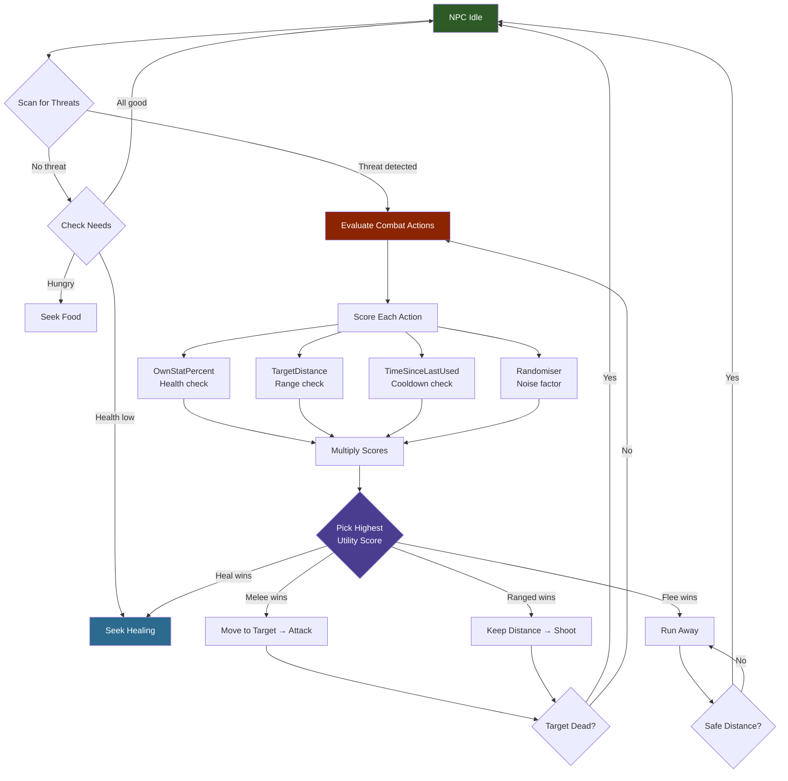
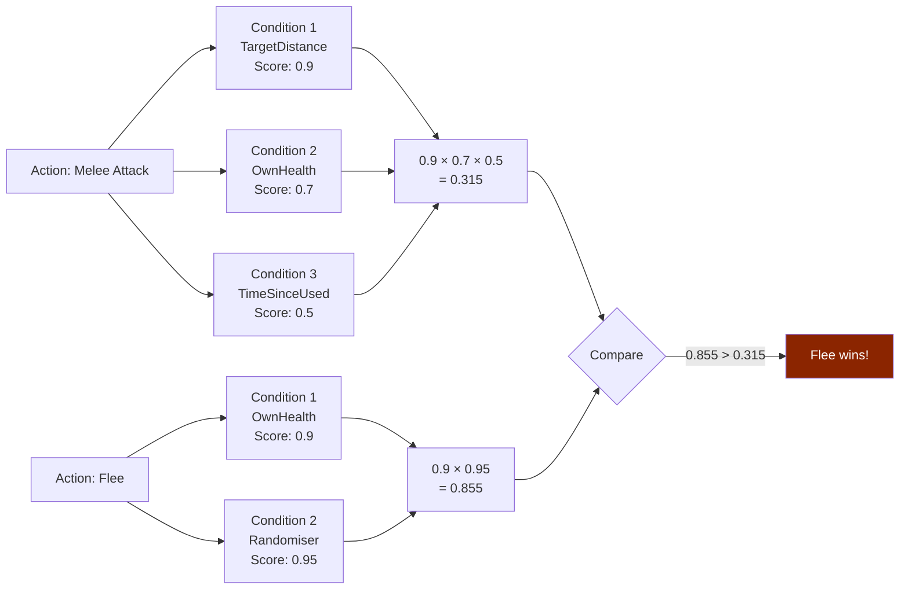

## Descripción general

Los archivos de condiciones de toma de decisiones definen funciones de puntuación reutilizables que la IA del NPC evalúa para decidir qué hacer a continuación. Cada condición tiene un `Type` que nombra la métrica que se mide, un `Stat` que especifica qué estadística del juego leer (cuando aplica), y una `Curve` que controla cómo los valores crudos se mapean a puntuaciones de utilidad entre 0 y 1. Estas condiciones aparecen tanto en archivos independientes de `DecisionMaking/Conditions/` como en línea dentro de las definiciones de acciones del Combat Action Evaluator.

## Ubicación de archivos

`Assets/Server/NPC/DecisionMaking/Conditions/*.json`

Las condiciones también se usan en línea dentro de arreglos `AvailableActions[*].Conditions` en archivos de balanceo. Ver [Balanceo de combate de NPCs](/hytale-modding-docs/reference/npc-system/npc-combat-balancing).

## Esquema

### Objeto de condición

| Field | Type | Required | Default | Descripción |
|-------|------|----------|---------|-------------|
| `Type` | string | Sí | — | El tipo de condición (ver tabla abajo). |
| `Stat` | string | No | — | La estadística a leer. Usada por tipos de condición basados en estadísticas. |
| `Curve` | string \| object | No | — | Cómo mapear el valor crudo a una puntuación de utilidad de 0 a 1. Puede ser un nombre de curva (string) o un objeto de curva en línea. |
| `MinValue` | number | No | — | Valor mínimo de corte para el valor crudo (usado por `Randomiser`). |
| `MaxValue` | number | No | — | Valor máximo de corte para el valor crudo (usado por `Randomiser`). |

### Tipos de condición

| Type | Descripción | Campos clave |
|------|-------------|--------------|
| `OwnStatPercent` | Puntúa basándose en la estadística propia del NPC como porcentaje de su máximo. | `Stat`, `Curve` |
| `TargetStatPercent` | Puntúa basándose en la estadística del NPC objetivo como porcentaje de su máximo. | `Stat`, `Curve` |
| `TargetDistance` | Puntúa basándose en la distancia al objetivo actual. | `Curve` |
| `TimeSinceLastUsed` | Puntúa basándose en cuánto tiempo ha pasado desde que se usó esta acción por última vez. | `Curve` |
| `Randomiser` | Agrega un componente de puntuación aleatorio entre `MinValue` y `MaxValue`. | `MinValue`, `MaxValue` |

### Valores de Stat

| Stat | Descripción |
|------|-------------|
| `Health` | Puntos de vida actuales. |

### Valores de Curve

Una `Curve` puede ser un atajo de nombre (string) o un objeto en línea:

**Atajo de nombre (string):**

| Valor | Forma | Caso de uso |
|-------|-------|-------------|
| `"Linear"` | Aumenta linealmente de 0 a 1 conforme la estadística aumenta. | Preferir acciones cuando la estadística es alta. |
| `"ReverseLinear"` | Disminuye linealmente de 1 a 0 conforme la estadística aumenta. | Preferir acciones cuando la estadística es baja (p.ej. curar cuando está herido). |

**Objeto de curva en línea:**

| Field | Type | Descripción |
|-------|------|-------------|
| `ResponseCurve` | string | Forma de curva de respuesta con nombre (ver abajo). |
| `XRange` | [number, number] | El rango de entrada `[min, max]` para el valor crudo. Los valores fuera de este rango se recortan. |
| `Type` | `"Switch"` | Forma alternativa en línea para un umbral duro. |
| `SwitchPoint` | number | Para `Type: "Switch"` — el valor crudo en el que la puntuación cambia de 0 a 1. |

**Curvas de respuesta con nombre (`ResponseCurve`):**

| Valor | Forma |
|-------|-------|
| `"Linear"` | Línea recta de 0 a 1 a lo largo de `XRange`. |
| `"SimpleLogistic"` | Curva S creciente hacia 1. Útil para "preferir cuando está cerca". |
| `"SimpleDescendingLogistic"` | Curva S decreciente hacia 0. Útil para "preferir cuando está lejos". |

## Cómo funciona la toma de decisiones del NPC



### Cómo funciona la puntuación de utilidad

Cada acción disponible tiene una lista de `Conditions`. El NPC evalúa cada condición para producir una puntuación entre 0 y 1, luego **multiplica** todas las puntuaciones entre sí. La acción con la puntuación final más alta gana.



## Ejemplos

### Archivo de condición independiente — HP Linear

Puntúa la salud propia del NPC linealmente: salud completa = puntuación 1, muerto = puntuación 0.

```json
{
  "Type": "OwnStatPercent",
  "Stat": "Health",
  "Curve": "Linear"
}
```

### Condición en línea — distancia al objetivo (descendente)

Prefiere esta acción cuando el objetivo está cerca; la puntuación baja conforme la distancia aumenta hacia 15 bloques.

```json
{
  "Type": "TargetDistance",
  "Curve": {
    "ResponseCurve": "SimpleDescendingLogistic",
    "XRange": [0, 15]
  }
}
```

### Condición en línea — tiempo desde el último uso

Puntúa una acción más alto mientras más tiempo haya pasado desde su último uso, en una ventana de 10 segundos.

```json
{
  "Type": "TimeSinceLastUsed",
  "Curve": {
    "ResponseCurve": "Linear",
    "XRange": [0, 10]
  }
}
```

### Condición en línea — umbral de interruptor

Puntúa 1 una vez que han pasado 10 segundos, 0 antes de eso (filtro duro).

```json
{
  "Type": "TimeSinceLastUsed",
  "Curve": {
    "Type": "Switch",
    "SwitchPoint": 10
  }
}
```

### Condición en línea — aleatorizador

Agrega un componente de ruido aleatorio entre 0.9 y 1.0 a la puntuación de utilidad de la acción.

```json
{
  "Type": "Randomiser",
  "MinValue": 0.9,
  "MaxValue": 1
}
```

### Condición en línea — HP linear inverso (curar cuando está herido)

Puntúa más alto cuando la salud es baja, para que el NPC prefiera acciones de curación cuando está dañado.

```json
{
  "Type": "OwnStatPercent",
  "Stat": "Health",
  "Curve": "ReverseLinear"
}
```

## Páginas relacionadas

- [Balanceo de combate de NPCs](/hytale-modding-docs/reference/npc-system/npc-combat-balancing) — Donde las condiciones aparecen dentro de `AvailableActions[*].Conditions` y `RunConditions`
- [Roles de NPC](/hytale-modding-docs/reference/npc-system/npc-roles) — Archivos de rol que referencian la toma de decisiones vía el árbol `Instructions`
- [Plantillas de NPC](/hytale-modding-docs/reference/npc-system/npc-templates) — Plantillas que incorporan comportamiento basado en estas condiciones
