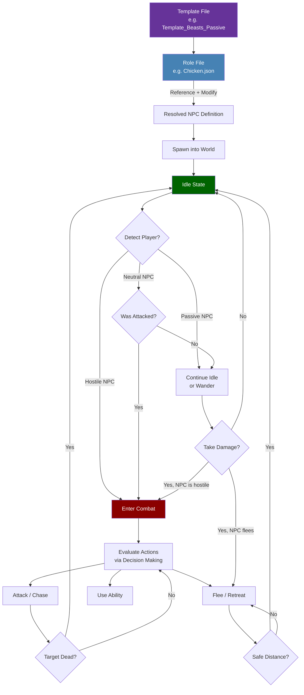

## Descripción general

Un archivo de rol de NPC define todo sobre un NPC específico: su apariencia visual, estadísticas de salud y movimiento, rangos de detección, tablas de drops, membresía de manada, estado domesticable y el árbol de instrucciones de IA que dirige su comportamiento. Los roles son típicamente archivos `Variant` que heredan de una plantilla a través del patrón `Reference` + `Modify`, sobrescribiendo solo los campos que difieren de la plantilla base.

## Ciclo de vida del rol de NPC



## Ubicación de archivos

`Assets/Server/NPC/Roles/**/*.json`

Los roles se organizan en subdirectorios por categoría:

- `_Core/` — Plantillas base y componentes compartidos
- `Aquatic/` — Peces, criaturas marinas
- `Avian/` — Aves
- `Boss/` — NPCs jefe
- `Creature/Critter/`, `Creature/Livestock/`, `Creature/Mammal/`, `Creature/Mythic/`, `Creature/Reptile/`, `Creature/Vermin/` — Animales del mundo abierto
- `Elemental/` — NPCs elementales
- `Intelligent/Aggressive/`, `Intelligent/Neutral/`, `Intelligent/Passive/` — NPCs de facciones y mercaderes
- `Undead/` — NPCs no muertos
- `Void/` — Criaturas del vacío

## Esquema

### Campos de nivel superior

| Field | Type | Required | Default | Descripción |
|-------|------|----------|---------|-------------|
| `Type` | `"Abstract"` \| `"Variant"` \| `"Generic"` | Sí | — | `Abstract` = plantilla base (no aparece en el mundo). `Variant` = hereda de un `Reference`. `Generic` = independiente, sin herencia. |
| `Reference` | string | Para `Variant` | — | El nombre de la plantilla de la que hereda este rol (p.ej. `"Template_Predator"`). |
| `Modify` | object | Para `Variant` | — | Campos a sobrescribir de la plantilla referenciada. Cualquier campo de nivel superior del rol puede aparecer aquí. |
| `StartState` | string | No | Predeterminado de plantilla | El nombre del estado inicial de IA (p.ej. `"Idle"`). |
| `Appearance` | string | No | Predeterminado de plantilla | El ID del modelo/rig a usar para este NPC. También puede establecerse vía `{ "Compute": "Appearance" }` para extraerlo de `Parameters`. |
| `MaxHealth` | number \| Compute | No | Predeterminado de plantilla | Puntos de vida máximos. A menudo se establece vía `{ "Compute": "MaxHealth" }`. |
| `MaxSpeed` | number | No | Predeterminado de plantilla | Velocidad máxima de movimiento en bloques por segundo. |
| `ViewRange` | number | No | Predeterminado de plantilla | Rango de detección usando línea de visión, en bloques. Establece `0` para desactivar la vista. |
| `ViewSector` | number | No | Predeterminado de plantilla | El arco del campo de visión en grados (p.ej. `180` = medio hemisferio al frente). |
| `HearingRange` | number | No | Predeterminado de plantilla | Rango de detección usando sonido, en bloques. Establece `0` para desactivar la audición. |
| `AlertedRange` | number | No | Predeterminado de plantilla | Rango de detección extendido cuando el NPC ya es consciente de una amenaza, en bloques. |
| `DropList` | string \| Compute | No | Predeterminado de plantilla | ID de la tabla de botín usada cuando este NPC es eliminado. |
| `FlockArray` | string[] \| Compute | No | `[]` | IDs de roles de NPC que pertenecen a este tipo de manada. Usado para comportamiento grupal coordinado. |
| `AttractiveItemSet` | string[] \| Compute | No | `[]` | IDs de objetos que atraen a este NPC cuando un jugador los sostiene cerca. |
| `IsTameable` | boolean | No | `false` | Si este NPC puede ser domesticado por un jugador. |
| `TameRoleChange` | string | No | — | El ID de rol al que cambia cuando este NPC es domesticado exitosamente. |
| `ProduceItem` | string | No | — | ID del objeto producido por este NPC en un temporizador (p.ej. huevos de gallinas). |
| `ProduceTimeout` | [string, string] | No | — | Rango de duración ISO 8601 `[min, max]` entre ciclos de producción (p.ej. `["PT18H", "PT48H"]`). |
| `MemoriesCategory` | string \| Compute | No | `"Other"` | Categoría usada por el sistema de memorias (p.ej. `"Predator"`, `"Undead"`, `"Goblin"`). |
| `NameTranslationKey` | string \| Compute | No | — | Clave de traducción para el nombre visible del NPC (p.ej. `"server.npcRoles.Fox.name"`). |
| `Parameters` | object | No | — | Definiciones de parámetros con nombre con `Value` y `Description`. Usados con referencias `{ "Compute": "<key>" }`. |
| `Instructions` | array | No | — | El árbol de instrucciones de IA. Cada entrada es un selector u objeto de paso evaluado en cada tick. |
| `Sensors` | array | No | — | Configuración de sensores para detectar entidades y estado del mundo. |
| `Actions` | array | No | — | Lista de definiciones de acciones disponibles para la IA. |
| `DisableDamageGroups` | string[] | No | — | IDs de grupos de fuentes de daño que no pueden dañar a este NPC (p.ej. `["Self", "Player"]`). |
| `Invulnerable` | boolean \| Compute | No | `false` | Si es `true`, el NPC no recibe daño. |
| `KnockbackScale` | number | No | `1.0` | Multiplicador del retroceso recibido. `0` = sin retroceso. |
| `MotionControllerList` | array | No | — | Controladores de física y locomoción (p.ej. Walk, Fly). |
| `IsMemory` | boolean \| Compute | No | `false` | Si este NPC es rastreado en el sistema de memorias. |
| `MemoriesNameOverride` | string \| Compute | No | `""` | Sobrescribe el nombre mostrado en la memoria cuando se establece. |
| `DefaultNPCAttitude` | string | No | — | Actitud predeterminada hacia otros NPCs (p.ej. `"Ignore"`, `"Neutral"`). |
| `DefaultPlayerAttitude` | string | No | — | Actitud predeterminada hacia jugadores (p.ej. `"Neutral"`, `"Hostile"`). |

### Abreviación Compute

Cualquier campo que lee `{ "Compute": "ParameterKey" }` resuelve su valor desde el bloque `Parameters`. Esto permite que las plantillas declaren valores predeterminados que los roles concretos pueden sobrescribir en su sección `Modify.Parameters`.

## Ejemplos

### Rol Variant (Zorro)

Hereda de `Template_Predator` y sobrescribe solo los campos específicos de un zorro.

```json
{
  "Type": "Variant",
  "Reference": "Template_Predator",
  "Modify": {
    "Appearance": "Fox",
    "DropList": "Drop_Fox",
    "MaxHealth": 38,
    "MaxSpeed": 8,
    "ViewRange": 12,
    "HearingRange": 8,
    "AlertedRange": 18,
    "AlertedTime": [2, 3],
    "FleeRange": 15,
    "IsMemory": true,
    "MemoriesCategory": "Predator",
    "NameTranslationKey": { "Compute": "NameTranslationKey" }
  },
  "Parameters": {
    "NameTranslationKey": {
      "Value": "server.npcRoles.Fox.name",
      "Description": "Translation key for NPC name display"
    }
  }
}
```

### Rol de ganado con domesticación y producción (Gallina)

```json
{
  "Type": "Variant",
  "Reference": "Template_Animal_Neutral",
  "Modify": {
    "Appearance": "Chicken",
    "FlockArray": ["Chicken", "Chicken_Chick"],
    "AttractiveItemSet": ["Plant_Crop_Corn_Item"],
    "AttractiveItemSetParticles": "Want_Food_Corn",
    "DropList": "Drop_Chicken",
    "MaxHealth": 29,
    "MaxSpeed": 5,
    "ViewRange": 8,
    "ViewSector": 300,
    "HearingRange": 4,
    "AlertedRange": 12,
    "AbsoluteDetectionRange": 1.5,
    "ProduceItem": "Food_Egg",
    "ProduceTimeout": ["PT18H", "PT48H"],
    "IsTameable": true,
    "TameRoleChange": "Tamed_Chicken",
    "IsMemory": true,
    "MemoriesNameOverride": "Chicken",
    "NameTranslationKey": { "Compute": "NameTranslationKey" }
  },
  "Parameters": {
    "NameTranslationKey": {
      "Value": "server.npcRoles.Chicken.name",
      "Description": "Translation key for NPC name display"
    }
  }
}
```

### Rol Generic (Mercader Klops) — sin herencia de plantilla

```json
{
  "Type": "Generic",
  "StartState": "Idle",
  "Appearance": "Klops_Merchant",
  "DropList": "Drop_Klops_Merchant",
  "MaxHealth": 74,
  "DefaultNPCAttitude": "Ignore",
  "DefaultPlayerAttitude": "Neutral",
  "NameTranslationKey": "server.npcRoles.Klops_Merchant.name"
}
```

## Páginas relacionadas

- [Plantillas de NPC](/hytale-modding-docs/reference/npc-system/npc-templates) — Plantillas base y el sistema de herencia `Reference`/`Modify`
- [Reglas de aparición de NPCs](/hytale-modding-docs/reference/npc-system/npc-spawn-rules) — Dónde y cómo los NPCs aparecen en el mundo
- [Grupos de NPC](/hytale-modding-docs/reference/npc-system/npc-groups) — Agrupaciones lógicas de roles para tablas de aparición y búsquedas de actitud
- [Actitudes de NPC](/hytale-modding-docs/reference/npc-system/npc-attitudes) — Cómo los NPCs se relacionan con otros NPCs y objetos
- [Balanceo de combate de NPCs](/hytale-modding-docs/reference/npc-system/npc-combat-balancing) — Configuración del evaluador de IA de combate
