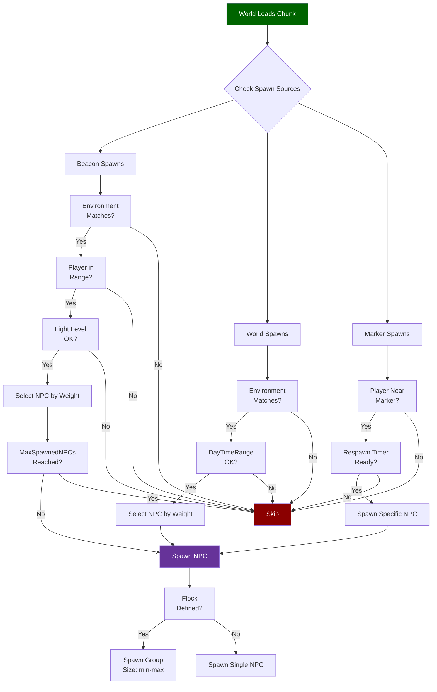
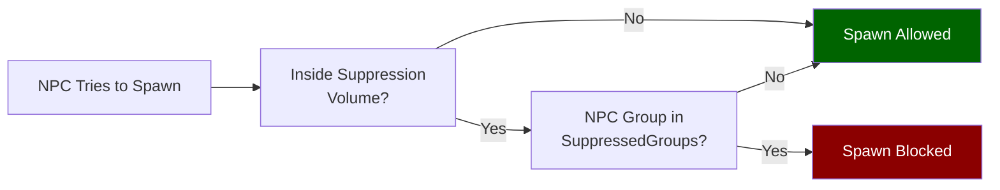

## Descripción general

Los archivos de reglas de aparición vinculan roles de NPC con ubicaciones y condiciones del mundo. El sistema tiene tres mecanismos de aparición: las **apariciones por baliza** gestionan puntos de aparición dinámicos vinculados a etiquetas de entorno con controles de ciclo de vida; las **apariciones del mundo** son tablas más simples vinculadas a etiquetas de entorno y ventanas de hora del día opcionales; las **apariciones por marcador** se colocan directamente en el mundo y referencian nombres específicos de NPC con temporizadores de reaparición.

## Ubicación de archivos

- `Assets/Server/NPC/Spawn/Beacons/**/*.json` — Apariciones impulsadas por balizas
- `Assets/Server/NPC/Spawn/World/**/*.json` — Apariciones del entorno del mundo
- `Assets/Server/NPC/Spawn/Markers/**/*.json` — Apariciones por marcador colocado
- `Assets/Server/NPC/Spawn/Suppression/**/*.json` — Volúmenes de supresión de aparición

## Cómo funciona la aparición de NPCs



### Zonas de supresión



## Esquema

### Aparición por baliza

| Field | Type | Required | Default | Descripción |
|-------|------|----------|---------|-------------|
| `Environments` | string[] | Sí | — | IDs de etiquetas de entorno donde esta baliza está activa. |
| `NPCs` | array | Sí | — | Lista de entradas de NPC (ver tabla de entradas de NPC abajo). |
| `MinDistanceFromPlayer` | number | No | — | Distancia mínima del jugador para aparecer, en bloques. |
| `MaxSpawnedNPCs` | number | No | — | Máximo de NPCs vivos que esta baliza mantendrá. |
| `ConcurrentSpawnsRange` | [number, number] | No | — | Min/max de NPCs a aparecer en un solo evento de aparición. |
| `SpawnAfterGameTimeRange` | [string, string] | No | — | Rango de duración ISO 8601 antes de la primera aparición (p.ej. `["PT20M", "PT40M"]`). |
| `NPCIdleDespawnTime` | number | No | — | Segundos que un NPC inactivo persiste antes de desaparecer. |
| `BeaconVacantDespawnGameTime` | string | No | — | Duración ISO 8601 — cuánto tiempo espera una baliza vacante antes de desaparecer. |
| `BeaconRadius` | number | No | — | Radio del área gestionada por la baliza, en bloques. |
| `SpawnRadius` | number | No | — | Radio dentro del cual se aparecen los NPCs, en bloques. |
| `TargetDistanceFromPlayer` | number | No | — | Distancia ideal de aparición desde el jugador. |
| `LightRanges` | object | No | — | Restricciones de nivel de luz del bloque, p.ej. `{ "Light": [0, 2] }`. |

### Aparición del mundo

| Field | Type | Required | Default | Descripción |
|-------|------|----------|---------|-------------|
| `Environments` | string[] | Sí | — | IDs de etiquetas de entorno donde esta tabla de aparición está activa. |
| `NPCs` | array | Sí | — | Lista de entradas de NPC (ver tabla de entradas de NPC abajo). |
| `DayTimeRange` | [number, number] | No | — | Rango de horas del juego cuando la aparición está permitida, p.ej. `[6, 18]` para solo durante el día. |

### Aparición por marcador

| Field | Type | Required | Default | Descripción |
|-------|------|----------|---------|-------------|
| `Model` | string | Sí | — | El ID del modelo del marcador (típicamente `"NPC_Spawn_Marker"`). |
| `NPCs` | array | Sí | — | Lista de entradas de NPC (ver tabla de entradas de NPC abajo). |
| `ExclusionRadius` | number | No | — | Otros marcadores dentro de este radio no aparecerán también, en bloques. |
| `RealtimeRespawn` | boolean | No | `false` | Si es `true`, los NPCs reaparecen con un temporizador en tiempo real. |
| `MaxDropHeight` | number | No | — | Distancia máxima sobre el suelo donde se puede colocar al NPC. |
| `DeactivationDistance` | number | No | — | Distancia del jugador a la que este marcador deja de simular, en bloques. |

### Volumen de supresión

| Field | Type | Required | Default | Descripción |
|-------|------|----------|---------|-------------|
| `SuppressionRadius` | number | Sí | — | Radio de la zona de supresión, en bloques. |
| `SuppressedGroups` | string[] | Sí | — | IDs de grupos de NPC suprimidos dentro de esta zona (p.ej. `["Aggressive", "Passive"]`). |
| `SuppressSpawnMarkers` | boolean | No | `false` | Si es `true`, también suprime marcadores de aparición dentro de la zona. |

### Entrada de NPC (usada en el arreglo `NPCs`)

| Field | Type | Required | Default | Descripción |
|-------|------|----------|---------|-------------|
| `Id` / `Name` | string | Sí | — | ID de rol del NPC a aparecer. Las balizas usan `Id`; los marcadores usan `Name`. |
| `Weight` | number | No | — | Peso relativo de aparición al seleccionar entre múltiples candidatos. |
| `Flock` | string \| object | No | — | ID de grupo de manada (string) o especificación de tamaño de manada en línea `{ "Size": [min, max] }`. |
| `SpawnBlockSet` | string | No | — | Etiqueta del conjunto de bloques sobre el que el NPC debe aparecer (p.ej. `"Volcanic"`, `"Portals_Oasis_Soil"`). |
| `SpawnFluidTag` | string | No | — | Etiqueta de fluido requerida cerca del punto de aparición (p.ej. `"Water"`). |
| `RealtimeRespawnTime` | number | No | — | Segundos antes de que este NPC reaparezca (apariciones por marcador). |
| `SpawnAfterGameTime` | string | No | — | Duración ISO 8601 antes de que esta entrada sea elegible (p.ej. `"P1D"`). |

## Ejemplos

### Aparición por baliza (goblins de cueva)

```json
{
  "Environments": ["Env_Zone1_Caves_Goblins"],
  "MinDistanceFromPlayer": 15,
  "MaxSpawnedNPCs": 3,
  "ConcurrentSpawnsRange": [1, 2],
  "SpawnAfterGameTimeRange": ["PT20M", "PT40M"],
  "NPCIdleDespawnTime": 60,
  "BeaconVacantDespawnGameTime": "PT15M",
  "BeaconRadius": 50,
  "SpawnRadius": 40,
  "TargetDistanceFromPlayer": 25,
  "NPCs": [
    { "Weight": 60, "SpawnBlockSet": "Volcanic", "Id": "Goblin_Scrapper" },
    { "Weight": 20, "SpawnBlockSet": "Volcanic", "Id": "Goblin_Lobber" },
    { "Weight": 20, "SpawnBlockSet": "Volcanic", "Id": "Goblin_Miner" }
  ],
  "LightRanges": {
    "Light": [0, 2]
  }
}
```

### Aparición del mundo (animales de oasis, solo de día)

```json
{
  "Environments": ["Env_Portals_Oasis"],
  "NPCs": [
    {
      "Weight": 15,
      "SpawnBlockSet": "Portals_Oasis_Soil",
      "SpawnFluidTag": "Water",
      "Id": "Flamingo",
      "Flock": "Group_Small"
    },
    {
      "Weight": 10,
      "SpawnBlockSet": "Portals_Oasis_Soil",
      "Id": "Tortoise"
    }
  ],
  "DayTimeRange": [6, 18]
}
```

### Aparición por marcador (oso, reaparición en tiempo real)

```json
{
  "Model": "NPC_Spawn_Marker",
  "NPCs": [
    {
      "Name": "Bear_Grizzly",
      "Weight": 100,
      "RealtimeRespawnTime": 420
    }
  ],
  "ExclusionRadius": 20,
  "RealtimeRespawn": true,
  "MaxDropHeight": 4,
  "DeactivationDistance": 150
}
```

### Volumen de supresión

```json
{
  "SuppressionRadius": 45,
  "SuppressedGroups": ["Aggressive", "Passive", "Neutral"],
  "SuppressSpawnMarkers": true
}
```

## Páginas relacionadas

- [Roles de NPC](/hytale-modding-docs/reference/npc-system/npc-roles) — Archivos de rol referenciados por `Id` / `Name` en las entradas de aparición
- [Grupos de NPC](/hytale-modding-docs/reference/npc-system/npc-groups) — IDs de grupo usados en `Flock` y supresión
- [Actitudes de NPC](/hytale-modding-docs/reference/npc-system/npc-attitudes) — Cómo los NPCs aparecidos se relacionan entre sí
