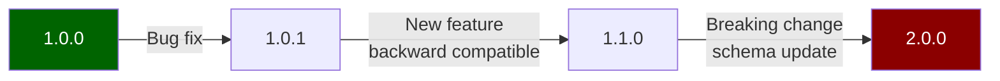
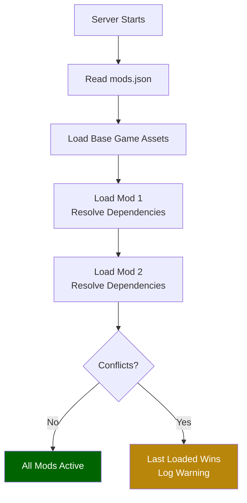

## Lo Que Aprenderás

- Estructurar un paquete de mod completo
- Escribir un `manifest.json` para tu mod
- Organizar assets por espacio de nombres
- Versionar tu mod correctamente
- Distribuir e instalar mods en servidores

## Prerrequisitos

- Haber completado al menos un tutorial para principiantes
- Familiaridad con la [Estructura del Proyecto](/hytale-modding-docs/getting-started/project-structure/)
- Un mod funcional con al menos un asset personalizado

## Paso 1: Estructura de Carpetas del Mod

Un mod de Hytale distribuible sigue una estructura de carpetas específica que refleja la estructura de assets del juego:

```
my_awesome_mod/
├── manifest.json
├── Server/
│   ├── NPC/
│   │   ├── Roles/
│   │   │   └── MyCreature.json
│   │   └── Spawn/
│   │       └── MyCreature_Spawn.json
│   ├── Item/
│   │   ├── Items/
│   │   │   └── MyItem.json
│   │   └── Recipes/
│   │       └── MyItem_Recipe.json
│   ├── Drops/
│   │   └── Drop_MyCreature.json
│   └── Models/
│       └── MyCreature.json
└── Common/
    ├── BlockTextures/
    │   └── My_Custom_Block.png
    └── Blocks/
        └── MyBlock/
            ├── MyBlock.blockymodel
            └── MyBlock.blockyanim
```

Reglas clave:
- La estructura de carpetas **debe coincidir** con el diseño de `Assets/` del juego
- Las configuraciones del lado del servidor van en `Server/`
- Los modelos, texturas y animaciones del lado del cliente van en `Common/`
- Mantén un espacio de nombres limpio para evitar conflictos con otros mods

## Paso 2: Crear el Manifiesto

El `manifest.json` identifica tu mod ante el servidor:

```json
{
  "Name": "My Awesome Mod",
  "Namespace": "my_awesome_mod",
  "Version": "1.0.0",
  "Description": "Adds new creatures, items, and blocks to Hytale.",
  "Author": "YourName",
  "Dependencies": [],
  "ServerSide": true,
  "ClientSide": true
}
```

### Campos del Manifiesto

| Campo | Tipo | Requerido | Descripción |
|-------|------|-----------|-------------|
| `Name` | string | Sí | Nombre legible del mod. |
| `Namespace` | string | Sí | Identificador único (minúsculas, guiones bajos). Se usa como prefijo para todos los IDs de assets. |
| `Version` | string | Sí | Versión semántica (`MAJOR.MINOR.PATCH`). |
| `Description` | string | No | Descripción breve de lo que hace el mod. |
| `Author` | string | No | Nombre del creador o equipo. |
| `Dependencies` | string[] | No | Lista de espacios de nombres de mods requeridos (por ejemplo, `["base_game"]`). |
| `ServerSide` | boolean | No | Si el mod incluye assets del lado del servidor. |
| `ClientSide` | boolean | No | Si el mod incluye assets del lado del cliente. |

## Paso 3: Asignar Espacio de Nombres a tus Assets

Todas las referencias de assets deben usar el espacio de nombres de tu mod para evitar conflictos:

```json
{
  "Reference": "Template_Beasts_Passive_Critter",
  "Modify": {
    "Appearance": "my_awesome_mod:MyCreature",
    "Drops": {
      "Reference": "my_awesome_mod:Drop_MyCreature"
    }
  }
}
```

### Convenciones de Nomenclatura

| Tipo de Asset | Convención | Ejemplo |
|---------------|-----------|---------|
| NPC Roles | `PascalCase` | `MyCreature.json` |
| Items | `PascalCase` | `MagicSword.json` |
| Blocks | `PascalCase` | `GlowingCrystal.json` |
| Textures | `PascalCase_Suffix` | `My_Block_Side.png`, `My_Block_Top.png` |
| Recipes | `PascalCase` | `MagicSword_Recipe.json` |
| Drop Tables | `Drop_PascalCase` | `Drop_MyCreature.json` |

## Paso 4: Versionado

Sigue el versionado semántico:



- **PATCH** (1.0.0 → 1.0.1): Correcciones de errores, correcciones de tipografía, ajustes de balance
- **MINOR** (1.0.0 → 1.1.0): Nuevo contenido (NPCs, objetos, bloques) sin romper partidas existentes
- **MAJOR** (1.0.0 → 2.0.0): Cambios que rompen contenido existente (IDs renombrados, archivos reestructurados)

## Paso 5: Lista de Verificación de Pruebas

Antes de distribuir, verifica:

- [ ] El servidor inicia sin errores con tu mod cargado
- [ ] Todos los NPCs aparecen correctamente en sus entornos definidos
- [ ] Todos los objetos aparecen en los menús de fabricación y pueden fabricarse
- [ ] Todos los bloques pueden colocarse y romperse
- [ ] Las tablas de botín producen el botín esperado
- [ ] No hay conflictos de espacio de nombres con los assets del juego base
- [ ] Las texturas y modelos se renderizan correctamente en el juego
- [ ] `manifest.json` tiene la versión y metadatos correctos

## Paso 6: Distribución

### Empaquetado

1. Comprime la carpeta del mod en un zip (incluyendo `manifest.json` en la raíz)
2. Nombra el archivo: `my_awesome_mod_v1.0.0.zip`
3. Incluye un `README.txt` con instrucciones de instalación

### Instalación

Los usuarios instalan tu mod:

1. Extrayendo el zip en el directorio `mods/` del servidor
2. Agregando el espacio de nombres de tu mod a `mods.json` en la configuración del servidor
3. Reiniciando el servidor

```
hytale-server/
├── mods/
│   └── my_awesome_mod/
│       ├── manifest.json
│       ├── Server/
│       └── Common/
└── mods.json
```

### Orden de Carga de Mods



Los mods se cargan en el orden listado en `mods.json`. Si dos mods definen el mismo ID de asset, el último cargado tiene prioridad.

## Consejos para Mods Limpios

1. **Mantén el enfoque** — un mod debería hacer una cosa bien
2. **Usa herencia** — extiende las plantillas del juego base con `Reference`/`Modify` en lugar de duplicar
3. **Documenta tus cambios** — incluye un changelog en tu README
4. **Prueba con otros mods** — verifica conflictos de espacio de nombres
5. **Mantén los archivos pequeños** — optimiza texturas, evita assets innecesarios

## Páginas Relacionadas

- [Installation & Setup](/hytale-modding-docs/getting-started/installation/) — Configuración inicial de la carpeta del mod
- [Project Structure](/hytale-modding-docs/getting-started/project-structure/) — Comprensión del árbol de assets
- [Inheritance & Templates](/hytale-modding-docs/reference/concepts/inheritance-and-templates/) — Extensión de assets del juego base
- [JSON Basics](/hytale-modding-docs/getting-started/json-basics/) — Patrones comunes de JSON
