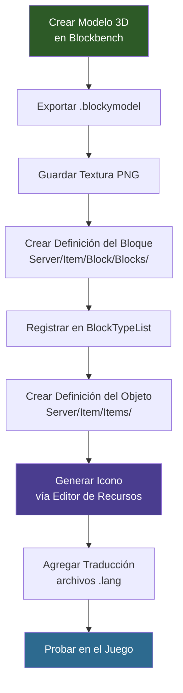

## Lo que Construirás

Un bloque de cristal brillante llamado **Block_Crystal_Glow** — un bloque con modelo personalizado que tiene su propia textura, emisión de luz, conjunto de sonidos e icono de inventario.


## Requisitos Previos

- Una carpeta de mod con un `manifest.json` válido (ver [Instalación y Configuración](/hytale-modding-docs/getting-started/installation/))
- [Blockbench](https://www.blockbench.net/) para crear el modelo 3D
- Una build de Hytale compatible con tu `TargetServerVersion`
- Familiaridad básica con JSON (ver [Conceptos Básicos de JSON](/hytale-modding-docs/getting-started/json-basics/))

## Repositorio Git

El mod completo y funcional está disponible como repositorio de GitHub que puedes clonar y usar directamente:

```text
https://github.com/nevesb/hytale-mods-custom-block
```

Clónalo y copia el contenido en tu directorio de mods de Hytale para probarlo inmediatamente. El repositorio contiene todos los archivos descritos en este tutorial con la estructura de carpetas correcta:

```
hytale-mods-custom-block/
├── manifest.json
├── Common/
│   ├── Blocks/HytaleModdingManual/
│   │   └── Crystal_Glow.blockymodel
│   ├── BlockTextures/HytaleModdingManual/
│   │   └── Crystal_Glow.png
│   └── Icons/ItemsGenerated/
│       └── Block_Crystal_Glow.png
├── Server/
│   ├── BlockTypeList/
│   │   └── HytaleModdingManual_Blocks.json
│   ├── Item/
│   │   ├── Block/Blocks/HytaleModdingManual/
│   │   │   └── Block_Crystal_Glow.json
│   │   └── Items/HytaleModdingManual/
│   │       └── Block_Crystal_Glow.json
│   └── Languages/
│       └── en-US/server.lang
└── ...
```

Para un mod de tutorial solo con assets, tu manifest debería verse así:

```json
{
  "Group": "HytaleModdingManual",
  "Name": "CreateACustomBlock",
  "Version": "1.0.0",
  "Description": "Implements the Create A Block tutorial with a custom crystal block",
  "Authors": [
    {
      "Name": "HytaleModdingManual"
    }
  ],
  "Dependencies": {},
  "OptionalDependencies": {},
  "IncludesAssetPack": true,
  "TargetServerVersion": "2026.02.19-1a311a592"
}
```

---

## Paso 1: Construir el Bloque en Blockbench

Abre [Blockbench](https://www.blockbench.net/) y crea tu modelo de bloque. Para el ejemplo del cristal, el modelo es un grupo de prismas rectangulares dispuestos para parecer formaciones de cristal naturales sobre una base plana.


Exporta el modelo como archivo `.blockymodel` y guárdalo en:

```text
Common/Blocks/HytaleModdingManual/Crystal_Glow.blockymodel
```

El formato `.blockymodel` es el formato de modelo en tiempo de ejecución de Hytale. Blockbench puede exportar directamente a este formato usando el plugin de Hytale.

---

## Paso 2: Crear la Textura

Pinta o exporta tu textura en Blockbench y guarda el archivo PNG en:

```text
Common/BlockTextures/HytaleModdingManual/Crystal_Glow.png
```

Este es el atlas de textura referenciado por el `.blockymodel`. El mapeo UV en Blockbench determina cómo esta textura se envuelve alrededor de las caras del modelo.

---

## Paso 3: Crear la Definición del Bloque

La definición del bloque controla cómo se comporta el bloque en el mundo — su física, renderizado, luz, sonido y comportamiento al recolectar.

Crea el archivo en:

```text
Server/Item/Block/Blocks/HytaleModdingManual/Block_Crystal_Glow.json
```

```json
{
  "Material": "Solid",
  "DrawType": "Model",
  "Opacity": "Transparent",
  "VariantRotation": "NESW",
  "CustomModel": "Blocks/HytaleModdingManual/Crystal_Glow.blockymodel",
  "CustomModelTexture": [
    {
      "Texture": "BlockTextures/HytaleModdingManual/Crystal_Glow.png",
      "Weight": 1
    }
  ],
  "HitboxType": "Full",
  "Gathering": {
    "Breaking": {
      "GatherType": "Rocks",
      "ItemId": "Block_Crystal_Glow"
    }
  },
  "Light": {
    "Color": "#88ccff",
    "Level": 14
  },
  "BlockSoundSetId": "Crystal",
  "ParticleColor": "#88ccff",
  "Support": {
    "Down": [
      {
        "FaceType": "Full"
      }
    ]
  }
}
```

### Campos de la Definición del Bloque

| Campo | Tipo | Requerido | Predeterminado | Descripción |
|-------|------|-----------|----------------|-------------|
| `Material` | string | Sí | — | Material físico del bloque. Controla la colisión y la interacción con herramientas. Valores: `Solid`, `Liquid`, `Gas`, `NonSolid`. |
| `DrawType` | string | Sí | `Block` | Cómo se renderiza el bloque. `Block` = cubo estándar, `Model` = malla `.blockymodel` personalizada, `Cross` = sprite de planta en forma de X. |
| `Opacity` | string | No | `Opaque` | Comportamiento de la luz. `Opaque` bloquea la luz completamente, `Transparent` deja pasar la luz, `SemiTransparent` para opacidad parcial. |
| `VariantRotation` | string | No | — | Variantes de rotación al colocar. `NESW` = 4 direcciones cardinales, `None` = orientación fija. |
| `CustomModel` | string | No | — | Ruta al archivo `.blockymodel` (relativa a `Common/`). Requerido cuando `DrawType` es `Model`. |
| `CustomModelTexture` | array | No | — | Lista de objetos de textura para el modelo personalizado. Cada entrada tiene `Texture` (ruta) y `Weight` (para selección aleatoria). |
| `CustomModelTexture[].Texture` | string | Sí | — | Ruta al archivo de textura PNG (relativa a `Common/`). |
| `CustomModelTexture[].Weight` | number | No | 1 | Peso para la selección aleatoria de textura. Si se listan múltiples texturas, Hytale elige una basándose en el peso. |
| `HitboxType` | string | No | `Full` | Forma del hitbox de colisión. `Full` = todo el espacio del bloque, `None` = sin colisión (se puede atravesar), `Custom` = definido por modelo. |
| `Gathering` | object | No | — | Define qué sucede cuando el bloque se rompe. Contiene un subobjeto `Breaking`. |
| `Gathering.Breaking.GatherType` | string | No | — | Categoría de herramienta necesaria para romper eficientemente. Valores: `Rocks`, `Wood`, `Dirt`, `Plant`, etc. |
| `Gathering.Breaking.ItemId` | string | No | — | ID del objeto que se suelta cuando el bloque se rompe. Usa el propio ID del bloque para que se suelte a sí mismo. |
| `Light` | object | No | — | Configuración de emisión de luz. |
| `Light.Color` | string | No | `#ffffff` | Color hexadecimal de la luz emitida. |
| `Light.Level` | number | No | 0 | Intensidad de la luz de 0 (sin luz) a 15 (máximo, como la luz solar). |
| `BlockSoundSetId` | string | No | — | Conjunto de sonidos usado al colocar, romper y caminar sobre el bloque. Valores: `Stone`, `Wood`, `Crystal`, `Metal`, `Dirt`, etc. |
| `ParticleColor` | string | No | — | Color hexadecimal de las partículas emitidas cuando el bloque se rompe. |
| `BlockParticleSetId` | string | No | — | Conjunto de partículas usado cuando el bloque se rompe o se interactúa con él. Valores: `Stone`, `Wood`, `Dirt`, etc. |
| `Support` | object | No | — | Define qué bloques adyacentes deben existir para que este bloque permanezca colocado. Si el soporte se elimina, el bloque se rompe y cae como objeto. `Down` requiere un bloque debajo con `FaceType: "Full"`. |
| `Flags` | object | No | `{}` | Flags de campo de bits para comportamientos especiales del bloque (por ejemplo, `Flammable`, `Replaceable`). |

---

## Paso 4: Registrar el Bloque en un BlockTypeList

Crea el archivo de lista en:

```text
Server/BlockTypeList/HytaleModdingManual_Blocks.json
```

```json
{
  "Blocks": [
    "Block_Crystal_Glow"
  ]
}
```

Hytale combina automáticamente las listas de bloques de todos los mods cargados. No necesitas modificar ningún archivo vanilla — solo crea tu propia lista y el juego la descubrirá.

---

## Paso 5: Crear la Definición del Objeto

La definición del objeto hace que el bloque aparezca en el inventario y controla cómo el jugador interactúa con él. Esto es independiente de la definición del bloque — el objeto es lo que el jugador sostiene, y el bloque es lo que existe en el mundo.

Crea el archivo en:

```text
Server/Item/Items/HytaleModdingManual/Block_Crystal_Glow.json
```

```json
{
  "TranslationProperties": {
    "Name": "server.items.Block_Crystal_Glow.name",
    "Description": "server.items.Block_Crystal_Glow.description"
  },
  "Interactions": {
    "Primary": "Block_Primary",
    "Secondary": "Block_Secondary"
  },
  "Quality": "Uncommon",
  "Icon": "Icons/ItemsGenerated/Block_Crystal_Glow.png",
  "PlayerAnimationsId": "Block",
  "BlockType": {
    "Material": "Solid",
    "DrawType": "Model",
    "Opacity": "Transparent",
    "VariantRotation": "NESW",
    "CustomModel": "Blocks/HytaleModdingManual/Crystal_Glow.blockymodel",
    "CustomModelTexture": [
      {
        "Texture": "BlockTextures/HytaleModdingManual/Crystal_Glow.png",
        "Weight": 1
      }
    ],
    "HitboxType": "Full",
    "Flags": {},
    "Gathering": {
      "Breaking": {
        "GatherType": "Rocks",
        "ItemId": "Block_Crystal_Glow"
      }
    },
    "Light": {
      "Color": "#88ccff",
      "Level": 14
    },
    "BlockParticleSetId": "Stone",
    "BlockSoundSetId": "Crystal",
    "ParticleColor": "#88ccff",
    "Support": {
      "Down": [
        {
          "FaceType": "Full"
        }
      ]
    }
  },
  "MaxStack": 64,
  "IconProperties": {
    "Scale": 0.58823,
    "Rotation": [22.5, 45, 22.5],
    "Translation": [0, -13.5]
  }
}
```

### Campos de la Definición del Objeto

| Campo | Tipo | Requerido | Predeterminado | Descripción |
|-------|------|-----------|----------------|-------------|
| `TranslationProperties` | object | No | — | Contiene las claves de traducción para el nombre y la descripción del objeto. |
| `TranslationProperties.Name` | string | No | — | Clave de traducción para el nombre visible del objeto (por ejemplo, `server.items.Block_Crystal_Glow.name`). |
| `TranslationProperties.Description` | string | No | — | Clave de traducción para la descripción del tooltip del objeto. |
| `Interactions` | object | No | — | Define qué sucede al hacer clic izquierdo (`Primary`) y clic derecho (`Secondary`). |
| `Interactions.Primary` | string | No | — | Interacción primaria cuando el jugador hace clic izquierdo. `Block_Primary` = comportamiento de romper bloque. |
| `Interactions.Secondary` | string | No | — | Interacción secundaria cuando el jugador hace clic derecho. `Block_Secondary` = comportamiento de colocar bloque. |
| `Quality` | string | No | `Common` | Nivel de rareza del objeto. Afecta el color del nombre del objeto en la interfaz. Valores: `Common`, `Uncommon`, `Rare`, `Epic`, `Legendary`. |
| `Icon` | string | No | — | Ruta al icono PNG del inventario (relativa a `Common/`). |
| `PlayerAnimationsId` | string | No | — | Conjunto de animaciones usado cuando el jugador sostiene este objeto. `Block` = animaciones de colocación de bloque, `Sword` = golpe cuerpo a cuerpo, etc. |
| `BlockType` | object | No | — | Definición de bloque integrada. Cuando el jugador coloca el objeto, este bloque se crea en el mundo. Contiene los mismos campos que la Definición de Bloque independiente. |
| `MaxStack` | number | No | 1 | Tamaño máximo de la pila en el inventario (1–64). |
| `IconProperties` | object | No | — | Controla cómo el modelo 3D se renderiza como icono de inventario. |
| `IconProperties.Scale` | number | No | 1.0 | Factor de escala para el renderizado del icono. Ajústalo para que el modelo encaje dentro del marco del icono. |
| `IconProperties.Rotation` | array | No | `[0,0,0]` | Rotación Euler `[X, Y, Z]` en grados para el renderizado del icono. `[22.5, 45, 22.5]` da una vista isométrica estándar. |
| `IconProperties.Translation` | array | No | `[0,0]` | Desplazamiento en píxeles `[X, Y]` para centrar el modelo en el marco del icono. |
| `Parent` | string | No | — | Hereda campos de otra definición de objeto. Útil para crear variantes sin duplicar todo el JSON. |
| `Tags` | array | No | `[]` | Lista de cadenas de etiquetas para categorización y filtrado (por ejemplo, `["Decorative", "Light_Source"]`). |
| `Categories` | array | No | `[]` | Categorías del objeto para agrupación en el menú de crafteo. |
| `ItemLevel` | number | No | 0 | Nivel numérico de tier usado para restricción de progresión. |
| `MaxStack` | number | No | 1 | Número máximo de objetos por espacio de inventario. |
| `SoundEventId` | string | No | — | Sonido reproducido en eventos específicos del objeto (equipar, usar). |
| `ItemSoundSetId` | string | No | — | Conjunto de sonidos para interacciones generales del objeto. |

---

## Paso 6: Generar el Icono con el Editor de Recursos

Hytale incluye un **Editor de Recursos** integrado accesible desde el Modo Creativo. Puedes usarlo para generar automáticamente el icono de inventario de tu bloque en lugar de crear uno manualmente.


Para generar el icono:

1. Abre Hytale en **Modo Creativo**
2. Abre el **Editor de Recursos** (esquina superior derecha: botón "Editor")
3. Navega a **Item** en el panel izquierdo y encuentra tu grupo de mod (por ejemplo, `HytaleModdingManual`)
4. Selecciona tu objeto de bloque (`Block_Crystal_Glow`)
5. En el panel de propiedades a la derecha, encuentra el campo **Icon**
6. Haz clic en el icono del lápiz junto al campo Icon — el editor renderizará el modelo 3D y guardará un icono PNG automáticamente
7. El icono generado se guarda en `Icons/ItemsGenerated/Block_Crystal_Glow.png`

El Editor de Recursos también te permite ajustar `IconProperties` (Scale, Rotation, Translation) visualmente para obtener la vista isométrica perfecta para tu icono.

Las `IconProperties` en el JSON del objeto controlan cómo el modelo 3D se posiciona para el renderizado del icono:
- **Scale**: `0.58823` reduce el cristal para que encaje dentro del marco del icono
- **Rotation**: `[22.5, 45, 22.5]` da el ángulo isométrico estándar
- **Translation**: `[0, -13.5]` desplaza el modelo hacia abajo para centrarlo

---

## Paso 7: Agregar Traducciones

Hytale usa archivos `.lang` para traducir los nombres y descripciones de los objetos. Crea un archivo de idioma para cada locale que quieras soportar:

```text
Server/Languages/en-US/server.lang
Server/Languages/pt-BR/server.lang
Server/Languages/es/server.lang
```

### Cómo Funciona la Traducción

El JSON del objeto referencia claves de traducción a través de `TranslationProperties`:

```json
{
  "TranslationProperties": {
    "Name": "server.items.Block_Crystal_Glow.name",
    "Description": "server.items.Block_Crystal_Glow.description"
  }
}
```

El juego busca estas claves en el archivo `.lang` que coincida con el idioma del jugador. El formato de la clave es:

```text
items.<ItemId>.<property> = <texto traducido>
```

### Inglés (`Server/Languages/en-US/server.lang`)

```text
items.Block_Crystal_Glow.name = Glowing Crystal Block
items.Block_Crystal_Glow.description = A crystal block that radiates soft blue light.
```

### Portugués (`Server/Languages/pt-BR/server.lang`)

```text
items.Block_Crystal_Glow.name = Bloco de Cristal Brilhante
items.Block_Crystal_Glow.description = Um bloco de cristal que irradia uma suave luz azul.
```

### Español (`Server/Languages/es/server.lang`)

```text
items.Block_Crystal_Glow.name = Bloque de Cristal Brillante
items.Block_Crystal_Glow.description = Un bloque de cristal que irradia una suave luz azul.
```

Si falta una clave de traducción para un locale, Hytale recurre a `en-US`. Si la clave falta por completo, se muestra la cadena de la clave sin traducir (por ejemplo, `server.items.Block_Crystal_Glow.name`) en lugar del nombre traducido.

Para más detalles sobre el sistema de localización, consulta [Claves de Localización](/hytale-modding-docs/reference/concepts/localization-keys/).

---

## Paso 8: Empaquetar y Probar

La carpeta final de tu mod debería verse así:

```text
CreateACustomBlock/
├── manifest.json
├── Common/
│   ├── Blocks/HytaleModdingManual/
│   │   └── Crystal_Glow.blockymodel
│   ├── BlockTextures/HytaleModdingManual/
│   │   └── Crystal_Glow.png
│   └── Icons/ItemsGenerated/
│       └── Block_Crystal_Glow.png
├── Server/
│   ├── BlockTypeList/
│   │   └── HytaleModdingManual_Blocks.json
│   ├── Item/
│   │   ├── Block/Blocks/HytaleModdingManual/
│   │   │   └── Block_Crystal_Glow.json
│   │   └── Items/HytaleModdingManual/
│   │       └── Block_Crystal_Glow.json
│   └── Languages/
│       ├── en-US/server.lang
│       ├── pt-BR/server.lang
│       └── es/server.lang
```

Para probar:

1. Copia la carpeta del mod en tu directorio de mods de Hytale
2. Inicia el juego o recarga el entorno de mods
3. Otórgate permisos de operador y genera el bloque usando comandos de chat:
   ```text
   /op self
   /spawnitem Block_Crystal_Glow
   ```
4. Coloca el bloque en el mundo
5. Confirma:
   - El modelo personalizado del cristal aparece (no un cubo por defecto)
   - El bloque emite luz azul (`Level: 14`)
   - Los sonidos de cristal se reproducen al colocar y romper
   - El bloque se suelta a sí mismo al romperse
   - El nombre traducido aparece en el tooltip del inventario

---

## Flujo de Creación de Bloques



---

## Páginas Relacionadas

- [Crear un Objeto Personalizado](/hytale-modding-docs/tutorials/beginner/create-an-item/) — Objetos sin colocación de bloque
- [Crear un NPC Personalizado](/hytale-modding-docs/tutorials/beginner/create-an-npc/) — Generar criaturas en el mundo
- [Referencia de Definiciones de Bloques](/hytale-modding-docs/reference/item-system/block-definitions/) — Esquema completo de bloques
- [Referencia de Definiciones de Objetos](/hytale-modding-docs/reference/item-system/item-definitions/) — Esquema completo de objetos
- [Texturas de Bloques](/hytale-modding-docs/reference/models-and-visuals/block-textures/) — Convenciones de texturas
- [Claves de Localización](/hytale-modding-docs/reference/concepts/localization-keys/) — Sistema de traducción
- [Empaquetado de Mods](/hytale-modding-docs/tutorials/advanced/mod-packaging/) — Guía de distribución
