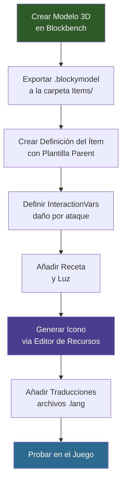

## Lo Que Vas a Construir

Una **Espada de Cristal** — un arma cuerpo a cuerpo personalizada fabricada con bloques de cristal brillante. Hereda el sistema de combate con espada de Hytale (combos de golpes, guardia, ataque especial), tiene su propio modelo 3D voxel, textura de cristal pintada a mano, emisión de luz, receta de crafteo y traducciones multilingüe.


## Requisitos Previos

- Una carpeta de mod con un `manifest.json` válido (ver [Instalación y Configuración](/hytale-modding-docs/getting-started/installation/))
- [Blockbench](https://www.blockbench.net/) con el plugin de Hytale para crear el modelo 3D
- El tutorial [Crear un Bloque](/hytale-modding-docs/tutorials/beginner/create-a-block/) completado (la Espada de Cristal usa `Ore_Crystal_Glow` como ingrediente de crafteo)
- Familiaridad básica con JSON (ver [Fundamentos de JSON](/hytale-modding-docs/getting-started/json-basics/))

## Repositorio Git

El mod funcional completo está disponible como repositorio de GitHub:

```text
https://github.com/nevesb/hytale-mods-custom-weapon
```

Clónalo y copia el contenido en tu directorio de mods de Hytale. El repositorio contiene todos los archivos descritos en este tutorial:

```
hytale-mods-custom-weapon/
├── manifest.json
├── Weapon_Sword_Crystal_Glow.bbmodel              (archivo fuente de Blockbench)
├── Common/
│   ├── Items/Weapons/Crystal/
│   │   ├── Weapon_Sword_Crystal_Glow.blockymodel  (modelo de tiempo de ejecución exportado)
│   │   └── Weapon_Sword_Crystal_Glow.png          (textura)
│   └── Icons/ItemsGenerated/
│       └── Weapon_Sword_Crystal_Glow.png
├── Server/
│   ├── Item/Items/HytaleModdingManual/
│   │   └── Weapon_Sword_Crystal_Glow.json
│   └── Languages/
│       ├── en-US/server.lang
│       ├── pt-BR/server.lang
│       └── es/server.lang
```

Tu manifest:

```json
{
  "Group": "HytaleModdingManual",
  "Name": "CreateACustomWeapon",
  "Version": "1.0.0",
  "Description": "Implements the Create A Weapon tutorial with a custom crystal sword",
  "Authors": [
    {
      "Name": "HytaleModdingManual"
    }
  ],
  "Dependencies": {},
  "OptionalDependencies": {},
  "IncludesAssetPack": true,
  "TargetServerVersion": "2026.02.19-1a311a592"
}
```

---

## Paso 1: Modelar la Espada en Blockbench

Abre Blockbench y crea un nuevo proyecto con el formato **Hytale Character**. La espada se construye en cinco secciones, de abajo hacia arriba:

| Sección | Descripción | Dimensiones |
|---------|-------------|------------|
| **Pomo** | Pequeño cristal en la base | 3x6x3 |
| **Empuñadura** | Mango envuelto en cuero oscuro con anillos de metal | 6x18x6 (mango) + 7.5x1.5x7.5 (envueltos) |
| **Guardia** | Base de cristal con centro de diamante y hojas laterales | 27x6x4.5 (base) + 6x6x9 (diamante) + 4.5x9x1.5 (lados) |
| **Hoja** | Prisma de cristal principal con núcleo interior | 9x36x3 (principal) + 3x57x6 (núcleo) |
| **Punta** | Punto facetado afilado | 6x4.5x3 + 3x4.5x1.5 |


**Consejos de modelado:**
- Coloca el punto de pivote en el área del agarre de la empuñadura (alrededor de Y=15) — Hytale lo usa para el posicionamiento de la mano y el origen de la luz
- Usa cubos separados para cada prisma de cristal para crear el aspecto facetado
- Rota ligeramente los cristales de la guardia hacia afuera (15-25 grados) para un aspecto natural de racimo
- La altura total debe ser ~72 vóxeles para coincidir con la escala oficial de armas de Hytale
- Usa UV por cara (no box UV) para cubos grandes — el box UV está limitado a un espacio UV de 32x32
- Configura los cubos de la hoja y punta de cristal en sombreado **fullbright** para el efecto de brillo

**Texturizado:**
- Usa un estilo pintado a mano con bloques de color direccionales, sin degradados suaves
- Partes de cristal: franjas verticales de `#d9ffff` (arriba) a `#00bbee` (medio) a `#003050` (base), núcleo más claro que los bordes
- La empuñadura usa tonos cálidos de cuero: `#2a2520` con reflejos de costura `#3a3228`
- Los envoltorios usan gris metálico: `#484440` con brillo `#5a5550`
- La resolución de la textura debe coincidir con el tamaño UV: **128x128** (densidad de píxeles 64 / blockSize 64 = relación 1:1)

Exporta como **Hytale Blocky Model** y guarda en:

```text
Common/Items/Weapons/Crystal/Weapon_Sword_Crystal_Glow.blockymodel
```

Copia el PNG de la textura junto al blockymodel:

```text
Common/Items/Weapons/Crystal/Weapon_Sword_Crystal_Glow.png
```

:::caution[Rutas de Assets de Common]
Todas las rutas de `Common/` referenciadas en el JSON del ítem deben comenzar con un directorio raíz permitido: `Blocks/`, `Items/`, `Resources/`, `NPC/`, `VFX/` o `Consumable/`. Colocar modelos o texturas fuera de estas raíces (p. ej., `Models/`) causará un error de validación.
:::

---

## Paso 2: Crear la Definición del Ítem

Las armas de Hytale usan el sistema de plantillas `Parent` para heredar animaciones de combate base, interacciones y efectos de sonido. Al establecer `"Parent": "Template_Weapon_Sword"`, nuestra Espada de Cristal obtiene automáticamente el conjunto completo de movimientos de espada: combos de golpes, guardia y la habilidad especial Vortexstrike.

Crea el archivo en:

```text
Server/Item/Items/HytaleModdingManual/Weapon_Sword_Crystal_Glow.json
```

```json
{
  "Parent": "Template_Weapon_Sword",
  "TranslationProperties": {
    "Name": "server.items.Weapon_Sword_Crystal_Glow.name",
    "Description": "server.items.Weapon_Sword_Crystal_Glow.description"
  },
  "Model": "Items/Weapons/Crystal/Weapon_Sword_Crystal_Glow.blockymodel",
  "Texture": "Items/Weapons/Crystal/Weapon_Sword_Crystal_Glow.png",
  "Icon": "Icons/ItemsGenerated/Weapon_Sword_Crystal_Glow.png",
  "Quality": "Rare",
  "ItemLevel": 30,
  "Tags": {
    "Type": [
      "Weapon"
    ],
    "Family": [
      "Sword"
    ]
  },
  "IconProperties": {
    "Scale": 0.5,
    "Rotation": [0, 180, 45],
    "Translation": [-23, -23]
  },
  "InteractionVars": {
    "Swing_Left_Damage": {
      "Interactions": [
        {
          "Parent": "Weapon_Sword_Primary_Swing_Left_Damage",
          "DamageCalculator": {
            "BaseDamage": {
              "Physical": 14
            }
          }
        }
      ]
    },
    "Swing_Right_Damage": {
      "Interactions": [
        {
          "Parent": "Weapon_Sword_Primary_Swing_Right_Damage",
          "DamageCalculator": {
            "BaseDamage": {
              "Physical": 14
            }
          }
        }
      ]
    },
    "Swing_Down_Damage": {
      "Interactions": [
        {
          "Parent": "Weapon_Sword_Primary_Swing_Down_Damage",
          "DamageCalculator": {
            "BaseDamage": {
              "Physical": 24
            }
          }
        }
      ]
    },
    "Thrust_Damage": {
      "Interactions": [
        {
          "Parent": "Weapon_Sword_Primary_Thrust_Damage",
          "DamageCalculator": {
            "BaseDamage": {
              "Physical": 36
            }
          }
        }
      ]
    },
    "Vortexstrike_Spin_Damage": {
      "Interactions": [
        {
          "Parent": "Weapon_Sword_Signature_Vortexstrike_Spin_Damage",
          "DamageCalculator": {
            "BaseDamage": {
              "Physical": 26
            }
          }
        }
      ]
    },
    "Vortexstrike_Stab_Damage": {
      "Interactions": [
        {
          "Parent": "Weapon_Sword_Signature_Vortexstrike_Stab_Damage",
          "DamageCalculator": {
            "BaseDamage": {
              "Physical": 72
            }
          }
        }
      ]
    },
    "Guard_Wield": {
      "Interactions": [
        {
          "Parent": "Weapon_Sword_Secondary_Guard_Wield",
          "StaminaCost": {
            "Value": 8,
            "CostType": "Damage"
          }
        }
      ]
    }
  },
  "Recipe": {
    "TimeSeconds": 5.0,
    "KnowledgeRequired": false,
    "Input": [
      {
        "ItemId": "Ore_Crystal_Glow",
        "Quantity": 4
      },
      {
        "ItemId": "Ingredient_Bar_Iron",
        "Quantity": 2
      }
    ],
    "BenchRequirement": [
      {
        "Type": "Crafting",
        "Categories": [
          "Weapon_Sword"
        ],
        "Id": "Weapon_Bench"
      }
    ]
  },
  "Light": {
    "Radius": 2,
    "Color": "#468"
  },
  "MaxDurability": 450,
  "DurabilityLossOnHit": 0.18
}
```

### Campos Clave del Ítem

| Campo | Tipo | Descripción |
|-------|------|-------------|
| `Parent` | string | Hereda de una plantilla. `Template_Weapon_Sword` otorga el combate completo con espada: combos de golpes, guardia y firma Vortexstrike. |
| `TranslationProperties` | object | Claves de traducción de `Name` y `Description` para la interfaz de usuario. |
| `Model` | string | Ruta al `.blockymodel` (relativa a `Common/`). Debe comenzar con una raíz permitida: `Items/`, `Blocks/`, etc. |
| `Texture` | string | Ruta al PNG de la textura (relativa a `Common/`). Debe comenzar con una raíz permitida. |
| `Icon` | string | Ruta al PNG del icono de inventario (relativa a `Common/`). |
| `Quality` | string | Nivel de rareza. Controla el color del nombre: `Common`, `Uncommon`, `Rare`, `Epic`, `Legendary`. |
| `ItemLevel` | number | Nivel de progresión para la ponderación de la tabla de botín. |
| `Tags` | object | Grupos de etiquetas categorizadas. `Type` para la categoría del ítem, `Family` para la familia del arma. |
| `IconProperties` | object | Controla la representación del icono 3D: `Scale`, `Rotation` [X,Y,Z], `Translation` [X,Y]. |
| `InteractionVars` | object | Sobreescribe los valores de daño para cada ataque en la cadena de combo heredada. |
| `Recipe` | object | Receta de crafteo con ítems de `Input`, `BenchRequirement` y `TimeSeconds`. |
| `Light` | object | Luz emitida. `Radius` (entero) y `Color` (código hexadecimal abreviado). |
| `MaxDurability` | number | Total de golpes antes de que el arma se rompa. |
| `DurabilityLossOnHit` | number | Fracción de durabilidad perdida por golpe. |

### Daño mediante InteractionVars

A diferencia de un campo `Damage` simple, las armas de Hytale definen el daño **por ataque** en la cadena de combo usando `InteractionVars`. Cada nombre de variable (p. ej., `Swing_Left_Damage`) se corresponde con un fotograma de animación específico, y se sobreescribe el `DamageCalculator.BaseDamage` para establecer cuánto daño inflige ese golpe:

| Ataque | Animación | Daño de la Espada de Cristal |
|--------|-----------|------------------------------|
| `Swing_Left_Damage` | Golpe horizontal izquierdo | 14 Físico |
| `Swing_Right_Damage` | Golpe horizontal derecho | 14 Físico |
| `Swing_Down_Damage` | Golpe descendente desde arriba | 24 Físico |
| `Thrust_Damage` | Estocada hacia adelante (remate del combo) | 36 Físico |
| `Vortexstrike_Spin_Damage` | Ataque especial giratorio | 26 Físico |
| `Vortexstrike_Stab_Damage` | Remate especial con estocada | 72 Físico |

### Emisión de Luz

Los ítems pueden emitir luz usando el campo `Light` con `Radius` (entero, en bloques) y `Color` (código hexadecimal abreviado). La Espada de Cristal usa `"Color": "#468"` — un tenue resplandor cian a la mitad de la intensidad del Bloque de Cristal Brillante (`#88ccff`).

:::caution[El Radio Debe Ser un Entero]
El campo `Radius` solo acepta números enteros. Usar un decimal como `1.5` causará una `NumberFormatException` y el mod no se cargará.
:::

---

## Paso 3: Generar el Icono

Usa el **Editor de Recursos** en Modo Creativo para generar el icono de inventario, igual que en el tutorial del bloque:

1. Abre Hytale en Modo Creativo
2. Abre el Editor de Recursos (botón "Editor" en la parte superior derecha)
3. Navega a **Item** > `HytaleModdingManual` > `Weapon_Sword_Crystal_Glow`
4. Haz clic en el icono de lápiz junto al campo **Icon**
5. Ajusta `IconProperties` para obtener la mejor vista isométrica
6. El icono generado se guarda en `Icons/ItemsGenerated/Weapon_Sword_Crystal_Glow.png`

---

## Paso 4: Añadir Traducciones

Crea archivos de idioma para cada idioma:

### Inglés (`Server/Languages/en-US/server.lang`)

```text
items.Weapon_Sword_Crystal_Glow.name = Crystal Sword
items.Weapon_Sword_Crystal_Glow.description = A blade forged from enchanted crystal. Radiates a soft blue glow.
```

### Portugués (`Server/Languages/pt-BR/server.lang`)

```text
items.Weapon_Sword_Crystal_Glow.name = Espada de Cristal
items.Weapon_Sword_Crystal_Glow.description = Uma lâmina forjada de cristal encantado. Irradia um brilho azul suave.
```

### Español (`Server/Languages/es/server.lang`)

```text
items.Weapon_Sword_Crystal_Glow.name = Espada de Cristal
items.Weapon_Sword_Crystal_Glow.description = Una espada forjada de cristal encantado. Irradia un brillo azul suave.
```

El formato de la clave es `items.<ItemId>.<property>`. Si falta una clave para un idioma, Hytale recurre a `en-US`.

---

## Paso 5: Empaquetar y Probar

Tu carpeta de mod final:

```text
CreateACustomWeapon/
├── manifest.json
├── Common/
│   ├── Items/Weapons/Crystal/
│   │   ├── Weapon_Sword_Crystal_Glow.blockymodel
│   │   └── Weapon_Sword_Crystal_Glow.png
│   └── Icons/ItemsGenerated/
│       └── Weapon_Sword_Crystal_Glow.png
├── Server/
│   ├── Item/Items/HytaleModdingManual/
│   │   └── Weapon_Sword_Crystal_Glow.json
│   └── Languages/
│       ├── en-US/server.lang
│       ├── pt-BR/server.lang
│       └── es/server.lang
```

Para probar:

1. Copia la carpeta del mod en tu directorio de mods de Hytale (`%APPDATA%/Hytale/UserData/Mods/`)
2. Inicia el juego o recarga el entorno de mods
3. Otórgate permisos de operador y genera la espada usando comandos de chat:
   ```text
   /op self
   /spawnitem Weapon_Sword_Crystal_Glow
   ```
4. Confirma que:
   - El modelo de la espada de cristal se renderiza correctamente al sostenerla
   - La hoja y la punta de cristal brillan con sombreado fullbright
   - La espada emite una suave luz azul alrededor del jugador
   - Las animaciones de golpe de espada se reproducen al hacer clic izquierdo (combo de 4 golpes)
   - La guardia se activa al hacer clic derecho
   - La habilidad especial Vortexstrike funciona cuando la energía está llena
   - El nombre y la descripción traducidos aparecen en el tooltip
   - La receta de crafteo funciona en un Banco de Armas (4x Bloque de Cristal Brillante + 2x Lingote de Hierro)
   - La durabilidad disminuye al golpear (máximo 450)

---

## Flujo de Creación de Armas



---

## Errores Comunes

| Problema | Causa | Solución |
|---------|-------|-----|
| `Unexpected character: 5b, '['` | `Tags` definido como array `[]` en lugar de objeto `{}` | Usa `{"Type": ["Weapon"], "Family": ["Sword"]}` |
| `Common Asset must be within the root` | La ruta de Model/Texture no comienza con `Items/`, `Blocks/`, etc. | Mueve los archivos bajo una raíz permitida como `Items/Weapons/` |
| `Common Asset doesn't exist` | Archivo de icono faltante en `Common/Icons/` | Genera el icono con el Editor de Recursos o coloca un PNG manualmente |
| `NumberFormatException` en Light | `Radius` es un decimal como `1.5` | Usa un entero: `1`, `2`, `3`, etc. |
| La textura se ve incorrecta en el juego | La resolución de la textura no coincide con el tamaño UV | Para el formato Hytale Character: la textura debe ser tamaño UV x (pixelDensity / blockSize). Con valores predeterminados: textura = tamaño UV |

---

## Páginas Relacionadas

- [Crear un Bloque Personalizado](/hytale-modding-docs/tutorials/beginner/create-a-block/) — Construye el bloque de cristal usado como ingrediente
- [Crear un NPC Personalizado](/hytale-modding-docs/tutorials/beginner/create-an-npc/) — Crea criaturas que suelten tu arma
- [Referencia de Definiciones de Ítems](/hytale-modding-docs/reference/item-system/item-definitions/) — Esquema completo del ítem
- [Recetas de Crafteo](/hytale-modding-docs/reference/crafting-system/recipes/) — Referencia del sistema de recetas
- [Claves de Localización](/hytale-modding-docs/reference/concepts/localization-keys/) — Sistema de traducción
- [Empaquetado de Mods](/hytale-modding-docs/tutorials/advanced/mod-packaging/) — Guía de distribución
