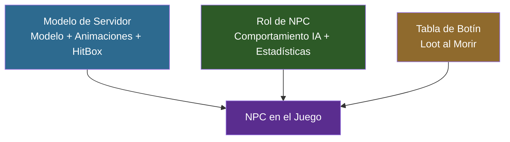

## Objetivo

Crear un **Slime** — un NPC hostil que persigue y ataca a los jugadores en cuanto los ve. Configurarás un modelo 3D con animaciones, definirás su comportamiento de IA mediante herencia de plantillas, configurarás una tabla de botín con pesos y añadirás traducciones multilingües. Al final, tendrás un mod de NPC completamente funcional que podrás invocar en el Modo Creativo.

## Lo Que Aprenderás

- Cómo se estructuran los NPCs a través de tres capas JSON (Modelo de Servidor, Rol de NPC, Tabla de Botín)
- Cómo configurar un modelo con 9 conjuntos de animaciones
- Cómo la herencia de plantillas (`Template_Predator`) proporciona el comportamiento de IA
- Cómo las tablas de botín con pesos controlan el loot
- Cómo añadir traducciones para EN, ES y PT-BR

## Requisitos Previos

- Una carpeta de mod con un `manifest.json` válido (consulta [Configura Tu Entorno de Desarrollo](/hytale-modding-docs/tutorials/beginner/setup-dev-environment/))
- Blockbench con el plugin de Hytale instalado
- Familiaridad con la herencia de plantillas JSON (consulta [Herencia y Plantillas](/hytale-modding-docs/reference/concepts/inheritance-and-templates/))

---

## Descripción General de la Arquitectura de NPCs

A diferencia de los bloques y objetos que usan un único archivo JSON cada uno, los NPCs requieren **tres definiciones separadas** que trabajan juntas:



| Capa | Ubicación del Archivo | Propósito |
|------|----------------------|-----------|
| **Modelo de Servidor** | `Server/Models/` | Vincula el archivo `.blockymodel`, la textura, las animaciones, el hitbox y la configuración de cámara |
| **Rol de NPC** | `Server/NPC/Roles/` | Define el comportamiento de IA mediante herencia de plantillas, salud, retroceso y claves de traducción |
| **Tabla de Botín** | `Server/Drops/` | Controla qué loot se suelta cuando el NPC muere, usando selección aleatoria con pesos |

El nombre de `Appearance` del **Modelo de Servidor** conecta las tres capas — el Rol de NPC lo referencia, y el motor lo usa para encontrar el modelo, la textura y las animaciones correctas.

---

## Paso 1: Crear el Modelo y la Textura en Blockbench

Abre Blockbench y crea un nuevo proyecto de **Hytale Character**:

- **Block Size**: 64
- **Pixel Density**: 64
- **UV Size**: 128×128 (la textura debe coincidir: 128×128 píxeles)

Construye el cuerpo del slime usando cubos organizados en grupos. Para el Slime, la estructura es:

| Grupo | Propósito |
|-------|-----------|
| `Body` | Cuerpo principal del slime (cubo grande) |
| `Head` | Porción superior (usada por el seguimiento de cámara) |
| `Eyes` | Detalles de la cara |
| `Arm_Left` / `Arm_Right` | Pequeños apéndices para animaciones de ataque |
| `Leg_Left` / `Leg_Right` | Bases para animaciones de caminar |

Pinta la textura en la pestaña **Paint** — tonos verdes con manchas más oscuras funcionan bien para una criatura tipo slime.


### Exportar el Modelo

1. **File > Export > Export Hytale Blocky Model** → guardar como `Model_Slime.blockymodel`
2. Guardar la textura por separado como `Texture.png` (128×128)

### Crear Animaciones

Los NPCs necesitan archivos de animación para cada estado de movimiento. Crea estas 9 animaciones en la pestaña **Animate** de Blockbench:

| Animación | Archivo | Bucle | Propósito |
|-----------|---------|-------|-----------|
| Idle | `Idle.blockyanim` | Sí | Estar quieto — rebote sutil |
| Walk | `Walk.blockyanim` | Sí | Moverse hacia adelante |
| Walk_Backward | `Walk_Backward.blockyanim` | Sí | Moverse hacia atrás |
| Run | `Run.blockyanim` | Sí | Perseguir al jugador |
| Attack | `Attack.blockyanim` | Sí | Golpe cuerpo a cuerpo |
| Death | `Death.blockyanim` | **No** | Se reproduce una vez al morir |
| Crouch | `Crouch.blockyanim` | Sí | Inactivo agachado |
| Crouch_Walk | `Crouch_Walk.blockyanim` | Sí | Avanzar agachado |
| Crouch_Walk_Backward | `Crouch_Walk_Backward.blockyanim` | Sí | Retroceder agachado |

Exporta cada animación con **File > Export > Export Hytale Block Animation**.

:::tip[Animación de Muerte]
Establece `"Loop": false` para la animación de Muerte en el Modelo de Servidor — todas las demás animaciones se repiten en bucle por defecto.
:::

---

## Paso 2: Configurar la Estructura de Archivos del Mod

Coloca tus archivos en la carpeta del mod siguiendo esta estructura exacta:

```text
CreateACustomNPC/
├── manifest.json
├── Common/
│   ├── Icons/
│   │   └── ModelsGenerated/
│   │       └── Slime.png
│   └── NPC/
│       └── Beast/
│           └── Slime/
│               ├── Model/
│               │   ├── Model_Slime.blockymodel
│               │   └── Texture.png
│               └── Animations/
│                   └── Default/
│                       ├── Idle.blockyanim
│                       ├── Walk.blockyanim
│                       ├── Walk_Backward.blockyanim
│                       ├── Run.blockyanim
│                       ├── Attack.blockyanim
│                       ├── Death.blockyanim
│                       ├── Crouch.blockyanim
│                       ├── Crouch_Walk.blockyanim
│                       └── Crouch_Walk_Backward.blockyanim
├── Server/
│   ├── Models/
│   │   └── Beast/
│   │       └── Slime.json
│   ├── NPC/
│   │   └── Roles/
│   │       └── Slime.json
│   ├── Drops/
│   │   └── Drop_Slime.json
│   └── Languages/
│       ├── en-US/
│       │   └── server.lang
│       ├── es/
│       │   └── server.lang
│       └── pt-BR/
│           └── server.lang
```

Todas las rutas en `Common/` deben comenzar con una raíz permitida: `NPC/`, `Icons/`, `Items/`, `Blocks/`, etc. El modelo y las animaciones van bajo `NPC/`, y el icono de aparición va bajo `Icons/`.

---

## Paso 3: Crear el manifest.json

```json
{
  "Group": "HytaleModdingManual",
  "Name": "CreateACustomNPC",
  "Version": "1.0.0",
  "Description": "Implements the Create A NPC tutorial with a custom slime",
  "Authors": [
    {
      "Name": "HytaleModdingManual"
    }
  ],
  "Dependencies": {},
  "OptionalDependencies": {},
  "IncludesAssetPack": true,
  "TargetServerVersion": "2026.02.19-1a311a592"
}
```

---

## Paso 4: Definir el Modelo de Servidor

El Modelo de Servidor es el puente entre los assets 3D en `Common/` y el motor del juego. Le indica a Hytale dónde encontrar el modelo, la textura y cada animación.

Crea `Server/Models/Beast/Slime.json`:

```json
{
  "Model": "NPC/Beast/Slime/Model/Model_Slime.blockymodel",
  "Texture": "NPC/Beast/Slime/Model/Texture.png",
  "EyeHeight": 1.5,
  "CrouchOffset": -0.15,
  "HitBox": {
    "Max": { "X": 0.8, "Y": 2.0, "Z": 0.8 },
    "Min": { "X": -0.8, "Y": 0, "Z": -0.8 }
  },
  "Camera": {
    "Pitch": {
      "AngleRange": { "Max": 15, "Min": -15 },
      "TargetNodes": ["Head"]
    },
    "Yaw": {
      "AngleRange": { "Max": 15, "Min": -15 },
      "TargetNodes": ["Head"]
    }
  },
  "AnimationSets": {
    "Walk": {
      "Animations": [
        { "Animation": "NPC/Beast/Slime/Animations/Default/Walk.blockyanim" }
      ]
    },
    "Attack": {
      "Animations": [
        { "Animation": "NPC/Beast/Slime/Animations/Default/Attack.blockyanim" }
      ]
    },
    "Idle": {
      "Animations": [
        { "Animation": "NPC/Beast/Slime/Animations/Default/Idle.blockyanim" }
      ]
    },
    "Death": {
      "Animations": [
        {
          "Animation": "NPC/Beast/Slime/Animations/Default/Death.blockyanim",
          "Loop": false
        }
      ]
    },
    "Walk_Backward": {
      "Animations": [
        { "Animation": "NPC/Beast/Slime/Animations/Default/Walk_Backward.blockyanim" }
      ]
    },
    "Run": {
      "Animations": [
        { "Animation": "NPC/Beast/Slime/Animations/Default/Run.blockyanim" }
      ]
    },
    "Crouch": {
      "Animations": [
        { "Animation": "NPC/Beast/Slime/Animations/Default/Crouch.blockyanim" }
      ]
    },
    "Crouch_Walk": {
      "Animations": [
        { "Animation": "NPC/Beast/Slime/Animations/Default/Crouch_Walk.blockyanim" }
      ]
    },
    "Crouch_Walk_Backward": {
      "Animations": [
        { "Animation": "NPC/Beast/Slime/Animations/Default/Crouch_Walk_Backward.blockyanim" }
      ]
    }
  },
  "Icon": "Icons/ModelsGenerated/Slime.png",
  "IconProperties": {
    "Scale": 0.25,
    "Rotation": [0, -45, 0],
    "Translation": [0, -61]
  }
}
```

### Campos del Modelo de Servidor

| Campo | Tipo | Propósito |
|-------|------|-----------|
| `Model` | String | Ruta al archivo `.blockymodel` (relativa a `Common/`) |
| `Texture` | String | Ruta a la textura `.png` (relativa a `Common/`) |
| `EyeHeight` | Number | Posición vertical de los ojos del NPC en bloques — afecta la cámara y la línea de visión |
| `CrouchOffset` | Number | Cuánto baja el modelo al agacharse |
| `HitBox` | Object | Caja de colisión para detección de daño. `Min`/`Max` definen las esquinas en bloques |
| `Camera` | Object | Cómo la cabeza del NPC sigue a los objetivos. `TargetNodes` debe coincidir con los nombres de grupo en el modelo |
| `AnimationSets` | Object | Mapea estados del juego a archivos de animación. Cada conjunto puede tener múltiples animaciones con pesos |
| `Icon` | String | Ruta del icono del menú de aparición (relativa a `Common/`) |
| `IconProperties` | Object | Escala, rotación y traslación para el renderizado del icono |

:::caution[Los Nombres de Conjuntos de Animación Son Fijos]
El motor espera nombres específicos de conjuntos de animación: `Idle`, `Walk`, `Walk_Backward`, `Run`, `Attack`, `Death`, `Crouch`, `Crouch_Walk`, `Crouch_Walk_Backward`. Usar nombres diferentes hará que el NPC se congele en su pose inactiva durante esa acción.
:::

---

## Paso 5: Definir el Rol de NPC

El Rol de NPC define el comportamiento y las estadísticas. En lugar de escribir la IA desde cero, Hytale usa **herencia de plantillas** — eliges una plantilla de comportamiento y solo sobrescribes lo que difiere.

Crea `Server/NPC/Roles/Slime.json`:

```json
{
  "Type": "Variant",
  "Reference": "Template_Predator",
  "Modify": {
    "Appearance": "Slime",
    "MaxHealth": 75,
    "KnockbackScale": 0.5,
    "IsMemory": true,
    "MemoriesCategory": "Beast",
    "NameTranslationKey": {
      "Compute": "NameTranslationKey"
    }
  },
  "Parameters": {
    "NameTranslationKey": {
      "Value": "server.npcRoles.Slime.name",
      "Description": "Translation key for NPC name display"
    }
  }
}
```

### Cómo Funciona la Herencia de Plantillas

El patrón `"Type": "Variant"` + `"Reference": "Template_Predator"` significa:

1. **Comenzar con** todos los campos de `Template_Predator` (IA hostil, lógica de persecución, patrones de ataque, rango de visión)
2. **Sobrescribir** solo los campos listados en `"Modify"` (apariencia, salud, retroceso, etc.)
3. **Todo lo demás** (toma de decisiones, lógica de combate, velocidades de movimiento) viene de la plantilla

### Plantillas de NPC Disponibles

| Plantilla | Comportamiento | Usar Para |
|-----------|---------------|-----------|
| `Template_Predator` | Hostil — persigue y ataca jugadores en cuanto los ve | Enemigos, criaturas hostiles |
| `Template_Prey` | Pasivo — huye cuando se siente amenazado | Conejos, ciervos, animales pequeños |
| `Template_Neutral` | Neutral — ataca solo cuando es provocado | Osos, lobos |
| `Template_Domestic` | Doméstico — sigue al dueño, puede ser encerrado en corrales | Animales de granja, mascotas |
| `Template_Beasts_Passive_Critter` | Criatura pasiva — deambula, huye | Ardillas, ranas, insectos |

### Campos del Rol de NPC

| Campo | Tipo | Propósito |
|-------|------|-----------|
| `Appearance` | String | Debe coincidir con el nombre del archivo del Modelo de Servidor (sin `.json`). Así es como el motor vincula el Rol con el Modelo |
| `MaxHealth` | Number | Puntos de vida. Los enemigos del juego base van desde 30 (Esqueleto) hasta 500+ (jefes) |
| `KnockbackScale` | Number | Resistencia al retroceso. `1.0` = normal, `0.5` = mitad de retroceso, `0` = inamovible |
| `IsMemory` | Boolean | Si el NPC aparece en el bestiario de Memorias del jugador |
| `MemoriesCategory` | String | Pestaña del bestiario: `Critter`, `Beast`, `Boss`, `Other` |
| `NameTranslationKey` | Compute | Clave de traducción para el nombre que se muestra sobre la cabeza del NPC |

### El Patrón Compute

```json
"NameTranslationKey": {
  "Compute": "NameTranslationKey"
}
```

Esto le dice al motor: "obtener el valor de `NameTranslationKey` del bloque `Parameters`." La sección `Parameters` luego proporciona el valor real:

```json
"Parameters": {
  "NameTranslationKey": {
    "Value": "server.npcRoles.Slime.name",
    "Description": "Translation key for NPC name display"
  }
}
```

Esta indirección existe porque las plantillas usan `Compute` para leer valores que cada variante define de manera diferente. Cada variante proporciona su propio valor de `NameTranslationKey`, pero la lógica de la plantilla para usarlo permanece igual.

---

## Paso 6: Crear la Tabla de Botín

La tabla de botín controla qué loot se suelta cuando el NPC muere. Hytale usa un sistema de **selección aleatoria con pesos**.

Crea `Server/Drops/Drop_Slime.json`:

```json
{
  "Container": {
    "Type": "Choice",
    "Containers": [
      {
        "Type": "Single",
        "Item": {
          "ItemId": "Ore_Crystal_Slime",
          "QuantityMin": 1,
          "QuantityMax": 1
        },
        "Weight": 100
      },
      {
        "Type": "Single",
        "Item": {
          "ItemId": "Consumable_Potion_Health_Large"
        },
        "Weight": 60
      },
      {
        "Type": "Empty",
        "Weight": 40
      }
    ]
  }
}
```

### Cómo Funciona la Selección con Pesos

El `"Type": "Choice"` raíz elige **un** contenedor hijo al azar, proporcional al peso:

| Drop | Peso | Probabilidad |
|------|------|-------------|
| Mineral de Cristal de Slime (1) | 100 | 100/200 = **50%** |
| Poción de Salud (Grande) | 60 | 60/200 = **30%** |
| Nada | 40 | 40/200 = **20%** |

Peso total = 100 + 60 + 40 = 200. Cada peso se divide entre el total para obtener la probabilidad.

### Tipos de Contenedores de Drops

| Tipo | Comportamiento |
|------|---------------|
| `Choice` | Elige **un** hijo al azar (con pesos) |
| `Multiple` | Evalúa **todos** los hijos (usar para drops garantizados + bonus) |
| `Single` | Produce el `Item` especificado con cantidad entre `QuantityMin` y `QuantityMax` |
| `Empty` | No suelta nada — usar como opción de "sin drop" en contenedores `Choice` |

:::tip[Múltiples Drops Garantizados]
Para siempre soltar un objeto Y tener probabilidad de un segundo, usa `Multiple` en la raíz con dos hijos `Choice` — uno garantizado, uno con una opción `Empty`. Consulta [Referencia de Tablas de Botín](/hytale-modding-docs/reference/economy-and-progression/drop-tables/) para patrones avanzados.
:::

---

## Paso 7: Añadir Traducciones

Crea un archivo `server.lang` para cada idioma bajo `Server/Languages/`:

**`Server/Languages/en-US/server.lang`**
```properties
npcRoles.Slime.name = Slime
```

**`Server/Languages/es/server.lang`**
```properties
npcRoles.Slime.name = Slime
```

**`Server/Languages/pt-BR/server.lang`**
```properties
npcRoles.Slime.name = Slime
```

La clave de traducción en el archivo `.lang` debe coincidir con el `Parameters.NameTranslationKey.Value` en el Rol de NPC — pero **sin** el prefijo `server.`. El motor añade el prefijo automáticamente al resolver archivos de idioma del servidor.

---

## Paso 8: Empaquetar y Probar

1. Copia la carpeta `CreateACustomNPC/` a `%APPDATA%/Hytale/UserData/Mods/`

2. Inicia Hytale y entra en el **Modo Creativo**

3. Revisa el registro en `%APPDATA%/Hytale/UserData/Logs/` para confirmar que tu mod se cargó:
   ```text
   [Hytale] Loading assets from: ...\Mods\CreateACustomNPC\Server
   [AssetRegistryLoader] Loading assets from ...\Mods\CreateACustomNPC\Server
   ```

4. Abre el menú de aparición de NPCs y busca **Slime**

5. Invoca el NPC y verifica:


   - El modelo se renderiza correctamente con la textura del slime
   - El NPC es hostil y te persigue en cuanto te ve
   - Las animaciones de ataque, caminar, correr y muerte se reproducen correctamente
   - El nombre "Slime" aparece sobre su cabeza
   - Al matarlo suelta uno de: Mineral de Cristal de Slime (50%), Poción de Salud (30%), o nada (20%)

---

## Errores Comunes

| Problema | Causa | Solución |
|----------|-------|----------|
| `Common Asset 'path' must be within the root` | La ruta del modelo/textura no comienza con `NPC/`, `Icons/`, etc. | Mueve los archivos bajo un directorio raíz permitido en `Common/` |
| `Common Asset 'path' doesn't exist` | La ruta en el JSON no coincide con la ubicación real del archivo | Verifica cada ruta en el Modelo de Servidor — son relativas a `Common/` |
| El NPC aparece pero es invisible | La ruta `Model` del Modelo de Servidor es incorrecta o el `.blockymodel` está corrupto | Re-exporta desde Blockbench, verifica la ruta |
| El NPC se queda quieto, no ataca | Plantilla incorrecta o animaciones faltantes | Verifica que `Reference` sea `Template_Predator` y que los 9 conjuntos de animación existan |
| El NPC se desliza sin animación | El nombre del conjunto de animación no coincide con el nombre esperado | Usa los nombres exactos: `Walk`, `Run`, `Idle`, `Attack`, `Death`, etc. |
| El nombre no aparece sobre el NPC | Discrepancia en la clave de traducción | Asegúrate de que la clave en `.lang` coincida con `Parameters.NameTranslationKey.Value` menos el prefijo `server.` |
| La animación de muerte se repite en bucle | Falta `"Loop": false` en la animación de Muerte | Añade `"Loop": false` a la entrada de Death en `AnimationSets` |
| La tabla de botín no funciona | Falta el campo `DropList` en el Rol de NPC | Añade `"DropList": "Drop_Slime"` al bloque `Modify` (omitido aquí ya que `Template_Predator` lo maneja) |

---

## Siguientes Pasos

- [Crear un Bloque Personalizado](/hytale-modding-docs/tutorials/beginner/create-a-block/) — Construye un bloque de cristal brillante para usar como drop de NPC
- [Crear un Arma Personalizada](/hytale-modding-docs/tutorials/beginner/create-an-item/) — Crea una espada para luchar contra tu nuevo NPC
- [Referencia de Roles de NPC](/hytale-modding-docs/reference/npc-system/npc-roles/) — Referencia completa del esquema para definiciones de roles de NPC
- [Referencia de Tablas de Botín](/hytale-modding-docs/reference/economy-and-progression/drop-tables/) — Patrones avanzados de tablas de botín con contenedores anidados
