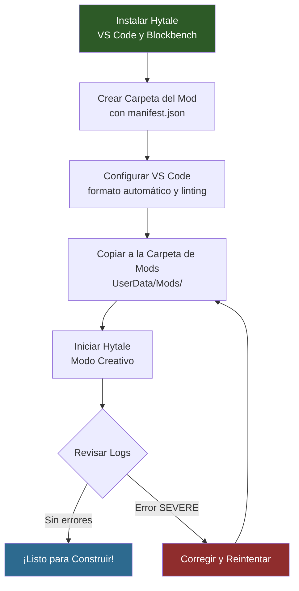

## Objetivo

Instala las herramientas que necesitas, crea una carpeta de mod con un `manifest.json` válido y confirma que Hytale la reconoce al iniciar. Al finalizar tendrás una base funcional para todos los tutoriales que siguen.

## Requisitos previos

- Hytale instalado (cliente del juego con acceso al Modo Creativo)
- Acceso de escritura al directorio de mods en `%APPDATA%/Hytale/UserData/Mods/`

---

## Paso 1: Instala las Herramientas Necesarias

### Hytale

El juego es necesario para cargar y probar mods. Los mods se cargan desde:

```text
%APPDATA%/Hytale/UserData/Mods/
```

En Windows, esto corresponde a `C:\Users\<you>\AppData\Roaming\Hytale\UserData\Mods\`. Cada subcarpeta con un `manifest.json` válido se carga como mod al iniciar.

### Visual Studio Code

VS Code es el editor recomendado para archivos JSON de Hytale. Proporciona resaltado de sintaxis, detección de errores y formato automático.

Descarga desde: **https://code.visualstudio.com/**

Tras instalar, agrega estas extensiones desde el panel de Extensiones (`Ctrl+Shift+X`):

| Extensión | Propósito |
|-----------|-----------|
| **JSON** (integrada) | Resaltado de sintaxis y emparejamiento de corchetes |
| **Error Lens** | Muestra errores de validación JSON en línea |
| **Prettier** | Formatea JSON automáticamente al guardar |

### Blockbench

Blockbench es la herramienta de modelado 3D utilizada para crear archivos `.blockymodel` para bloques, ítems y NPCs.

Descarga desde: **https://www.blockbench.net/**

Tras instalar:

1. Abre Blockbench
2. Ve a **File > Plugins**
3. Busca `Hytale`
4. Instala el plugin **Hytale Exporter**
5. Reinicia Blockbench

El plugin agrega las opciones de formato **Hytale Character** y **Hytale Blocky Model** al crear nuevos proyectos.

---

## Paso 2: Comprende la Estructura del Mod

Cada mod de Hytale es una carpeta con un `manifest.json` en su raíz. La carpeta tiene dos subdirectorios principales:

```text
MyFirstMod/
├── manifest.json
├── Common/                    (assets del lado del cliente)
│   ├── Blocks/                (modelos de bloques)
│   ├── BlockTextures/         (texturas de bloques)
│   ├── Items/                 (modelos y texturas de ítems/armas)
│   ├── Icons/                 (iconos de inventario)
│   │   └── ItemsGenerated/
│   └── NPC/                   (modelos de NPCs)
└── Server/                    (definiciones del lado del servidor)
    ├── Item/
    │   ├── Block/
    │   │   └── Blocks/        (definiciones de tipos de bloques)
    │   └── Items/             (definiciones de ítems)
    ├── BlockTypeList/         (registra bloques)
    ├── NPC/
    │   └── Roles/             (comportamiento de NPCs)
    └── Languages/             (traducciones)
        ├── en-US/server.lang
        ├── pt-BR/server.lang
        └── es/server.lang
```

**Reglas clave:**
- `Common/` contiene los assets que el cliente renderiza: modelos (`.blockymodel`), texturas (`.png`) e iconos
- `Server/` contiene las definiciones JSON que procesa el servidor: ítems, bloques, NPCs, recetas e idiomas
- Las rutas de assets en JSON son **relativas a `Common/`** y deben comenzar con una raíz permitida: `Blocks/`, `BlockTextures/`, `Items/`, `Icons/`, `NPC/`, `Resources/`, `VFX/` o `Consumable/`
- Los archivos de idioma van en `Server/Languages/<locale>/server.lang`
- La carpeta de espacio de nombres de tu mod (p. ej., `HytaleModdingManual/`) va dentro de cada directorio de assets para evitar colisiones de nombres

:::caution[Sin carpeta Assets/]
A diferencia del diseño interno de archivos del juego vanilla, las carpetas de mod **no** tienen una envoltura `Assets/`. Coloca `Common/` y `Server/` directamente dentro de la raíz de tu mod, junto a `manifest.json`.
:::

---

## Paso 3: Crea el manifest.json

El `manifest.json` identifica tu mod ante el motor. Crea una carpeta y su manifiesto:

```text
MyFirstMod/manifest.json
```

```json
{
  "Group": "MyStudio",
  "Name": "MyFirstMod",
  "Version": "1.0.0",
  "Description": "A minimal Hytale mod to validate the development setup",
  "Authors": [
    {
      "Name": "MyStudio"
    }
  ],
  "Dependencies": {},
  "OptionalDependencies": {},
  "IncludesAssetPack": true,
  "TargetServerVersion": "2026.02.19-1a311a592"
}
```

### Campos del Manifiesto

| Campo | Requerido | Descripción |
|-------|-----------|-------------|
| `Group` | Sí | Espacio de nombres del autor u organización. Usa un identificador único como el nombre de tu estudio. |
| `Name` | Sí | Identificador del mod. Solo ASCII, sin espacios. Se usa en mensajes de log y referencias de dependencias. |
| `Version` | No | Versión de tu mod en formato semver. |
| `Description` | No | Descripción breve mostrada en diagnósticos. |
| `Authors` | No | Lista de objetos `{"Name": "..."}`. |
| `Dependencies` | No | Mods requeridos: `{"ModGroup:ModName": ">=1.0.0"}`. |
| `OptionalDependencies` | No | Mods compatibles pero no requeridos. |
| `IncludesAssetPack` | No | Ponlo en `true` cuando el mod incluye assets personalizados (modelos, texturas, definiciones JSON). |
| `TargetServerVersion` | No | Versión exacta del servidor de Hytale a la que apunta el mod. |

:::note[Group y Name]
`Group` y `Name` juntos forman el ID único del mod (`Group:Name`). Si la carga falla, el mensaje de error hace referencia a este ID — p. ej., `Mod MyStudio:MyFirstMod failed to load`.
:::

---

## Paso 4: Configura VS Code

Abre tu carpeta de mod en VS Code:

```text
File > Open Folder > select MyFirstMod/
```

Crea `.vscode/settings.json` dentro de la carpeta del mod para el formato automático:

```json
{
  "editor.formatOnSave": true,
  "editor.defaultFormatter": "esbenp.prettier-vscode",
  "[json]": {
    "editor.defaultFormatter": "esbenp.prettier-vscode"
  },
  "files.associations": {
    "*.lang": "properties"
  }
}
```

Esto detecta errores de sintaxis antes de intentar cargar el mod. El JSON de Hytale **distingue mayúsculas de minúsculas** — el motor rechaza `"material": "solid"` pero acepta `"Material": "Solid"`.

---

## Paso 5: Carga y Verifica

1. Copia tu carpeta `MyFirstMod/` al directorio de mods:

   ```text
   %APPDATA%/Hytale/UserData/Mods/MyFirstMod/
   ```

2. Inicia Hytale y entra al Modo Creativo

3. Revisa el log del cliente en `%APPDATA%/Hytale/UserData/Logs/` buscando tu mod:

   ```text
   [Hytale] Loading assets from: ...\Mods\MyFirstMod\Server
   [AssetRegistryLoader] Loading assets from ...\Mods\MyFirstMod\Server
   ```

Si ves estas líneas sin un error `SEVERE`, tu mod se cargó exitosamente. Un mod vacío con solo un manifiesto es válido — Hytale lo cargará y continuará.

### Lectura de Errores de Inicio

Los errores aparecen en el log con el nivel `SEVERE` e incluyen siempre la ruta del archivo y el campo que falló:

| Patrón en el Log | Significado |
|------------------|-------------|
| `Loading assets from: ...\MyFirstMod\Server` | Mod encontrado y siendo cargado |
| `Loaded N entries for 'en-US'` | Archivos de idioma cargados correctamente |
| `Failed to decode asset: X` | Error de parseo JSON o de esquema en el asset X |
| `Common Asset 'path' must be within the root` | La ruta del asset no comienza con una raíz permitida |
| `Common Asset 'path' doesn't exist` | El archivo referenciado no existe en `Common/` |
| `Unused key(s) in 'X': field` | Campo no reconocido (advertencia, no fatal) |
| `Mod Group:Name failed to load` | Error fatal — revisa las líneas `SEVERE` anteriores para más detalles |
| `missing or invalid manifest.json` | El manifiesto está malformado o le faltan campos requeridos |

:::tip[Ubicación de los Logs]
Logs del cliente: `%APPDATA%/Hytale/UserData/Logs/`
Logs del editor: `%APPDATA%/Hytale/EditorUserData/Logs/`

El log más reciente tiene la fecha de hoy en el nombre del archivo (p. ej., `2026-03-12_02-42-09_client.log`).
:::

---

## Paso 6: Configura Blockbench

Al crear modelos para Hytale:

1. Abre Blockbench
2. **File > New** y selecciona el formato Hytale:
   - **Hytale Character** para ítems y NPCs (blockSize 64, pixel density 64)
   - **Hytale Blocky Model** para bloques (blockSize 16)
3. Construye tu modelo usando cubos y grupos
4. Pinta la textura en la pestaña Paint
5. Exporta con **File > Export > Export Hytale Blocky Model**

### Convenciones Importantes

| Convención | Detalle |
|------------|---------|
| Resolución de textura | Debe coincidir con el tamaño UV del formato. Formato Character: textura = tamaño UV (p. ej., UV 128x128 = textura 128x128) |
| Punto de pivote | Posiciona en el agarre/mango para armas — afecta la colocación en la mano y el origen de luz |
| UV por cara | Úsalo para cubos mayores de 32 vóxeles (el UV de caja está limitado al espacio UV 32x32) |
| Modos de sombreado | `standard` (predeterminado), `fullbright` (brillo emisivo), `flat` (sin iluminación), `reflective` |
| Formato de archivo | `.blockymodel` para el modelo, `.png` para la textura (guardada por separado) |

---

## Flujo del Entorno de Desarrollo



---

## Próximos Pasos

Tu entorno de desarrollo está listo. Continúa con los tutoriales para principiantes:

- [Crear un Bloque Personalizado](/hytale-modding-docs/tutorials/beginner/create-a-block/) — Construye un bloque de cristal luminoso con textura, modelo, receta y traducciones
- [Crear un Arma Personalizada](/hytale-modding-docs/tutorials/beginner/create-an-item/) — Crea una espada de cristal con estadísticas de combate, emisión de luz y crafteo
- [Crear un NPC Personalizado](/hytale-modding-docs/tutorials/beginner/create-an-npc/) — Genera una criatura con comportamiento de IA y tablas de botín
