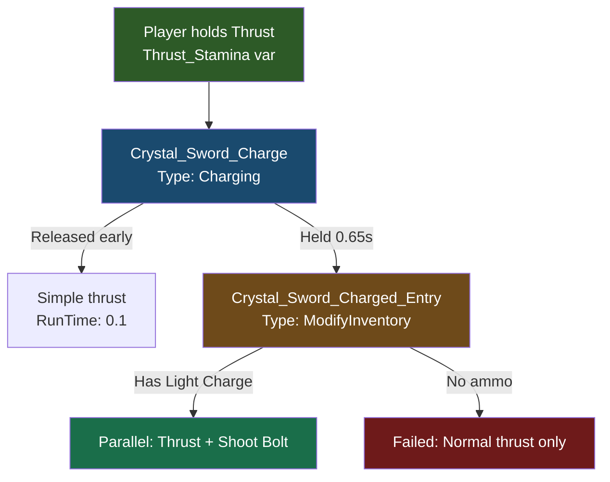

## Objetivo

Construye un **Yunque de Cristal**, una **Espada de Cristal** con un ataque de proyectil cargado y munición de **Carga de Luz** — todo crafteable desde la mesa. Aprenderás cómo se conectan las mesas de crafteo, las cadenas de interacciones, el tipo de interacción Charging y los sistemas de proyectiles.

## Lo que Aprenderás

- Cómo se definen las mesas de crafteo usando la propiedad de bloque `Bench`
- Por qué `State` con `Id: "crafting"` es **obligatorio** para que se abra la interfaz de la mesa
- Cómo crear categorías que organizan las recetas dentro de la interfaz de la mesa
- Cómo los niveles de tier y `CraftingTimeReductionModifier` controlan la velocidad de crafteo
- Cómo las recetas de ítems referencian una mesa mediante `BenchRequirement`
- Cómo `InteractionVars` sobrescribe el comportamiento vanilla de la espada para añadir ataques personalizados
- Cómo el tipo de interacción `Charging` crea mecánicas de mantener-para-cargar con efectos visuales
- Cómo `ModifyInventory` consume munición y se encadena en interacciones `Parallel`
- Cómo definir proyectiles, configs de proyectiles y un tipo de daño personalizado

## Requisitos Previos

- Una carpeta de mod con un `manifest.json` válido (ver [Configura tu Entorno de Desarrollo](/hytale-modding-docs/es/tutorials/beginner/setup-dev-environment))
- Familiaridad con definiciones de bloques (ver [Crear un Bloque Personalizado](/hytale-modding-docs/es/tutorials/beginner/create-a-block))
- Familiaridad con definiciones de ítems (ver [Crear un Ítem Personalizado](/hytale-modding-docs/es/tutorials/beginner/create-an-item))

**Repositorio del mod de ejemplo:** [hytale-guide-create-a-crafting-bench](https://github.com/nevesb/hytale-guide-create-a-crafting-bench)

---

## Descripción General de la Mesa de Crafteo

Las mesas de crafteo en Hytale son **ítems** que contienen un `BlockType` en línea con una configuración `Bench`. A diferencia de los bloques puros que necesitan un JSON de Bloque separado y una entrada en `BlockTypeList`, las mesas definen todo en un único archivo JSON de ítem — el mismo patrón que usan las mesas del juego base como `Bench_Weapon` y `Bench_Armory`.

Diferencias clave respecto a los bloques normales:
- **Sin JSON de Bloque separado** en `Server/Item/Block/Blocks/`
- **Sin entrada en `BlockTypeList`** necesaria
- El bloque `State` con `Id: "crafting"` es **obligatorio** para que funcione la interfaz de crafteo
- El objeto `Bench` define el tipo de crafteo, las categorías y los niveles de tier

---

## Paso 1: Configurar la Estructura de Archivos del Mod

```text
CreateACraftingBench/
├── manifest.json
├── Common/
│   ├── Blocks/HytaleModdingManual/
│   │   └── Armory_Crystal_Glow.blockymodel
│   ├── BlockTextures/HytaleModdingManual/
│   │   └── Armory_Crystal_Glow.png
│   └── Items/Weapons/Crystal/
│       ├── Weapon_Sword_Crystal_Glow.blockymodel
│       └── Weapon_Sword_Crystal_Glow.png
└── Server/
    ├── Entity/Damage/
    │   └── Crystal_Light.json
    ├── Item/
    │   ├── Interactions/HytaleModdingManual/
    │   │   ├── Crystal_Sword_Charge.json
    │   │   ├── Crystal_Sword_Charged_Entry.json
    │   │   ├── Crystal_Sword_Shoot_Bolt.json
    │   │   ├── Crystal_Sword_Special.json
    │   │   └── Crystal_Light_Bolt_Damage.json
    │   ├── Items/HytaleModdingManual/
    │   │   ├── Bench_Armory_Crystal_Glow.json
    │   │   ├── Weapon_Sword_Crystal_Glow.json
    │   │   └── Weapon_Arrow_Crystal_Glow.json
    │   └── RootInteractions/HytaleModdingManual/
    │       └── Crystal_Sword_Special.json
    ├── Projectiles/
    │   └── Crystal_Light_Bolt.json
    ├── ProjectileConfigs/HytaleModdingManual/
    │   └── Projectile_Config_Crystal_Light_Bolt.json
    └── Languages/
        ├── en-US/server.lang
        ├── es/server.lang
        └── pt-BR/server.lang
```

### manifest.json

```json
{
  "Group": "HytaleModdingManual",
  "Name": "CreateACraftingBench",
  "Version": "2.0.0",
  "Description": "Crystal Anvil bench, Crystal Sword with projectile attacks, Light Charges ammo, and Crystal Light element",
  "Authors": [
    {
      "Name": "HytaleModdingManual"
    }
  ],
  "Dependencies": {
    "HytaleModdingManual:CreateACustomBlock": "1.0.0",
    "HytaleModdingManual:CreateACustomTree": "1.0.0"
  },
  "OptionalDependencies": {},
  "IncludesAssetPack": true
}
```

`IncludesAssetPack` es `true` porque tenemos recursos Common (modelos y texturas). La lista de `Dependencies` indica los mods que proveen recursos usados en las recetas (mineral de Cristal Brillante y Madera Encantada).

---

## Paso 2: Crear la Definición del Ítem de la Mesa

Crea la mesa en `Server/Item/Items/HytaleModdingManual/Bench_Armory_Crystal_Glow.json`:

```json
{
  "TranslationProperties": {
    "Name": "server.items.Bench_Armory_Crystal_Glow.name",
    "Description": "server.items.Bench_Armory_Crystal_Glow.description"
  },
  "Quality": "Rare",
  "Icon": "Icons/ItemsGenerated/Bench_Armory_Crystal_Glow.png",
  "Categories": [
    "Furniture.Benches"
  ],
  "Recipe": {
    "TimeSeconds": 10.0,
    "KnowledgeRequired": false,
    "Input": [
      {
        "ItemId": "Ore_Crystal_Glow",
        "Quantity": 3
      },
      {
        "ItemId": "Wood_Enchanted_Trunk",
        "Quantity": 10
      },
      {
        "ItemId": "Ingredient_Bar_Gold",
        "Quantity": 5
      }
    ],
    "BenchRequirement": [
      {
        "Type": "Crafting",
        "Categories": [
          "Workbench_Crafting"
        ],
        "Id": "Workbench",
        "RequiredTierLevel": 2
      }
    ]
  },
  "BlockType": {
    "Material": "Solid",
    "DrawType": "Model",
    "Opacity": "Transparent",
    "CustomModel": "Blocks/HytaleModdingManual/Armory_Crystal_Glow.blockymodel",
    "CustomModelTexture": [
      {
        "Texture": "BlockTextures/HytaleModdingManual/Armory_Crystal_Glow.png",
        "Weight": 1
      }
    ],
    "VariantRotation": "NESW",
    "HitboxType": "Bench_Weapon",
    "State": {
      "Id": "crafting",
      "Definitions": {
        "CraftCompleted": {
          "Looping": true
        },
        "CraftCompletedInstant": {}
      }
    },
    "Gathering": {
      "Breaking": {
        "GatherType": "Benches",
        "ItemId": "Bench_Armory_Crystal_Glow"
      }
    },
    "Light": {
      "Color": "#88ccff"
    },
    "Bench": {
      "Type": "Crafting",
      "LocalOpenSoundEventId": "SFX_Weapon_Bench_Open",
      "LocalCloseSoundEventId": "SFX_Weapon_Bench_Close",
      "CompletedSoundEventId": "SFX_Weapon_Bench_Craft",
      "Id": "Armory_Crystal_Glow",
      "Categories": [
        {
          "Id": "Crystal_Glow_Sword",
          "Name": "server.benchCategories.crystal_glow_sword",
          "Icon": "Icons/CraftingCategories/Armory/Sword.png"
        }
      ],
      "TierLevels": [
        {
          "CraftingTimeReductionModifier": 0.0
        }
      ]
    },
    "BlockSoundSetId": "Crystal",
    "ParticleColor": "#88ccff",
    "Support": {
      "Down": [
        {
          "FaceType": "Full"
        }
      ]
    },
    "BlockParticleSetId": "Crystal"
  },
  "PlayerAnimationsId": "Block",
  "IconProperties": {
    "Scale": 0.5,
    "Rotation": [
      22.5,
      45,
      22.5
    ],
    "Translation": [
      13,
      -14
    ]
  },
  "Tags": {
    "Type": [
      "Bench"
    ]
  },
  "MaxStack": 1,
  "ItemSoundSetId": "ISS_Items_Gems"
}
```

### Explicación de los campos clave de la mesa

| Campo | Propósito |
|-------|-----------|
| `Bench.Type` | Debe ser `"Crafting"` para mesas basadas en recetas |
| `Bench.Id` | Identificador único que las recetas referencian en su `BenchRequirement` |
| `Bench.Categories` | Array de pestañas de categoría que se muestran en la interfaz de la mesa. Cada una tiene un `Id`, `Icon` y `Name` de traducción |
| `Bench.TierLevels` | Array de niveles de mejora. Cada uno puede tener `CraftingTimeReductionModifier` (porcentaje más rápido) y `UpgradeRequirement` |
| `State` | **Obligatorio.** Debe tener `"Id": "crafting"` para que la interfaz de la mesa se abra al interactuar |
| `VariantRotation` | `"NESW"` permite que la mesa mire en cuatro direcciones al colocarse |
| `HitboxType` | Reutiliza el hitbox `"Bench_Weapon"` para el área de interacción |
| `Light.Color` | Emite un suave brillo azul (`#88ccff`) |
| `Support.Down` | Requiere una cara de bloque completa debajo para colocarse |

:::caution[State es obligatorio]
Sin el bloque `State`, la mesa se colocará en el mundo pero **la interfaz de crafteo no se abrirá** al interactuar con ella. No aparece ningún error en los registros — falla silenciosamente. Todas las mesas del juego base (`Bench_Weapon`, `Bench_Armory`, `Bench_Campfire`) incluyen esta configuración de `State`.
:::

### Estructura de categorías

Cada categoría en el array `Categories` define una pestaña en la interfaz de crafteo:

```json
{
  "Id": "Crystal_Glow_Sword",
  "Name": "server.benchCategories.crystal_glow_sword",
  "Icon": "Icons/CraftingCategories/Armory/Sword.png"
}
```

- **`Id`** — El identificador de categoría que las recetas referencian para aparecer bajo esta pestaña
- **`Icon`** — Ruta al PNG del ícono que se muestra en la pestaña de categoría (reutilizamos el ícono de Espada del juego base)
- **`Name`** — Clave de traducción para el texto de la etiqueta de la categoría

---

## Paso 3: Crear una Receta que Use la Mesa

Cualquier ítem con una `Recipe` puede referenciar tu mesa a través de `BenchRequirement`. La conexión se establece haciendo coincidir `BenchRequirement.Id` con el `Bench.Id` de tu mesa, y `Categories` con las pestañas de categoría bajo las que aparece la receta.

Por ejemplo, la receta de la Espada de Cristal Brillante referencia nuestra mesa:

```json
{
  "Recipe": {
    "TimeSeconds": 8.0,
    "Input": [
      {
        "ItemId": "Ore_Crystal_Glow",
        "Quantity": 10
      },
      {
        "ItemId": "Wood_Enchanted_Trunk",
        "Quantity": 50
      },
      {
        "ItemId": "Ingredient_Leather_Heavy",
        "Quantity": 10
      }
    ],
    "BenchRequirement": [
      {
        "Type": "Crafting",
        "Id": "Armory_Crystal_Glow",
        "Categories": [
          "Crystal_Glow_Sword"
        ]
      }
    ]
  }
}
```

### Campos de BenchRequirement

| Campo | Propósito |
|-------|-----------|
| `Type` | Debe ser `"Crafting"` para coincidir con una mesa de crafteo |
| `Id` | Debe coincidir exactamente con el `Bench.Id` de tu definición de mesa (sensible a mayúsculas) |
| `Categories` | Array de IDs de categoría bajo los que aparece esta receta. Debe coincidir con un `Id` de categoría de la mesa |
| `RequiredTierLevel` | Nivel mínimo de tier de mesa requerido. Omitir para tier 0 (sin mejora necesaria) |

---

## Paso 4: Añadir las Claves de Traducción

Crea los archivos de idioma en `Server/Languages/<locale>/server.lang`:

### Inglés (`en-US/server.lang`)

```
items.Bench_Armory_Crystal_Glow.name = Crystal Anvil
items.Bench_Armory_Crystal_Glow.description = A crystal anvil for forging crystal weapons.
benchCategories.crystal_glow_sword = Crystal Sword
```

### Español (`es/server.lang`)

```
items.Bench_Armory_Crystal_Glow.name = Yunque de Cristal
items.Bench_Armory_Crystal_Glow.description = Un yunque de cristal para forjar armas de cristal.
benchCategories.crystal_glow_sword = Espada de Cristal
```

### Portugués BR (`pt-BR/server.lang`)

```
items.Bench_Armory_Crystal_Glow.name = Bigorna de Cristal
items.Bench_Armory_Crystal_Glow.description = Uma bigorna de cristal para forjar armas de cristal.
benchCategories.crystal_glow_sword = Espada de Cristal
```

Ten en cuenta el formato de la clave de traducción: `items.<ItemId>.name` y `benchCategories.<category_id>`. El prefijo `server.` en el JSON (`"Name": "server.items.Bench_Armory_Crystal_Glow.name"`) se corresponde con la clave del archivo lang sin el prefijo `server.`.

---

## Paso 5: Añadir el Modelo Personalizado

La mesa usa un `.blockymodel` y una textura personalizados. Colócalos en la carpeta `Common/`:

- **Modelo:** `Common/Blocks/HytaleModdingManual/Armory_Crystal_Glow.blockymodel`
- **Textura:** `Common/BlockTextures/HytaleModdingManual/Armory_Crystal_Glow.png`

Puedes crear el modelo usando [Blockbench](https://www.blockbench.net/) con el formato **Hytale Block**. El modelo debe caber dentro del límite del bloque (32 unidades = 1 bloque). Para una mesa de 2 bloques de ancho, usa el hitbox `"HitboxType": "Bench_Weapon"` que cubre el área más amplia.

:::tip[Rutas de recursos Common]
Los recursos Common deben estar dentro de uno de estos directorios raíz: `Blocks/`, `BlockTextures/`, `Items/`, `Resources/`, `NPC/`, `VFX/` o `Consumable/`. Colocar archivos fuera de estas carpetas causa un error de carga.
:::

---

## Paso 6: Crear la Espada de Cristal

La espada hereda de `Template_Weapon_Sword` (plantilla de espada vanilla) y sobrescribe comportamientos específicos a través de `InteractionVars`. Crea `Server/Item/Items/HytaleModdingManual/Weapon_Sword_Crystal_Glow.json`:

```json
{
  "Parent": "Template_Weapon_Sword",
  "TranslationProperties": {
    "Name": "server.items.Weapon_Sword_Crystal_Glow.name",
    "Description": "server.items.Weapon_Sword_Crystal_Glow.description"
  },
  "Model": "Items/Weapons/Crystal/Weapon_Sword_Crystal_Glow.blockymodel",
  "Texture": "Items/Weapons/Crystal/Weapon_Sword_Crystal_Glow.png",
  "Icon": "Icons/ItemsGenerated/Weapon_Sword_Crystal_Glow.png",
  "Quality": "Rare",
  "ItemLevel": 35,
  "Tags": {
    "Type": ["Weapon"],
    "Family": ["Sword"]
  },
  "Interactions": {
    "Primary": "Root_Weapon_Sword_Primary",
    "Secondary": "Root_Weapon_Sword_Secondary_Guard",
    "Ability1": "Crystal_Sword_Special"
  },
  "InteractionVars": {
    "Swing_Left_Damage": {
      "Interactions": [{
        "Parent": "Weapon_Sword_Primary_Swing_Left_Damage",
        "DamageCalculator": { "BaseDamage": { "Physical": 12 } }
      }]
    },
    "Swing_Right_Damage": {
      "Interactions": [{
        "Parent": "Weapon_Sword_Primary_Swing_Right_Damage",
        "DamageCalculator": { "BaseDamage": { "Physical": 12 } }
      }]
    },
    "Swing_Down_Damage": {
      "Interactions": [{
        "Parent": "Weapon_Sword_Primary_Swing_Down_Damage",
        "DamageCalculator": { "BaseDamage": { "Physical": 22 } }
      }]
    },
    "Thrust_Damage": {
      "Interactions": [{
        "Parent": "Weapon_Sword_Primary_Thrust_Damage",
        "DamageCalculator": {
          "BaseDamage": { "Physical": 20, "Crystal_Light": 12 }
        }
      }]
    },
    "Thrust_Stamina": {
      "Interactions": ["Crystal_Sword_Charge"]
    },
    "Guard_Wield": {
      "Interactions": [{
        "Parent": "Weapon_Sword_Secondary_Guard_Wield",
        "StaminaCost": { "Value": 8, "CostType": "Damage" }
      }]
    }
  },
  "Weapon": {
    "EntityStatsToClear": ["SignatureEnergy"],
    "StatModifiers": {
      "SignatureEnergy": [{ "Amount": 20, "CalculationType": "Additive" }]
    }
  },
  "Recipe": {
    "TimeSeconds": 5.0,
    "KnowledgeRequired": false,
    "Input": [
      { "ItemId": "Ore_Crystal_Glow", "Quantity": 10 },
      { "ItemId": "Wood_Enchanted_Trunk", "Quantity": 50 },
      { "ItemId": "Ingredient_Leather_Heavy", "Quantity": 10 }
    ],
    "BenchRequirement": [{
      "Type": "Crafting",
      "Categories": ["Crystal_Glow"],
      "Id": "Armory_Crystal_Glow"
    }]
  },
  "Light": { "Radius": 2, "Color": "#88ccff" },
  "MaxDurability": 150,
  "DurabilityLossOnHit": 0.18
}
```

### Conceptos clave

| Campo | Propósito |
|-------|-----------|
| `Parent` | Hereda todo el comportamiento vanilla de la espada (combos de swing, guardia, thrust) de `Template_Weapon_Sword` |
| `InteractionVars` | Sobrescribe partes específicas de la cadena de interacciones heredada. Cada clave reemplaza una variable nombrada en la cadena vanilla |
| `Thrust_Stamina` | El combo vanilla de thrust termina con un thrust cargado que consume stamina. Lo reemplazamos con `Crystal_Sword_Charge` para añadir nuestra mecánica de proyectil |
| `Thrust_Damage` | Añade daño `Crystal_Light` junto con `Physical` en ataques de thrust |
| `Weapon.StatModifiers` | Acumula `SignatureEnergy` (+20 por golpe) — usada por la habilidad especial |
| `Light` | La espada emite un brillo azul cuando se sostiene |

:::tip[Patrón de InteractionVars]
`InteractionVars` es cómo Hytale permite que ítems individuales personalicen cadenas de interacción compartidas. La cadena vanilla `Root_Weapon_Sword_Primary` referencia variables como `Thrust_Damage` y `Thrust_Stamina`. Cada arma provee sus propios valores para estas variables sin necesidad de duplicar la cadena completa.
:::

---

## Paso 7: Crear la Munición de Carga de Luz

El thrust cargado de la Espada de Cristal consume **Cargas de Luz** del inventario del jugador. Crea `Server/Item/Items/HytaleModdingManual/Weapon_Arrow_Crystal_Glow.json`:

```json
{
  "TranslationProperties": {
    "Name": "server.items.Weapon_Arrow_Crystal_Glow.name",
    "Description": "server.items.Weapon_Arrow_Crystal_Glow.description"
  },
  "Categories": ["Items.Weapons"],
  "Quality": "Uncommon",
  "ItemLevel": 25,
  "Model": "Items/Projectiles/Ice_Bolt.blockymodel",
  "Texture": "Items/Projectiles/Ice_Bolt_Texture.png",
  "Icon": "Icons/ItemsGenerated/Weapon_Arrow_Crystal_Glow.png",
  "Recipe": {
    "TimeSeconds": 5.0,
    "KnowledgeRequired": false,
    "Input": [
      { "ItemId": "Plant_Fruit_Enchanted", "Quantity": 1 },
      { "ItemId": "Ore_Crystal_Glow", "Quantity": 1 },
      { "ItemId": "Weapon_Arrow_Crude", "Quantity": 10 }
    ],
    "OutputQuantity": 50,
    "BenchRequirement": [{
      "Type": "Crafting",
      "Categories": ["Crystal_Glow"],
      "Id": "Armory_Crystal_Glow"
    }]
  },
  "MaxStack": 100,
  "Tags": {
    "Type": ["Weapon"],
    "Family": ["Arrow"]
  },
  "Weapon": {},
  "Light": { "Radius": 1, "Color": "#88ccff" }
}
```

Ten en cuenta `OutputQuantity: 50` — craftear un lote produce 50 cargas. La etiqueta `Family: Arrow` y el bloque `Weapon: {}` son necesarios para que el juego trate este ítem como munición consumible.

---

## Paso 8: Construir la Cadena de Interacciones del Ataque Cargado

El ataque cargado usa una cadena de interacciones que fluyen entre sí. Así es como se conectan:



### 8a. La interacción de Carga

Crea `Server/Item/Interactions/HytaleModdingManual/Crystal_Sword_Charge.json`:

```json
{
  "Type": "Charging",
  "AllowIndefiniteHold": false,
  "DisplayProgress": false,
  "HorizontalSpeedMultiplier": 0.5,
  "Effects": {
    "ItemAnimationId": "StabDashCharging",
    "Particles": [
      {
        "PositionOffset": { "X": 0, "Y": 0, "Z": 0 },
        "RotationOffset": { "Pitch": 0, "Roll": 0, "Yaw": 0 },
        "TargetNodeName": "blade",
        "SystemId": "Sword_Charging"
      }
    ]
  },
  "Next": {
    "0": {
      "Type": "Simple",
      "RunTime": 0.1
    },
    "0.65": "Crystal_Sword_Charged_Entry"
  }
}
```

| Campo | Propósito |
|-------|-----------|
| `Type: "Charging"` | Mecánica de mantener-para-cargar — el jugador mantiene presionado el botón de ataque |
| `DisplayProgress: false` | Oculta la barra de carga. El efecto de partículas provee retroalimentación visual en su lugar |
| `HorizontalSpeedMultiplier` | Reduce la velocidad de movimiento del jugador al 50% mientras carga |
| `Effects.ItemAnimationId` | Reproduce la animación de preparación `StabDashCharging` en la espada |
| `Effects.Particles` | Genera partículas `Sword_Charging` en el nodo `blade` de la espada — un efecto circular brillante |
| `Next."0"` | Si se suelta antes de 0.65s, realiza un thrust rápido (sin proyectil) |
| `Next."0.65"` | Si se mantiene 0.65s o más, transiciona a `Crystal_Sword_Charged_Entry` |

:::caution[TargetNodeName debe coincidir con tu modelo]
El `TargetNodeName` debe coincidir con el nombre de un grupo en el archivo `.blockymodel` de tu espada. Las espadas vanilla usan `"Handle"` pero los modelos personalizados pueden tener nombres de nodo diferentes. Revisa tu modelo en Blockbench para encontrar el nombre de grupo correcto.
:::

### 8b. La verificación de munición y ejecución paralela

Crea `Server/Item/Interactions/HytaleModdingManual/Crystal_Sword_Charged_Entry.json`:

```json
{
  "Type": "ModifyInventory",
  "ItemToRemove": {
    "Id": "Weapon_Arrow_Crystal_Glow",
    "Quantity": 1
  },
  "AdjustHeldItemDurability": -0.3,
  "Next": {
    "Type": "Parallel",
    "Interactions": [
      {
        "Interactions": [
          "Weapon_Sword_Primary_Thrust_Force",
          "Weapon_Sword_Primary_Thrust_Selector"
        ]
      },
      {
        "Interactions": [
          { "Type": "Simple", "RunTime": 0 },
          "Crystal_Sword_Shoot_Bolt"
        ]
      }
    ]
  },
  "Failed": {
    "Type": "Serial",
    "Interactions": [
      "Weapon_Sword_Primary_Thrust_Force",
      "Weapon_Sword_Primary_Thrust_Selector"
    ]
  }
}
```

| Campo | Propósito |
|-------|-----------|
| `Type: "ModifyInventory"` | Verifica y elimina ítems del inventario del jugador |
| `ItemToRemove` | Consume 1 Carga de Luz. Si el jugador no tiene ninguna, salta a `Failed` |
| `AdjustHeldItemDurability` | Reduce la durabilidad de la espada en 0.3 al disparar un proyectil |
| `Next` (Parallel) | Ejecuta el ataque de thrust y el disparo de proyectil simultáneamente |
| `Failed` | Si no hay munición, realiza un thrust normal sin proyectil |

:::caution[Evita encadenar a Weapon_Sword_Primary_Thrust]
`Weapon_Sword_Primary_Thrust` es en sí misma una interacción de tipo `Charging`. Si encadenas a ella desde otra interacción Charging, el jugador ve una animación doble. En su lugar, referencia los componentes internos directamente: `Weapon_Sword_Primary_Thrust_Force` (movimiento) y `Weapon_Sword_Primary_Thrust_Selector` (detección de golpe).
:::

### 8c. La interacción de proyectil

Crea `Server/Item/Interactions/HytaleModdingManual/Crystal_Sword_Shoot_Bolt.json`:

```json
{
  "Type": "Projectile",
  "Config": "Projectile_Config_Crystal_Light_Bolt",
  "Next": {
    "Type": "Simple",
    "RunTime": 0.2
  }
}
```

---

## Paso 9: Configurar el Proyectil

### 9a. Definición del proyectil

Crea `Server/Projectiles/Crystal_Light_Bolt.json`:

```json
{
  "Appearance": "Ice_Bolt",
  "Radius": 0.2,
  "Height": 0.2,
  "MuzzleVelocity": 55,
  "TerminalVelocity": 60,
  "Gravity": 2,
  "TimeToLive": 10,
  "Damage": 18,
  "HitParticles": { "SystemId": "Impact_Ice" },
  "DeathParticles": { "SystemId": "Impact_Ice" },
  "HitSoundEventId": "SFX_Divine_Respawn",
  "DeathSoundEventId": "SFX_Ice_Bolt_Death"
}
```

### 9b. Config del proyectil

Crea `Server/ProjectileConfigs/HytaleModdingManual/Projectile_Config_Crystal_Light_Bolt.json`:

```json
{
  "Parent": "Projectile_Config_Arrow_Base",
  "Model": "Ice_Bolt",
  "Physics": {
    "Type": "Standard",
    "Gravity": 2,
    "TerminalVelocityAir": 60,
    "TerminalVelocityWater": 15,
    "RotationMode": "VelocityDamped",
    "Bounciness": 0.0
  },
  "LaunchForce": 55,
  "SpawnOffset": { "X": 0.3, "Y": -0.3, "Z": 1.5 },
  "Interactions": {
    "ProjectileHit": {
      "Interactions": [
        "Crystal_Light_Bolt_Damage",
        "Common_Projectile_Despawn"
      ]
    },
    "ProjectileMiss": {
      "Interactions": [
        "Common_Projectile_Miss",
        "Common_Projectile_Despawn"
      ]
    }
  }
}
```

La config hereda de `Projectile_Config_Arrow_Base` y sobrescribe la física, la fuerza de lanzamiento y las interacciones de impacto. `SpawnOffset` controla dónde aparece el rayo relativo al jugador.

### 9c. Daño del proyectil

Crea `Server/Item/Interactions/HytaleModdingManual/Crystal_Light_Bolt_Damage.json`:

```json
{
  "Parent": "DamageEntityParent",
  "DamageCalculator": {
    "BaseDamage": {
      "Crystal_Light": 18
    }
  },
  "DamageEffects": {
    "Knockback": {
      "Type": "Force",
      "Direction": { "X": 0.0, "Y": 1, "Z": -3 },
      "Force": 8,
      "VelocityType": "Add"
    },
    "WorldParticles": [{ "SystemId": "Impact_Ice", "Scale": 1 }],
    "WorldSoundEventId": "SFX_Ice_Bolt_Death",
    "EntityStatsOnHit": [
      { "EntityStatId": "SignatureEnergy", "Amount": 5 }
    ]
  }
}
```

El rayo inflige daño `Crystal_Light` (nuestro tipo de daño personalizado), aplica retroceso y otorga 5 de `SignatureEnergy` al impactar — ayudando a cargar la habilidad especial de la espada.

---

## Paso 10: Añadir el Tipo de Daño Personalizado

Crea `Server/Entity/Damage/Crystal_Light.json`:

```json
{
  "Parent": "Elemental",
  "Inherits": "Elemental",
  "DamageTextColor": "#88ccff"
}
```

Esto registra `Crystal_Light` como un nuevo tipo de daño que hereda de `Elemental`. El `DamageTextColor` controla el color de los números de daño mostrados al impactar.

---

## Paso 11: Probar en el Juego

1. Coloca la carpeta del mod en tu directorio de mods (`%APPDATA%/Hytale/UserData/Mods/`).
2. Inicia el servidor y revisa los registros en busca de errores de validación.
3. Usa `/spawnitem Bench_Armory_Crystal_Glow` para obtener la mesa, luego `/spawnitem Weapon_Sword_Crystal_Glow` y `/spawnitem Weapon_Arrow_Crystal_Glow 50` para probar.
4. Coloca la mesa y haz clic derecho para verificar que la interfaz de crafteo se abre con la categoría Crystal Light.
5. Equipa la espada y prueba el combo básico (clic izquierdo para swings, mantener para thrust).
6. Con Cargas de Luz en tu inventario, mantén el thrust — deberías ver el brillo de carga en la hoja, y luego un rayo de cristal se dispara después de 0.65 segundos.
7. Sin Cargas de Luz, el thrust cargado debería realizar un thrust normal sin proyectil.

**Errores comunes y soluciones:**

| Error | Causa | Solución |
|-------|-------|----------|
| La mesa se coloca pero la interfaz no se abre | Falta el bloque `State` | Añade `"State": { "Id": "crafting", ... }` al `BlockType` de la mesa |
| La receta no aparece en la mesa | `BenchRequirement.Id` no coincide | Asegúrate de que `Id` coincide exactamente con `Bench.Id` (sensible a mayúsculas) |
| `StackOverflowError` al cargar | Uso de herencia con `Parent` junto con `State` | Haz la mesa independiente — copia todos los campos en lugar de heredar de `Bench_Weapon` |
| Animación de carga doble | Encadenar a `Weapon_Sword_Primary_Thrust` | Usa `Thrust_Force` + `Thrust_Selector` directamente en su lugar |
| Partículas en el jugador, no en la espada | `TargetNodeName` incorrecto | Debe coincidir con el nombre de un grupo en tu archivo `.blockymodel` |
| El proyectil no se dispara | Falta el ítem de `ItemToRemove` en el inventario | Asegúrate de que el jugador tiene Cargas de Luz; verifica que la rama `Failed` funciona |
| Barra de carga visible | `DisplayProgress` no configurado | Añade `"DisplayProgress": false` a la interacción Charging |

---

## Referencia de Mesas del Juego Base

Para referencia, aquí están los tipos de mesas que se usan en el juego base:

| Mesa | `Bench.Type` | `Bench.Id` | Categorías |
|------|-------------|------------|------------|
| Mesa de Armas | `Crafting` | `Weapon_Bench` | Sword, Mace, Battleaxe, Daggers, Bow |
| Armería | `DiagramCrafting` | `Armory` | Weapons (Sword, Club, Axe, etc.), Armor (Head, Chest, etc.) |
| Hoguera | `Crafting` | `Campfire` | Cooking |
| Banco de Trabajo | `Crafting` | `Workbench` | Workbench_Crafting |

---

## Próximos Pasos

- [Crear un Bloque Personalizado](/hytale-modding-docs/es/tutorials/beginner/create-a-block) — aprende cómo se conectan bloques e ítems
- [Tablas de Botín Personalizadas](/hytale-modding-docs/es/tutorials/intermediate/custom-loot-tables) — configura drops que incluyan tus ítems crafteados
- [Tiendas y Comercio con NPCs](/hytale-modding-docs/es/tutorials/intermediate/npc-shops-and-trading) — vende ítems crafteados en la mesa a través de mercaderes NPC
