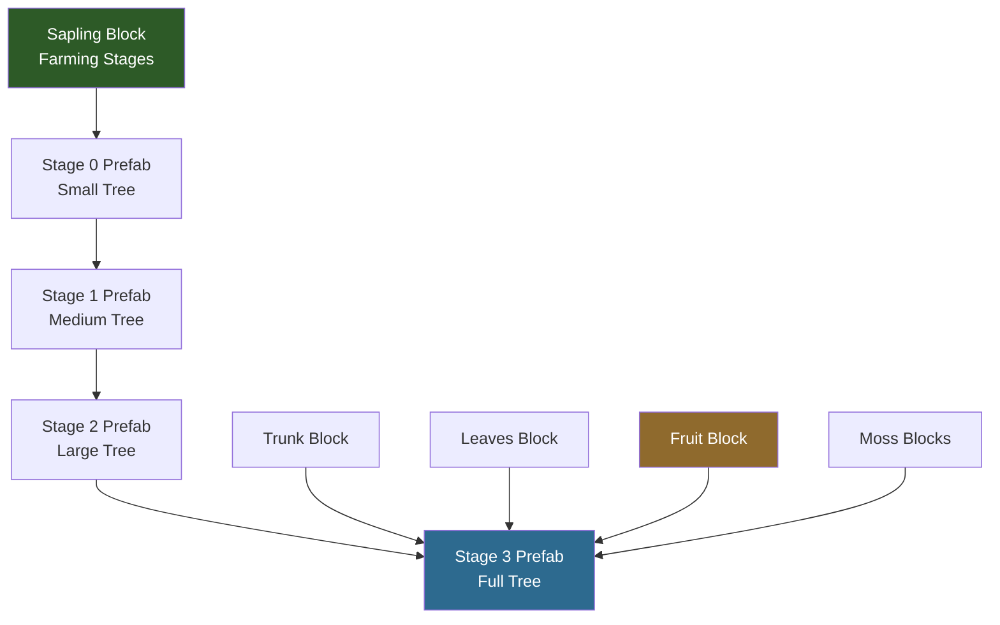
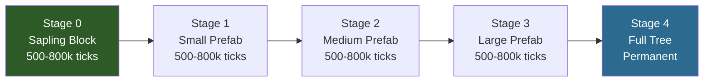

## Lo que Construirás

Un **Árbol Encantado** — un tipo de árbol personalizado que los jugadores pueden cultivar desde un brote cerca de bloques Crystal Glow. Cuando está completamente desarrollado, el árbol proporciona **Madera Encantada** (bloques de tronco) para fabricación, **Fragmentos de Luz** (fruta brillante) y bloques decorativos de **Musgo Cristalino**. El árbol usa los modelos de hojas de Azure y el tronco de Ash como base con texturas personalizadas y una mecánica de crecimiento única basada en luz de cristal.


## Lo que Aprenderás

- Cómo los árboles de Hytale están compuestos por múltiples tipos de bloques (tronco, hojas, fruta, brote, musgo)
- Cómo la herencia con `Parent` crea variantes de árboles a partir de tipos existentes
- Cómo el sistema de `Farming` impulsa el crecimiento del brote a través de etapas de prefabs
- Cómo crear un `Growth Modifier` personalizado que responde a colores de luz específicos
- Cómo configurar bloques de fruta que emiten luz
- Cómo `PrefabList` registra las estructuras de árboles para el motor

## Requisitos Previos

- Completa primero el tutorial [Crear un Bloque Personalizado](/hytale-modding-docs/tutorials/beginner/create-a-block/) — este mod **depende del Crystal Glow Block** creado en ese tutorial para su mecánica de crecimiento
- Una carpeta de mod con un `manifest.json` válido (consulta [Configura tu Entorno de Desarrollo](/hytale-modding-docs/tutorials/beginner/setup-dev-environment/))
- El [mod Crystal Glow Block](https://github.com/nevesb/hytale-mods-custom-block) instalado y funcionando en tu carpeta de mods
- Texturas personalizadas para tronco, hojas y fruta (o reutiliza las texturas de Azure/Ash para pruebas)

## Repositorio Git

El mod completo y funcional está disponible como repositorio en GitHub:

```text
https://github.com/nevesb/hytale-mods-custom-tree
```

Clónalo y copia el contenido a tu directorio de mods de Hytale para probarlo inmediatamente.

---

## Descripción General del Sistema de Árboles

Un árbol en Hytale no es un solo asset — es una **composición de múltiples tipos de bloques** más un **sistema de crecimiento** que los ensambla en forma de árbol:



| Componente | Ubicación del Archivo | Propósito |
|-----------|----------------------|-----------|
| **Tronco** | `Server/Item/Items/Wood/` | El bloque de madera — se obtiene al talar, se usa como material de construcción |
| **Hojas** | `Server/Item/Items/Plant/Leaves/` | Copa decorativa — se descompone cuando se retira el tronco |
| **Fruta** | `Server/Item/Items/Plant/Fruit/` | Objeto cosechable que crece en el árbol — puede brillar, consumirse o usarse como material de fabricación |
| **Brote** | `Server/Item/Items/Plant/` | Bloque plantable con etapas de `Farming` que crece hasta convertirse en árbol con el tiempo |
| **Musgo** | `Server/Item/Items/Plant/Moss/` | Bloques decorativos que crecen en el tronco — musgo de pared y musgo de suelo |
| **Modificador de Crecimiento** | `Server/Farming/Modifiers/` | Controla qué condiciones ambientales aceleran el crecimiento |
| **PrefabList** | `Server/PrefabList/` | Registro que indica al motor dónde encontrar los archivos prefab del árbol para cada etapa de crecimiento |

Cada prefab (`.prefab.json`) es un plano que contiene las posiciones exactas de bloques que forman la forma del árbol en esa etapa. El sistema `Farming` del brote transiciona entre estos prefabs con el tiempo.

---

## Paso 1: Crear el Bloque de Tronco

El tronco es lo que los jugadores talan para obtener madera. Heredamos de `Wood_Ash_Trunk` y solo sobreescribimos las texturas, la recolección y el color de partículas.

Crea `Server/Item/Items/Wood/Enchanted/Wood_Enchanted_Trunk.json`:

```json
{
  "TranslationProperties": {
    "Name": "server.items.Wood_Enchanted_Trunk.name",
    "Description": "server.items.Wood_Enchanted_Trunk.description"
  },
  "Parent": "Wood_Ash_Trunk",
  "BlockType": {
    "Textures": [
      {
        "Sides": "BlockTextures/Wood_Trunk_Crystal_Side.png",
        "UpDown": "BlockTextures/Wood_Trunk_Crystal_Top.png",
        "Weight": 1
      }
    ],
    "Gathering": {
      "Breaking": {
        "ItemId": "Wood_Enchanted_Trunk",
        "GatherType": "Woods"
      }
    },
    "ParticleColor": "#5e3b56"
  },
  "ResourceTypes": [
    { "Id": "Wood_Trunk" },
    { "Id": "Wood_All" },
    { "Id": "Fuel" },
    { "Id": "Charcoal" }
  ],
  "Icon": "Icons/ItemsGenerated/Wood_Enchanted_Trunk.png",
  "IconProperties": {
    "Scale": 0.58823,
    "Rotation": [22.5, 45, 22.5],
    "Translation": [0, -13.5]
  }
}
```

### Campos del Tronco

| Campo | Tipo | Propósito |
|-------|------|-----------|
| `Parent` | String | Hereda todas las propiedades de bloque de `Wood_Ash_Trunk` (dureza, requisitos de herramienta, física) |
| `BlockType.Textures` | Array | Configuración de texturas. `Sides` para la corteza, `UpDown` para la sección transversal vista desde arriba/abajo |
| `BlockType.Textures[].Weight` | Number | Para múltiples variantes de textura — `1` significa que es la única opción |
| `BlockType.Gathering.Breaking` | Object | Lo que se obtiene al romper el bloque. `GatherType: "Woods"` significa que las hachas lo rompen más rápido |
| `BlockType.ParticleColor` | String | Color hexadecimal de las partículas cuando el bloque es golpeado o roto |
| `ResourceTypes` | Array | Etiqueta este bloque como madera para recetas de fabricación. `Wood_Trunk` y `Wood_All` permiten usarlo en cualquier receta que requiera madera |
| `IconProperties` | Object | Controla cómo el modelo 3D se renderiza como icono de inventario (escala, rotación, posición) |

:::tip[Archivos de Textura]
Las rutas de textura son relativas a `Common/`. Necesitas dos archivos PNG:
- `Common/BlockTextures/Wood_Trunk_Crystal_Side.png` — textura de corteza (caras laterales)
- `Common/BlockTextures/Wood_Trunk_Crystal_Top.png` — textura de anillos (caras superior/inferior)

Como heredamos de Ash, puedes empezar copiando las texturas del tronco de Ash y ajustando el tono a un azul/púrpura cristalino.
:::

---

## Paso 2: Crear el Bloque de Hojas

Las hojas usan un modelo 3D compartido (`Ball.blockymodel`) con una textura personalizada para el color. Heredan todo el comportamiento de descomposición y física de la plantilla de hojas de Azure.

Crea `Server/Item/Items/Plant/Leaves/Plant_Leaves_Enchanted.json`:

```json
{
  "TranslationProperties": {
    "Name": "server.items.Plant_Leaves_Enchanted.name"
  },
  "Parent": "Plant_Leaves_Azure",
  "Icon": "Icons/ItemsGenerated/Plant_Leaves_Enchanted.png",
  "BlockType": {
    "CustomModel": "Blocks/Foliage/Leaves/Ball.blockymodel",
    "CustomModelTexture": [
      {
        "Texture": "Blocks/Foliage/Leaves/Ball_Textures/Crystal.png",
        "Weight": 1
      }
    ],
    "ParticleColor": "#1c7baf"
  }
}
```

### Campos de las Hojas

| Campo | Tipo | Propósito |
|-------|------|-----------|
| `Parent` | String | Hereda de `Plant_Leaves_Azure` — obtiene descomposición de hojas, transparencia y comportamiento de rotura |
| `BlockType.CustomModel` | String | Modelo compartido de hojas. Todos los tipos de árboles usan la misma forma `Ball.blockymodel` |
| `BlockType.CustomModelTexture` | Array | Textura de color aplicada al modelo. Cambia este PNG para cambiar el color de las hojas |
| `BlockType.ParticleColor` | String | Color de las partículas cuando las hojas se rompen. Usa un color que coincida con la textura |

El `Ball.blockymodel` es un modelo vanilla compartido en `Common/Blocks/Foliage/Leaves/Ball.blockymodel`. Solo necesitas proporcionar una textura personalizada en `Common/Blocks/Foliage/Leaves/Ball_Textures/Crystal.png`.

---

## Paso 3: Crear el Bloque de Fruta (Fragmentos de Luz)

La fruta es el material de fabricación clave — **Fragmentos de Luz** que brillan en el árbol y se obtienen al cosechar. Este bloque emite luz, es transparente y puede consumirse como alimento.

Crea `Server/Item/Items/Plant/Fruit/Plant_Fruit_Enchanted.json`:

```json
{
  "TranslationProperties": {
    "Name": "server.items.Plant_Fruit_Enchanted.name",
    "Description": "server.items.Plant_Fruit_Enchanted.description"
  },
  "Parent": "Template_Fruit",
  "BlockType": {
    "CustomModel": "Resources/Ingredients/Crystal_Fruit.blockymodel",
    "CustomModelTexture": [
      {
        "Texture": "Resources/Ingredients/Crystal_Fruit_Texture.png",
        "Weight": 1
      }
    ],
    "VariantRotation": "UpDown",
    "Opacity": "Transparent",
    "Light": {
      "Color": "#469"
    },
    "BlockSoundSetId": "Mushroom",
    "BlockParticleSetId": "Dust",
    "ParticleColor": "#326ea7",
    "Gathering": {
      "Harvest": {
        "ItemId": "Plant_Fruit_Enchanted"
      },
      "Soft": {
        "ItemId": "Plant_Fruit_Enchanted"
      }
    }
  },
  "InteractionVars": {
    "Consume_Charge": {
      "Interactions": [
        {
          "Parent": "Consume_Charge_Food_T1_Inner",
          "Effects": {
            "Particles": [
              {
                "SystemId": "Food_Eat",
                "Color": "#326ea7",
                "TargetNodeName": "Mouth",
                "TargetEntityPart": "Entity"
              }
            ]
          }
        }
      ]
    }
  },
  "Icon": "Icons/ItemsGenerated/Plant_Fruit_Enchanted.png",
  "Scale": 1.75,
  "DropOnDeath": true,
  "Quality": "Common"
}
```

### Campos de la Fruta

| Campo | Tipo | Propósito |
|-------|------|-----------|
| `Parent` | String | Hereda de `Template_Fruit` — obtiene comportamiento de cosecha y lógica de consumo de alimento |
| `BlockType.CustomModel` | String | Modelo 3D de la fruta. Créalo en Blockbench o reutiliza un modelo de fruta existente |
| `BlockType.Opacity` | String | `"Transparent"` — el bloque de fruta no bloquea la luz ni la visión |
| `BlockType.Light.Color` | String | Color hexadecimal de la luz emitida. `"#469"` produce un brillo azul suave que combina con el tema cristalino |
| `BlockType.VariantRotation` | String | `"UpDown"` — la fruta cuelga en diferentes orientaciones para variedad natural |
| `BlockType.Gathering.Harvest` | Object | Lo que se obtiene al hacer clic derecho en la fruta. Permite recolectar sin romper el bloque |
| `BlockType.Gathering.Soft` | Object | Lo que se obtiene al romper el bloque de fruta. Mismo objeto, pero el bloque se destruye |
| `InteractionVars` | Object | Define lo que sucede al consumir. Hereda de `Consume_Charge_Food_T1_Inner` para curación básica de alimento |
| `Scale` | Number | Multiplicador de escala visual. `1.75` hace la fruta más visible en el árbol |
| `DropOnDeath` | Boolean | `true` — la fruta se suelta como objeto cuando el bloque es destruido (árbol talado o hojas en descomposición) |

:::caution[Formato del Color de Luz]
`Light.Color` usa un **formato hexadecimal abreviado de 3 caracteres** donde cada carácter representa R, G, B. `"#469"` se expande a `#446699` — un azul apagado. A diferencia de `Light.Radius` en objetos (que debe ser un entero), la luz de bloques solo usa `Color` y el motor determina el radio según las reglas de nivel de luz de bloques.
:::

---

## Paso 4: Crear los Bloques de Musgo

Los bloques de musgo crecen en el tronco del árbol y a su alrededor, añadiendo detalle visual. Creamos dos tipos: **musgo de pared** (se adhiere a los lados del tronco) y **musgo de suelo** (se extiende por el suelo cerca de la base). Ambos usan `Tint` para recolorear las texturas de musgo azul vanilla y que coincidan con nuestro tema cristalino.

### Musgo de Pared

Crea `Server/Item/Items/Plant/Moss/Plant_Moss_Wall_Crystal.json`:

```json
{
  "TranslationProperties": {
    "Name": "server.items.Plant_Moss_Wall_Crystal.name"
  },
  "Parent": "Plant_Moss_Wall_Blue",
  "BlockType": {
    "Gathering": {
      "Soft": {
        "ItemId": "Plant_Moss_Wall_Crystal"
      },
      "UseDefaultDropWhenPlaced": true
    },
    "Tint": ["#88ccff"],
    "ParticleColor": "#88ccff"
  },
  "Icon": "Icons/ItemsGenerated/Plant_Moss_Wall_Crystal.png",
  "IconProperties": {
    "Scale": 0.58823,
    "Rotation": [22.5, 45, 22.5],
    "Translation": [10, -14]
  }
}
```

### Musgo de Suelo

Crea `Server/Item/Items/Plant/Moss/Plant_Moss_Rug_Crystal.json`:

```json
{
  "TranslationProperties": {
    "Name": "server.items.Plant_Moss_Rug_Crystal.name"
  },
  "Parent": "Plant_Moss_Rug_Blue",
  "BlockType": {
    "Gathering": {
      "Soft": {
        "ItemId": "Plant_Moss_Rug_Crystal"
      },
      "UseDefaultDropWhenPlaced": true
    },
    "Light": {
      "Color": "#246"
    },
    "Tint": ["#88ccff"],
    "ParticleColor": "#88ccff"
  },
  "Icon": "Icons/ItemsGenerated/Plant_Moss_Rug_Crystal.png",
  "IconProperties": {
    "Scale": 0.58823,
    "Rotation": [22.5, 45, 22.5],
    "Translation": [0, -7]
  }
}
```

### Campos del Musgo

| Campo | Tipo | Propósito |
|-------|------|-----------|
| `Parent` | String | `Plant_Moss_Wall_Blue` o `Plant_Moss_Rug_Blue` — hereda modelo, reglas de colocación y comportamiento de descomposición |
| `BlockType.Tint` | Array | Tinte de color aplicado sobre la textura del padre. `"#88ccff"` cambia el musgo azul a un azul cristalino que combina con el tema del árbol |
| `BlockType.Light.Color` | String | El musgo de suelo emite un brillo tenue `"#246"`, añadiendo iluminación sutil en el suelo alrededor de la base del árbol |
| `BlockType.Gathering.Soft` | Object | Lo que se obtiene al romper el musgo. Se devuelve a sí mismo |
| `BlockType.Gathering.UseDefaultDropWhenPlaced` | Boolean | `true` — usa el comportamiento de drop predeterminado de vanilla cuando el bloque es colocado por un jugador |

:::tip[Usar Tint para Variantes de Color]
El campo `Tint` es un atajo muy útil — en lugar de crear nuevas texturas, aplicas un filtro de color sobre las texturas existentes del padre. Es ideal para variantes de musgo, hierba y flores donde solo necesitas cambiar el tono.
:::

---

## Paso 5: Crear el Brote

El brote es la pieza más compleja — es un bloque plantable que hereda de `Plant_Sapling_Oak` y usa el sistema `Farming` para crecer a través de etapas de prefabs con el tiempo. También usa un modificador de crecimiento personalizado **CrystalGlow** que hace que el árbol solo crezca cerca de la luz de bloques Crystal Glow.

Crea `Server/Item/Items/Plant/Plant_Sapling_Enchanted.json`:

```json
{
  "TranslationProperties": {
    "Name": "server.items.Plant_Sapling_Enchanted.name",
    "Description": "server.items.Plant_Sapling_Enchanted.description"
  },
  "Parent": "Plant_Sapling_Oak",
  "BlockType": {
    "CustomModelTexture": [
      {
        "Texture": "Blocks/Foliage/Tree/Sapling_Textures/Crystal.png",
        "Weight": 1
      }
    ],
    "ParticleColor": "#44aacc",
    "Farming": {
      "Stages": {
        "Default": [
          {
            "Block": "Plant_Sapling_Enchanted",
            "Duration": {
              "Min": 500000,
              "Max": 800000
            },
            "Type": "BlockType"
          },
          {
            "Prefabs": [
              {
                "Path": "Trees/Enchanted/Stage_0/Enchanted_Stage0_001.prefab.json",
                "Weight": 1
              }
            ],
            "Duration": {
              "Min": 500000,
              "Max": 800000
            },
            "Type": "Prefab",
            "ReplaceMaskTags": ["Soil"],
            "SoundEventId": "SFX_Crops_Grow"
          },
          {
            "Prefabs": [
              {
                "Path": "Trees/Enchanted/Stage_1/Enchanted_Stage1_001.prefab.json",
                "Weight": 1
              }
            ],
            "Duration": {
              "Min": 500000,
              "Max": 800000
            },
            "Type": "Prefab",
            "ReplaceMaskTags": ["Soil"],
            "SoundEventId": "SFX_Crops_Grow"
          },
          {
            "Prefabs": [
              {
                "Path": "Trees/Enchanted/Stage_2/Enchanted_Stage2_001.prefab.json",
                "Weight": 1
              }
            ],
            "Duration": {
              "Min": 500000,
              "Max": 800000
            },
            "Type": "Prefab",
            "ReplaceMaskTags": ["Soil"],
            "SoundEventId": "SFX_Crops_Grow"
          },
          {
            "Prefabs": [
              {
                "Path": "Trees/Enchanted/Stage_3/Enchanted_Stage3_001.prefab.json",
                "Weight": 1
              }
            ],
            "Type": "Prefab",
            "ReplaceMaskTags": ["Soil"],
            "SoundEventId": "SFX_Crops_Grow"
          }
        ]
      },
      "StartingStageSet": "Default",
      "ActiveGrowthModifiers": ["CrystalGlow"]
    },
    "Gathering": {
      "Soft": {
        "ItemId": "Plant_Sapling_Enchanted"
      }
    }
  },
  "Icon": "Icons/ItemsGenerated/Plant_Sapling_Enchanted.png",
  "IconProperties": {
    "Scale": 0.58823,
    "Rotation": [0, 0, 0],
    "Translation": [0, -13.5]
  }
}
```

### Cómo Funcionan las Etapas de Farming

El array `Farming.Stages.Default` define la progresión de crecimiento:



| Etapa | Tipo | Qué Sucede |
|-------|------|------------|
| 0 | `BlockType` | El bloque de brote permanece en el mundo. Después de 500,000–800,000 ticks, transiciona al primer prefab |
| 1 | `Prefab` | El motor reemplaza el brote con un prefab de árbol pequeño (unos pocos bloques de tronco + hojas) |
| 2 | `Prefab` | Se reemplaza con un prefab de árbol mediano (más alto, más hojas) |
| 3 | `Prefab` | Se reemplaza con un prefab de árbol grande (ramas, la fruta empieza a aparecer) |
| 4 | `Prefab` | El árbol final, completamente desarrollado. **Sin `Duration`** — permanece de forma permanente |

### Diferencias Clave del Brote Respecto a Crear desde Cero

Como heredamos de `Plant_Sapling_Oak`, el brote ya tiene:
- `DrawType: "Model"` y `CustomModel: "Blocks/Foliage/Tree/Sapling.blockymodel"`
- `BlockEntity.Components.FarmingBlock: {}`
- `Support.Down` que requiere suelo
- `HitboxType: "Plant_Large"`
- `Group: "Wood"` y `RandomRotation: "YawStep1"`
- Categorías, etiquetas, interacciones y conjuntos de sonido

Solo necesitamos sobreescribir: la **textura**, el **color de partículas**, las **etapas de farming** (para apuntar a nuestros propios prefabs), la **recolección** (para que suelte nuestro brote) y el **modificador de crecimiento**.

### Campos Clave de Farming

| Campo | Tipo | Propósito |
|-------|------|-----------|
| `Stages.Default[].Type` | String | `"BlockType"` para el bloque de brote, `"Prefab"` para las etapas del modelo de árbol |
| `Stages.Default[].Block` | String | Para etapas `BlockType`: el ID del bloque (el propio brote) |
| `Stages.Default[].Prefabs` | Array | Para etapas `Prefab`: lista de rutas de prefab con pesos para selección aleatoria |
| `Stages.Default[].Duration` | Object | `Min`/`Max` en ticks del juego. El motor elige un valor aleatorio. Omite en la etapa final para hacerla permanente |
| `Stages.Default[].ReplaceMaskTags` | Array | Etiquetas de bloques que los prefabs pueden reemplazar. `"Soil"` permite que las raíces penetren en la tierra |
| `Stages.Default[].SoundEventId` | String | Sonido reproducido al transicionar a esta etapa |
| `StartingStageSet` | String | Con qué conjunto de etapas comenzar. `"Default"` es el estándar |
| `ActiveGrowthModifiers` | Array | IDs de modificadores de crecimiento. `"CrystalGlow"` es nuestro modificador personalizado definido en el siguiente paso |

:::tip[Múltiples Variantes de Prefab]
Para añadir variedad visual, incluye múltiples entradas en el array `Prefabs` de una etapa con `Weight` igual. El motor elige una al azar:
```json
"Prefabs": [
  { "Path": "Trees/Enchanted/Stage_2/Enchanted_Stage2_001.prefab.json", "Weight": 1 },
  { "Path": "Trees/Enchanted/Stage_2/Enchanted_Stage2_002.prefab.json", "Weight": 1 }
]
```
:::

---

## Paso 6: Crear el Modificador de Crecimiento Crystal Glow

Esto es lo que hace único al Árbol Encantado — solo crece cerca de **bloques Crystal Glow** (luz `#88ccff`). El modificador filtra la luz por color RGB para asegurar que solo la fuente de luz correcta active el crecimiento.

Crea `Server/Farming/Modifiers/CrystalGlow.json`:

```json
{
  "Type": "LightLevel",
  "Modifier": 2500,
  "ArtificialLight": {
    "Red": {
      "Min": 0,
      "Max": 5
    },
    "Green": {
      "Min": 1,
      "Max": 127
    },
    "Blue": {
      "Min": 1,
      "Max": 127
    }
  },
  "Sunlight": {
    "Min": 0,
    "Max": 5
  },
  "RequireBoth": true
}
```

### Campos del Modificador de Crecimiento

| Campo | Tipo | Propósito |
|-------|------|-----------|
| `Type` | String | `"LightLevel"` — este modificador comprueba las condiciones de luz en la posición del brote |
| `Modifier` | Number | Multiplicador de velocidad de crecimiento. `2500` da un impulso masivo, haciendo que el árbol crezca rápido cerca de luz cristalina |
| `ArtificialLight.Red` | Object | Filtro RGB — Rojo `0-5` filtra antorchas y otras fuentes de luz cálida (componente rojo alto) |
| `ArtificialLight.Green` | Object | Verde `1-127` acepta el componente verde de la luz Crystal Glow |
| `ArtificialLight.Blue` | Object | Azul `1-127` acepta el componente azul de la luz Crystal Glow |
| `Sunlight` | Object | `0-5` — el árbol solo crece en oscuridad o sombra profunda (la luz solar inhibe el crecimiento) |
| `RequireBoth` | Boolean | `true` — **ambas** condiciones de luz artificial Y luz solar deben cumplirse simultáneamente |

:::caution[Cómo Funciona el Filtro RGB]
El bloque Crystal Glow emite luz `#88ccff`, que tiene valores RGB de aproximadamente R:136, G:204, B:255. El modificador acepta esto porque:
- Rojo `0-5`: El filtro comprueba el **nivel de rojo ambiental** en el brote, no el color de la fuente de luz directamente. En un área oscura iluminada solo por Crystal Glow, el nivel de rojo es bajo.
- Verde/Azul `1-127`: Asegura que haya algo de luz artificial presente (no cero).
- Luz solar `0-5`: Fuerza la plantación subterránea/nocturna.

Las antorchas y otras luces cálidas tienen componentes rojos altos, así que **fallan** el filtro de Rojo y no activan el crecimiento.
:::

---

## Paso 7: Registrar el PrefabList

El `PrefabList` indica al motor dónde buscar los archivos prefab de tu árbol. Cada etapa de crecimiento tiene su propio directorio.

Crea `Server/PrefabList/Trees_Enchanted.json`:

```json
{
  "Prefabs": [
    {
      "RootDirectory": "Asset",
      "Path": "Trees/Enchanted/Stage_0/",
      "Recursive": true
    },
    {
      "RootDirectory": "Asset",
      "Path": "Trees/Enchanted/Stage_1/",
      "Recursive": true
    },
    {
      "RootDirectory": "Asset",
      "Path": "Trees/Enchanted/Stage_2/",
      "Recursive": true
    },
    {
      "RootDirectory": "Asset",
      "Path": "Trees/Enchanted/Stage_3/",
      "Recursive": true
    }
  ]
}
```

### Campos del PrefabList

| Campo | Tipo | Propósito |
|-------|------|-----------|
| `Prefabs` | Array | Lista de entradas de directorio a escanear |
| `RootDirectory` | String | `"Asset"` — relativo al directorio `Server/Prefabs/` del mod |
| `Path` | String | Subdirectorio que contiene archivos `.prefab.json` para una etapa de crecimiento |
| `Recursive` | Boolean | `true` — escanea también los subdirectorios |

Los archivos `.prefab.json` reales contienen datos de posición de bloques que forman la forma del árbol. Estos se crean usando el editor de prefabs de Hytale en Modo Creativo y contienen referencias a los tipos de bloques que definimos arriba (tronco, hojas, fruta, musgo). Los prefabs están incluidos en el [repositorio complementario](https://github.com/nevesb/hytale-mods-custom-tree).

---

## Paso 8: Añadir Traducciones

Crea archivos de idioma en `Server/Languages/`:

**`Server/Languages/en-US/server.lang`**
```properties
items.Wood_Enchanted_Trunk.name = Enchanted Wood
items.Wood_Enchanted_Trunk.description = Shimmering wood harvested from an Enchanted Tree.
items.Plant_Leaves_Enchanted.name = Enchanted Leaves
items.Plant_Fruit_Enchanted.name = Light Shard
items.Plant_Fruit_Enchanted.description = A glowing fruit from the Enchanted Tree. Used to craft light-infused ammunition.
items.Plant_Sapling_Enchanted.name = Enchanted Sapling
items.Plant_Sapling_Enchanted.description = Plant on soil to grow an Enchanted Tree.
items.Plant_Moss_Wall_Crystal.name = Crystal Wall Moss
items.Plant_Moss_Rug_Crystal.name = Crystal Moss Rug
```

**`Server/Languages/es/server.lang`**
```properties
items.Wood_Enchanted_Trunk.name = Madera Encantada
items.Wood_Enchanted_Trunk.description = Madera reluciente cosechada de un Arbol Encantado.
items.Plant_Leaves_Enchanted.name = Hojas Encantadas
items.Plant_Fruit_Enchanted.name = Fragmento de Luz
items.Plant_Fruit_Enchanted.description = Una fruta brillante del Arbol Encantado. Se usa para fabricar municion infundida con luz.
items.Plant_Sapling_Enchanted.name = Brote Encantado
items.Plant_Sapling_Enchanted.description = Planta en tierra para hacer crecer un Arbol Encantado.
items.Plant_Moss_Wall_Crystal.name = Musgo de Pared Cristalino
items.Plant_Moss_Rug_Crystal.name = Alfombra de Musgo Cristalino
```

**`Server/Languages/pt-BR/server.lang`**
```properties
items.Wood_Enchanted_Trunk.name = Madeira Encantada
items.Wood_Enchanted_Trunk.description = Madeira reluzente colhida de uma Arvore Encantada.
items.Plant_Leaves_Enchanted.name = Folhas Encantadas
items.Plant_Fruit_Enchanted.name = Fragmento de Luz
items.Plant_Fruit_Enchanted.description = Uma fruta brilhante da Arvore Encantada. Usada para fabricar municao infundida com luz.
items.Plant_Sapling_Enchanted.name = Muda Encantada
items.Plant_Sapling_Enchanted.description = Plante em solo para cultivar uma Arvore Encantada.
items.Plant_Moss_Wall_Crystal.name = Musgo de Parede Cristalino
items.Plant_Moss_Rug_Crystal.name = Tapete de Musgo Cristalino
```

---

## Paso 9: Estructura Completa del Mod

```text
CreateACustomTree/
├── manifest.json
├── Common/
│   ├── BlockTextures/
│   │   ├── Wood_Trunk_Crystal_Side.png
│   │   └── Wood_Trunk_Crystal_Top.png
│   ├── Blocks/Foliage/
│   │   ├── Leaves/
│   │   │   ├── Ball.blockymodel
│   │   │   └── Ball_Textures/
│   │   │       └── Crystal.png
│   │   └── Tree/
│   │       ├── Sapling.blockymodel
│   │       └── Sapling_Textures/
│   │           └── Crystal.png
│   ├── Resources/Ingredients/
│   │   ├── Crystal_Fruit.blockymodel
│   │   └── Crystal_Fruit_Texture.png
│   └── Icons/ItemsGenerated/
│       ├── Wood_Enchanted_Trunk.png
│       ├── Plant_Sapling_Enchanted.png
│       ├── Plant_Fruit_Enchanted.png
│       ├── Plant_Leaves_Enchanted.png
│       ├── Plant_Moss_Wall_Crystal.png
│       └── Plant_Moss_Rug_Crystal.png
├── Server/
│   ├── Farming/Modifiers/
│   │   └── CrystalGlow.json
│   ├── Item/Items/
│   │   ├── Wood/Enchanted/
│   │   │   └── Wood_Enchanted_Trunk.json
│   │   └── Plant/
│   │       ├── Leaves/
│   │       │   └── Plant_Leaves_Enchanted.json
│   │       ├── Fruit/
│   │       │   └── Plant_Fruit_Enchanted.json
│   │       ├── Moss/
│   │       │   ├── Plant_Moss_Wall_Crystal.json
│   │       │   └── Plant_Moss_Rug_Crystal.json
│   │       └── Plant_Sapling_Enchanted.json
│   ├── PrefabList/
│   │   └── Trees_Enchanted.json
│   ├── Prefabs/Trees/Enchanted/
│   │   ├── Stage_0/Enchanted_Stage0_001.prefab.json
│   │   ├── Stage_1/Enchanted_Stage1_001.prefab.json
│   │   ├── Stage_2/Enchanted_Stage2_001.prefab.json
│   │   └── Stage_3/Enchanted_Stage3_001.prefab.json
│   └── Languages/
│       ├── en-US/server.lang
│       ├── es/server.lang
│       └── pt-BR/server.lang
```

---

## Paso 10: Probar en el Juego

1. Copia la carpeta del mod a `%APPDATA%/Hytale/UserData/Mods/`
2. También instala el [mod Crystal Glow Block](https://github.com/nevesb/hytale-mods-custom-block) — es necesario para la mecánica de crecimiento
3. Inicia Hytale y entra en **Modo Creativo**
4. Otórgate permisos de operador y genera los objetos:
   ```text
   /op self
   /spawnitem Wood_Enchanted_Trunk
   /spawnitem Plant_Sapling_Enchanted
   /spawnitem Plant_Fruit_Enchanted
   /spawnitem Ore_Crystal_Glow
   ```
5. Coloca el tronco y verifica que aparece la textura personalizada
6. Coloca bloques Crystal Glow en un área oscura (bajo tierra o de noche)
7. Coloca el brote sobre suelo cerca de los bloques Crystal Glow y confirma que:
   - Se renderiza con la textura de brote cristalino
   - Requiere suelo debajo (se rompe si se retira el suelo)
   - Al romperlo devuelve el objeto de brote
8. Espera el crecimiento — el modificador CrystalGlow da un impulso de velocidad de 2500x, así que el crecimiento debería ser rápido cerca de la luz cristalina
9. Verifica que el árbol completamente desarrollado tiene:
   - Bloques de tronco encantado con texturas azul cristalino
   - Hojas cristalinas en color azul hielo
   - Fruta brillante de Fragmento de Luz
   - Musgo Cristalino en el tronco y el suelo

---

## Problemas Comunes

| Problema | Causa | Solución |
|----------|-------|----------|
| El brote se coloca pero nunca crece | Falta el componente `FarmingBlock` o no hay luz cristalina | Asegúrate de que el brote herede de `Plant_Sapling_Oak` (tiene `FarmingBlock`) y coloca bloques Crystal Glow cerca en la oscuridad |
| `Unknown prefab path` | Archivo prefab faltante o ruta incorrecta | Verifica que los archivos `.prefab.json` existan en las rutas referenciadas en `Farming.Stages` |
| El brote flota en el aire | Falta `Support` | Se hereda de `Plant_Sapling_Oak` — asegúrate de que el padre sea correcto |
| La fruta no brilla | Formato de `Light` incorrecto | Usa `"Light": { "Color": "#469" }` dentro de `BlockType` (no a nivel raíz) |
| Las hojas usan el modelo incorrecto | Ruta de `CustomModel` incorrecta | Los modelos compartidos como `Ball.blockymodel` están en `Blocks/Foliage/Leaves/Ball.blockymodel` |
| Crecimiento demasiado lento | El modificador `CrystalGlow` no se activa | Verifica que los bloques Crystal Glow estén cerca, el área esté oscura (luz solar 0-5) y no haya luces cálidas (antorchas) cerca |
| Color del musgo incorrecto | `Tint` no aplicado | Asegúrate de que `Tint` sea un array: `["#88ccff"]`, no un string |
| El árbol crece con cualquier luz | `ActiveGrowthModifiers` incorrecto | Usa `["CrystalGlow"]` no el genérico `["LightLevel"]` |

---

## Cómo se Conecta

El Árbol Encantado proporciona materiales clave para el resto de la serie de tutoriales:

- **Madera Encantada** → se usa como material de mango al fabricar la [Espada de Cristal](/hytale-modding-docs/tutorials/beginner/create-an-item/) y la [Ballesta de Cristal](/hytale-modding-docs/tutorials/intermediate/projectile-weapons/)
- **Fragmentos de Luz** → se usan como munición para los proyectiles de luz de la Ballesta de Cristal

Siguiente tutorial: [Tablas de Botín Personalizadas](/hytale-modding-docs/tutorials/intermediate/custom-loot-tables/) — configura tablas de drop avanzadas para que el Árbol Encantado y el Slime suelten los materiales correctos con los pesos adecuados.
