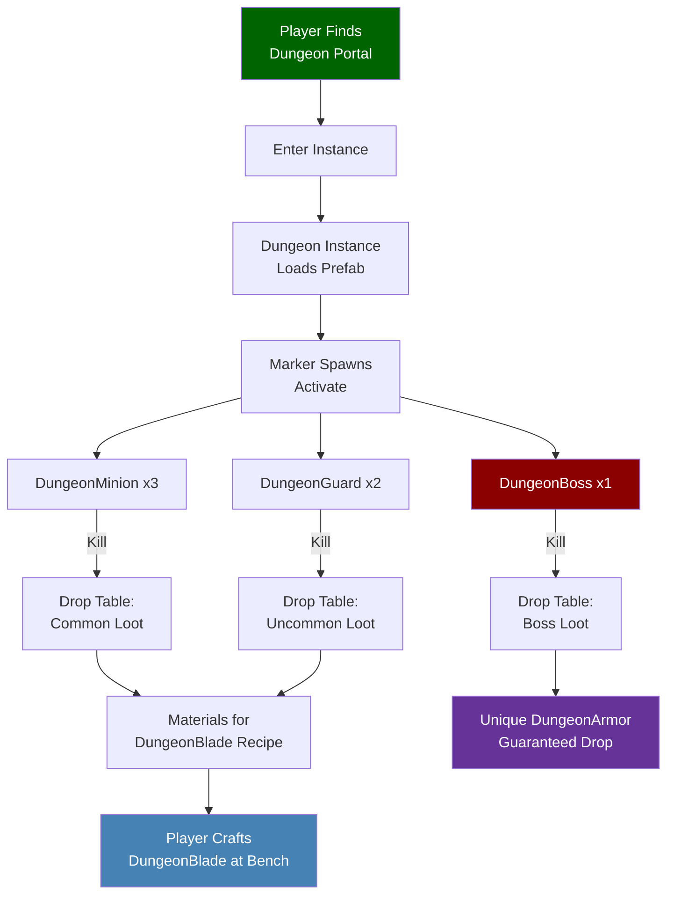
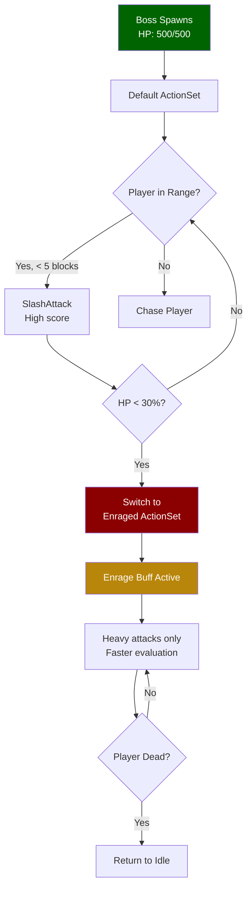

## Descripción General

Esta vitrina recorre la estructura de un mod completo de Hytale llamado **Dude VS Dungeon**. Demuestra cómo múltiples sistemas se conectan: NPCs personalizados con comportamientos de IA, armas y armaduras únicas, recetas de fabricación, instancias de mazmorras con portales y tablas de botín que unen todo.

Este no es un tutorial paso a paso — es un recorrido guiado por un mod terminado para mostrar cómo encajan las piezas.

## Estructura del Mod

```
dude_vs_dungeon/
├── manifest.json
├── Server/
│   ├── NPC/
│   │   ├── Roles/
│   │   │   ├── DungeonGuard.json
│   │   │   ├── DungeonBoss.json
│   │   │   └── DungeonMinion.json
│   │   ├── Spawn/
│   │   │   └── Markers/
│   │   │       └── Dungeon_Spawns.json
│   │   └── Balancing/
│   │       ├── CAE_DungeonGuard.json
│   │       └── CAE_DungeonBoss.json
│   ├── Item/
│   │   ├── Items/
│   │   │   ├── Weapon/
│   │   │   │   └── DungeonBlade.json
│   │   │   └── Armor/
│   │   │       └── DungeonArmor_Chest.json
│   │   └── Recipes/
│   │       └── DungeonBlade_Recipe.json
│   ├── Drops/
│   │   ├── Drop_DungeonGuard.json
│   │   ├── Drop_DungeonBoss.json
│   │   └── Drop_DungeonChest.json
│   ├── Instances/
│   │   └── DungeonInstance.json
│   ├── PortalTypes/
│   │   └── DungeonPortal.json
│   └── Models/
│       ├── DungeonGuard.json
│       ├── DungeonBoss.json
│       └── DungeonMinion.json
└── Common/
    └── NPC/
        ├── DungeonGuard/
        ├── DungeonBoss/
        └── DungeonMinion/
```

## Interacciones del Sistema



## Archivos Clave Explicados

### 1. El Rol del NPC Jefe

El DungeonBoss hereda de la plantilla de monstruo y sobrescribe las estadísticas de combate:

```json
{
  "Reference": "Template_Beasts_Aggressive_Monster",
  "Modify": {
    "Appearance": "dude_vs_dungeon:DungeonBoss",
    "Health": {
      "Parameter": "BossHealth",
      "Compute": { "Base": 500 }
    },
    "MovementSpeed": {
      "Parameter": "BossSpeed",
      "Compute": { "Base": 1.8 }
    },
    "Drops": {
      "Reference": "dude_vs_dungeon:Drop_DungeonBoss"
    },
    "CombatActionEvaluator": "dude_vs_dungeon:CAE_DungeonBoss"
  }
}
```

### 2. IA de Combate del Jefe

El jefe tiene múltiples fases de combate impulsadas por umbrales de salud:

```json
{
  "EvaluationInterval": 0.5,
  "AvailableActions": {
    "SlashAttack": {
      "ActionId": "MeleeAttack_Heavy",
      "Conditions": [
        { "Type": "TargetDistance", "Curve": { "ResponseCurve": "SimpleDescendingLogistic", "XRange": [0, 5] } },
        { "Type": "TimeSinceLastUsed", "Curve": { "ResponseCurve": "Linear", "XRange": [0, 3] } }
      ]
    },
    "Enrage": {
      "ActionId": "Buff_Enrage",
      "RunConditions": [
        { "Type": "OwnStatPercent", "Stat": "Health", "Curve": "ReverseLinear" }
      ],
      "Conditions": [
        { "Type": "OwnStatPercent", "Stat": "Health", "Curve": { "Type": "Switch", "SwitchPoint": 0.3 } }
      ]
    }
  },
  "ActionSets": {
    "Default": {
      "Actions": ["SlashAttack"],
      "BasicAttackType": "MeleeAttack_Light"
    },
    "Enraged": {
      "Actions": ["SlashAttack", "Enrage"],
      "BasicAttackType": "MeleeAttack_Heavy"
    }
  }
}
```

### Flujo de Combate



### 3. Tabla de Botín del Jefe

Objeto de armadura única garantizado + recompensas de materiales aleatorios:

```json
{
  "Container": {
    "Type": "Multiple",
    "Children": [
      {
        "Type": "Single",
        "Item": "dude_vs_dungeon:DungeonArmor_Chest",
        "Count": 1
      },
      {
        "Type": "Choice",
        "Children": [
          { "Weight": 40, "Type": "Single", "Item": "hytale:Diamond", "Count": [2, 5] },
          { "Weight": 35, "Type": "Single", "Item": "hytale:Gold_Ingot", "Count": [3, 8] },
          { "Weight": 25, "Type": "Single", "Item": "dude_vs_dungeon:DungeonShard", "Count": [1, 3] }
        ]
      }
    ]
  }
}
```

### 4. Instancia de Mazmorra

El archivo de instancia une todo — el prefab, los marcadores de aparición y el portal:

```json
{
  "Prefab": "dude_vs_dungeon:Prefab_DungeonArena",
  "SpawnPoint": { "X": 8, "Y": 1, "Z": 8 },
  "Portal": "dude_vs_dungeon:DungeonPortal",
  "MaxPlayers": 4,
  "ResetTime": "PT30M",
  "Objectives": [
    {
      "Type": "KillNPC",
      "Target": "dude_vs_dungeon:DungeonBoss",
      "Count": 1
    }
  ]
}
```

### 5. El Arma Fabricada

Una DungeonBlade fabricada con materiales obtenidos de mobs de mazmorra:

```json
{
  "Parent": "Template_Weapon_Sword",
  "Modify": {
    "TranslationKey": "dude_vs_dungeon.item.name.dungeon_blade",
    "BaseDamage": { "Slashing": 25, "Fire": 10 },
    "AttackSpeed": 1.2,
    "Durability": 500,
    "Quality": "Legendary"
  }
}
```

Receta que requiere botín de mazmorra:

```json
{
  "Inputs": [
    { "Item": "dude_vs_dungeon:DungeonShard", "Count": 5 },
    { "Item": "hytale:Diamond", "Count": 3 },
    { "Item": "hytale:Iron_Ingot", "Count": 10 }
  ],
  "Output": {
    "Item": "dude_vs_dungeon:DungeonBlade",
    "Count": 1
  },
  "BenchRequirement": [
    { "Id": "WorkBench", "RequiredTierLevel": 3 }
  ],
  "ProcessingTime": 10
}
```

## Sistemas Utilizados

Este mod demuestra los siguientes sistemas trabajando juntos:

| Sistema | Páginas |
|---------|---------|
| Roles y Plantillas de NPC | [NPC Roles](/hytale-modding-docs/reference/npc-system/npc-roles/), [NPC Templates](/hytale-modding-docs/reference/npc-system/npc-templates/) |
| IA de Combate | [NPC Decision Making](/hytale-modding-docs/reference/npc-system/npc-decision-making/), [NPC Combat Balancing](/hytale-modding-docs/reference/npc-system/npc-combat-balancing/) |
| Sistema de Aparición | [NPC Spawn Rules](/hytale-modding-docs/reference/npc-system/npc-spawn-rules/) |
| Objetos y Fabricación | [Item Definitions](/hytale-modding-docs/reference/item-system/item-definitions/), [Recipes](/hytale-modding-docs/reference/crafting-system/recipes/) |
| Botín | [Drop Tables](/hytale-modding-docs/reference/economy-and-progression/drop-tables/) |
| Mazmorras | [Instances](/hytale-modding-docs/reference/game-configuration/instances/), [Portal Types](/hytale-modding-docs/reference/world-and-environment/portal-types/) |
| Empaquetado de Mods | [Mod Packaging](/hytale-modding-docs/tutorials/advanced/mod-packaging/) |

## Conclusiones

1. **Usa herencia** — el jefe y las armas extienden plantillas base, no se construyen desde cero
2. **Conecta sistemas** — los botines alimentan recetas, los marcadores de aparición se activan en instancias, los portales restringen contenido
3. **Estratifica la complejidad del combate** — el jefe usa conjuntos de acciones impulsados por condiciones para transiciones de fase
4. **Balancea con pesos** — el botín usa selecciones ponderadas para recompensas variadas pero controladas
5. **Espacio de nombres para todo** — el prefijo `dude_vs_dungeon:` previene conflictos con otros mods
