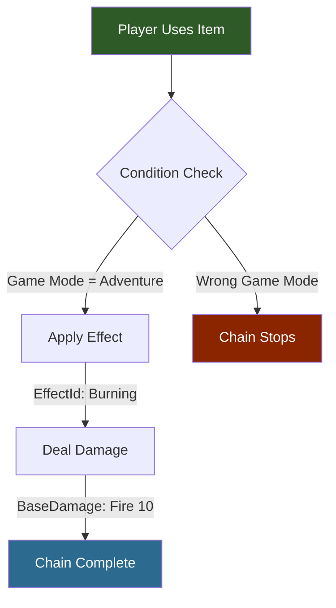
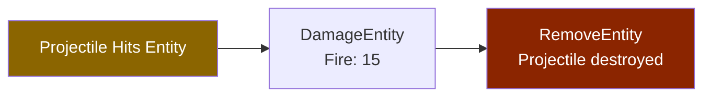
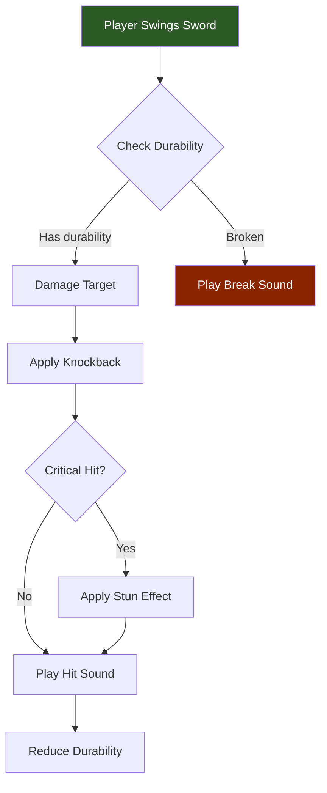

## Visao Geral

O Hytale constroi comportamentos de gameplay complexos encadeando interacoes simples. Cada interacao tem um `Type` e um campo opcional `Next` apontando para a acao seguinte. Isso cria pipelines sequenciais que podem incluir condicoes, dano, efeitos, sons e mais.

## Como as Cadeias de Interacao Funcionam



### Cadeia de Acerto de Projetil



### Cadeia Complexa de Arma



## Estrutura da Cadeia

```json
{
  "Type": "Condition",
  "RequiredGameMode": "Adventure",
  "Next": {
    "Type": "ApplyEffect",
    "EffectId": "Burning",
    "Next": {
      "Type": "Damage",
      "DamageCalculator": {
        "BaseDamage": { "Fire": 10 }
      }
    }
  }
}
```

Essa cadeia: verifica o modo de jogo -> aplica efeito de queimadura -> causa dano de fogo.

## Tipos de Interacao

| Type | Proposito | Campos Principais |
|------|-----------|-------------------|
| `Condition` | Condicao baseada em requisitos | `RequiredGameMode` |
| `ApplyEffect` | Aplica um efeito de status | `EffectId` |
| `Damage` | Causa dano | `DamageCalculator`, `BaseDamage` |
| `DamageEntity` | Dano ao acertar projetil | `DamageCalculator` |
| `RemoveEntity` | Destroi a entidade | — |
| `Simple` | Interacao basica | Varia |
| `Consume` | Usa um item consumivel | `Consume_Charge`, efeitos |

## Onde as Cadeias Sao Usadas

- **Interacoes de Itens** (`Server/Item/Interactions/`) — quebra de blocos, uso de ferramentas
- **Configs de Projeteis** (`Server/ProjectileConfigs/`) — acoes ao acertar e ao quicar
- **Acoes de NPCs** — sequencias de habilidades de combate

## Exemplo de Interacao de Projetil

```json
{
  "Interactions": {
    "ProjectileHit": {
      "Cooldown": 0,
      "Interactions": [
        {
          "Type": "DamageEntity",
          "DamageCalculator": { "BaseDamage": { "Fire": 15 } },
          "Next": {
            "Type": "RemoveEntity"
          }
        }
      ]
    }
  }
}
```

## Paginas Relacionadas

- [Item Interactions](/hytale-modding-docs/reference/item-system/item-interactions/) — cadeias de interacao de blocos e itens
- [Projectile Configs](/hytale-modding-docs/reference/combat-and-projectiles/projectile-configs/) — cadeias de eventos de projeteis
- [Damage Types](/hytale-modding-docs/reference/combat-and-projectiles/damage-types/) — hierarquia de tipos de dano
