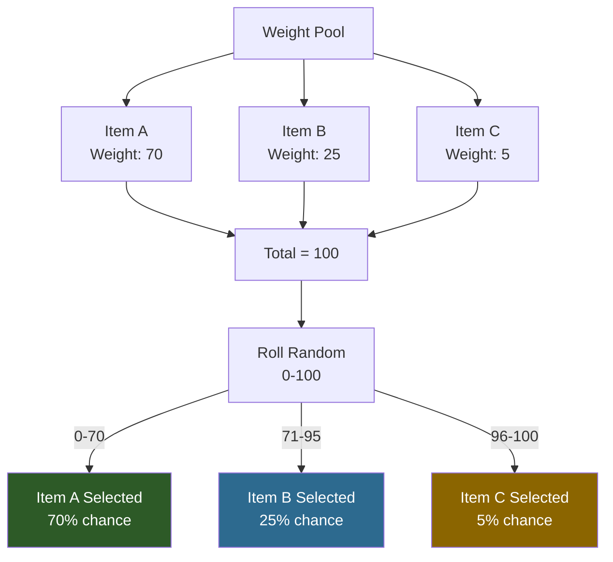
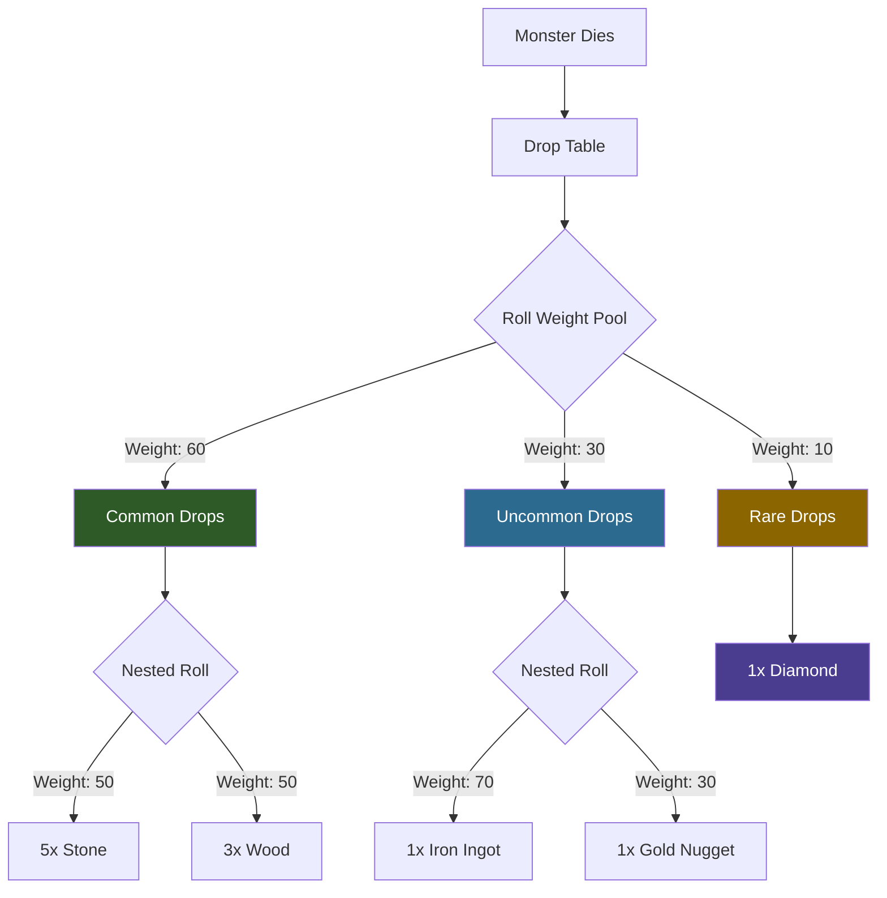

## Visao Geral

Muitos sistemas do Hytale usam selecao aleatoria ponderada para determinar resultados. Pesos sao numeros relativos — um peso maior significa maior probabilidade de ser selecionado. O total nao precisa ser igual a 100.

## Como os Pesos Funcionam

Dados itens com pesos `[70, 25, 5]`, as probabilidades sao:
- Item A: 70/100 = 70%
- Item B: 25/100 = 25%
- Item C: 5/100 = 5%

## Como a Selecao por Peso Funciona



### Exemplo de Peso Aninhado (Tabelas de Drop)



## Sistemas que Usam Pesos

### Tabelas de Drop

Drops de loot usam pesos dentro de containers `Choice`:

```json
{
  "Container": {
    "Type": "Choice",
    "Containers": [
      { "Weight": 80, "Item": { "ItemId": "Coin_Gold", "QuantityMin": 1, "QuantityMax": 3 } },
      { "Weight": 15, "Item": { "ItemId": "Gem_Ruby" } },
      { "Weight": 5, "Item": { "ItemId": "Sword_Rare" } }
    ]
  }
}
```

### Spawn de NPCs

Regras de spawn ponderam qual NPC aparece:

```json
{
  "NPCs": [
    { "Weight": 10, "Id": "Chicken", "Flock": "One_Or_Two" },
    { "Weight": 10, "Id": "Rabbit", "Flock": "Group_Small" },
    { "Weight": 5, "Id": "Deer", "Flock": "One_Or_Two" }
  ]
}
```

### Lojas de Troca (Pool Slots)

Pools de inventario de lojas selecionam trocas por peso:

```json
{
  "Type": "Pool",
  "SlotCount": 2,
  "Trades": [
    { "Weight": 10, "Trade": { "Output": [{ "ItemId": "Food_Apple" }], "Input": [{ "ItemId": "Coin_Gold", "Quantity": 5 }] } },
    { "Weight": 5, "Trade": { "Output": [{ "ItemId": "Food_Pie" }], "Input": [{ "ItemId": "Coin_Gold", "Quantity": 12 }] } }
  ]
}
```

### Previsoes do Tempo

A selecao de clima por hora usa pesos:

```json
{
  "WeatherForecasts": {
    "6": [
      { "WeatherId": "Zone1_Sunny", "Weight": 60 },
      { "WeatherId": "Zone1_Cloudy", "Weight": 30 },
      { "WeatherId": "Zone1_Rain", "Weight": 10 }
    ]
  }
}
```

## Paginas Relacionadas

- [Drop Tables](/hytale-modding-docs/reference/economy-and-progression/drop-tables/) — sistema de pesos de loot
- [NPC Spawn Rules](/hytale-modding-docs/reference/npc-system/npc-spawn-rules/) — pesos de spawn
- [Barter Shops](/hytale-modding-docs/reference/economy-and-progression/barter-shops/) — pesos de pool de comercio
