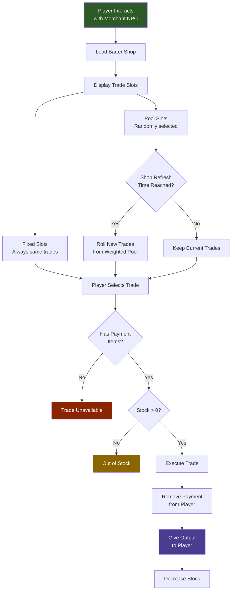

## Visão Geral

As lojas de troca definem o inventário de NPCs mercadores: o que vendem, o que aceitam como pagamento, quanto estoque está disponível e quando é reabastecido. Cada arquivo de loja contém uma lista de `TradeSlots` que são `Fixed` (sempre a mesma troca) ou `Pool` (selecionados aleatoriamente de uma lista ponderada de trocas possíveis a cada reabastecimento). O estoque da loja é resetado em um cronograma diário configurável.

## Como o Comércio com NPCs Funciona



## Localização dos Arquivos

```
Assets/Server/BarterShops/
  Klops_Merchant.json
  Kweebec_Merchant.json
```

## Schema

### Nível superior

| Field | Type | Required | Default | Description |
|-------|------|----------|---------|-------------|
| `DisplayNameKey` | `string` | Sim | — | Chave de localização para o nome exibido na UI da loja. |
| `RefreshInterval` | `RefreshInterval` | Sim | — | Com que frequência o estoque da loja é resetado. |
| `RestockHour` | `number` | Sim | — | Hora do jogo (0–23) em que o estoque é reabastecido a cada ciclo. |
| `TradeSlots` | `TradeSlot[]` | Sim | — | Lista ordenada de slots de troca exibidos na UI da loja. |

### RefreshInterval

| Field | Type | Required | Default | Description |
|-------|------|----------|---------|-------------|
| `Days` | `number` | Não | — | Número de dias no jogo entre reabastecimentos. |

### TradeSlot

| Field | Type | Required | Default | Description |
|-------|------|----------|---------|-------------|
| `Type` | `"Fixed" \| "Pool"` | Sim | — | `Fixed` sempre mostra a mesma troca. `Pool` escolhe trocas aleatoriamente de uma lista ponderada. |
| `Trade` | `Trade` | Não | — | A troca única para slots `Fixed`. |
| `SlotCount` | `number` | Não | — | Apenas `Pool`. Número de trocas selecionadas aleatoriamente de `Trades` para exibir. |
| `Trades` | `PoolTrade[]` | Não | — | Apenas `Pool`. Lista ponderada de trocas possíveis para amostrar. |

### Trade (Fixed)

| Field | Type | Required | Default | Description |
|-------|------|----------|---------|-------------|
| `Output` | `TradeItem` | Sim | — | O item que o jogador recebe. |
| `Input` | `TradeItem[]` | Sim | — | Itens que o jogador deve fornecer como pagamento (um ou mais). |
| `Stock` | `number` | Sim | — | Número de vezes que esta troca pode ser completada antes do slot ficar sem estoque. |

### PoolTrade

| Field | Type | Required | Default | Description |
|-------|------|----------|---------|-------------|
| `Weight` | `number` | Sim | — | Probabilidade relativa desta troca ser selecionada quando o pool é amostrado. |
| `Output` | `TradeItem` | Sim | — | O item que o jogador recebe. |
| `Input` | `TradeItem[]` | Sim | — | Itens que o jogador deve fornecer como pagamento. |
| `Stock` | `number \| [number, number]` | Sim | — | Contagem fixa de estoque, ou faixa `[min, max]` para estoque aleatorizado a cada reabastecimento. |

### TradeItem

| Field | Type | Required | Default | Description |
|-------|------|----------|---------|-------------|
| `ItemId` | `string` | Sim | — | ID do item. |
| `Quantity` | `number` | Sim | — | Tamanho da pilha do item. |

## Exemplos

**Loja fixa simples** (`Assets/Server/BarterShops/Klops_Merchant.json`):

```json
{
  "DisplayNameKey": "server.barter.klops_merchant.title",
  "RefreshInterval": {
    "Days": 1
  },
  "RestockHour": 6,
  "TradeSlots": [
    {
      "Type": "Fixed",
      "Trade": {
        "Output": { "ItemId": "Furniture_Construction_Sign", "Quantity": 1 },
        "Input": [{ "ItemId": "Furniture_Construction_Sign", "Quantity": 1 }],
        "Stock": 1
      }
    }
  ]
}
```

**Loja mista com slots fixos e pool** (`Assets/Server/BarterShops/Kweebec_Merchant.json`, condensado):

```json
{
  "DisplayNameKey": "server.barter.kweebec_merchant.title",
  "RefreshInterval": {
    "Days": 3
  },
  "RestockHour": 6,
  "TradeSlots": [
    {
      "Type": "Fixed",
      "Trade": {
        "Output": { "ItemId": "Ingredient_Spices", "Quantity": 3 },
        "Input": [{ "ItemId": "Ingredient_Life_Essence", "Quantity": 20 }],
        "Stock": 10
      }
    },
    {
      "Type": "Pool",
      "SlotCount": 3,
      "Trades": [
        {
          "Weight": 50,
          "Output": { "ItemId": "Plant_Crop_Berry_Block", "Quantity": 1 },
          "Input": [{ "ItemId": "Ingredient_Life_Essence", "Quantity": 30 }],
          "Stock": [10, 20]
        },
        {
          "Weight": 30,
          "Output": { "ItemId": "Plant_Crop_Berry_Winter_Block", "Quantity": 1 },
          "Input": [{ "ItemId": "Ingredient_Life_Essence", "Quantity": 50 }],
          "Stock": [10, 20]
        },
        {
          "Weight": 20,
          "Output": { "ItemId": "Food_Salad_Berry", "Quantity": 1 },
          "Input": [{ "ItemId": "Ingredient_Life_Essence", "Quantity": 15 }],
          "Stock": [4, 8]
        }
      ]
    }
  ]
}
```

No slot pool acima, 3 trocas são escolhidas aleatoriamente da lista ponderada cada vez que a loja reabastece a cada 3 dias na hora 6. O estoque é aleatorizado entre os valores min e max.

## Páginas Relacionadas

- [Tabelas de Drop](/hytale-modding-docs/reference/economy-and-progression/drop-tables) — loot de contêineres e NPCs
- [Fazendas e Galinheiros](/hytale-modding-docs/reference/economy-and-progression/farming-coops) — produção alternativa de recursos
