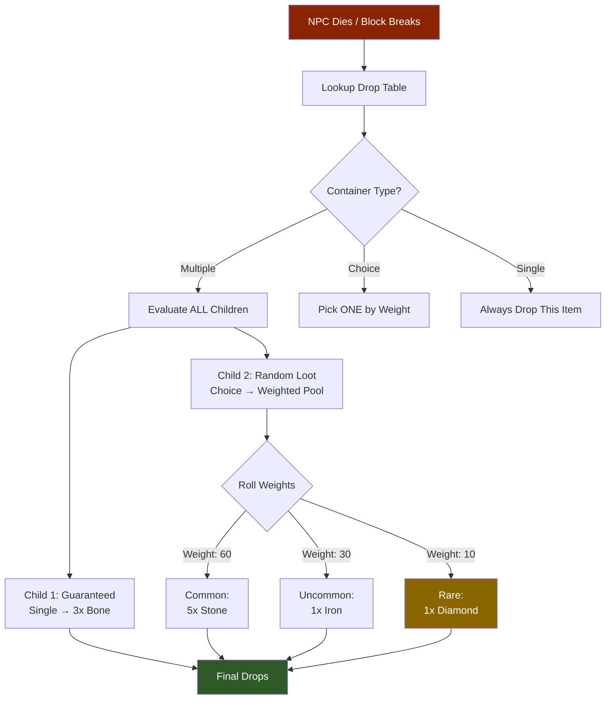
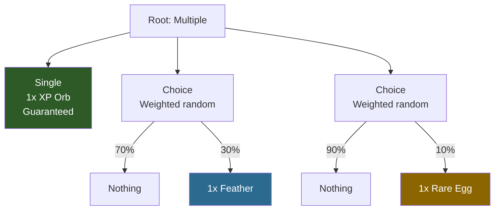

## Visão Geral

As tabelas de drop definem quais itens são produzidos quando um contêiner é aberto, um NPC é eliminado ou um nó de recurso é coletado. O sistema usa uma estrutura recursiva de `Container` que suporta três modos de seleção: `Single` (sempre produz um item), `Choice` (escolhe aleatoriamente um filho por peso) e `Multiple` (avalia todos os filhos). Aninhar esses tipos permite criar tabelas de loot ponderadas complexas com drops garantidos e opcionais.

## Como as Tabelas de Drop Funcionam



### Exemplo de Aninhamento de Contêineres



## Localização dos Arquivos

```
Assets/Server/Drops/
  Items/          (contêineres do mundo: barris, potes, caixões)
  NPCs/
    Beast/
    Boss/
    Critter/
    Elemental/
    Flying_Beast/
    Flying_Critter/
    Flying_Wildlife/
    Intelligent/
    Inventory/
  Objectives/
  Plant/
  Rock/
  Wood/
```

## Schema

### Nível superior

| Field | Type | Required | Default | Description |
|-------|------|----------|---------|-------------|
| `Container` | `Container` | Sim | — | Nó contêiner raiz que define a lógica de loot. |

### Container

| Field | Type | Required | Default | Description |
|-------|------|----------|---------|-------------|
| `Type` | `"Single" \| "Multiple" \| "Choice" \| "Empty"` | Sim | — | Modo de seleção para este nó contêiner. |
| `Item` | `ItemEntry` | Não | — | O item a ser produzido. Válido apenas quando `Type` é `"Single"`. |
| `Containers` | `Container[]` | Não | — | Contêineres filhos. Usado pelos tipos `Multiple` e `Choice`. |
| `Weight` | `number` | Não | — | Peso de probabilidade relativa. Usado por contêineres pai `Choice` ao selecionar entre irmãos. |

### Tipos de Container

| Type | Comportamento |
|------|---------------|
| `Single` | Sempre produz exatamente o item definido em `Item`. |
| `Multiple` | Avalia cada contêiner filho independentemente e combina todos os resultados. |
| `Choice` | Seleciona aleatoriamente um contêiner filho ponderado pelo campo `Weight` de cada filho. |
| `Empty` | Não produz nada. Usado como opção ponderada de "sem drop" dentro de nós `Choice`. |

### ItemEntry

| Field | Type | Required | Default | Description |
|-------|------|----------|---------|-------------|
| `ItemId` | `string` | Sim | — | ID do item a ser produzido. |
| `QuantityMin` | `number` | Sim | — | Tamanho mínimo da pilha produzida. |
| `QuantityMax` | `number` | Sim | — | Tamanho máximo da pilha produzida. A quantidade real é escolhida uniformemente entre min e max. |

## Exemplos

**Contêiner do mundo com drops de escolha ponderada** (`Assets/Server/Drops/Items/Barrels.json`):

```json
{
  "Container": {
    "Type": "Choice",
    "Containers": [
      {
        "Type": "Choice",
        "Weight": 100,
        "Containers": [
          {
            "Type": "Single",
            "Item": {
              "ItemId": "Plant_Fruit_Apple",
              "QuantityMin": 1,
              "QuantityMax": 1
            }
          }
        ]
      },
      {
        "Type": "Choice",
        "Weight": 25,
        "Containers": [
          {
            "Type": "Single",
            "Item": {
              "ItemId": "Weapon_Arrow_Crude",
              "QuantityMin": 1,
              "QuantityMax": 5
            }
          }
        ]
      },
      {
        "Type": "Empty",
        "Weight": 800
      }
    ]
  }
}
```

**Drop de NPC com múltiplos drops garantidos** (`Assets/Server/Drops/NPCs/Beast/Drop_Bear_Grizzly.json`):

```json
{
  "Container": {
    "Type": "Multiple",
    "Containers": [
      {
        "Type": "Choice",
        "Weight": 100,
        "Containers": [
          {
            "Type": "Single",
            "Item": {
              "ItemId": "Ingredient_Hide_Heavy",
              "QuantityMin": 1,
              "QuantityMax": 2
            }
          }
        ]
      },
      {
        "Type": "Choice",
        "Weight": 100,
        "Containers": [
          {
            "Type": "Single",
            "Item": {
              "ItemId": "Food_Wildmeat_Raw",
              "QuantityMin": 2,
              "QuantityMax": 3
            }
          }
        ]
      }
    ]
  }
}
```

O `Multiple` raiz garante que o urso sempre dropa tanto couro quanto carne. Cada filho usa um `Choice` com peso 100 (a única opção não vazia), tornando cada drop individual garantido.

## Páginas Relacionadas

- [Lojas de Troca](/hytale-modding-docs/reference/economy-and-progression/barter-shops) — slots de troca de mercadores
- [Fazendas e Galinheiros](/hytale-modding-docs/reference/economy-and-progression/farming-coops) — o campo `ProduceDrops` referencia IDs de tabelas de drop
- [Receitas](/hytale-modding-docs/reference/crafting-system/recipes) — crafting como alternativa aos drops
