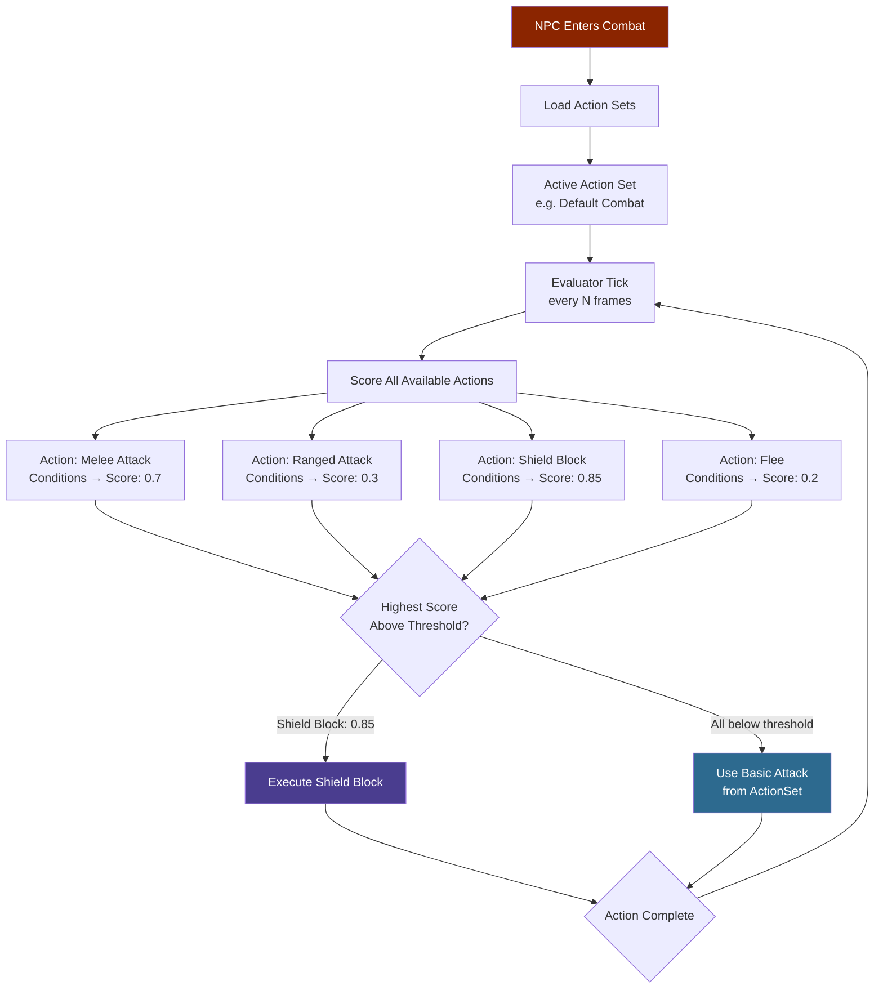
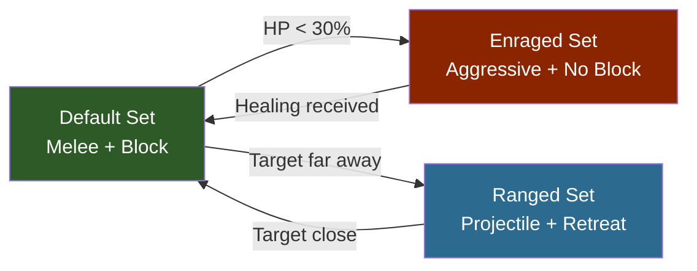

## Visao Geral

Arquivos do Combat Action Evaluator (CAE) configuram o sistema de IA por utilidade que conduz o combate dos NPCs. Cada arquivo define com que frequencia o avaliador executa, um conjunto de acoes disponiveis nomeadas com condicoes de pontuacao e um ou mais conjuntos de acoes que agrupam quais acoes e ataques basicos estao ativos em um determinado estado de combate. O avaliador pontua todas as acoes disponiveis a cada tick e executa a de maior pontuacao acima de um limite minimo.

## Fluxo de IA de Combate



### Transicoes de Conjuntos de Acoes



## Localizacao dos Arquivos

- `Assets/Server/NPC/Balancing/Beast/*.json` — CAEs de animais e criaturas
- `Assets/Server/NPC/Balancing/Intelligent/*.json` — CAEs de NPCs de faccao
- `Assets/Server/NPC/Balancing/CAE_Test_*.json` — CAEs de teste e referencia

## Schema

### Campos de nivel superior

| Field | Type | Required | Default | Descricao |
|-------|------|----------|---------|-----------|
| `Type` | `"CombatActionEvaluator"` | Sim | — | Identifica este arquivo como um CAE. |
| `TargetMemoryDuration` | number | Nao | — | Quantos segundos o NPC lembra de um alvo apos perder a visao dele. |
| `CombatActionEvaluator` | object | Sim | — | O bloco de configuracao do avaliador (veja abaixo). |

### Bloco CombatActionEvaluator

| Field | Type | Required | Default | Descricao |
|-------|------|----------|---------|-----------|
| `RunConditions` | array | Nao | — | Condicoes avaliadas antes de executar o avaliador completo. Todas devem passar para o avaliador prosseguir neste tick. |
| `MinRunUtility` | number | Nao | — | Pontuacao minima combinada de utilidade das `RunConditions` necessaria para executar o avaliador. |
| `MinActionUtility` | number | Nao | — | Pontuacao minima de utilidade que uma acao deve atingir para ser considerada para execucao. |
| `AvailableActions` | object | Sim | — | Definicoes de acoes nomeadas. As chaves sao IDs de acoes referenciados por `ActionSets`. |
| `ActionSets` | object | Sim | — | Conjuntos nomeados de acoes ativas e ataques basicos. O conjunto ativo e controlado pelo sub-estado de combate do NPC. |

### Entrada do array RunConditions

Cada entrada e um objeto de condicao (veja [NPC Decision Making](/hytale-modding-docs/reference/npc-system/npc-decision-making)). Comumente usados:

| Type | Proposito |
|------|-----------|
| `TimeSinceLastUsed` | Limita a frequencia com que o avaliador dispara. |
| `Randomiser` | Adiciona aleatoriedade para evitar comportamento perfeitamente previsivel. |

### Entrada de AvailableActions

Cada chave em `AvailableActions` e uma acao nomeada. Campos do objeto de acao:

| Field | Type | Required | Default | Descricao |
|-------|------|----------|---------|-----------|
| `Type` | string | Sim | — | Tipo de acao. Veja a tabela de tipos de acao abaixo. |
| `Description` | string | Nao | — | Descricao legivel da acao. |
| `Target` | string | Nao | — | Categoria do alvo: `"Hostile"`, `"Friendly"`, `"Self"`. |
| `WeaponSlot` | number | Nao | — | Indice do slot de arma usado para esta acao. |
| `SubState` | string | Nao | — | Sub-estado de combate a ativar quando esta acao executa (mapeia para uma chave de `ActionSets`). |
| `Ability` | string | Nao | — | ID da habilidade a executar. |
| `AttackDistanceRange` | [number, number] | Nao | — | Distancia `[min, max]` em blocos na qual esta acao pode ser usada. |
| `PostExecuteDistanceRange` | [number, number] | Nao | — | Faixa de distancia que o NPC tenta manter apos executar. |
| `ChargeFor` | number | Nao | — | Segundos para carregar antes de executar. |
| `WeightCoefficient` | number | Nao | `1.0` | Multiplicador aplicado a pontuacao final de utilidade desta acao. |
| `InteractionVars` | object | Nao | — | Overrides de variaveis de interacao aplicados quando esta acao dispara. |
| `Conditions` | array | Nao | — | Condicoes de pontuacao para esta acao especifica (veja [NPC Decision Making](/hytale-modding-docs/reference/npc-system/npc-decision-making)). |

### Tipos de Acao

| Type | Descricao |
|------|-----------|
| `SelectBasicAttackTarget` | Seleciona um alvo para ataques basicos usando as condicoes para pontuar candidatos. |
| `Ability` | Executa uma habilidade nomeada (golpe corpo a corpo, arremesso a distancia, cura, etc.). |

### Entrada de ActionSets

Cada chave em `ActionSets` e um nome de sub-estado (ex: `"Default"`, `"Ranged"`, `"Attack"`). O valor:

| Field | Type | Required | Default | Descricao |
|-------|------|----------|---------|-----------|
| `BasicAttacks` | object | Nao | — | Configuracao de ataque basico para este sub-estado (veja abaixo). |
| `Actions` | string[] | Nao | — | Lista de IDs de acoes de `AvailableActions` que sao avaliadas neste sub-estado. |

### Objeto BasicAttacks

| Field | Type | Required | Default | Descricao |
|-------|------|----------|---------|-----------|
| `Attacks` | string[] | Sim | — | IDs de habilidades usadas como ataques basicos. |
| `Randomise` | boolean | Nao | `false` | Se `true`, seleciona aleatoriamente da lista `Attacks` a cada ciclo. |
| `MaxRange` | number | Nao | — | Alcance maximo em blocos para ataques basicos. |
| `Timeout` | number | Nao | — | Segundos para aguardar o ataque acertar antes de cancelar. |
| `CooldownRange` | [number, number] | Nao | — | Cooldown `[min, max]` em segundos entre ataques basicos. |
| `UseProjectedDistance` | boolean | Nao | `false` | Se `true`, usa distancia projetada (prevista) em vez da distancia atual. |
| `InteractionVars` | object | Nao | — | Overrides de variaveis de interacao para todos os ataques basicos neste conjunto. |

## Exemplos

### CAE simples de animal (Rat)

Um rato com um unico ataque de mordida, sem habilidades especiais:

```json
{
  "Type": "CombatActionEvaluator",
  "TargetMemoryDuration": 10,
  "CombatActionEvaluator": {
    "RunConditions": [
      {
        "Type": "TimeSinceLastUsed",
        "Curve": { "ResponseCurve": "Linear", "XRange": [0, 10] }
      },
      {
        "Type": "Randomiser",
        "MinValue": 0.9,
        "MaxValue": 1
      }
    ],
    "MinRunUtility": 0.5,
    "MinActionUtility": 0.01,
    "AvailableActions": {
      "SelectTarget": {
        "Type": "SelectBasicAttackTarget",
        "Description": "Select a target",
        "Conditions": [
          {
            "Type": "TargetDistance",
            "Curve": { "ResponseCurve": "SimpleDescendingLogistic", "XRange": [0, 15] }
          }
        ]
      }
    },
    "ActionSets": {
      "Default": {
        "BasicAttacks": {
          "Attacks": ["Rat_Bite"],
          "Randomise": false,
          "MaxRange": 2,
          "Timeout": 0.5,
          "CooldownRange": [0.001, 0.001]
        },
        "Actions": ["SelectTarget"]
      }
    }
  }
}
```

### CAE de NPC inteligente (Goblin Scrapper) — multiplos conjuntos de acoes

Um goblin que alterna entre sub-estados corpo a corpo e a distancia:

```json
{
  "Type": "CombatActionEvaluator",
  "TargetMemoryDuration": 5,
  "CombatActionEvaluator": {
    "RunConditions": [
      {
        "Type": "TimeSinceLastUsed",
        "Curve": { "ResponseCurve": "Linear", "XRange": [0, 5] }
      },
      { "Type": "Randomiser", "MinValue": 0.9, "MaxValue": 1 }
    ],
    "MinRunUtility": 0.5,
    "MinActionUtility": 0.01,
    "AvailableActions": {
      "Melee": {
        "Type": "Ability",
        "Description": "Quick melee swing",
        "WeaponSlot": 0,
        "SubState": "Default",
        "Ability": "Goblin_Scrapper_Attack",
        "Target": "Hostile",
        "AttackDistanceRange": [2.5, 2.5],
        "PostExecuteDistanceRange": [2.5, 2.5],
        "Conditions": [
          {
            "Type": "TimeSinceLastUsed",
            "Curve": { "ResponseCurve": "Linear", "XRange": [0, 1] }
          }
        ]
      },
      "Ranged": {
        "Type": "Ability",
        "Description": "Throw rubble from range",
        "WeaponSlot": 0,
        "SubState": "Ranged",
        "Ability": "Goblin_Scrapper_Rubble_Throw",
        "Target": "Hostile",
        "AttackDistanceRange": [15, 15],
        "PostExecuteDistanceRange": [2.5, 2.5],
        "Conditions": [
          {
            "Type": "TimeSinceLastUsed",
            "Curve": { "ResponseCurve": "Linear", "XRange": [0, 2] }
          },
          {
            "Type": "TargetDistance",
            "Curve": { "ResponseCurve": "SimpleLogistic", "XRange": [0, 15] }
          }
        ]
      }
    },
    "ActionSets": {
      "Default": {
        "BasicAttacks": {
          "Attacks": ["Goblin_Scrapper_Attack"],
          "Randomise": false,
          "MaxRange": 2.5,
          "Timeout": 0.5,
          "CooldownRange": [0.001, 0.001]
        },
        "Actions": ["SwingDown", "Ranged"]
      },
      "Ranged": {
        "BasicAttacks": {
          "Attacks": ["Goblin_Scrapper_Rubble_Throw"],
          "Randomise": false,
          "MaxRange": 15,
          "Timeout": 0.5,
          "CooldownRange": [0.8, 2]
        },
        "Actions": ["Melee"]
      }
    }
  }
}
```

## Paginas Relacionadas

- [NPC Decision Making](/hytale-modding-docs/reference/npc-system/npc-decision-making) — Tipos de condicao usados em `RunConditions` e `AvailableActions[*].Conditions`
- [NPC Roles](/hytale-modding-docs/reference/npc-system/npc-roles) — Arquivos de role que referenciam CAEs pelo campo `_CombatConfig` em `Modify`
- [NPC Templates](/hytale-modding-docs/reference/npc-system/npc-templates) — Templates que conectam o avaliador de combate pela arvore `Instructions`
