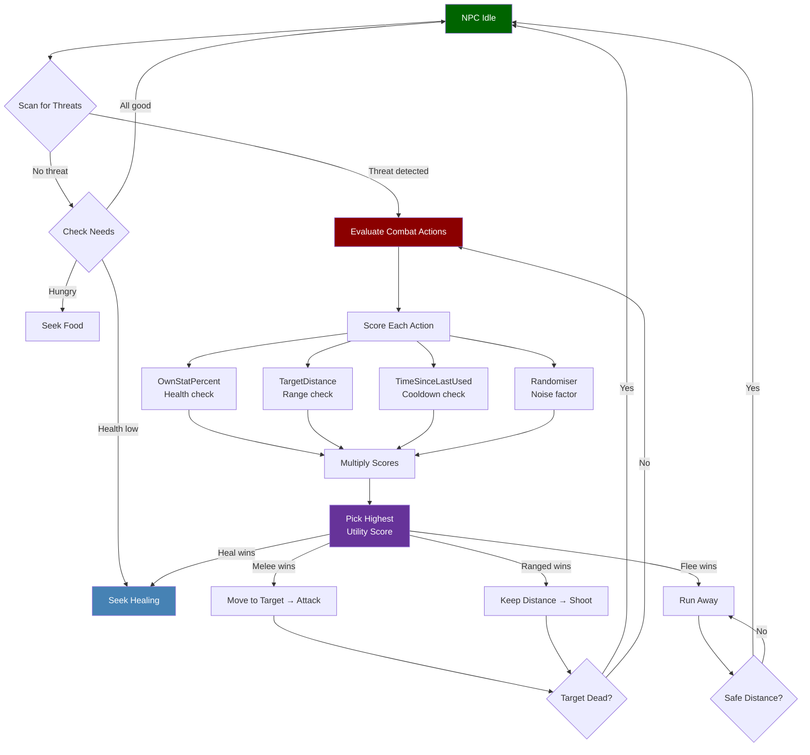
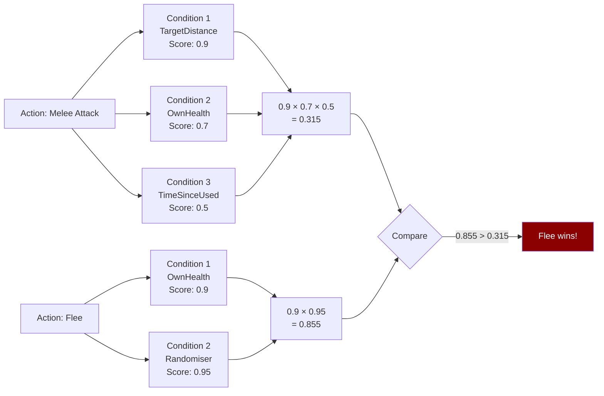

## Visao Geral

Arquivos de condicao de tomada de decisao definem funcoes de pontuacao reutilizaveis que a IA do NPC avalia para decidir o que fazer em seguida. Cada condicao tem um `Type` que nomeia a metrica sendo medida, um `Stat` especificando qual atributo do jogo ler (quando aplicavel) e uma `Curve` controlando como valores brutos sao mapeados para pontuacoes de utilidade entre 0 e 1. Essas condicoes aparecem tanto em arquivos standalone de `DecisionMaking/Conditions/` quanto inline dentro de definicoes de acoes do Combat Action Evaluator.

## Localizacao dos Arquivos

`Assets/Server/NPC/DecisionMaking/Conditions/*.json`

Condicoes tambem sao usadas inline dentro dos arrays `AvailableActions[*].Conditions` em arquivos de balanceamento. Veja [NPC Combat Balancing](/hytale-modding-docs/reference/npc-system/npc-combat-balancing).

## Schema

### Objeto de condicao

| Field | Type | Required | Default | Descricao |
|-------|------|----------|---------|-----------|
| `Type` | string | Sim | — | O tipo de condicao (veja a tabela abaixo). |
| `Stat` | string | Nao | — | O atributo a ser lido. Usado por tipos de condicao baseados em atributo. |
| `Curve` | string \| object | Nao | — | Como mapear o valor bruto para uma pontuacao de utilidade de 0 a 1. Pode ser uma string de curva nomeada ou um objeto de curva inline. |
| `MinValue` | number | Nao | — | Valor minimo de clamp para o valor bruto (usado por `Randomiser`). |
| `MaxValue` | number | Nao | — | Valor maximo de clamp para o valor bruto (usado por `Randomiser`). |

### Tipos de Condicao

| Type | Descricao | Campos Principais |
|------|-----------|-------------------|
| `OwnStatPercent` | Pontua com base no atributo proprio do NPC como porcentagem do maximo. | `Stat`, `Curve` |
| `TargetStatPercent` | Pontua com base no atributo do NPC alvo como porcentagem do maximo. | `Stat`, `Curve` |
| `TargetDistance` | Pontua com base na distancia ate o alvo atual. | `Curve` |
| `TimeSinceLastUsed` | Pontua com base em quanto tempo atras essa acao foi usada pela ultima vez. | `Curve` |
| `Randomiser` | Adiciona um componente de pontuacao aleatoria entre `MinValue` e `MaxValue`. | `MinValue`, `MaxValue` |

### Valores de Stat

| Stat | Descricao |
|------|-----------|
| `Health` | Pontos de vida atuais. |

### Valores de Curve

Uma `Curve` pode ser um atalho de string nomeada ou um objeto inline:

**Atalho de string nomeada:**

| Valor | Forma | Caso de uso |
|-------|-------|-------------|
| `"Linear"` | Aumenta linearmente de 0 a 1 conforme o atributo aumenta. | Preferir acoes quando o atributo esta alto. |
| `"ReverseLinear"` | Diminui linearmente de 1 a 0 conforme o atributo aumenta. | Preferir acoes quando o atributo esta baixo (ex: curar quando ferido). |

**Objeto de curva inline:**

| Field | Type | Descricao |
|-------|------|-----------|
| `ResponseCurve` | string | Forma de curva de resposta nomeada (veja abaixo). |
| `XRange` | [number, number] | A faixa de entrada `[min, max]` para o valor bruto. Valores fora dessa faixa sao limitados. |
| `Type` | `"Switch"` | Forma inline alternativa para um limiar rigido. |
| `SwitchPoint` | number | Para `Type: "Switch"` — o valor bruto no qual a pontuacao muda de 0 para 1. |

**Curvas de resposta nomeadas (`ResponseCurve`):**

| Valor | Forma |
|-------|-------|
| `"Linear"` | Linha reta de 0 a 1 ao longo de `XRange`. |
| `"SimpleLogistic"` | Curva S crescendo em direcao a 1. Util para "preferir quando perto". |
| `"SimpleDescendingLogistic"` | Curva S decrescendo em direcao a 0. Util para "preferir quando longe". |

## Como a Tomada de Decisao do NPC Funciona



### Como a Pontuacao de Utilidade Funciona

Cada acao disponivel tem uma lista de `Conditions`. O NPC avalia cada condicao para produzir uma pontuacao entre 0 e 1, e entao **multiplica** todas as pontuacoes. A acao com a maior pontuacao final vence.



## Exemplos

### Arquivo de condicao standalone — HP Linear

Pontua a vida propria do NPC linearmente: vida cheia = pontuacao 1, morto = pontuacao 0.

```json
{
  "Type": "OwnStatPercent",
  "Stat": "Health",
  "Curve": "Linear"
}
```

### Condicao inline — distancia do alvo (descendente)

Prefere esta acao quando o alvo esta perto; a pontuacao cai conforme a distancia aumenta ate 15 blocos.

```json
{
  "Type": "TargetDistance",
  "Curve": {
    "ResponseCurve": "SimpleDescendingLogistic",
    "XRange": [0, 15]
  }
}
```

### Condicao inline — tempo desde o ultimo uso

Pontua uma acao mais alto quanto mais tempo se passou desde que foi usada, em uma janela de 10 segundos.

```json
{
  "Type": "TimeSinceLastUsed",
  "Curve": {
    "ResponseCurve": "Linear",
    "XRange": [0, 10]
  }
}
```

### Condicao inline — limiar switch

Pontua 1 apos 10 segundos terem passado, 0 antes disso (bloqueio rigido).

```json
{
  "Type": "TimeSinceLastUsed",
  "Curve": {
    "Type": "Switch",
    "SwitchPoint": 10
  }
}
```

### Condicao inline — randomiser

Adiciona um componente de ruido aleatorio entre 0.9 e 1.0 a pontuacao de utilidade da acao.

```json
{
  "Type": "Randomiser",
  "MinValue": 0.9,
  "MaxValue": 1
}
```

### Condicao inline — HP linear reverso (curar quando ferido)

Pontua mais alto quando a vida esta baixa, para que o NPC prefira acoes de cura quando danificado.

```json
{
  "Type": "OwnStatPercent",
  "Stat": "Health",
  "Curve": "ReverseLinear"
}
```

## Paginas Relacionadas

- [NPC Combat Balancing](/hytale-modding-docs/reference/npc-system/npc-combat-balancing) — Onde as condicoes aparecem dentro de `AvailableActions[*].Conditions` e `RunConditions`
- [NPC Roles](/hytale-modding-docs/reference/npc-system/npc-roles) — Arquivos de role que referenciam tomada de decisao pela arvore `Instructions`
- [NPC Templates](/hytale-modding-docs/reference/npc-system/npc-templates) — Templates que embutem comportamento guiado por essas condicoes
