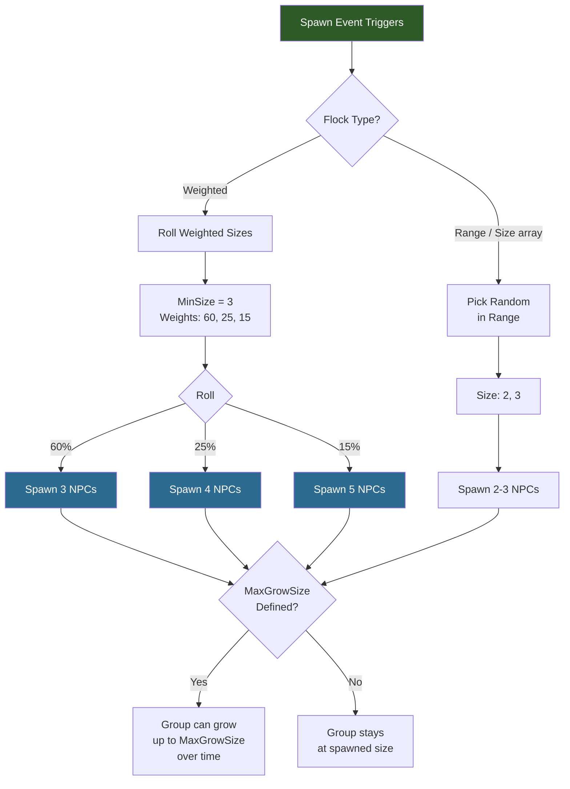

## Visao Geral

Arquivos de bando definem o comportamento de spawn em grupo — quantos NPCs aparecem juntos quando um evento de spawn e acionado. O sistema suporta dois modos: **Weighted** (seleciona aleatoriamente um tamanho de grupo a partir de probabilidades ponderadas) e **Range** (escolhe um tamanho aleatorio dentro de uma faixa min/max). Bandos sao referenciados pelas regras de spawn pelo campo `Flock`.

## Como o Dimensionamento de Bando Funciona



## Localizacao dos Arquivos

```
Assets/Server/NPC/Flocks/
  Group_Small.json
  Group_Medium.json
  Group_Large.json
  Group_Tiny.json
  Pack_Small.json
  One_Or_Two.json
  Parent_And_Young_75_25.json
  EasterEgg_Pair.json
```

## Schema

| Field | Type | Required | Default | Descricao |
|-------|------|----------|---------|-----------|
| `Type` | string | Nao | — | Modo de dimensionamento. `"Weighted"` usa `MinSize` + `SizeWeights`. Omita para modo de faixa simples. |
| `MinSize` | integer | Sim* | — | Tamanho minimo do grupo. Obrigatorio para tipo `Weighted`. Tamanho inicial para o indice de peso 0. |
| `SizeWeights` | number[] | Sim* | — | Pesos relativos para cada tamanho a partir de `MinSize`. Obrigatorio para tipo `Weighted`. |
| `Size` | [number, number] | Nao | — | Faixa simples min/max para tamanho do grupo (alternativa ao Weighted). |
| `MaxGrowSize` | integer | Nao | — | Tamanho maximo que o grupo pode atingir ao longo do tempo (ex: por reproducao). |

### Como SizeWeights Funciona

Para `MinSize: 3` e `SizeWeights: [60, 25, 15]`:

| Indice | Tamanho | Peso | Probabilidade |
|--------|---------|------|---------------|
| 0 | 3 (MinSize + 0) | 60 | 60% |
| 1 | 4 (MinSize + 1) | 25 | 25% |
| 2 | 5 (MinSize + 2) | 15 | 15% |

## Exemplos

### Grupo pequeno (3-5 NPCs, ponderado)

```json
{
  "Type": "Weighted",
  "MinSize": 3,
  "SizeWeights": [60, 25, 15]
}
```

60% de chance de 3, 25% de chance de 4, 15% de chance de 5.

### Grupo grande (5-7 NPCs, ponderado)

```json
{
  "Type": "Weighted",
  "MinSize": 5,
  "SizeWeights": [60, 20, 20]
}
```

### Pai e filhote (1-2, expansivel)

```json
{
  "Type": "Weighted",
  "MinSize": 1,
  "SizeWeights": [75, 25],
  "MaxGrowSize": 8
}
```

75% de chance de 1, 25% de chance de 2. O grupo pode crescer ate 8 ao longo do tempo.

### Faixa simples (2-3 NPCs)

```json
{
  "Size": [2, 3]
}
```

Sem pesos — apenas uma escolha aleatoria entre 2 e 3.

## Bandos Disponiveis

| ID do Bando | Tipo | Tamanhos | Notas |
|-------------|------|----------|-------|
| `Group_Tiny` | Weighted | 1-2 | Grupos muito pequenos |
| `Group_Small` | Weighted | 3-5 | Animais passivos comuns |
| `Group_Medium` | Weighted | 4-6 | Rebanhos medios |
| `Group_Large` | Weighted | 5-7 | Rebanhos grandes |
| `Pack_Small` | Range | 2-3 | Matilhas de predadores |
| `One_Or_Two` | Range | 1-2 | Solitario ou em par |
| `Parent_And_Young_75_25` | Weighted | 1-2 | Pares reprodutivos, cresce ate 8 |
| `EasterEgg_Pair` | Range | 2 | Spawns de easter egg |

## Paginas Relacionadas

- [NPC Spawn Rules](/hytale-modding-docs/reference/npc-system/npc-spawn-rules/) — Onde os bandos sao referenciados pelo campo `Flock`
- [NPC Groups](/hytale-modding-docs/reference/npc-system/npc-groups/) — Agrupamento logico de tipos de NPC
- [Weight System](/hytale-modding-docs/reference/concepts/weight-system/) — Como a selecao ponderada funciona
