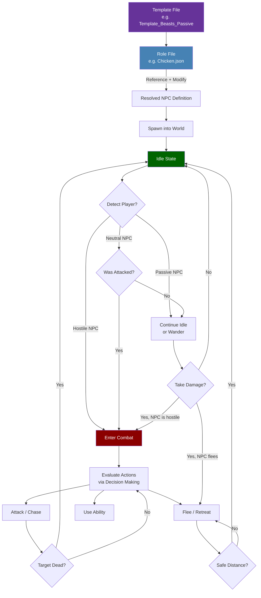

## Visao Geral

Um arquivo de Role de NPC define tudo sobre um NPC especifico: sua aparencia visual, atributos de vida e movimento, alcances de percepcao, tabelas de drop, associacao a bandos, status de domesticavel e a arvore de instrucoes de IA que controla seu comportamento. Roles sao tipicamente arquivos `Variant` que herdam de um template via o padrao `Reference` + `Modify`, sobrescrevendo apenas os campos que diferem do template base.

## Ciclo de Vida do Role de NPC



## Localizacao dos Arquivos

`Assets/Server/NPC/Roles/**/*.json`

Os roles sao organizados em subdiretorios por categoria:

- `_Core/` — Templates base e componentes compartilhados
- `Aquatic/` — Peixes, criaturas marinhas
- `Avian/` — Passaros
- `Boss/` — NPCs chefes
- `Creature/Critter/`, `Creature/Livestock/`, `Creature/Mammal/`, `Creature/Mythic/`, `Creature/Reptile/`, `Creature/Vermin/` — Animais do overworld
- `Elemental/` — NPCs elementais
- `Intelligent/Aggressive/`, `Intelligent/Neutral/`, `Intelligent/Passive/` — NPCs de faccao e mercadores
- `Undead/` — NPCs mortos-vivos
- `Void/` — Criaturas do Void

## Schema

### Campos de nivel superior

| Field | Type | Required | Default | Descricao |
|-------|------|----------|---------|-----------|
| `Type` | `"Abstract"` \| `"Variant"` \| `"Generic"` | Sim | — | `Abstract` = template base (nao pode spawnar). `Variant` = herda de um `Reference`. `Generic` = independente, sem heranca. |
| `Reference` | string | Para `Variant` | — | O nome do template de onde esse role herda (ex: `"Template_Predator"`). |
| `Modify` | object | Para `Variant` | — | Campos a sobrescrever do template referenciado. Qualquer campo de nivel superior do role pode aparecer aqui. |
| `StartState` | string | Nao | Padrao do template | O nome do estado inicial de IA (ex: `"Idle"`). |
| `Appearance` | string | Nao | Padrao do template | O ID do modelo/rig a usar para este NPC. Tambem pode ser definido via `{ "Compute": "Appearance" }` para buscar dos `Parameters`. |
| `MaxHealth` | number \| Compute | Nao | Padrao do template | Pontos de vida maximos. Frequentemente definido via `{ "Compute": "MaxHealth" }`. |
| `MaxSpeed` | number | Nao | Padrao do template | Velocidade maxima de movimento em blocos por segundo. |
| `ViewRange` | number | Nao | Padrao do template | Alcance de deteccao usando linha de visao, em blocos. Defina como `0` para desativar a visao. |
| `ViewSector` | number | Nao | Padrao do template | O arco do campo de visao em graus (ex: `180` = meio esfera na frente). |
| `HearingRange` | number | Nao | Padrao do template | Alcance de deteccao usando som, em blocos. Defina como `0` para desativar a audicao. |
| `AlertedRange` | number | Nao | Padrao do template | Alcance de deteccao estendido quando o NPC ja esta ciente de uma ameaca, em blocos. |
| `DropList` | string \| Compute | Nao | Padrao do template | ID da tabela de loot usada quando este NPC e morto. |
| `FlockArray` | string[] \| Compute | Nao | `[]` | IDs de roles de NPC que pertencem a este tipo de bando. Usado para comportamento coordenado de grupo. |
| `AttractiveItemSet` | string[] \| Compute | Nao | `[]` | IDs de itens que este NPC e atraido quando segurados por um jogador proximo. |
| `IsTameable` | boolean | Nao | `false` | Se este NPC pode ser domesticado por um jogador. |
| `TameRoleChange` | string | Nao | — | O ID do role para o qual mudar quando este NPC e domesticado com sucesso. |
| `ProduceItem` | string | Nao | — | ID do item produzido por este NPC em um timer (ex: ovos de galinhas). |
| `ProduceTimeout` | [string, string] | Nao | — | Faixa de duracao ISO 8601 `[min, max]` entre ciclos de producao (ex: `["PT18H", "PT48H"]`). |
| `MemoriesCategory` | string \| Compute | Nao | `"Other"` | Categoria usada pelo sistema de memorias (ex: `"Predator"`, `"Undead"`, `"Goblin"`). |
| `NameTranslationKey` | string \| Compute | Nao | — | Chave de traducao para o nome de exibicao do NPC (ex: `"server.npcRoles.Fox.name"`). |
| `Parameters` | object | Nao | — | Definicoes de parametros nomeados com `Value` e `Description`. Usados com referencias `{ "Compute": "<key>" }`. |
| `Instructions` | array | Nao | — | A arvore de instrucoes de IA. Cada entrada e um objeto seletor ou passo avaliado a cada tick. |
| `Sensors` | array | Nao | — | Configuracao de sensores para detectar entidades e estado do mundo. |
| `Actions` | array | Nao | — | Lista de definicoes de acoes disponiveis para a IA. |
| `DisableDamageGroups` | string[] | Nao | — | IDs de grupos de fonte de dano que nao podem danificar este NPC (ex: `["Self", "Player"]`). |
| `Invulnerable` | boolean \| Compute | Nao | `false` | Se `true`, o NPC nao recebe dano. |
| `KnockbackScale` | number | Nao | `1.0` | Multiplicador para knockback recebido. `0` = sem knockback. |
| `MotionControllerList` | array | Nao | — | Controladores de fisica e locomocao (ex: Walk, Fly). |
| `IsMemory` | boolean \| Compute | Nao | `false` | Se este NPC e rastreado no sistema de memorias. |
| `MemoriesNameOverride` | string \| Compute | Nao | `""` | Sobrescreve o nome exibido na memoria quando definido. |
| `DefaultNPCAttitude` | string | Nao | — | Atitude padrao em relacao a outros NPCs (ex: `"Ignore"`, `"Neutral"`). |
| `DefaultPlayerAttitude` | string | Nao | — | Atitude padrao em relacao a jogadores (ex: `"Neutral"`, `"Hostile"`). |

### Atalho Compute

Qualquer campo que use `{ "Compute": "ParameterKey" }` resolve seu valor a partir do bloco `Parameters`. Isso permite que templates declarem padroes que roles concretos podem sobrescrever na secao `Modify.Parameters`.

## Exemplos

### Role variante (Fox)

Herda de `Template_Predator` e sobrescreve apenas os campos especificos de uma raposa.

```json
{
  "Type": "Variant",
  "Reference": "Template_Predator",
  "Modify": {
    "Appearance": "Fox",
    "DropList": "Drop_Fox",
    "MaxHealth": 38,
    "MaxSpeed": 8,
    "ViewRange": 12,
    "HearingRange": 8,
    "AlertedRange": 18,
    "AlertedTime": [2, 3],
    "FleeRange": 15,
    "IsMemory": true,
    "MemoriesCategory": "Predator",
    "NameTranslationKey": { "Compute": "NameTranslationKey" }
  },
  "Parameters": {
    "NameTranslationKey": {
      "Value": "server.npcRoles.Fox.name",
      "Description": "Translation key for NPC name display"
    }
  }
}
```

### Role de gado com domesticacao e producao (Chicken)

```json
{
  "Type": "Variant",
  "Reference": "Template_Animal_Neutral",
  "Modify": {
    "Appearance": "Chicken",
    "FlockArray": ["Chicken", "Chicken_Chick"],
    "AttractiveItemSet": ["Plant_Crop_Corn_Item"],
    "AttractiveItemSetParticles": "Want_Food_Corn",
    "DropList": "Drop_Chicken",
    "MaxHealth": 29,
    "MaxSpeed": 5,
    "ViewRange": 8,
    "ViewSector": 300,
    "HearingRange": 4,
    "AlertedRange": 12,
    "AbsoluteDetectionRange": 1.5,
    "ProduceItem": "Food_Egg",
    "ProduceTimeout": ["PT18H", "PT48H"],
    "IsTameable": true,
    "TameRoleChange": "Tamed_Chicken",
    "IsMemory": true,
    "MemoriesNameOverride": "Chicken",
    "NameTranslationKey": { "Compute": "NameTranslationKey" }
  },
  "Parameters": {
    "NameTranslationKey": {
      "Value": "server.npcRoles.Chicken.name",
      "Description": "Translation key for NPC name display"
    }
  }
}
```

### Role generico (Klops Merchant) — sem heranca de template

```json
{
  "Type": "Generic",
  "StartState": "Idle",
  "Appearance": "Klops_Merchant",
  "DropList": "Drop_Klops_Merchant",
  "MaxHealth": 74,
  "DefaultNPCAttitude": "Ignore",
  "DefaultPlayerAttitude": "Neutral",
  "NameTranslationKey": "server.npcRoles.Klops_Merchant.name"
}
```

## Paginas Relacionadas

- [NPC Templates](/hytale-modding-docs/reference/npc-system/npc-templates) — Templates base e o sistema de heranca `Reference`/`Modify`
- [NPC Spawn Rules](/hytale-modding-docs/reference/npc-system/npc-spawn-rules) — Onde e como os NPCs sao spawnados no mundo
- [NPC Groups](/hytale-modding-docs/reference/npc-system/npc-groups) — Agrupamentos logicos de roles para tabelas de spawn e consultas de atitude
- [NPC Attitudes](/hytale-modding-docs/reference/npc-system/npc-attitudes) — Como os NPCs se sentem em relacao a outros NPCs e itens
- [NPC Combat Balancing](/hytale-modding-docs/reference/npc-system/npc-combat-balancing) — Configuracao do avaliador de IA de combate
