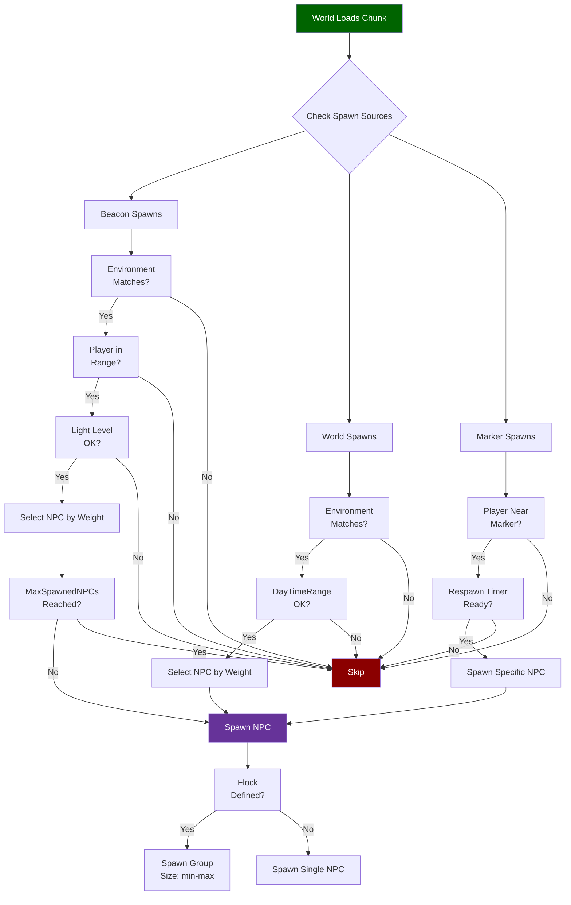
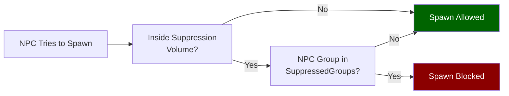

## Visao Geral

Arquivos de regras de spawn vinculam roles de NPC a localizacoes e condicoes do mundo. O sistema possui tres mecanismos de spawn: **Beacon spawns** gerenciam pontos de spawn dinamicos vinculados a tags de ambiente com controles de ciclo de vida; **World spawns** sao tabelas mais simples vinculadas a tags de ambiente e janelas opcionais de horario do dia; **Marker spawns** sao colocados diretamente no mundo e referenciam nomes especificos de NPCs com timers de respawn.

## Localizacao dos Arquivos

- `Assets/Server/NPC/Spawn/Beacons/**/*.json` — Spawners por beacon
- `Assets/Server/NPC/Spawn/World/**/*.json` — Spawners de ambiente do mundo
- `Assets/Server/NPC/Spawn/Markers/**/*.json` — Spawners por marker posicionado
- `Assets/Server/NPC/Spawn/Suppression/**/*.json` — Volumes de supressao de spawn

## Como o Spawn de NPC Funciona



### Zonas de Supressao



## Schema

### Beacon Spawn

| Field | Type | Required | Default | Descricao |
|-------|------|----------|---------|-----------|
| `Environments` | string[] | Sim | — | IDs de tags de ambiente onde este beacon esta ativo. |
| `NPCs` | array | Sim | — | Lista de entradas de NPC (veja a tabela de entrada de NPC abaixo). |
| `MinDistanceFromPlayer` | number | Nao | — | Distancia minima do jogador para spawnar, em blocos. |
| `MaxSpawnedNPCs` | number | Nao | — | Maximo de NPCs vivos que este beacon mantera. |
| `ConcurrentSpawnsRange` | [number, number] | Nao | — | Min/max de NPCs a spawnar em um unico evento de spawn. |
| `SpawnAfterGameTimeRange` | [string, string] | Nao | — | Faixa de duracao ISO 8601 antes do primeiro spawn (ex: `["PT20M", "PT40M"]`). |
| `NPCIdleDespawnTime` | number | Nao | — | Segundos que um NPC ocioso persiste antes de desaparecer. |
| `BeaconVacantDespawnGameTime` | string | Nao | — | Duracao ISO 8601 — quanto tempo um beacon vazio espera antes de desaparecer. |
| `BeaconRadius` | number | Nao | — | Raio da area gerenciada pelo beacon, em blocos. |
| `SpawnRadius` | number | Nao | — | Raio dentro do qual os NPCs sao spawnados, em blocos. |
| `TargetDistanceFromPlayer` | number | Nao | — | Distancia ideal de spawn em relacao ao jogador. |
| `LightRanges` | object | Nao | — | Restricoes de nivel de luz do bloco, ex: `{ "Light": [0, 2] }`. |

### World Spawn

| Field | Type | Required | Default | Descricao |
|-------|------|----------|---------|-----------|
| `Environments` | string[] | Sim | — | IDs de tags de ambiente onde esta tabela de spawn esta ativa. |
| `NPCs` | array | Sim | — | Lista de entradas de NPC (veja a tabela de entrada de NPC abaixo). |
| `DayTimeRange` | [number, number] | Nao | — | Faixa de horas do jogo quando o spawn e permitido, ex: `[6, 18]` para apenas durante o dia. |

### Marker Spawn

| Field | Type | Required | Default | Descricao |
|-------|------|----------|---------|-----------|
| `Model` | string | Sim | — | O ID do modelo do marker (tipicamente `"NPC_Spawn_Marker"`). |
| `NPCs` | array | Sim | — | Lista de entradas de NPC (veja a tabela de entrada de NPC abaixo). |
| `ExclusionRadius` | number | Nao | — | Outros markers dentro deste raio nao spawnarao tambem, em blocos. |
| `RealtimeRespawn` | boolean | Nao | `false` | Se `true`, NPCs respawnam em um timer de tempo real. |
| `MaxDropHeight` | number | Nao | — | Distancia maxima acima do chao onde o NPC pode ser colocado. |
| `DeactivationDistance` | number | Nao | — | Distancia do jogador na qual este marker para de simular, em blocos. |

### Volume de Supressao

| Field | Type | Required | Default | Descricao |
|-------|------|----------|---------|-----------|
| `SuppressionRadius` | number | Sim | — | Raio da zona de supressao, em blocos. |
| `SuppressedGroups` | string[] | Sim | — | IDs de grupos de NPC suprimidos dentro desta zona (ex: `["Aggressive", "Passive"]`). |
| `SuppressSpawnMarkers` | boolean | Nao | `false` | Se `true`, tambem suprime markers de spawn dentro da zona. |

### Entrada de NPC (usada no array `NPCs`)

| Field | Type | Required | Default | Descricao |
|-------|------|----------|---------|-----------|
| `Id` / `Name` | string | Sim | — | ID do role do NPC a spawnar. Beacons usam `Id`; markers usam `Name`. |
| `Weight` | number | Nao | — | Peso relativo de spawn ao selecionar entre multiplos candidatos. |
| `Flock` | string \| object | Nao | — | ID do grupo de bando (string) ou especificacao inline de tamanho de bando `{ "Size": [min, max] }`. |
| `SpawnBlockSet` | string | Nao | — | Tag de conjunto de blocos onde o NPC deve spawnar (ex: `"Volcanic"`, `"Portals_Oasis_Soil"`). |
| `SpawnFluidTag` | string | Nao | — | Tag de fluido necessaria perto do ponto de spawn (ex: `"Water"`). |
| `RealtimeRespawnTime` | number | Nao | — | Segundos antes deste NPC respawnar (spawns por marker). |
| `SpawnAfterGameTime` | string | Nao | — | Duracao ISO 8601 antes desta entrada se tornar elegivel (ex: `"P1D"`). |

## Exemplos

### Beacon spawn (goblins de caverna)

```json
{
  "Environments": ["Env_Zone1_Caves_Goblins"],
  "MinDistanceFromPlayer": 15,
  "MaxSpawnedNPCs": 3,
  "ConcurrentSpawnsRange": [1, 2],
  "SpawnAfterGameTimeRange": ["PT20M", "PT40M"],
  "NPCIdleDespawnTime": 60,
  "BeaconVacantDespawnGameTime": "PT15M",
  "BeaconRadius": 50,
  "SpawnRadius": 40,
  "TargetDistanceFromPlayer": 25,
  "NPCs": [
    { "Weight": 60, "SpawnBlockSet": "Volcanic", "Id": "Goblin_Scrapper" },
    { "Weight": 20, "SpawnBlockSet": "Volcanic", "Id": "Goblin_Lobber" },
    { "Weight": 20, "SpawnBlockSet": "Volcanic", "Id": "Goblin_Miner" }
  ],
  "LightRanges": {
    "Light": [0, 2]
  }
}
```

### World spawn (animais de oasis, apenas de dia)

```json
{
  "Environments": ["Env_Portals_Oasis"],
  "NPCs": [
    {
      "Weight": 15,
      "SpawnBlockSet": "Portals_Oasis_Soil",
      "SpawnFluidTag": "Water",
      "Id": "Flamingo",
      "Flock": "Group_Small"
    },
    {
      "Weight": 10,
      "SpawnBlockSet": "Portals_Oasis_Soil",
      "Id": "Tortoise"
    }
  ],
  "DayTimeRange": [6, 18]
}
```

### Marker spawn (urso, respawn em tempo real)

```json
{
  "Model": "NPC_Spawn_Marker",
  "NPCs": [
    {
      "Name": "Bear_Grizzly",
      "Weight": 100,
      "RealtimeRespawnTime": 420
    }
  ],
  "ExclusionRadius": 20,
  "RealtimeRespawn": true,
  "MaxDropHeight": 4,
  "DeactivationDistance": 150
}
```

### Volume de supressao

```json
{
  "SuppressionRadius": 45,
  "SuppressedGroups": ["Aggressive", "Passive", "Neutral"],
  "SuppressSpawnMarkers": true
}
```

## Paginas Relacionadas

- [NPC Roles](/hytale-modding-docs/reference/npc-system/npc-roles) — Arquivos de role referenciados por `Id` / `Name` nas entradas de spawn
- [NPC Groups](/hytale-modding-docs/reference/npc-system/npc-groups) — IDs de grupo usados em `Flock` e supressao
- [NPC Attitudes](/hytale-modding-docs/reference/npc-system/npc-attitudes) — Como NPCs spawnados se relacionam entre si
