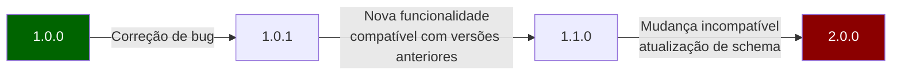
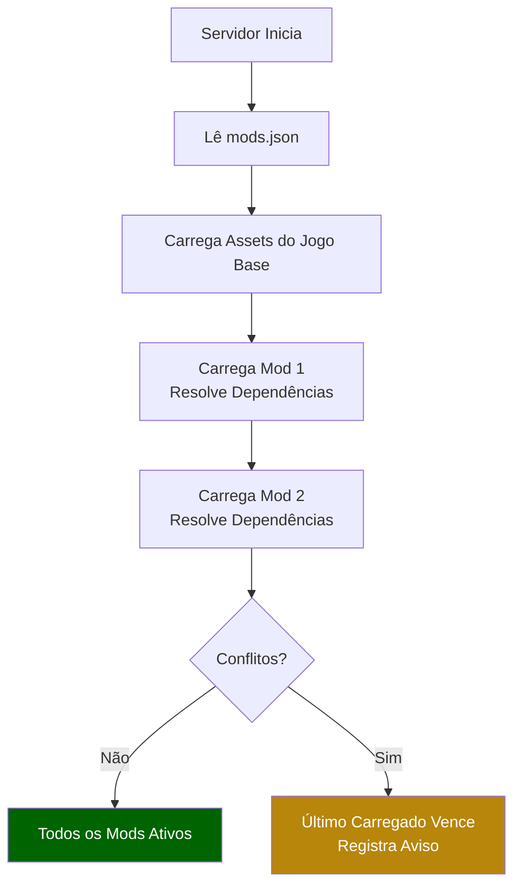

## O Que Você Aprenderá

- Estruturar um pacote de mod completo
- Escrever um `manifest.json` para seu mod
- Organizar assets por namespace
- Versionar seu mod corretamente
- Distribuir e instalar mods em servidores

## Pré-requisitos

- Ter completado pelo menos um tutorial para iniciantes
- Familiaridade com [Estrutura do Projeto](/hytale-modding-docs/getting-started/project-structure/)
- Um mod funcional com pelo menos um asset personalizado

## Passo 1: Estrutura de Pasta do Mod

Um mod distribuível do Hytale segue um layout de pasta específico que espelha a estrutura de assets do jogo:

```
my_awesome_mod/
├── manifest.json
├── Server/
│   ├── NPC/
│   │   ├── Roles/
│   │   │   └── MyCreature.json
│   │   └── Spawn/
│   │       └── MyCreature_Spawn.json
│   ├── Item/
│   │   ├── Items/
│   │   │   └── MyItem.json
│   │   └── Recipes/
│   │       └── MyItem_Recipe.json
│   ├── Drops/
│   │   └── Drop_MyCreature.json
│   └── Models/
│       └── MyCreature.json
└── Common/
    ├── BlockTextures/
    │   └── My_Custom_Block.png
    └── Blocks/
        └── MyBlock/
            ├── MyBlock.blockymodel
            └── MyBlock.blockyanim
```

Regras principais:
- A estrutura de pastas **deve corresponder** ao layout de `Assets/` do jogo
- Configurações do lado do servidor vão em `Server/`
- Modelos, texturas e animações do lado do cliente vão em `Common/`
- Mantenha um namespace limpo para evitar conflitos com outros mods

## Passo 2: Criar o Manifesto

O `manifest.json` identifica seu mod para o servidor:

```json
{
  "Name": "My Awesome Mod",
  "Namespace": "my_awesome_mod",
  "Version": "1.0.0",
  "Description": "Adds new creatures, items, and blocks to Hytale.",
  "Author": "YourName",
  "Dependencies": [],
  "ServerSide": true,
  "ClientSide": true
}
```

### Campos do Manifesto

| Campo | Tipo | Obrigatório | Descrição |
|-------|------|-------------|-----------|
| `Name` | string | Sim | Nome legível do mod. |
| `Namespace` | string | Sim | Identificador único (minúsculas, underscores). Usado para prefixar todos os IDs de assets. |
| `Version` | string | Sim | Versão semântica (`MAJOR.MINOR.PATCH`). |
| `Description` | string | Não | Descrição curta do que o mod faz. |
| `Author` | string | Não | Nome do criador ou equipe. |
| `Dependencies` | string[] | Não | Lista de namespaces de mods necessários (ex: `["base_game"]`). |
| `ServerSide` | boolean | Não | Se o mod inclui assets do lado do servidor. |
| `ClientSide` | boolean | Não | Se o mod inclui assets do lado do cliente. |

## Passo 3: Aplicar Namespace nos Seus Assets

Todas as referências de assets devem usar o namespace do seu mod para evitar conflitos:

```json
{
  "Reference": "Template_Beasts_Passive_Critter",
  "Modify": {
    "Appearance": "my_awesome_mod:MyCreature",
    "Drops": {
      "Reference": "my_awesome_mod:Drop_MyCreature"
    }
  }
}
```

### Convenções de Nomenclatura

| Tipo de Asset | Convenção | Exemplo |
|---------------|-----------|---------|
| Papéis de NPC | `PascalCase` | `MyCreature.json` |
| Itens | `PascalCase` | `MagicSword.json` |
| Blocos | `PascalCase` | `GlowingCrystal.json` |
| Texturas | `PascalCase_Suffix` | `My_Block_Side.png`, `My_Block_Top.png` |
| Receitas | `PascalCase` | `MagicSword_Recipe.json` |
| Tabelas de Drop | `Drop_PascalCase` | `Drop_MyCreature.json` |

## Passo 4: Versionamento

Siga o versionamento semântico:



- **PATCH** (1.0.0 → 1.0.1): Correções de bugs, correções de texto, ajustes de balanceamento
- **MINOR** (1.0.0 → 1.1.0): Novo conteúdo (NPCs, itens, blocos) sem quebrar saves existentes
- **MAJOR** (1.0.0 → 2.0.0): Mudanças incompatíveis no conteúdo existente (IDs renomeados, arquivos reestruturados)

## Passo 5: Checklist de Testes

Antes de distribuir, verifique:

- [ ] Servidor inicia sem erros com seu mod carregado
- [ ] Todos os NPCs surgem corretamente em seus ambientes definidos
- [ ] Todos os itens aparecem nos menus de fabricação e podem ser fabricados
- [ ] Todos os blocos podem ser colocados e quebrados
- [ ] Tabelas de drop produzem o loot esperado
- [ ] Sem conflitos de namespace com assets do jogo base
- [ ] Texturas e modelos renderizam corretamente no jogo
- [ ] `manifest.json` tem versão e metadados corretos

## Passo 6: Distribuição

### Empacotamento

1. Comprima a pasta do mod em zip (incluindo `manifest.json` na raiz)
2. Nomeie o arquivo: `my_awesome_mod_v1.0.0.zip`
3. Inclua um `README.txt` com instruções de instalação

### Instalação

Usuários instalam seu mod:

1. Extraindo o zip no diretório `mods/` do servidor
2. Adicionando o namespace do seu mod ao `mods.json` na configuração do servidor
3. Reiniciando o servidor

```
hytale-server/
├── mods/
│   └── my_awesome_mod/
│       ├── manifest.json
│       ├── Server/
│       └── Common/
└── mods.json
```

### Ordem de Carregamento de Mods



Mods são carregados na ordem listada em `mods.json`. Se dois mods definem o mesmo ID de asset, o último carregado tem prioridade.

## Dicas para Mods Limpos

1. **Mantenha o foco** — um mod deve fazer uma coisa bem
2. **Use herança** — estenda templates do jogo base com `Reference`/`Modify` em vez de duplicar
3. **Documente suas mudanças** — inclua um changelog no seu README
4. **Teste com outros mods** — verifique conflitos de namespace
5. **Mantenha tamanhos de arquivo pequenos** — otimize texturas, evite assets desnecessários

## Páginas Relacionadas

- [Instalação e Configuração](/hytale-modding-docs/getting-started/installation/) — Configuração inicial da pasta do mod
- [Estrutura do Projeto](/hytale-modding-docs/getting-started/project-structure/) — Entendendo a árvore de assets
- [Herança e Templates](/hytale-modding-docs/reference/concepts/inheritance-and-templates/) — Estendendo assets do jogo base
- [Noções Básicas de JSON](/hytale-modding-docs/getting-started/json-basics/) — Padrões comuns de JSON
