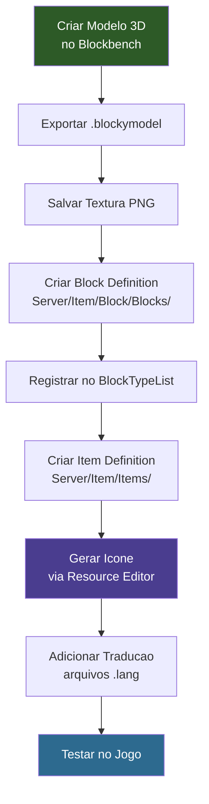

## O Que Você Vai Construir

Um bloco de cristal brilhante chamado **Ore_Crystal_Glow** — um bloco com modelo personalizado, textura própria, emissão de luz, conjunto de sons e ícone de inventário.


## Pré-requisitos

- Uma pasta de mod com um `manifest.json` válido (veja [Instalação e Configuração](/hytale-modding-docs/getting-started/installation/))
- [Blockbench](https://www.blockbench.net/) para criar o modelo 3D
- Uma build do Hytale compatível com o seu `TargetServerVersion`
- Familiaridade básica com JSON (veja [Fundamentos de JSON](/hytale-modding-docs/getting-started/json-basics/))

## Repositório Git

O mod completo e funcional está disponível como um repositório no GitHub que você pode clonar e usar diretamente:

```text
https://github.com/nevesb/hytale-mods-custom-block
```

Clone-o e copie o conteúdo para o diretório de mods do Hytale para testar imediatamente. O repositório contém todos os arquivos descritos neste tutorial na estrutura de pastas correta:

```
hytale-mods-custom-block/
├── manifest.json
├── Common/
│   ├── Blocks/HytaleModdingManual/
│   │   └── Crystal_Glow.blockymodel
│   ├── BlockTextures/HytaleModdingManual/
│   │   └── Crystal_Glow.png
│   └── Icons/ItemsGenerated/
│       └── Ore_Crystal_Glow.png
├── Server/
│   ├── BlockTypeList/
│   │   └── HytaleModdingManual_Blocks.json
│   ├── Item/
│   │   ├── Block/Blocks/HytaleModdingManual/
│   │   │   └── Ore_Crystal_Glow.json
│   │   └── Items/HytaleModdingManual/
│   │       └── Ore_Crystal_Glow.json
│   └── Languages/
│       └── en-US/server.lang
└── ...
```

Para um mod de tutorial apenas com assets, o seu manifest deve ficar assim:

```json
{
  "Group": "HytaleModdingManual",
  "Name": "CreateACustomBlock",
  "Version": "1.0.0",
  "Description": "Implements the Create A Block tutorial with a custom crystal block",
  "Authors": [
    {
      "Name": "HytaleModdingManual"
    }
  ],
  "Dependencies": {},
  "OptionalDependencies": {},
  "IncludesAssetPack": true,
  "TargetServerVersion": "2026.02.19-1a311a592"
}
```

---

## Passo 1: Construir o Bloco no Blockbench

Abra o [Blockbench](https://www.blockbench.net/) e crie o modelo do seu bloco. No exemplo do cristal, o modelo é um conjunto de prismas retangulares organizados para parecer formações cristalinas naturais sobre uma base plana.


Exporte o modelo como um arquivo `.blockymodel` e salve-o em:

```text
Common/Blocks/HytaleModdingManual/Crystal_Glow.blockymodel
```

O formato `.blockymodel` é o formato de modelo de runtime do Hytale. O Blockbench pode exportar diretamente nesse formato usando o plugin do Hytale.

---

## Passo 2: Criar a Textura

Pinte ou exporte sua textura no Blockbench e salve o arquivo PNG em:

```text
Common/BlockTextures/HytaleModdingManual/Crystal_Glow.png
```

Este é o atlas de textura referenciado pelo `.blockymodel`. O mapeamento UV no Blockbench determina como essa textura envolve as faces do modelo.

---

## Passo 3: Criar a Definição do Bloco

A definição do bloco controla como o bloco se comporta no mundo — sua física, renderização, luz, som e comportamento de coleta.

Crie o arquivo em:

```text
Server/Item/Block/Blocks/HytaleModdingManual/Ore_Crystal_Glow.json
```

```json
{
  "Material": "Solid",
  "DrawType": "Model",
  "Opacity": "Transparent",
  "VariantRotation": "NESW",
  "CustomModel": "Blocks/HytaleModdingManual/Crystal_Glow.blockymodel",
  "CustomModelTexture": [
    {
      "Texture": "BlockTextures/HytaleModdingManual/Crystal_Glow.png",
      "Weight": 1
    }
  ],
  "HitboxType": "Full",
  "Gathering": {
    "Breaking": {
      "GatherType": "Rocks",
      "ItemId": "Ore_Crystal_Glow"
    }
  },
  "Light": {
    "Color": "#88ccff",
    "Level": 14
  },
  "BlockSoundSetId": "Crystal",
  "ParticleColor": "#88ccff",
  "Support": {
    "Down": [
      {
        "FaceType": "Full"
      }
    ]
  }
}
```

### Campos da Definição do Bloco

| Campo | Tipo | Obrigatório | Padrão | Descrição |
|-------|------|-------------|--------|-----------|
| `Material` | string | Sim | — | Material físico do bloco. Controla colisão e interação com ferramentas. Valores: `Solid`, `Liquid`, `Gas`, `NonSolid`. |
| `DrawType` | string | Sim | `Block` | Como o bloco é renderizado. `Block` = cubo padrão, `Model` = malha `.blockymodel` personalizada, `Cross` = sprite de planta em formato X. |
| `Opacity` | string | Não | `Opaque` | Comportamento da luz. `Opaque` bloqueia a luz totalmente, `Transparent` permite a passagem de luz, `SemiTransparent` para opacidade parcial. |
| `VariantRotation` | string | Não | — | Variantes de rotação ao posicionar. `NESW` = 4 direções cardeais, `None` = orientação fixa. |
| `CustomModel` | string | Não | — | Caminho para o arquivo `.blockymodel` (relativo a `Common/`). Obrigatório quando `DrawType` é `Model`. |
| `CustomModelTexture` | array | Não | — | Lista de objetos de textura para o modelo personalizado. Cada entrada possui `Texture` (caminho) e `Weight` (para seleção aleatória). |
| `CustomModelTexture[].Texture` | string | Sim | — | Caminho para o arquivo de textura PNG (relativo a `Common/`). |
| `CustomModelTexture[].Weight` | number | Não | 1 | Peso para seleção aleatória de textura. Se múltiplas texturas forem listadas, o Hytale escolhe uma com base no peso. |
| `HitboxType` | string | Não | `Full` | Formato da hitbox de colisão. `Full` = espaço inteiro do bloco, `None` = sem colisão (atravessável), `Custom` = definido por modelo. |
| `Gathering` | object | Não | — | Define o que acontece quando o bloco é quebrado. Contém um sub-objeto `Breaking`. |
| `Gathering.Breaking.GatherType` | string | Não | — | Categoria de ferramenta necessária para quebrar eficientemente. Valores: `Rocks`, `Wood`, `Dirt`, `Plant`, etc. |
| `Gathering.Breaking.ItemId` | string | Não | — | ID do item dropado quando o bloco é quebrado. Use o próprio ID do bloco para que ele drope a si mesmo. |
| `Light` | object | Não | — | Configuração de emissão de luz. |
| `Light.Color` | string | Não | `#ffffff` | Cor hexadecimal da luz emitida. |
| `Light.Level` | number | Não | 0 | Intensidade da luz de 0 (sem luz) a 15 (máximo, como a luz do sol). |
| `BlockSoundSetId` | string | Não | — | Conjunto de sons usado ao posicionar, quebrar e caminhar sobre o bloco. Valores: `Stone`, `Wood`, `Crystal`, `Metal`, `Dirt`, etc. |
| `ParticleColor` | string | Não | — | Cor hexadecimal das partículas emitidas quando o bloco é quebrado. |
| `BlockParticleSetId` | string | Não | — | Conjunto de partículas usado quando o bloco é quebrado ou quando há interação. Valores: `Stone`, `Wood`, `Dirt`, etc. |
| `Support` | object | Não | — | Define quais blocos adjacentes devem existir para que este bloco permaneça posicionado. Se o suporte for removido, o bloco se quebra e cai como item. `Down` requer um bloco abaixo com `FaceType: "Full"`. |
| `Flags` | object | Não | `{}` | Flags de bitfield para comportamentos especiais do bloco (ex.: `Flammable`, `Replaceable`). |

---

## Passo 4: Registrar o Bloco em uma BlockTypeList

Crie o arquivo de lista em:

```text
Server/BlockTypeList/HytaleModdingManual_Blocks.json
```

```json
{
  "Blocks": [
    "Ore_Crystal_Glow"
  ]
}
```

O Hytale combina automaticamente as listas de blocos de todos os mods carregados. Você não precisa modificar nenhum arquivo vanilla — basta criar sua própria lista e o jogo a descobre automaticamente.

---

## Passo 5: Criar a Definição do Item

A definição do item faz o bloco aparecer no inventário e controla como o jogador interage com ele. Isso é separado da definição do bloco — o item é o que o jogador segura, e o bloco é o que existe no mundo.

Crie o arquivo em:

```text
Server/Item/Items/HytaleModdingManual/Ore_Crystal_Glow.json
```

```json
{
  "TranslationProperties": {
    "Name": "server.items.Ore_Crystal_Glow.name",
    "Description": "server.items.Ore_Crystal_Glow.description"
  },
  "Interactions": {
    "Primary": "Block_Primary",
    "Secondary": "Block_Secondary"
  },
  "Quality": "Uncommon",
  "Icon": "Icons/ItemsGenerated/Ore_Crystal_Glow.png",
  "PlayerAnimationsId": "Block",
  "BlockType": {
    "Material": "Solid",
    "DrawType": "Model",
    "Opacity": "Transparent",
    "VariantRotation": "NESW",
    "CustomModel": "Blocks/HytaleModdingManual/Crystal_Glow.blockymodel",
    "CustomModelTexture": [
      {
        "Texture": "BlockTextures/HytaleModdingManual/Crystal_Glow.png",
        "Weight": 1
      }
    ],
    "HitboxType": "Full",
    "Flags": {},
    "Gathering": {
      "Breaking": {
        "GatherType": "Rocks",
        "ItemId": "Ore_Crystal_Glow"
      }
    },
    "Light": {
      "Color": "#88ccff",
      "Level": 14
    },
    "BlockParticleSetId": "Stone",
    "BlockSoundSetId": "Crystal",
    "ParticleColor": "#88ccff",
    "Support": {
      "Down": [
        {
          "FaceType": "Full"
        }
      ]
    }
  },
  "MaxStack": 64,
  "IconProperties": {
    "Scale": 0.58823,
    "Rotation": [22.5, 45, 22.5],
    "Translation": [0, -13.5]
  }
}
```

### Campos da Definição do Item

| Campo | Tipo | Obrigatório | Padrão | Descrição |
|-------|------|-------------|--------|-----------|
| `TranslationProperties` | object | Não | — | Contém chaves de tradução para o nome e a descrição do item. |
| `TranslationProperties.Name` | string | Não | — | Chave de tradução para o nome de exibição do item (ex.: `server.items.Ore_Crystal_Glow.name`). |
| `TranslationProperties.Description` | string | Não | — | Chave de tradução para a descrição do tooltip do item. |
| `Interactions` | object | Não | — | Define o que acontece ao clicar com o botão esquerdo (`Primary`) e com o botão direito (`Secondary`). |
| `Interactions.Primary` | string | Não | — | Interação primária quando o jogador clica com o botão esquerdo. `Block_Primary` = comportamento de quebrar bloco. |
| `Interactions.Secondary` | string | Não | — | Interação secundária quando o jogador clica com o botão direito. `Block_Secondary` = comportamento de posicionar bloco. |
| `Quality` | string | Não | `Common` | Nível de raridade do item. Afeta a cor do nome do item na interface. Valores: `Common`, `Uncommon`, `Rare`, `Epic`, `Legendary`. |
| `Icon` | string | Não | — | Caminho para o ícone PNG do inventário (relativo a `Common/`). |
| `PlayerAnimationsId` | string | Não | — | Conjunto de animações usado quando o jogador segura este item. `Block` = animações de posicionamento de bloco, `Sword` = golpe corpo a corpo, etc. |
| `BlockType` | object | Não | — | Definição de bloco incorporada. Quando o jogador posiciona o item, este bloco é criado no mundo. Contém os mesmos campos da Definição de Bloco standalone. |
| `MaxStack` | number | Não | 1 | Tamanho máximo de empilhamento no inventário (1–64). |
| `IconProperties` | object | Não | — | Controla como o modelo 3D é renderizado como ícone de inventário. |
| `IconProperties.Scale` | number | Não | 1.0 | Fator de escala para a renderização do ícone. Ajuste para encaixar o modelo dentro da moldura do ícone. |
| `IconProperties.Rotation` | array | Não | `[0,0,0]` | Rotação Euler `[X, Y, Z]` em graus para a renderização do ícone. `[22.5, 45, 22.5]` fornece uma visão isométrica padrão. |
| `IconProperties.Translation` | array | Não | `[0,0]` | Deslocamento em pixels `[X, Y]` para centralizar o modelo na moldura do ícone. |
| `Parent` | string | Não | — | Herda campos de outra definição de item. Útil para criar variantes sem duplicar o JSON inteiro. |
| `Tags` | array | Não | `[]` | Lista de strings de tags para categorização e filtragem (ex.: `["Decorative", "Light_Source"]`). |
| `Categories` | array | Não | `[]` | Categorias do item para agrupamento no menu de criação. |
| `ItemLevel` | number | Não | 0 | Nível numérico de tier usado para controle de progressão. |
| `MaxStack` | number | Não | 1 | Número máximo de itens por slot de inventário. |
| `SoundEventId` | string | Não | — | Som reproduzido em eventos específicos do item (equipar, usar). |
| `ItemSoundSetId` | string | Não | — | Conjunto de sons para interações gerais com o item. |

---

## Passo 6: Gerar o Ícone com o Editor de Recursos

O Hytale inclui um **Editor de Recursos** integrado, acessível a partir do Modo Criativo. Você pode usá-lo para gerar automaticamente o ícone de inventário do seu bloco em vez de criar um manualmente.


Para gerar o ícone:

1. Abra o Hytale no **Modo Criativo**
2. Abra o **Editor de Recursos** (canto superior direito: botão "Editor")
3. Navegue até **Item** no painel esquerdo e encontre o grupo do seu mod (ex.: `HytaleModdingManual`)
4. Selecione o item do seu bloco (`Ore_Crystal_Glow`)
5. No painel de propriedades à direita, encontre o campo **Icon**
6. Clique no ícone de lápis ao lado do campo Icon — o editor renderizará o modelo 3D e salvará um ícone PNG automaticamente
7. O ícone gerado é salvo em `Icons/ItemsGenerated/Ore_Crystal_Glow.png`

O Editor de Recursos também permite ajustar `IconProperties` (Scale, Rotation, Translation) visualmente para obter a visão isométrica perfeita para o seu ícone.

As `IconProperties` no JSON do item controlam como o modelo 3D é posicionado para a renderização do ícone:
- **Scale**: `0.58823` reduz o cristal para caber dentro da moldura do ícone
- **Rotation**: `[22.5, 45, 22.5]` fornece o ângulo isométrico padrão
- **Translation**: `[0, -13.5]` desloca o modelo para baixo para centralizá-lo

---

## Passo 7: Adicionar Traduções

O Hytale usa arquivos `.lang` para traduzir nomes e descrições de itens. Crie um arquivo de idioma para cada locale que você deseja suportar:

```text
Server/Languages/en-US/server.lang
Server/Languages/pt-BR/server.lang
Server/Languages/es/server.lang
```

### Como a Tradução Funciona

O JSON do item referencia chaves de tradução através de `TranslationProperties`:

```json
{
  "TranslationProperties": {
    "Name": "server.items.Ore_Crystal_Glow.name",
    "Description": "server.items.Ore_Crystal_Glow.description"
  }
}
```

O jogo procura essas chaves no arquivo `.lang` correspondente ao idioma do jogador. O formato da chave é:

```text
items.<ItemId>.<property> = <texto traduzido>
```

### Inglês (`Server/Languages/en-US/server.lang`)

```text
items.Ore_Crystal_Glow.name = Glowing Crystal Block
items.Ore_Crystal_Glow.description = A crystal block that radiates soft blue light.
```

### Português (`Server/Languages/pt-BR/server.lang`)

```text
items.Ore_Crystal_Glow.name = Bloco de Cristal Brilhante
items.Ore_Crystal_Glow.description = Um bloco de cristal que irradia uma suave luz azul.
```

### Espanhol (`Server/Languages/es/server.lang`)

```text
items.Ore_Crystal_Glow.name = Bloque de Cristal Brillante
items.Ore_Crystal_Glow.description = Un bloque de cristal que irradia una suave luz azul.
```

Se uma chave de tradução estiver ausente para um locale, o Hytale volta para `en-US`. Se a chave estiver totalmente ausente, a string bruta da chave (ex.: `server.items.Ore_Crystal_Glow.name`) é exibida em vez do nome traduzido.

Para mais detalhes sobre o sistema de localização, veja [Chaves de Localização](/hytale-modding-docs/reference/concepts/localization-keys/).

---

## Passo 8: Empacotar e Testar

A estrutura final da pasta do seu mod deve ficar assim:

```text
CreateACustomBlock/
├── manifest.json
├── Common/
│   ├── Blocks/HytaleModdingManual/
│   │   └── Crystal_Glow.blockymodel
│   ├── BlockTextures/HytaleModdingManual/
│   │   └── Crystal_Glow.png
│   └── Icons/ItemsGenerated/
│       └── Ore_Crystal_Glow.png
├── Server/
│   ├── BlockTypeList/
│   │   └── HytaleModdingManual_Blocks.json
│   ├── Item/
│   │   ├── Block/Blocks/HytaleModdingManual/
│   │   │   └── Ore_Crystal_Glow.json
│   │   └── Items/HytaleModdingManual/
│   │       └── Ore_Crystal_Glow.json
│   └── Languages/
│       ├── en-US/server.lang
│       ├── pt-BR/server.lang
│       └── es/server.lang
```

Para testar:

1. Copie a pasta do mod para o diretório de mods do Hytale
2. Inicie o jogo ou recarregue o ambiente de mods
3. Conceda permissões de operador e gere o bloco usando comandos de chat:
   ```text
   /op self
   /spawnitem Ore_Crystal_Glow
   ```
4. Coloque o bloco no mundo
5. Confirme:
   - O modelo personalizado do cristal aparece (não um cubo padrão)
   - O bloco emite luz azul (`Level: 14`)
   - Sons de cristal são reproduzidos ao posicionar e quebrar
   - O bloco dropa a si mesmo quando quebrado
   - O nome traduzido aparece no tooltip do inventário

---

## Fluxo de Criação do Bloco



---

## Páginas Relacionadas

- [Criar um Item Personalizado](/hytale-modding-docs/tutorials/beginner/create-an-item/) — Itens sem posicionamento de bloco
- [Criar um NPC Personalizado](/hytale-modding-docs/tutorials/beginner/create-an-npc/) — Gerar criaturas no mundo
- [Referência de Definições de Bloco](/hytale-modding-docs/reference/item-system/block-definitions/) — Schema completo de blocos
- [Referência de Definições de Item](/hytale-modding-docs/reference/item-system/item-definitions/) — Schema completo de itens
- [Texturas de Bloco](/hytale-modding-docs/reference/models-and-visuals/block-textures/) — Convenções de textura
- [Chaves de Localização](/hytale-modding-docs/reference/concepts/localization-keys/) — Sistema de tradução
- [Empacotamento de Mod](/hytale-modding-docs/tutorials/advanced/mod-packaging/) — Guia de distribuição
