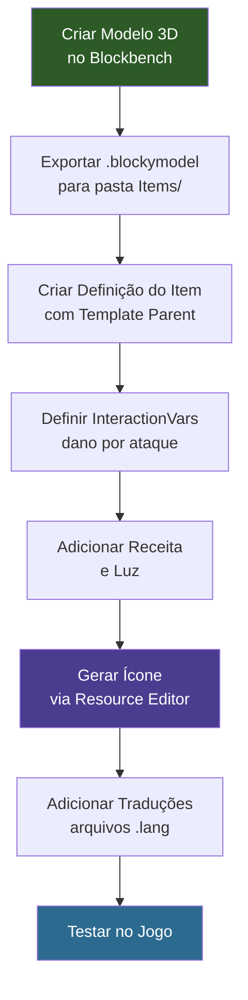

## O Que Você Vai Construir

Uma **Espada de Cristal** — uma arma corpo a corpo personalizada forjada a partir de blocos de cristal brilhante. Ela herda o sistema de combate de espada do Hytale (combos de golpe, guarda, ataque especial), tem seu próprio modelo 3D em voxel, textura de cristal pintada à mão, emissão de luz, receita de criação e traduções multilíngues.


## Pré-requisitos

- Uma pasta de mod com um `manifest.json` válido (veja [Instalação e Configuração](/hytale-modding-docs/getting-started/installation/))
- [Blockbench](https://www.blockbench.net/) com o plugin do Hytale para criar o modelo 3D
- O tutorial [Criar um Bloco](/hytale-modding-docs/tutorials/beginner/create-a-block/) concluído (a Espada de Cristal usa `Block_Crystal_Glow` como ingrediente de criação)
- Familiaridade básica com JSON (veja [Conceitos Básicos de JSON](/hytale-modding-docs/getting-started/json-basics/))

## Repositório Git

O mod completo e funcional está disponível como repositório no GitHub:

```text
https://github.com/nevesb/hytale-mods-custom-weapon
```

Clone-o e copie o conteúdo para o diretório de mods do Hytale. O repositório contém todos os arquivos descritos neste tutorial:

```
hytale-mods-custom-weapon/
├── manifest.json
├── Crystal_Sword.bbmodel              (arquivo fonte do Blockbench)
├── Common/
│   ├── Items/Weapons/Crystal/
│   │   ├── Crystal_Sword.blockymodel  (modelo de runtime exportado)
│   │   └── Crystal_Sword.png          (textura)
│   └── Icons/ItemsGenerated/
│       └── Crystal_Sword.png
├── Server/
│   ├── Item/Items/HytaleModdingManual/
│   │   └── Crystal_Sword.json
│   └── Languages/
│       ├── en-US/server.lang
│       ├── pt-BR/server.lang
│       └── es/server.lang
```

Seu manifesto:

```json
{
  "Group": "HytaleModdingManual",
  "Name": "CreateACustomWeapon",
  "Version": "1.0.0",
  "Description": "Implements the Create A Weapon tutorial with a custom crystal sword",
  "Authors": [
    {
      "Name": "HytaleModdingManual"
    }
  ],
  "Dependencies": {},
  "OptionalDependencies": {},
  "IncludesAssetPack": true,
  "TargetServerVersion": "2026.02.19-1a311a592"
}
```

---

## Passo 1: Modelar a Espada no Blockbench

Abra o Blockbench e crie um novo projeto no formato **Hytale Character**. A espada é construída em cinco seções, de baixo para cima:

| Seção | Descrição | Dimensões |
|-------|-----------|-----------|
| **Pommel** | Pequeno cristal na base | 3x6x3 |
| **Handle** | Cabo com couro escuro envolto em anéis de metal | 6x18x6 (cabo) + 7.5x1.5x7.5 (envoltórios) |
| **Guard** | Base de cristal com centro de diamante e lâminas laterais | 27x6x4.5 (base) + 6x6x9 (diamante) + 4.5x9x1.5 (lados) |
| **Blade** | Prisma de cristal principal com núcleo interno | 9x36x3 (principal) + 3x57x6 (núcleo) |
| **Tip** | Ponta facetada afilada | 6x4.5x3 + 3x4.5x1.5 |


**Dicas de modelagem:**
- Defina o ponto de pivô na área de pegada do cabo (por volta de Y=15) — o Hytale usa isso para posicionamento da mão e origem da luz
- Use cubos separados para cada prisma de cristal para criar o aspecto facetado
- Rotacione os cristais da guarda levemente para fora (15-25 graus) para uma aparência natural de grupo
- A altura total deve ser ~72 voxels para corresponder à escala oficial de armas do Hytale
- Use UV por face (não box UV) para cubos grandes — box UV é limitado ao espaço UV de 32x32
- Defina os cubos da lâmina e da ponta do cristal como **fullbright** para o efeito de brilho

**Texturização:**
- Use um estilo pintado à mão com blocos de cor direcionais, sem gradientes suaves
- Partes de cristal: listras verticais de `#d9ffff` (topo) para `#00bbee` (meio) para `#003050` (base), núcleo mais claro que as bordas
- O cabo usa tons quentes de couro: `#2a2520` com realces de costura `#3a3228`
- Os envoltórios usam cinza metálico: `#484440` com brilho `#5a5550`
- A resolução da textura deve corresponder ao tamanho UV: **128x128** (densidade de pixel 64 / blockSize 64 = proporção 1:1)

Exporte como **Hytale Blocky Model** e salve em:

```text
Common/Items/Weapons/Crystal/Crystal_Sword.blockymodel
```

Copie a textura PNG ao lado do blockymodel:

```text
Common/Items/Weapons/Crystal/Crystal_Sword.png
```

:::caution[Caminhos de Assets Comuns]
Todos os caminhos de `Common/` referenciados no JSON do item devem começar com um diretório raiz permitido: `Blocks/`, `Items/`, `Resources/`, `NPC/`, `VFX/` ou `Consumable/`. Colocar modelos ou texturas fora dessas raízes (ex.: `Models/`) causará um erro de validação.
:::

---

## Passo 2: Criar a Definição do Item

Armas do Hytale usam o sistema de template `Parent` para herdar animações de combate, interações e efeitos sonoros. Ao definir `"Parent": "Template_Weapon_Sword"`, nossa Espada de Cristal automaticamente obtém o conjunto completo de movimentos de espada: combos de golpe, guarda e a habilidade especial Vortexstrike.

Crie o arquivo em:

```text
Server/Item/Items/HytaleModdingManual/Crystal_Sword.json
```

```json
{
  "Parent": "Template_Weapon_Sword",
  "TranslationProperties": {
    "Name": "server.items.Crystal_Sword.name",
    "Description": "server.items.Crystal_Sword.description"
  },
  "Model": "Items/Weapons/Crystal/Crystal_Sword.blockymodel",
  "Texture": "Items/Weapons/Crystal/Crystal_Sword.png",
  "Icon": "Icons/ItemsGenerated/Crystal_Sword.png",
  "Quality": "Rare",
  "ItemLevel": 30,
  "Tags": {
    "Type": [
      "Weapon"
    ],
    "Family": [
      "Sword"
    ]
  },
  "IconProperties": {
    "Scale": 0.5,
    "Rotation": [0, 180, 45],
    "Translation": [-23, -23]
  },
  "InteractionVars": {
    "Swing_Left_Damage": {
      "Interactions": [
        {
          "Parent": "Weapon_Sword_Primary_Swing_Left_Damage",
          "DamageCalculator": {
            "BaseDamage": {
              "Physical": 14
            }
          }
        }
      ]
    },
    "Swing_Right_Damage": {
      "Interactions": [
        {
          "Parent": "Weapon_Sword_Primary_Swing_Right_Damage",
          "DamageCalculator": {
            "BaseDamage": {
              "Physical": 14
            }
          }
        }
      ]
    },
    "Swing_Down_Damage": {
      "Interactions": [
        {
          "Parent": "Weapon_Sword_Primary_Swing_Down_Damage",
          "DamageCalculator": {
            "BaseDamage": {
              "Physical": 24
            }
          }
        }
      ]
    },
    "Thrust_Damage": {
      "Interactions": [
        {
          "Parent": "Weapon_Sword_Primary_Thrust_Damage",
          "DamageCalculator": {
            "BaseDamage": {
              "Physical": 36
            }
          }
        }
      ]
    },
    "Vortexstrike_Spin_Damage": {
      "Interactions": [
        {
          "Parent": "Weapon_Sword_Signature_Vortexstrike_Spin_Damage",
          "DamageCalculator": {
            "BaseDamage": {
              "Physical": 26
            }
          }
        }
      ]
    },
    "Vortexstrike_Stab_Damage": {
      "Interactions": [
        {
          "Parent": "Weapon_Sword_Signature_Vortexstrike_Stab_Damage",
          "DamageCalculator": {
            "BaseDamage": {
              "Physical": 72
            }
          }
        }
      ]
    },
    "Guard_Wield": {
      "Interactions": [
        {
          "Parent": "Weapon_Sword_Secondary_Guard_Wield",
          "StaminaCost": {
            "Value": 8,
            "CostType": "Damage"
          }
        }
      ]
    }
  },
  "Recipe": {
    "TimeSeconds": 5.0,
    "KnowledgeRequired": false,
    "Input": [
      {
        "ItemId": "Block_Crystal_Glow",
        "Quantity": 4
      },
      {
        "ItemId": "Ingredient_Bar_Iron",
        "Quantity": 2
      }
    ],
    "BenchRequirement": [
      {
        "Type": "Crafting",
        "Categories": [
          "Weapon_Sword"
        ],
        "Id": "Weapon_Bench"
      }
    ]
  },
  "Light": {
    "Radius": 2,
    "Color": "#468"
  },
  "MaxDurability": 450,
  "DurabilityLossOnHit": 0.18
}
```

### Campos Principais do Item

| Campo | Tipo | Descrição |
|-------|------|-----------|
| `Parent` | string | Herda de um template. `Template_Weapon_Sword` fornece o combate completo de espada: combos de golpe, guarda e a especial Vortexstrike. |
| `TranslationProperties` | object | Chaves de tradução de `Name` e `Description` para a interface. |
| `Model` | string | Caminho para o `.blockymodel` (relativo a `Common/`). Deve começar com uma raiz permitida: `Items/`, `Blocks/`, etc. |
| `Texture` | string | Caminho para a textura PNG (relativo a `Common/`). Deve começar com uma raiz permitida. |
| `Icon` | string | Caminho para o ícone do inventário PNG (relativo a `Common/`). |
| `Quality` | string | Nível de raridade. Controla a cor do nome: `Common`, `Uncommon`, `Rare`, `Epic`, `Legendary`. |
| `ItemLevel` | number | Nível de progressão para ponderação de tabela de loot. |
| `Tags` | object | Grupos de tags categorizados. `Type` para categoria do item, `Family` para família de arma. |
| `IconProperties` | object | Controla a renderização do ícone 3D: `Scale`, `Rotation` [X,Y,Z], `Translation` [X,Y]. |
| `InteractionVars` | object | Substitui valores de dano para cada ataque na cadeia de combo herdada. |
| `Recipe` | object | Receita de criação com itens de `Input`, `BenchRequirement` e `TimeSeconds`. |
| `Light` | object | Luz emitida. `Radius` (inteiro) e `Color` (abreviação hexadecimal). |
| `MaxDurability` | number | Total de acertos antes de a arma quebrar. |
| `DurabilityLossOnHit` | number | Fração de durabilidade perdida por acerto. |

### Dano via InteractionVars

Ao contrário de um campo `Damage` simples, as armas do Hytale definem dano **por ataque** na cadeia de combo usando `InteractionVars`. Cada nome de variável (ex.: `Swing_Left_Damage`) mapeia para um frame de animação específico, e você substitui `DamageCalculator.BaseDamage` para definir quanto dano aquele golpe causa:

| Ataque | Animação | Dano da Espada de Cristal |
|--------|----------|---------------------------|
| `Swing_Left_Damage` | Golpe horizontal para a esquerda | 14 Físico |
| `Swing_Right_Damage` | Golpe horizontal para a direita | 14 Físico |
| `Swing_Down_Damage` | Golpe descendente por cima | 24 Físico |
| `Thrust_Damage` | Estocada frontal (finalizador do combo) | 36 Físico |
| `Vortexstrike_Spin_Damage` | Ataque giratório especial | 26 Físico |
| `Vortexstrike_Stab_Damage` | Estocada finalizadora especial | 72 Físico |

### Emissão de Luz

Itens podem emitir luz usando o campo `Light` com `Radius` (inteiro, em blocos) e `Color` (abreviação hexadecimal). A Espada de Cristal usa `"Color": "#468"` — um brilho ciano tênue com metade da intensidade do Bloco de Cristal Brilhante (`#88ccff`).

:::caution[Radius Deve Ser um Inteiro]
O campo `Radius` aceita apenas números inteiros. Usar um decimal como `1.5` causará um `NumberFormatException` e o mod falhará ao carregar.
:::

---

## Passo 3: Gerar o Ícone

Use o **Resource Editor** no Modo Criativo para gerar o ícone do inventário, assim como no tutorial de blocos:

1. Abra o Hytale no Modo Criativo
2. Abra o Resource Editor (botão "Editor" no canto superior direito)
3. Navegue até **Item** > `HytaleModdingManual` > `Crystal_Sword`
4. Clique no ícone de lápis ao lado do campo **Icon**
5. Ajuste `IconProperties` para a melhor visão isométrica
6. O ícone gerado é salvo em `Icons/ItemsGenerated/Crystal_Sword.png`

---

## Passo 4: Adicionar Traduções

Crie arquivos de idioma para cada localidade:

### Inglês (`Server/Languages/en-US/server.lang`)

```text
items.Crystal_Sword.name = Crystal Sword
items.Crystal_Sword.description = A blade forged from enchanted crystal. Radiates a soft blue glow.
```

### Português (`Server/Languages/pt-BR/server.lang`)

```text
items.Crystal_Sword.name = Espada de Cristal
items.Crystal_Sword.description = Uma lâmina forjada de cristal encantado. Irradia um brilho azul suave.
```

### Espanhol (`Server/Languages/es/server.lang`)

```text
items.Crystal_Sword.name = Espada de Cristal
items.Crystal_Sword.description = Una espada forjada de cristal encantado. Irradia un brillo azul suave.
```

O formato da chave é `items.<ItemId>.<propriedade>`. Se uma chave estiver ausente para uma localidade, o Hytale usa `en-US` como fallback.

---

## Passo 5: Empacotar e Testar

Sua pasta de mod final:

```text
CreateACustomWeapon/
├── manifest.json
├── Common/
│   ├── Items/Weapons/Crystal/
│   │   ├── Crystal_Sword.blockymodel
│   │   └── Crystal_Sword.png
│   └── Icons/ItemsGenerated/
│       └── Crystal_Sword.png
├── Server/
│   ├── Item/Items/HytaleModdingManual/
│   │   └── Crystal_Sword.json
│   └── Languages/
│       ├── en-US/server.lang
│       ├── pt-BR/server.lang
│       └── es/server.lang
```

Para testar:

1. Copie a pasta do mod para o diretório de mods do Hytale (`%APPDATA%/Hytale/UserData/Mods/`)
2. Inicie o jogo ou recarregue o ambiente de mods
3. Invoque `Crystal_Sword` a partir do inventário
4. Confirme:
   - O modelo da espada de cristal renderiza corretamente quando empunhado
   - A lâmina e a ponta do cristal brilham com sombreamento fullbright
   - A espada emite uma luz azul suave ao redor do jogador
   - As animações de golpe da espada são reproduzidas no clique esquerdo (combo de 4 acertos)
   - A guarda é ativada no clique direito
   - A habilidade especial Vortexstrike funciona quando a energia está cheia
   - O nome e a descrição traduzidos aparecem na dica de ferramenta
   - A receita de criação funciona em uma Bancada de Armas (4x Bloco de Cristal Brilhante + 2x Barra de Ferro)
   - A durabilidade diminui a cada acerto (máximo 450)

---

## Fluxo de Criação de Arma



---

## Problemas Comuns

| Problema | Causa | Solução |
|----------|-------|---------|
| `Unexpected character: 5b, '['` | `Tags` definido como array `[]` em vez de objeto `{}` | Use `{"Type": ["Weapon"], "Family": ["Sword"]}` |
| `Common Asset must be within the root` | Caminho de Model/Texture não começa com `Items/`, `Blocks/`, etc. | Mova os arquivos para uma raiz permitida como `Items/Weapons/` |
| `Common Asset doesn't exist` | Arquivo de ícone ausente de `Common/Icons/` | Gere o ícone via Resource Editor ou coloque um PNG manualmente |
| `NumberFormatException` em Light | `Radius` é um decimal como `1.5` | Use um inteiro: `1`, `2`, `3`, etc. |
| Textura aparece quebrada no jogo | Resolução da textura não corresponde ao tamanho UV | Para o formato Hytale Character: a textura deve ser tamanho UV x (pixelDensity / blockSize). Com os padrões: textura = tamanho UV |

---

## Páginas Relacionadas

- [Criar um Bloco Personalizado](/hytale-modding-docs/tutorials/beginner/create-a-block/) — Construa o bloco de cristal usado como ingrediente
- [Criar um NPC Personalizado](/hytale-modding-docs/tutorials/beginner/create-an-npc/) — Crie criaturas que dropam sua arma
- [Referência de Definições de Item](/hytale-modding-docs/reference/item-system/item-definitions/) — Schema completo de itens
- [Receitas de Criação](/hytale-modding-docs/reference/crafting-system/recipes/) — Referência do sistema de receitas
- [Chaves de Localização](/hytale-modding-docs/reference/concepts/localization-keys/) — Sistema de tradução
- [Empacotamento de Mod](/hytale-modding-docs/tutorials/advanced/mod-packaging/) — Guia de distribuição
