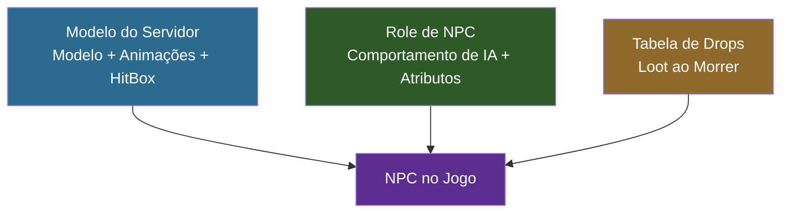

## Objetivo

Criar um **Slime** — um NPC hostil que persegue e ataca jogadores ao avistá-los. Você vai configurar um modelo 3D com animações, definir seu comportamento de IA através de herança de templates, configurar uma tabela de drops com pesos e adicionar traduções multilíngues. Ao final, você terá um mod de NPC totalmente funcional que pode ser invocado no Modo Criativo.

## O Que Você Vai Aprender

- Como NPCs são estruturados em três camadas JSON (Modelo do Servidor, Role de NPC, Tabela de Drops)
- Como configurar um modelo com 9 conjuntos de animação
- Como a herança de templates (`Template_Predator`) fornece comportamento de IA
- Como tabelas de drops com pesos controlam o loot
- Como adicionar traduções para EN, ES e PT-BR

## Pré-requisitos

- Uma pasta de mod com um `manifest.json` válido (veja [Configure seu Ambiente de Desenvolvimento](/hytale-modding-docs/tutorials/beginner/setup-dev-environment/))
- Blockbench com o plugin do Hytale instalado
- Familiaridade com herança de templates JSON (veja [Herança e Templates](/hytale-modding-docs/reference/concepts/inheritance-and-templates/))

---

## Visão Geral da Arquitetura de NPCs

Diferente de blocos e itens que usam um único arquivo JSON cada, NPCs requerem **três definições separadas** que funcionam juntas:



| Camada | Localização do Arquivo | Finalidade |
|--------|----------------------|------------|
| **Modelo do Servidor** | `Server/Models/` | Vincula o arquivo `.blockymodel`, textura, animações, hitbox e configurações de câmera |
| **Role de NPC** | `Server/NPC/Roles/` | Define o comportamento de IA via herança de template, vida, knockback e chaves de tradução |
| **Tabela de Drops** | `Server/Drops/` | Controla qual loot cai quando o NPC morre, usando seleção aleatória com pesos |

O nome de `Appearance` do **Modelo do Servidor** conecta todos os três — o Role de NPC o referencia, e o engine o usa para encontrar o modelo, textura e animações corretos.

---

## Passo 1: Criar o Modelo e a Textura no Blockbench

Abra o Blockbench e crie um novo projeto **Hytale Character**:

- **Block Size**: 64
- **Pixel Density**: 64
- **UV Size**: 128×128 (a textura deve corresponder: 128×128 pixels)

Construa o corpo do slime usando cubos organizados em grupos. Para o Slime, a estrutura é:

| Grupo | Finalidade |
|-------|------------|
| `Body` | Corpo principal do slime (cubo grande) |
| `Head` | Porção superior (usada pelo rastreamento de câmera) |
| `Eyes` | Detalhes do rosto |
| `Arm_Left` / `Arm_Right` | Pequenos apêndices para animações de ataque |
| `Leg_Left` / `Leg_Right` | Bases para animações de caminhada |

Pinte a textura na aba **Paint** — tons de verde com manchas mais escuras funcionam bem para uma criatura de slime.


### Exportar o Modelo

1. **File > Export > Export Hytale Blocky Model** → salve como `Model_Slime.blockymodel`
2. Salve a textura separadamente como `Texture.png` (128×128)

### Criar Animações

NPCs precisam de arquivos de animação para cada estado de movimento. Crie estas 9 animações na aba **Animate** do Blockbench:

| Animação | Arquivo | Loop | Finalidade |
|----------|---------|------|------------|
| Idle | `Idle.blockyanim` | Sim | Parado — balanço sutil |
| Walk | `Walk.blockyanim` | Sim | Movendo para frente |
| Walk_Backward | `Walk_Backward.blockyanim` | Sim | Movendo para trás |
| Run | `Run.blockyanim` | Sim | Perseguindo o jogador |
| Attack | `Attack.blockyanim` | Sim | Golpe corpo a corpo |
| Death | `Death.blockyanim` | **Não** | Toca uma vez ao morrer |
| Crouch | `Crouch.blockyanim` | Sim | Parado agachado |
| Crouch_Walk | `Crouch_Walk.blockyanim` | Sim | Agachado para frente |
| Crouch_Walk_Backward | `Crouch_Walk_Backward.blockyanim` | Sim | Agachado para trás |

Exporte cada animação com **File > Export > Export Hytale Block Animation**.

:::tip[Animação de Morte]
Defina `"Loop": false` para a animação de Death no Modelo do Servidor — todas as outras animações fazem loop por padrão.
:::

---

## Passo 2: Configurar a Estrutura de Arquivos do Mod

Coloque seus arquivos na pasta do mod seguindo esta estrutura exata:

```text
CreateACustomNPC/
├── manifest.json
├── Common/
│   ├── Icons/
│   │   └── ModelsGenerated/
│   │       └── Slime.png
│   └── NPC/
│       └── Beast/
│           └── Slime/
│               ├── Model/
│               │   ├── Model_Slime.blockymodel
│               │   └── Texture.png
│               └── Animations/
│                   └── Default/
│                       ├── Idle.blockyanim
│                       ├── Walk.blockyanim
│                       ├── Walk_Backward.blockyanim
│                       ├── Run.blockyanim
│                       ├── Attack.blockyanim
│                       ├── Death.blockyanim
│                       ├── Crouch.blockyanim
│                       ├── Crouch_Walk.blockyanim
│                       └── Crouch_Walk_Backward.blockyanim
├── Server/
│   ├── Models/
│   │   └── Beast/
│   │       └── Slime.json
│   ├── NPC/
│   │   └── Roles/
│   │       └── Slime.json
│   ├── Drops/
│   │   └── Drop_Slime.json
│   └── Languages/
│       ├── en-US/
│       │   └── server.lang
│       ├── es/
│       │   └── server.lang
│       └── pt-BR/
│           └── server.lang
```

Todos os caminhos em `Common/` devem começar com uma raiz permitida: `NPC/`, `Icons/`, `Items/`, `Blocks/`, etc. O modelo e as animações ficam em `NPC/`, e o ícone de spawn fica em `Icons/`.

---

## Passo 3: Criar o manifest.json

```json
{
  "Group": "HytaleModdingManual",
  "Name": "CreateACustomNPC",
  "Version": "1.0.0",
  "Description": "Implements the Create A NPC tutorial with a custom slime",
  "Authors": [
    {
      "Name": "HytaleModdingManual"
    }
  ],
  "Dependencies": {},
  "OptionalDependencies": {},
  "IncludesAssetPack": true,
  "TargetServerVersion": "2026.02.19-1a311a592"
}
```

---

## Passo 4: Definir o Modelo do Servidor

O Modelo do Servidor é a ponte entre os assets 3D em `Common/` e o engine do jogo. Ele diz ao Hytale onde encontrar o modelo, a textura e cada animação.

Crie `Server/Models/Beast/Slime.json`:

```json
{
  "Model": "NPC/Beast/Slime/Model/Model_Slime.blockymodel",
  "Texture": "NPC/Beast/Slime/Model/Texture.png",
  "EyeHeight": 1.5,
  "CrouchOffset": -0.15,
  "HitBox": {
    "Max": { "X": 0.8, "Y": 2.0, "Z": 0.8 },
    "Min": { "X": -0.8, "Y": 0, "Z": -0.8 }
  },
  "Camera": {
    "Pitch": {
      "AngleRange": { "Max": 15, "Min": -15 },
      "TargetNodes": ["Head"]
    },
    "Yaw": {
      "AngleRange": { "Max": 15, "Min": -15 },
      "TargetNodes": ["Head"]
    }
  },
  "AnimationSets": {
    "Walk": {
      "Animations": [
        { "Animation": "NPC/Beast/Slime/Animations/Default/Walk.blockyanim" }
      ]
    },
    "Attack": {
      "Animations": [
        { "Animation": "NPC/Beast/Slime/Animations/Default/Attack.blockyanim" }
      ]
    },
    "Idle": {
      "Animations": [
        { "Animation": "NPC/Beast/Slime/Animations/Default/Idle.blockyanim" }
      ]
    },
    "Death": {
      "Animations": [
        {
          "Animation": "NPC/Beast/Slime/Animations/Default/Death.blockyanim",
          "Loop": false
        }
      ]
    },
    "Walk_Backward": {
      "Animations": [
        { "Animation": "NPC/Beast/Slime/Animations/Default/Walk_Backward.blockyanim" }
      ]
    },
    "Run": {
      "Animations": [
        { "Animation": "NPC/Beast/Slime/Animations/Default/Run.blockyanim" }
      ]
    },
    "Crouch": {
      "Animations": [
        { "Animation": "NPC/Beast/Slime/Animations/Default/Crouch.blockyanim" }
      ]
    },
    "Crouch_Walk": {
      "Animations": [
        { "Animation": "NPC/Beast/Slime/Animations/Default/Crouch_Walk.blockyanim" }
      ]
    },
    "Crouch_Walk_Backward": {
      "Animations": [
        { "Animation": "NPC/Beast/Slime/Animations/Default/Crouch_Walk_Backward.blockyanim" }
      ]
    }
  },
  "Icon": "Icons/ModelsGenerated/Slime.png",
  "IconProperties": {
    "Scale": 0.25,
    "Rotation": [0, -45, 0],
    "Translation": [0, -61]
  }
}
```

### Campos do Modelo do Servidor

| Campo | Tipo | Finalidade |
|-------|------|------------|
| `Model` | String | Caminho para o arquivo `.blockymodel` (relativo a `Common/`) |
| `Texture` | String | Caminho para a textura `.png` (relativo a `Common/`) |
| `EyeHeight` | Number | Posição vertical dos olhos do NPC em blocos — afeta a câmera e a linha de visão |
| `CrouchOffset` | Number | Quanto o modelo abaixa ao agachar |
| `HitBox` | Object | Caixa de colisão para detecção de dano. `Min`/`Max` definem os cantos em blocos |
| `Camera` | Object | Como a cabeça do NPC rastreia alvos. `TargetNodes` deve corresponder aos nomes de grupos no modelo |
| `AnimationSets` | Object | Mapeia estados do jogo para arquivos de animação. Cada conjunto pode ter múltiplas animações com pesos |
| `Icon` | String | Caminho do ícone no menu de spawn (relativo a `Common/`) |
| `IconProperties` | Object | Escala, rotação e translação para a renderização do ícone |

:::caution[Os Nomes dos Conjuntos de Animação São Fixos]
O engine espera nomes específicos de conjuntos de animação: `Idle`, `Walk`, `Walk_Backward`, `Run`, `Attack`, `Death`, `Crouch`, `Crouch_Walk`, `Crouch_Walk_Backward`. Usar nomes diferentes fará o NPC congelar na pose idle durante aquela ação.
:::

---

## Passo 5: Definir o Role de NPC

O Role de NPC define o comportamento e os atributos. Em vez de escrever IA do zero, o Hytale usa **herança de templates** — você escolhe um template de comportamento e sobrescreve apenas o que difere.

Crie `Server/NPC/Roles/Slime.json`:

```json
{
  "Type": "Variant",
  "Reference": "Template_Predator",
  "Modify": {
    "Appearance": "Slime",
    "MaxHealth": 75,
    "KnockbackScale": 0.5,
    "IsMemory": true,
    "MemoriesCategory": "Beast",
    "NameTranslationKey": {
      "Compute": "NameTranslationKey"
    }
  },
  "Parameters": {
    "NameTranslationKey": {
      "Value": "server.npcRoles.Slime.name",
      "Description": "Translation key for NPC name display"
    }
  }
}
```

### Como Funciona a Herança de Templates

O padrão `"Type": "Variant"` + `"Reference": "Template_Predator"` significa:

1. **Começar com** todos os campos de `Template_Predator` (IA hostil, lógica de perseguição, padrões de ataque, alcance de visão)
2. **Sobrescrever** apenas os campos listados em `"Modify"` (aparência, vida, knockback, etc.)
3. **Todo o resto** (tomada de decisão, lógica de combate, velocidades de movimento) vem do template

### Templates de NPC Disponíveis

| Template | Comportamento | Usar Para |
|----------|--------------|-----------|
| `Template_Predator` | Hostil — persegue e ataca jogadores ao avistá-los | Inimigos, criaturas hostis |
| `Template_Prey` | Passivo — foge quando ameaçado | Coelhos, cervos, animais pequenos |
| `Template_Neutral` | Neutro — ataca apenas quando provocado | Ursos, lobos |
| `Template_Domestic` | Doméstico — segue o dono, pode ser cercado | Animais de fazenda, pets |
| `Template_Beasts_Passive_Critter` | Criatura passiva — vagueia, foge | Esquilos, sapos, insetos |

### Campos do Role de NPC

| Campo | Tipo | Finalidade |
|-------|------|------------|
| `Appearance` | String | Deve corresponder ao nome do arquivo do Modelo do Servidor (sem `.json`). É assim que o engine vincula o Role ao Modelo |
| `MaxHealth` | Number | Pontos de vida. Inimigos vanilla variam de 30 (Esqueleto) a 500+ (chefes) |
| `KnockbackScale` | Number | Resistência ao knockback. `1.0` = normal, `0.5` = metade do knockback, `0` = imóvel |
| `IsMemory` | Boolean | Se o NPC aparece no bestiário de Memórias do jogador |
| `MemoriesCategory` | String | Aba do bestiário: `Critter`, `Beast`, `Boss`, `Other` |
| `NameTranslationKey` | Compute | Chave de tradução para o nome exibido acima da cabeça do NPC |

### O Padrão Compute

```json
"NameTranslationKey": {
  "Compute": "NameTranslationKey"
}
```

Isso diz ao engine: "obtenha o valor de `NameTranslationKey` do bloco `Parameters`." A seção `Parameters` então fornece o valor real:

```json
"Parameters": {
  "NameTranslationKey": {
    "Value": "server.npcRoles.Slime.name",
    "Description": "Translation key for NPC name display"
  }
}
```

Essa indireção existe porque templates usam `Compute` para ler valores que cada variante define de forma diferente. Cada variante fornece seu próprio valor de `NameTranslationKey`, mas a lógica do template para usá-lo permanece a mesma.

---

## Passo 6: Criar a Tabela de Drops

A tabela de drops controla qual loot cai quando o NPC morre. O Hytale usa um sistema de **seleção aleatória com pesos**.

Crie `Server/Drops/Drop_Slime.json`:

```json
{
  "Container": {
    "Type": "Choice",
    "Containers": [
      {
        "Type": "Single",
        "Item": {
          "ItemId": "Ore_Crystal_Slime",
          "QuantityMin": 1,
          "QuantityMax": 1
        },
        "Weight": 100
      },
      {
        "Type": "Single",
        "Item": {
          "ItemId": "Consumable_Potion_Health_Large"
        },
        "Weight": 60
      },
      {
        "Type": "Empty",
        "Weight": 40
      }
    ]
  }
}
```

### Como Funciona a Seleção por Peso

O `"Type": "Choice"` raiz escolhe **um** container filho aleatoriamente, proporcional ao peso:

| Drop | Peso | Probabilidade |
|------|------|---------------|
| Minério de Cristal de Slime (1) | 100 | 100/200 = **50%** |
| Poção de Vida (Grande) | 60 | 60/200 = **30%** |
| Nada | 40 | 40/200 = **20%** |

Peso total = 100 + 60 + 40 = 200. Cada peso é dividido pelo total para obter a probabilidade.

### Tipos de Container de Drop

| Tipo | Comportamento |
|------|---------------|
| `Choice` | Escolhe **um** filho aleatoriamente (com peso) |
| `Multiple` | Avalia **todos** os filhos (use para drops garantidos + bônus) |
| `Single` | Produz o `Item` especificado com quantidade entre `QuantityMin` e `QuantityMax` |
| `Empty` | Não dropa nada — use como opção "sem drop" em containers `Choice` |

:::tip[Múltiplos Drops Garantidos]
Para sempre dropar um item E ter chance de um segundo, use `Multiple` na raiz com dois filhos `Choice` — um garantido, um com opção `Empty`. Veja [Referência de Tabelas de Drops](/hytale-modding-docs/reference/economy-and-progression/drop-tables/) para padrões avançados.
:::

---

## Passo 7: Adicionar Traduções

Crie um arquivo `server.lang` para cada idioma em `Server/Languages/`:

**`Server/Languages/en-US/server.lang`**
```properties
npcRoles.Slime.name = Slime
```

**`Server/Languages/es/server.lang`**
```properties
npcRoles.Slime.name = Slime
```

**`Server/Languages/pt-BR/server.lang`**
```properties
npcRoles.Slime.name = Slime
```

A chave de tradução no arquivo `.lang` deve corresponder ao `Parameters.NameTranslationKey.Value` no Role de NPC — mas **sem** o prefixo `server.`. O engine adiciona o prefixo automaticamente ao resolver arquivos de idioma do servidor.

---

## Passo 8: Empacotar e Testar

1. Copie a pasta `CreateACustomNPC/` para `%APPDATA%/Hytale/UserData/Mods/`

2. Inicie o Hytale e entre no **Modo Criativo**

3. Verifique o log em `%APPDATA%/Hytale/UserData/Logs/` para confirmar o carregamento do seu mod:
   ```text
   [Hytale] Loading assets from: ...\Mods\CreateACustomNPC\Server
   [AssetRegistryLoader] Loading assets from ...\Mods\CreateACustomNPC\Server
   ```

4. Conceda permissões de operador e gere o Slime usando comandos de chat:
   ```text
   /op self
   /npc spawn Slime
   ```

5. Verifique:


   - O modelo renderiza corretamente com a textura de slime
   - O NPC é hostil e persegue você ao avistá-lo
   - As animações de ataque, caminhada, corrida e morte funcionam corretamente
   - O nome "Slime" aparece acima da cabeça
   - Ao matá-lo, dropa um dos seguintes: Minério de Cristal de Slime (50%), Poção de Vida (30%) ou nada (20%)

---

## Problemas Comuns

| Problema | Causa | Solução |
|----------|-------|---------|
| `Common Asset 'path' must be within the root` | O caminho do modelo/textura não começa com `NPC/`, `Icons/`, etc. | Mova os arquivos para um diretório raiz permitido em `Common/` |
| `Common Asset 'path' doesn't exist` | O caminho no JSON não corresponde à localização real do arquivo | Verifique novamente cada caminho no Modelo do Servidor — eles são relativos a `Common/` |
| NPC aparece mas está invisível | O caminho `Model` do Modelo do Servidor está errado ou o `.blockymodel` está corrompido | Re-exporte do Blockbench, verifique o caminho |
| NPC fica parado, não ataca | Template errado ou animações faltando | Verifique se `Reference` é `Template_Predator` e se todos os 9 conjuntos de animação existem |
| NPC desliza sem animação | O nome do conjunto de animação não corresponde ao nome esperado | Use os nomes exatos: `Walk`, `Run`, `Idle`, `Attack`, `Death`, etc. |
| Nome não aparece acima do NPC | Chave de tradução incompatível | Certifique-se de que a chave no `.lang` corresponde ao `Parameters.NameTranslationKey.Value` menos o prefixo `server.` |
| Animação de morte fica em loop | Faltando `"Loop": false` na animação de Death | Adicione `"Loop": false` à entrada de Death em `AnimationSets` |
| Tabela de drops não funciona | Campo `DropList` faltando no Role de NPC | Adicione `"DropList": "Drop_Slime"` ao bloco `Modify` (omitido aqui pois `Template_Predator` já trata isso) |

---

## Próximos Passos

- [Criar um Bloco Personalizado](/hytale-modding-docs/tutorials/beginner/create-a-block/) — Construa um bloco de cristal brilhante para usar como drop de NPC
- [Criar uma Arma Personalizada](/hytale-modding-docs/tutorials/beginner/create-an-item/) — Crie uma espada para lutar contra seu novo NPC
- [Referência de Roles de NPC](/hytale-modding-docs/reference/npc-system/npc-roles/) — Referência completa do schema para definições de roles de NPC
- [Referência de Tabelas de Drops](/hytale-modding-docs/reference/economy-and-progression/drop-tables/) — Padrões avançados de tabelas de drops com containers aninhados
