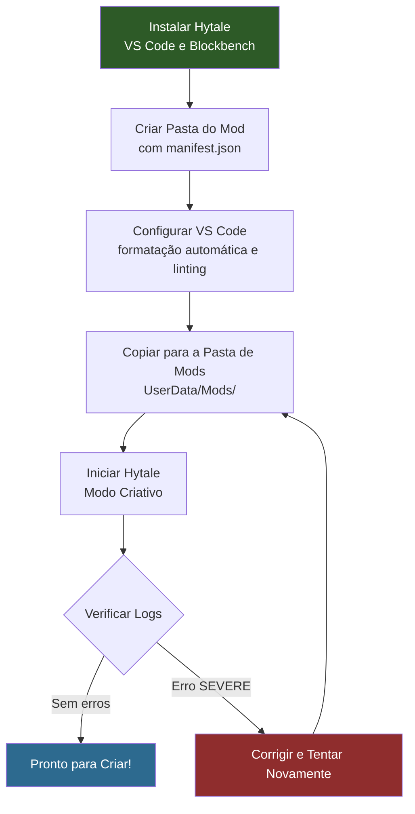

## Objetivo

Instale as ferramentas necessárias, crie uma pasta de mod com um `manifest.json` válido e confirme que o Hytale o reconhece na inicialização. Ao final, você terá uma base funcional para todos os tutoriais que se seguem.

## Pré-requisitos

- Hytale instalado (cliente do jogo com acesso ao Modo Criativo)
- Permissão de escrita no diretório de mods em `%APPDATA%/Hytale/UserData/Mods/`

---

## Passo 1: Instalar as Ferramentas Necessárias

### Hytale

O jogo é necessário para carregar e testar mods. Os mods são carregados a partir de:

```text
%APPDATA%/Hytale/UserData/Mods/
```

No Windows, esse caminho corresponde a `C:\Users\<você>\AppData\Roaming\Hytale\UserData\Mods\`. Cada subpasta com um `manifest.json` válido é carregada como um mod na inicialização.

### Visual Studio Code

O VS Code é o editor recomendado para arquivos JSON do Hytale. Ele oferece realce de sintaxe, detecção de erros e formatação automática.

Baixe em: **https://code.visualstudio.com/**

Após instalar, adicione estas extensões no painel de Extensões (`Ctrl+Shift+X`):

| Extensão | Finalidade |
|----------|------------|
| **JSON** (integrado) | Realce de sintaxe e correspondência de colchetes |
| **Error Lens** | Exibe erros de validação JSON diretamente no código |
| **Prettier** | Formata JSON automaticamente ao salvar |

### Blockbench

O Blockbench é a ferramenta de modelagem 3D usada para criar arquivos `.blockymodel` para blocos, itens e NPCs.

Baixe em: **https://www.blockbench.net/**

Após instalar:

1. Abra o Blockbench
2. Vá em **File > Plugins**
3. Pesquise por `Hytale`
4. Instale o plugin **Hytale Exporter**
5. Reinicie o Blockbench

O plugin adiciona as opções de formato **Hytale Character** e **Hytale Blocky Model** ao criar novos projetos.

---

## Passo 2: Entender a Estrutura do Mod

Todo mod do Hytale é uma pasta com um `manifest.json` na raiz. A pasta possui dois subdiretórios principais:

```text
MyFirstMod/
├── manifest.json
├── Common/                    (assets do lado do cliente)
│   ├── Blocks/                (modelos de blocos)
│   ├── BlockTextures/         (texturas de blocos)
│   ├── Items/                 (modelos + texturas de itens/armas)
│   ├── Icons/                 (ícones do inventário)
│   │   └── ItemsGenerated/
│   └── NPC/                   (modelos de NPCs)
└── Server/                    (definições do lado do servidor)
    ├── Item/
    │   ├── Block/
    │   │   └── Blocks/        (definições de tipos de blocos)
    │   └── Items/             (definições de itens)
    ├── BlockTypeList/         (registra blocos)
    ├── NPC/
    │   └── Roles/             (comportamento de NPCs)
    └── Languages/             (traduções)
        ├── en-US/server.lang
        ├── pt-BR/server.lang
        └── es/server.lang
```

**Regras importantes:**
- `Common/` contém os assets que o cliente renderiza: modelos (`.blockymodel`), texturas (`.png`) e ícones
- `Server/` contém as definições JSON processadas pelo servidor: itens, blocos, NPCs, receitas e idiomas
- Os caminhos de assets no JSON são **relativos a `Common/`** e devem começar com uma raiz permitida: `Blocks/`, `BlockTextures/`, `Items/`, `Icons/`, `NPC/`, `Resources/`, `VFX/` ou `Consumable/`
- Os arquivos de idioma ficam em `Server/Languages/<locale>/server.lang`
- A pasta de namespace do seu mod (ex.: `HytaleModdingManual/`) fica dentro de cada diretório de asset para evitar colisões de nomes

:::caution[Sem wrapper Assets/]
Ao contrário do layout interno de arquivos do jogo vanilla, as pastas de mod **não** possuem um wrapper `Assets/`. Coloque `Common/` e `Server/` diretamente dentro da raiz do mod, ao lado do `manifest.json`.
:::

---

## Passo 3: Criar o manifest.json

O `manifest.json` identifica seu mod para o engine. Crie uma pasta e seu manifest:

```text
MyFirstMod/manifest.json
```

```json
{
  "Group": "MyStudio",
  "Name": "MyFirstMod",
  "Version": "1.0.0",
  "Description": "A minimal Hytale mod to validate the development setup",
  "Authors": [
    {
      "Name": "MyStudio"
    }
  ],
  "Dependencies": {},
  "OptionalDependencies": {},
  "IncludesAssetPack": true,
  "TargetServerVersion": "2026.02.19-1a311a592"
}
```

### Campos do Manifest

| Campo | Obrigatório | Descrição |
|-------|-------------|-----------|
| `Group` | Sim | Namespace do autor ou organização. Use um identificador único como o nome do seu estúdio. |
| `Name` | Sim | Identificador do mod. Apenas caracteres ASCII, sem espaços. Usado em mensagens de log e referências de dependência. |
| `Version` | Não | Versão do seu mod no formato semver. |
| `Description` | Não | Descrição curta exibida nos diagnósticos. |
| `Authors` | Não | Lista de objetos `{"Name": "..."}`. |
| `Dependencies` | Não | Mods obrigatórios: `{"ModGroup:ModName": ">=1.0.0"}`. |
| `OptionalDependencies` | Não | Mods suportados mas não obrigatórios. |
| `IncludesAssetPack` | Não | Defina como `true` quando o mod incluir assets personalizados (modelos, texturas, definições JSON). |
| `TargetServerVersion` | Não | Build exata do servidor Hytale que o mod tem como alvo. |

:::note[Group e Name]
`Group` e `Name` juntos formam o ID único do mod (`Group:Name`). Se o carregamento falhar, a mensagem de erro referencia esse ID — ex.: `Mod MyStudio:MyFirstMod failed to load`.
:::

---

## Passo 4: Configurar o VS Code

Abra sua pasta de mod no VS Code:

```text
File > Open Folder > selecione MyFirstMod/
```

Crie `.vscode/settings.json` dentro da pasta do mod para formatação automática:

```json
{
  "editor.formatOnSave": true,
  "editor.defaultFormatter": "esbenp.prettier-vscode",
  "[json]": {
    "editor.defaultFormatter": "esbenp.prettier-vscode"
  },
  "files.associations": {
    "*.lang": "properties"
  }
}
```

Isso detecta erros de sintaxe antes de você tentar carregar o mod. O JSON do Hytale é **sensível a maiúsculas e minúsculas** — o engine rejeita `"material": "solid"` mas aceita `"Material": "Solid"`.

---

## Passo 5: Carregar e Verificar

1. Copie sua pasta `MyFirstMod/` para o diretório de mods:

   ```text
   %APPDATA%/Hytale/UserData/Mods/MyFirstMod/
   ```

2. Inicie o Hytale e entre no Modo Criativo

3. Verifique o log do cliente em `%APPDATA%/Hytale/UserData/Logs/` para o seu mod:

   ```text
   [Hytale] Loading assets from: ...\Mods\MyFirstMod\Server
   [AssetRegistryLoader] Loading assets from ...\Mods\MyFirstMod\Server
   ```

Se você vir essas linhas sem um erro `SEVERE`, seu mod foi carregado com sucesso. Um mod vazio com apenas um manifest é válido — o Hytale o carregará e continuará.

### Lendo Erros de Inicialização

Os erros aparecem no log com o nível `SEVERE` e sempre incluem o caminho do arquivo e o campo que falhou:

| Padrão no Log | Significado |
|---------------|-------------|
| `Loading assets from: ...\MyFirstMod\Server` | Mod encontrado e sendo carregado |
| `Loaded N entries for 'en-US'` | Arquivos de idioma carregados com sucesso |
| `Failed to decode asset: X` | Erro de parse JSON ou de schema no asset X |
| `Common Asset 'path' must be within the root` | O caminho do asset não começa com uma raiz permitida |
| `Common Asset 'path' doesn't exist` | Arquivo referenciado está ausente em `Common/` |
| `Unused key(s) in 'X': field` | Campo não reconhecido (aviso, não fatal) |
| `Mod Group:Name failed to load` | Erro fatal — verifique as linhas `SEVERE` anteriores para detalhes |
| `missing or invalid manifest.json` | O manifest está malformado ou faltam campos obrigatórios |

:::tip[Localização dos Logs]
Logs do cliente: `%APPDATA%/Hytale/UserData/Logs/`
Logs do editor: `%APPDATA%/Hytale/EditorUserData/Logs/`

O log mais recente tem a data de hoje no nome do arquivo (ex.: `2026-03-12_02-42-09_client.log`).
:::

---

## Passo 6: Configurar o Blockbench

Ao criar modelos para o Hytale:

1. Abra o Blockbench
2. **File > New** e selecione o formato Hytale:
   - **Hytale Character** para itens e NPCs (blockSize 64, pixel density 64)
   - **Hytale Blocky Model** para blocos (blockSize 16)
3. Construa seu modelo usando cubos e grupos
4. Pinte a textura na aba Paint
5. Exporte com **File > Export > Export Hytale Blocky Model**

### Convenções Importantes

| Convenção | Detalhe |
|-----------|---------|
| Resolução da textura | Deve corresponder ao tamanho do UV para o formato. Formato Character: textura = tamanho do UV (ex.: UV 128x128 = textura 128x128) |
| Ponto de pivô | Posicione na empunhadura/cabo para armas — afeta o posicionamento na mão e a origem da luz |
| UV por face | Use para cubos maiores que 32 voxels (box UV é limitado ao espaço de UV 32x32) |
| Modos de sombreamento | `standard` (padrão), `fullbright` (brilho emissivo), `flat` (sem iluminação), `reflective` |
| Formato de arquivo | `.blockymodel` para o modelo, `.png` para a textura (salva separadamente) |

---

## Fluxo do Ambiente de Desenvolvimento



---

## Próximos Passos

Seu ambiente de desenvolvimento está pronto. Continue com os tutoriais para iniciantes:

- [Criar um Bloco Personalizado](/hytale-modding-docs/tutorials/beginner/create-a-block/) — Construa um bloco de cristal brilhante com textura, modelo, receita e traduções
- [Criar uma Arma Personalizada](/hytale-modding-docs/tutorials/beginner/create-an-item/) — Crie uma espada de cristal com atributos de combate, emissão de luz e criação
- [Criar um NPC Personalizado](/hytale-modding-docs/tutorials/beginner/create-an-npc/) — Instancie uma criatura com comportamento de IA e tabelas de drops
