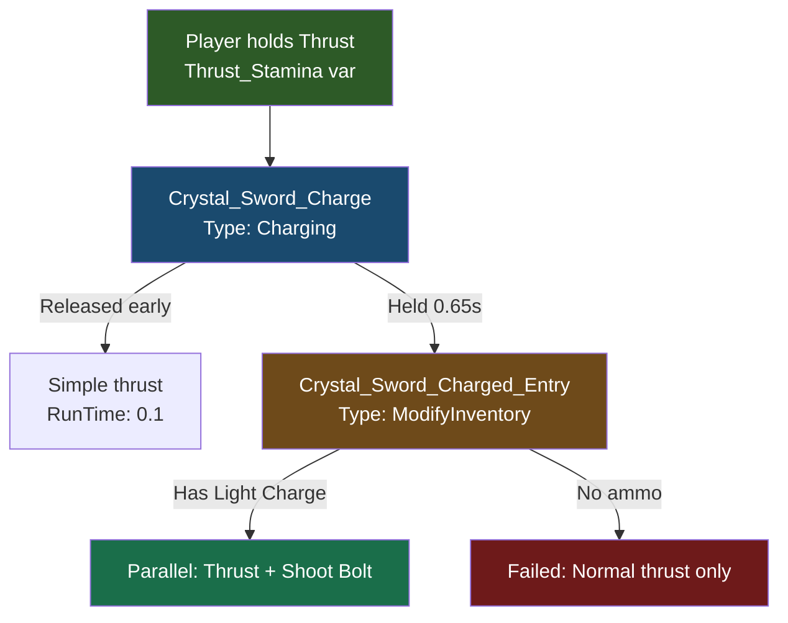

## Objetivo

Construa uma **Bigorna de Cristal**, uma **Espada de Cristal** com um ataque de projétil carregado e munição de **Carga de Luz** — tudo fabricável na bancada. Você vai aprender como bancadas de criação, cadeias de interações, o tipo de interação Charging e sistemas de projéteis se conectam.

## O Que Você Vai Aprender

- Como as bancadas de criação são definidas usando a propriedade de bloco `Bench`
- Como o `State` com `Id: "crafting"` é **obrigatório** para que a interface da bancada abra
- Como criar categorias que organizam receitas na interface da bancada
- Como os níveis de tier e o `CraftingTimeReductionModifier` controlam a velocidade de criação
- Como as receitas de itens referenciam uma bancada via `BenchRequirement`
- Como `InteractionVars` sobrescreve o comportamento vanilla da espada para adicionar ataques personalizados
- Como o tipo de interação `Charging` cria mecânicas de segurar-para-carregar com efeitos visuais
- Como `ModifyInventory` consome munição e encadeia em interações `Parallel`
- Como definir projéteis, configs de projéteis e um tipo de dano personalizado

## Pré-requisitos

- Uma pasta de mod com um `manifest.json` válido (veja [Configurar o Ambiente de Desenvolvimento](/hytale-modding-docs/pt-br/tutorials/beginner/setup-dev-environment))
- Familiaridade com definições de blocos (veja [Criar um Bloco Personalizado](/hytale-modding-docs/pt-br/tutorials/beginner/create-a-block))
- Familiaridade com definições de itens (veja [Criar um Item Personalizado](/hytale-modding-docs/pt-br/tutorials/beginner/create-an-item))

**Repositório do mod de exemplo:** [hytale-guide-create-a-crafting-bench](https://github.com/nevesb/hytale-guide-create-a-crafting-bench)

---

## Visão Geral das Bancadas de Criação

As bancadas de criação no Hytale são **itens** que contêm um `BlockType` inline com uma configuração `Bench`. Diferente de blocos puros que precisam de um JSON de Bloco separado e de uma entrada em `BlockTypeList`, as bancadas definem tudo em um único arquivo JSON de Item — o mesmo padrão usado pelas bancadas vanilla como `Bench_Weapon` e `Bench_Armory`.

Principais diferenças em relação a blocos comuns:
- **Nenhum JSON de Bloco separado** em `Server/Item/Block/Blocks/`
- **Nenhuma entrada em `BlockTypeList`** necessária
- O bloco `State` com `Id: "crafting"` é **obrigatório** para que a interface de criação funcione
- O objeto `Bench` define o tipo de criação, categorias e níveis de tier

---

## Passo 1: Configurar a Estrutura de Arquivos do Mod

```text
CreateACraftingBench/
├── manifest.json
├── Common/
│   ├── Blocks/HytaleModdingManual/
│   │   └── Armory_Crystal_Glow.blockymodel
│   ├── BlockTextures/HytaleModdingManual/
│   │   └── Armory_Crystal_Glow.png
│   └── Items/Weapons/Crystal/
│       ├── Weapon_Sword_Crystal_Glow.blockymodel
│       └── Weapon_Sword_Crystal_Glow.png
└── Server/
    ├── Entity/Damage/
    │   └── Crystal_Light.json
    ├── Item/
    │   ├── Interactions/HytaleModdingManual/
    │   │   ├── Crystal_Sword_Charge.json
    │   │   ├── Crystal_Sword_Charged_Entry.json
    │   │   ├── Crystal_Sword_Shoot_Bolt.json
    │   │   ├── Crystal_Sword_Special.json
    │   │   └── Crystal_Light_Bolt_Damage.json
    │   ├── Items/HytaleModdingManual/
    │   │   ├── Bench_Armory_Crystal_Glow.json
    │   │   ├── Weapon_Sword_Crystal_Glow.json
    │   │   └── Weapon_Arrow_Crystal_Glow.json
    │   └── RootInteractions/HytaleModdingManual/
    │       └── Crystal_Sword_Special.json
    ├── Projectiles/
    │   └── Crystal_Light_Bolt.json
    ├── ProjectileConfigs/HytaleModdingManual/
    │   └── Projectile_Config_Crystal_Light_Bolt.json
    └── Languages/
        ├── en-US/server.lang
        ├── es/server.lang
        └── pt-BR/server.lang
```

### manifest.json

```json
{
  "Group": "HytaleModdingManual",
  "Name": "CreateACraftingBench",
  "Version": "2.0.0",
  "Description": "Crystal Anvil bench, Crystal Sword with projectile attacks, Light Charges ammo, and Crystal Light element",
  "Authors": [
    {
      "Name": "HytaleModdingManual"
    }
  ],
  "Dependencies": {
    "HytaleModdingManual:CreateACustomBlock": "1.0.0",
    "HytaleModdingManual:CreateACustomTree": "1.0.0"
  },
  "OptionalDependencies": {},
  "IncludesAssetPack": true
}
```

`IncludesAssetPack` é `true` porque temos assets Common (modelos e texturas). A lista de `Dependencies` indica os mods que fornecem recursos usados nas receitas (minério de Cristal Brilhante e Madeira Encantada).

---

## Passo 2: Criar a Definição do Item da Bancada

Crie a bancada em `Server/Item/Items/HytaleModdingManual/Bench_Armory_Crystal_Glow.json`:

```json
{
  "TranslationProperties": {
    "Name": "server.items.Bench_Armory_Crystal_Glow.name",
    "Description": "server.items.Bench_Armory_Crystal_Glow.description"
  },
  "Quality": "Rare",
  "Icon": "Icons/ItemsGenerated/Bench_Armory_Crystal_Glow.png",
  "Categories": [
    "Furniture.Benches"
  ],
  "Recipe": {
    "TimeSeconds": 10.0,
    "KnowledgeRequired": false,
    "Input": [
      {
        "ItemId": "Ore_Crystal_Glow",
        "Quantity": 3
      },
      {
        "ItemId": "Wood_Enchanted_Trunk",
        "Quantity": 10
      },
      {
        "ItemId": "Ingredient_Bar_Gold",
        "Quantity": 5
      }
    ],
    "BenchRequirement": [
      {
        "Type": "Crafting",
        "Categories": [
          "Workbench_Crafting"
        ],
        "Id": "Workbench",
        "RequiredTierLevel": 2
      }
    ]
  },
  "BlockType": {
    "Material": "Solid",
    "DrawType": "Model",
    "Opacity": "Transparent",
    "CustomModel": "Blocks/HytaleModdingManual/Armory_Crystal_Glow.blockymodel",
    "CustomModelTexture": [
      {
        "Texture": "BlockTextures/HytaleModdingManual/Armory_Crystal_Glow.png",
        "Weight": 1
      }
    ],
    "VariantRotation": "NESW",
    "HitboxType": "Bench_Weapon",
    "State": {
      "Id": "crafting",
      "Definitions": {
        "CraftCompleted": {
          "Looping": true
        },
        "CraftCompletedInstant": {}
      }
    },
    "Gathering": {
      "Breaking": {
        "GatherType": "Benches",
        "ItemId": "Bench_Armory_Crystal_Glow"
      }
    },
    "Light": {
      "Color": "#88ccff"
    },
    "Bench": {
      "Type": "Crafting",
      "LocalOpenSoundEventId": "SFX_Weapon_Bench_Open",
      "LocalCloseSoundEventId": "SFX_Weapon_Bench_Close",
      "CompletedSoundEventId": "SFX_Weapon_Bench_Craft",
      "Id": "Armory_Crystal_Glow",
      "Categories": [
        {
          "Id": "Crystal_Glow_Sword",
          "Name": "server.benchCategories.crystal_glow_sword",
          "Icon": "Icons/CraftingCategories/Armory/Sword.png"
        }
      ],
      "TierLevels": [
        {
          "CraftingTimeReductionModifier": 0.0
        }
      ]
    },
    "BlockSoundSetId": "Crystal",
    "ParticleColor": "#88ccff",
    "Support": {
      "Down": [
        {
          "FaceType": "Full"
        }
      ]
    },
    "BlockParticleSetId": "Crystal"
  },
  "PlayerAnimationsId": "Block",
  "IconProperties": {
    "Scale": 0.5,
    "Rotation": [
      22.5,
      45,
      22.5
    ],
    "Translation": [
      13,
      -14
    ]
  },
  "Tags": {
    "Type": [
      "Bench"
    ]
  },
  "MaxStack": 1,
  "ItemSoundSetId": "ISS_Items_Gems"
}
```

### Principais campos da bancada explicados

| Campo | Finalidade |
|-------|-----------|
| `Bench.Type` | Deve ser `"Crafting"` para bancadas baseadas em receitas |
| `Bench.Id` | Identificador único que as receitas referenciam no `BenchRequirement` |
| `Bench.Categories` | Array de abas de categoria exibidas na interface da bancada. Cada uma tem um `Id`, `Icon` e `Name` de tradução |
| `Bench.TierLevels` | Array de níveis de upgrade. Cada um pode ter `CraftingTimeReductionModifier` (percentual mais rápido) e `UpgradeRequirement` |
| `State` | **Obrigatório.** Deve ter `"Id": "crafting"` para que a interface da bancada abra ao interagir |
| `VariantRotation` | `"NESW"` permite que a bancada fique voltada para quatro direções ao ser colocada |
| `HitboxType` | Reutiliza o hitbox `"Bench_Weapon"` para a área de interação |
| `Light.Color` | Emite um brilho azul suave (`#88ccff`) |
| `Support.Down` | Exige uma face de bloco completa abaixo para ser colocada |

:::caution[State é obrigatório]
Sem o bloco `State`, a bancada será colocada no mundo, mas **a interface de criação não abrirá** quando você interagir com ela. Não há nenhum erro nos logs — ela falha silenciosamente. Todas as bancadas vanilla (`Bench_Weapon`, `Bench_Armory`, `Bench_Campfire`) incluem essa configuração de `State`.
:::

### Estrutura das categorias

Cada categoria no array `Categories` define uma aba na interface de criação:

```json
{
  "Id": "Crystal_Glow_Sword",
  "Name": "server.benchCategories.crystal_glow_sword",
  "Icon": "Icons/CraftingCategories/Armory/Sword.png"
}
```

- **`Id`** — O identificador da categoria que as receitas referenciam para aparecer nessa aba
- **`Icon`** — Caminho para o PNG do ícone exibido na aba da categoria (reutilizamos o ícone vanilla de Espada)
- **`Name`** — Chave de tradução para o texto do rótulo da categoria

---

## Passo 3: Criar uma Receita Que Usa a Bancada

Qualquer item com uma `Recipe` pode referenciar sua bancada através de `BenchRequirement`. A conexão é feita combinando `BenchRequirement.Id` com o `Bench.Id` da sua bancada, e `Categories` com as abas de categoria em que a receita aparece.

Por exemplo, a receita da Espada de Cristal referencia nossa bancada:

```json
{
  "Recipe": {
    "TimeSeconds": 8.0,
    "Input": [
      {
        "ItemId": "Ore_Crystal_Glow",
        "Quantity": 10
      },
      {
        "ItemId": "Wood_Enchanted_Trunk",
        "Quantity": 50
      },
      {
        "ItemId": "Ingredient_Leather_Heavy",
        "Quantity": 10
      }
    ],
    "BenchRequirement": [
      {
        "Type": "Crafting",
        "Id": "Armory_Crystal_Glow",
        "Categories": [
          "Crystal_Glow_Sword"
        ]
      }
    ]
  }
}
```

### Campos do BenchRequirement

| Campo | Finalidade |
|-------|-----------|
| `Type` | Deve ser `"Crafting"` para corresponder a uma bancada de criação |
| `Id` | Deve corresponder exatamente ao `Bench.Id` da definição da sua bancada (diferencia maiúsculas de minúsculas) |
| `Categories` | Array de IDs de categoria em que essa receita aparece. Deve corresponder a um `Id` de categoria da bancada |
| `RequiredTierLevel` | Nível mínimo de tier da bancada necessário. Omita para tier 0 (nenhum upgrade necessário) |

---

## Passo 4: Adicionar Chaves de Tradução

Crie os arquivos de idioma em `Server/Languages/<locale>/server.lang`:

### Inglês (`en-US/server.lang`)

```
items.Bench_Armory_Crystal_Glow.name = Crystal Anvil
items.Bench_Armory_Crystal_Glow.description = A crystal anvil for forging crystal weapons.
benchCategories.crystal_glow_sword = Crystal Sword
```

### Espanhol (`es/server.lang`)

```
items.Bench_Armory_Crystal_Glow.name = Yunque de Cristal
items.Bench_Armory_Crystal_Glow.description = Un yunque de cristal para forjar armas de cristal.
benchCategories.crystal_glow_sword = Espada de Cristal
```

### Português BR (`pt-BR/server.lang`)

```
items.Bench_Armory_Crystal_Glow.name = Bigorna de Cristal
items.Bench_Armory_Crystal_Glow.description = Uma bigorna de cristal para forjar armas de cristal.
benchCategories.crystal_glow_sword = Espada de Cristal
```

Note o formato da chave de tradução: `items.<ItemId>.name` e `benchCategories.<category_id>`. O prefixo `server.` no JSON (`"Name": "server.items.Bench_Armory_Crystal_Glow.name"`) mapeia para a chave do arquivo lang sem o prefixo `server.`.

---

## Passo 5: Adicionar o Modelo Personalizado

A bancada usa um `.blockymodel` e uma textura personalizados. Coloque-os na pasta `Common/`:

- **Modelo:** `Common/Blocks/HytaleModdingManual/Armory_Crystal_Glow.blockymodel`
- **Textura:** `Common/BlockTextures/HytaleModdingManual/Armory_Crystal_Glow.png`

Você pode criar o modelo usando o [Blockbench](https://www.blockbench.net/) com o formato **Hytale Block**. O modelo deve caber dentro do limite do bloco (32 unidades = 1 bloco). Para uma bancada com 2 blocos de largura, use o hitbox `"HitboxType": "Bench_Weapon"`, que cobre a área mais larga.

:::tip[Caminhos de Assets Common]
Os assets Common devem estar dentro de um destes diretórios raiz: `Blocks/`, `BlockTextures/`, `Items/`, `Resources/`, `NPC/`, `VFX/` ou `Consumable/`. Colocar arquivos fora dessas pastas causa um erro de carregamento.
:::

---

## Passo 6: Criar a Espada de Cristal

A espada herda de `Template_Weapon_Sword` (template vanilla de espada) e sobrescreve comportamentos específicos através de `InteractionVars`. Crie `Server/Item/Items/HytaleModdingManual/Weapon_Sword_Crystal_Glow.json`:

```json
{
  "Parent": "Template_Weapon_Sword",
  "TranslationProperties": {
    "Name": "server.items.Weapon_Sword_Crystal_Glow.name",
    "Description": "server.items.Weapon_Sword_Crystal_Glow.description"
  },
  "Model": "Items/Weapons/Crystal/Weapon_Sword_Crystal_Glow.blockymodel",
  "Texture": "Items/Weapons/Crystal/Weapon_Sword_Crystal_Glow.png",
  "Icon": "Icons/ItemsGenerated/Weapon_Sword_Crystal_Glow.png",
  "Quality": "Rare",
  "ItemLevel": 35,
  "Tags": {
    "Type": ["Weapon"],
    "Family": ["Sword"]
  },
  "Interactions": {
    "Primary": "Root_Weapon_Sword_Primary",
    "Secondary": "Root_Weapon_Sword_Secondary_Guard",
    "Ability1": "Crystal_Sword_Special"
  },
  "InteractionVars": {
    "Swing_Left_Damage": {
      "Interactions": [{
        "Parent": "Weapon_Sword_Primary_Swing_Left_Damage",
        "DamageCalculator": { "BaseDamage": { "Physical": 12 } }
      }]
    },
    "Swing_Right_Damage": {
      "Interactions": [{
        "Parent": "Weapon_Sword_Primary_Swing_Right_Damage",
        "DamageCalculator": { "BaseDamage": { "Physical": 12 } }
      }]
    },
    "Swing_Down_Damage": {
      "Interactions": [{
        "Parent": "Weapon_Sword_Primary_Swing_Down_Damage",
        "DamageCalculator": { "BaseDamage": { "Physical": 22 } }
      }]
    },
    "Thrust_Damage": {
      "Interactions": [{
        "Parent": "Weapon_Sword_Primary_Thrust_Damage",
        "DamageCalculator": {
          "BaseDamage": { "Physical": 20, "Crystal_Light": 12 }
        }
      }]
    },
    "Thrust_Stamina": {
      "Interactions": ["Crystal_Sword_Charge"]
    },
    "Guard_Wield": {
      "Interactions": [{
        "Parent": "Weapon_Sword_Secondary_Guard_Wield",
        "StaminaCost": { "Value": 8, "CostType": "Damage" }
      }]
    }
  },
  "Weapon": {
    "EntityStatsToClear": ["SignatureEnergy"],
    "StatModifiers": {
      "SignatureEnergy": [{ "Amount": 20, "CalculationType": "Additive" }]
    }
  },
  "Recipe": {
    "TimeSeconds": 5.0,
    "KnowledgeRequired": false,
    "Input": [
      { "ItemId": "Ore_Crystal_Glow", "Quantity": 10 },
      { "ItemId": "Wood_Enchanted_Trunk", "Quantity": 50 },
      { "ItemId": "Ingredient_Leather_Heavy", "Quantity": 10 }
    ],
    "BenchRequirement": [{
      "Type": "Crafting",
      "Categories": ["Crystal_Glow"],
      "Id": "Armory_Crystal_Glow"
    }]
  },
  "Light": { "Radius": 2, "Color": "#88ccff" },
  "MaxDurability": 150,
  "DurabilityLossOnHit": 0.18
}
```

### Conceitos principais

| Campo | Finalidade |
|-------|-----------|
| `Parent` | Herda todo o comportamento vanilla da espada (combos de golpe, defesa, investida) de `Template_Weapon_Sword` |
| `InteractionVars` | Sobrescreve partes específicas da cadeia de interações herdada. Cada chave substitui uma variável nomeada na cadeia vanilla |
| `Thrust_Stamina` | O combo vanilla de investida termina com uma investida carregada que consome stamina. Nós substituímos por `Crystal_Sword_Charge` para adicionar nossa mecânica de projétil |
| `Thrust_Damage` | Adiciona dano `Crystal_Light` junto com `Physical` nos ataques de investida |
| `Weapon.StatModifiers` | Acumula `SignatureEnergy` (+20 por acerto) — usado pela habilidade especial |
| `Light` | A espada emite um brilho azul quando equipada |

:::tip[Padrão InteractionVars]
`InteractionVars` é como o Hytale permite que itens individuais personalizem cadeias de interações compartilhadas. A cadeia vanilla `Root_Weapon_Sword_Primary` referencia variáveis como `Thrust_Damage` e `Thrust_Stamina`. Cada arma fornece seus próprios valores para essas variáveis sem precisar duplicar a cadeia inteira.
:::

---

## Passo 7: Criar a Munição de Carga de Luz

A investida carregada da Espada de Cristal consome **Cargas de Luz** do inventário do jogador. Crie `Server/Item/Items/HytaleModdingManual/Weapon_Arrow_Crystal_Glow.json`:

```json
{
  "TranslationProperties": {
    "Name": "server.items.Weapon_Arrow_Crystal_Glow.name",
    "Description": "server.items.Weapon_Arrow_Crystal_Glow.description"
  },
  "Categories": ["Items.Weapons"],
  "Quality": "Uncommon",
  "ItemLevel": 25,
  "Model": "Items/Projectiles/Ice_Bolt.blockymodel",
  "Texture": "Items/Projectiles/Ice_Bolt_Texture.png",
  "Icon": "Icons/ItemsGenerated/Weapon_Arrow_Crystal_Glow.png",
  "Recipe": {
    "TimeSeconds": 5.0,
    "KnowledgeRequired": false,
    "Input": [
      { "ItemId": "Plant_Fruit_Enchanted", "Quantity": 1 },
      { "ItemId": "Ore_Crystal_Glow", "Quantity": 1 },
      { "ItemId": "Weapon_Arrow_Crude", "Quantity": 10 }
    ],
    "OutputQuantity": 50,
    "BenchRequirement": [{
      "Type": "Crafting",
      "Categories": ["Crystal_Glow"],
      "Id": "Armory_Crystal_Glow"
    }]
  },
  "MaxStack": 100,
  "Tags": {
    "Type": ["Weapon"],
    "Family": ["Arrow"]
  },
  "Weapon": {},
  "Light": { "Radius": 1, "Color": "#88ccff" }
}
```

Note que `OutputQuantity: 50` — fabricar um lote produz 50 cargas. A tag `Family: Arrow` e o bloco `Weapon: {}` são obrigatórios para que o jogo trate esse item como munição consumível.

---

## Passo 8: Construir a Cadeia de Interações do Ataque Carregado

O ataque carregado usa uma cadeia de interações que fluem uma para a outra. Veja como elas se conectam:



### 8a. A interação de Carregamento

Crie `Server/Item/Interactions/HytaleModdingManual/Crystal_Sword_Charge.json`:

```json
{
  "Type": "Charging",
  "AllowIndefiniteHold": false,
  "DisplayProgress": false,
  "HorizontalSpeedMultiplier": 0.5,
  "Effects": {
    "ItemAnimationId": "StabDashCharging",
    "Particles": [
      {
        "PositionOffset": { "X": 0, "Y": 0, "Z": 0 },
        "RotationOffset": { "Pitch": 0, "Roll": 0, "Yaw": 0 },
        "TargetNodeName": "blade",
        "SystemId": "Sword_Charging"
      }
    ]
  },
  "Next": {
    "0": {
      "Type": "Simple",
      "RunTime": 0.1
    },
    "0.65": "Crystal_Sword_Charged_Entry"
  }
}
```

| Campo | Finalidade |
|-------|-----------|
| `Type: "Charging"` | Mecânica de segurar-para-carregar — o jogador mantém o botão de ataque pressionado |
| `DisplayProgress: false` | Oculta a barra de carregamento. O efeito de partículas fornece o feedback visual |
| `HorizontalSpeedMultiplier` | Reduz a velocidade de movimento do jogador para 50% durante o carregamento |
| `Effects.ItemAnimationId` | Reproduz a animação de preparação `StabDashCharging` na espada |
| `Effects.Particles` | Gera partículas `Sword_Charging` no nó `blade` da espada — um efeito circular brilhante |
| `Next."0"` | Se solto antes de 0.65s, executa uma investida rápida (sem projétil) |
| `Next."0.65"` | Se mantido por 0.65s ou mais, transiciona para `Crystal_Sword_Charged_Entry` |

:::caution[TargetNodeName deve corresponder ao seu modelo]
O `TargetNodeName` deve corresponder a um nome de grupo no arquivo `.blockymodel` da sua espada. Espadas vanilla usam `"Handle"`, mas modelos personalizados podem ter nomes de nós diferentes. Verifique seu modelo no Blockbench para encontrar o nome correto do grupo.
:::

### 8b. A verificação de munição e execução paralela

Crie `Server/Item/Interactions/HytaleModdingManual/Crystal_Sword_Charged_Entry.json`:

```json
{
  "Type": "ModifyInventory",
  "ItemToRemove": {
    "Id": "Weapon_Arrow_Crystal_Glow",
    "Quantity": 1
  },
  "AdjustHeldItemDurability": -0.3,
  "Next": {
    "Type": "Parallel",
    "Interactions": [
      {
        "Interactions": [
          "Weapon_Sword_Primary_Thrust_Force",
          "Weapon_Sword_Primary_Thrust_Selector"
        ]
      },
      {
        "Interactions": [
          { "Type": "Simple", "RunTime": 0 },
          "Crystal_Sword_Shoot_Bolt"
        ]
      }
    ]
  },
  "Failed": {
    "Type": "Serial",
    "Interactions": [
      "Weapon_Sword_Primary_Thrust_Force",
      "Weapon_Sword_Primary_Thrust_Selector"
    ]
  }
}
```

| Campo | Finalidade |
|-------|-----------|
| `Type: "ModifyInventory"` | Verifica e remove itens do inventário do jogador |
| `ItemToRemove` | Consome 1 Carga de Luz. Se o jogador não tiver nenhuma, pula para `Failed` |
| `AdjustHeldItemDurability` | Reduz a durabilidade da espada em 0.3 ao disparar um projétil |
| `Next` (Parallel) | Executa o ataque de investida e o disparo de projétil simultaneamente |
| `Failed` | Se não houver munição, executa uma investida normal sem projétil |

:::caution[Evite encadear para Weapon_Sword_Primary_Thrust]
`Weapon_Sword_Primary_Thrust` é uma interação do tipo `Charging`. Se você encadear para ela a partir de outra interação Charging, o jogador verá uma animação dupla. Em vez disso, referencie os componentes internos diretamente: `Weapon_Sword_Primary_Thrust_Force` (movimento) e `Weapon_Sword_Primary_Thrust_Selector` (detecção de acerto).
:::

### 8c. A interação de projétil

Crie `Server/Item/Interactions/HytaleModdingManual/Crystal_Sword_Shoot_Bolt.json`:

```json
{
  "Type": "Projectile",
  "Config": "Projectile_Config_Crystal_Light_Bolt",
  "Next": {
    "Type": "Simple",
    "RunTime": 0.2
  }
}
```

---

## Passo 9: Configurar o Projétil

### 9a. Definição do projétil

Crie `Server/Projectiles/Crystal_Light_Bolt.json`:

```json
{
  "Appearance": "Ice_Bolt",
  "Radius": 0.2, "Height": 0.2,
  "MuzzleVelocity": 55, "TerminalVelocity": 60, "Gravity": 2,
  "TimeToLive": 10, "Damage": 18,
  "HitParticles": { "SystemId": "Impact_Ice" },
  "DeathParticles": { "SystemId": "Impact_Ice" },
  "HitSoundEventId": "SFX_Divine_Respawn",
  "DeathSoundEventId": "SFX_Ice_Bolt_Death"
}
```

### 9b. Config do projétil

Crie `Server/ProjectileConfigs/HytaleModdingManual/Projectile_Config_Crystal_Light_Bolt.json`:

```json
{
  "Parent": "Projectile_Config_Arrow_Base",
  "Model": "Ice_Bolt",
  "Physics": {
    "Type": "Standard", "Gravity": 2,
    "TerminalVelocityAir": 60, "TerminalVelocityWater": 15,
    "RotationMode": "VelocityDamped", "Bounciness": 0.0
  },
  "LaunchForce": 55,
  "SpawnOffset": { "X": 0.3, "Y": -0.3, "Z": 1.5 },
  "Interactions": {
    "ProjectileHit": { "Interactions": ["Crystal_Light_Bolt_Damage", "Common_Projectile_Despawn"] },
    "ProjectileMiss": { "Interactions": ["Common_Projectile_Miss", "Common_Projectile_Despawn"] }
  }
}
```

A config herda de `Projectile_Config_Arrow_Base` e sobrescreve a física, força de lançamento e interações de acerto. `SpawnOffset` controla onde o projétil aparece em relação ao jogador.

### 9c. Dano do projétil

Crie `Server/Item/Interactions/HytaleModdingManual/Crystal_Light_Bolt_Damage.json`:

```json
{
  "Parent": "DamageEntityParent",
  "DamageCalculator": {
    "BaseDamage": {
      "Crystal_Light": 18
    }
  },
  "DamageEffects": {
    "Knockback": {
      "Type": "Force",
      "Direction": { "X": 0.0, "Y": 1, "Z": -3 },
      "Force": 8,
      "VelocityType": "Add"
    },
    "WorldParticles": [{ "SystemId": "Impact_Ice", "Scale": 1 }],
    "WorldSoundEventId": "SFX_Ice_Bolt_Death",
    "EntityStatsOnHit": [
      { "EntityStatId": "SignatureEnergy", "Amount": 5 }
    ]
  }
}
```

O projétil causa dano `Crystal_Light` (nosso tipo de dano personalizado), aplica recuo e concede 5 de `SignatureEnergy` ao acertar — ajudando a carregar a habilidade especial da espada.

---

## Passo 10: Adicionar o Tipo de Dano Personalizado

Crie `Server/Entity/Damage/Crystal_Light.json`:

```json
{
  "Parent": "Elemental",
  "Inherits": "Elemental",
  "DamageTextColor": "#88ccff"
}
```

Isso registra `Crystal_Light` como um novo tipo de dano herdando de `Elemental`. O `DamageTextColor` controla a cor dos números de dano exibidos ao acertar.

---

## Passo 11: Testar no Jogo

1. Coloque a pasta do mod no diretório de mods (`%APPDATA%/Hytale/UserData/Mods/`).
2. Inicie o servidor e verifique os logs em busca de erros de validação.
3. Use `/spawnitem Bench_Armory_Crystal_Glow` para obter a bancada, depois `/spawnitem Weapon_Sword_Crystal_Glow` e `/spawnitem Weapon_Arrow_Crystal_Glow 50` para testar.
4. Coloque a bancada e clique com o botão direito para verificar que a interface de criação abre com a categoria Crystal Light.
5. Equipe a espada e teste o combo básico (clique esquerdo para golpes, segure para investida).
6. Com Cargas de Luz no inventário, segure a investida — você deve ver o brilho de carregamento na lâmina, depois um projétil de cristal dispara após 0.65 segundos.
7. Sem Cargas de Luz, a investida carregada deve executar uma investida normal sem projétil.

**Erros comuns e soluções:**

| Erro | Causa | Solução |
|------|-------|---------|
| Bancada é colocada, mas a interface não abre | Bloco `State` ausente | Adicione `"State": { "Id": "crafting", ... }` ao `BlockType` da bancada |
| Receita não aparece na bancada | Incompatibilidade de `BenchRequirement.Id` | Certifique-se de que o `Id` corresponde exatamente ao `Bench.Id` (diferencia maiúsculas de minúsculas) |
| `StackOverflowError` ao carregar | Uso de herança com `Parent` junto com `State` | Torne a bancada autônoma — copie todos os campos em vez de herdar de `Bench_Weapon` |
| Animação de carregamento dupla | Encadeamento para `Weapon_Sword_Primary_Thrust` | Use `Thrust_Force` + `Thrust_Selector` diretamente |
| Partículas no jogador, não na espada | `TargetNodeName` incorreto | Deve corresponder a um nome de grupo no seu arquivo `.blockymodel` |
| Projétil não dispara | Item `ItemToRemove` ausente no inventário | Certifique-se de que o jogador tem Cargas de Luz; verifique se o branch `Failed` funciona |
| Barra de carregamento visível | `DisplayProgress` não definido | Adicione `"DisplayProgress": false` à interação Charging |

---

## Referência de Bancadas Vanilla

Para referência, aqui estão os tipos de bancadas usados no jogo vanilla:

| Bancada | `Bench.Type` | `Bench.Id` | Categorias |
|---------|-------------|------------|-----------|
| Bancada de Armas | `Crafting` | `Weapon_Bench` | Sword, Mace, Battleaxe, Daggers, Bow |
| Arsenal | `DiagramCrafting` | `Armory` | Weapons (Sword, Club, Axe, etc.), Armor (Head, Chest, etc.) |
| Fogueira | `Crafting` | `Campfire` | Cooking |
| Bancada de Trabalho | `Crafting` | `Workbench` | Workbench_Crafting |

---

## Próximos Passos

- [Criar um Bloco Personalizado](/hytale-modding-docs/pt-br/tutorials/beginner/create-a-block) — aprenda como blocos e itens se conectam
- [Tabelas de Loot Personalizadas](/hytale-modding-docs/pt-br/tutorials/intermediate/custom-loot-tables) — configure drops que incluam seus itens criados
- [Lojas e Comércio com NPCs](/hytale-modding-docs/pt-br/tutorials/intermediate/npc-shops-and-trading) — venda itens fabricados na bancada através de mercadores NPCs
