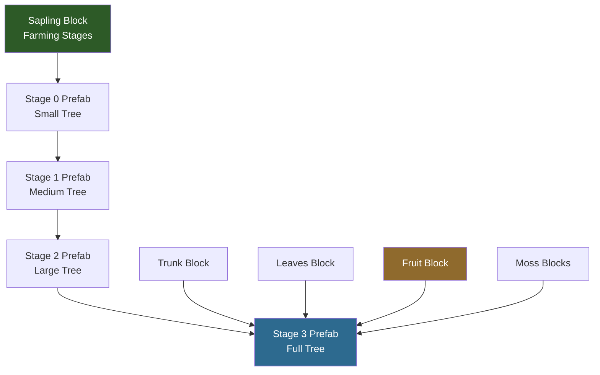

## O Que Você Vai Construir

Uma **Árvore Encantada** — um tipo de árvore personalizado que os jogadores podem cultivar a partir de uma muda próxima a blocos Crystal Glow. Quando totalmente crescida, a árvore fornece **Enchanted Wood** (blocos de tronco) para fabricação, **Light Shards** (frutas brilhantes) e blocos decorativos de **Crystal Moss**. A árvore usa modelos de folhas da árvore Azure e tronco Ash como base, com texturas personalizadas e uma mecânica única de crescimento por luz cristalina.


## O Que Você Vai Aprender

- Como as árvores do Hytale são compostas por múltiplos tipos de bloco (tronco, folhas, frutas, muda, musgo)
- Como a herança via `Parent` cria variantes de árvores a partir de tipos existentes
- Como o sistema de `Farming` controla o crescimento da muda através de estágios de prefab
- Como criar um `Growth Modifier` personalizado que responde a cores de luz específicas
- Como configurar blocos de fruta que emitem luz
- Como o `PrefabList` registra estruturas de árvores para o motor do jogo

## Pré-requisitos

- Complete primeiro o tutorial [Criar um Bloco Personalizado](/hytale-modding-docs/tutorials/beginner/create-a-block/) — este mod **depende do Crystal Glow Block** criado naquele tutorial para sua mecânica de crescimento
- Uma pasta de mod com um `manifest.json` válido (veja [Configurar o Ambiente de Desenvolvimento](/hytale-modding-docs/tutorials/beginner/setup-dev-environment/))
- O [mod Crystal Glow Block](https://github.com/nevesb/hytale-mods-custom-block) instalado e funcionando na sua pasta de mods
- Texturas personalizadas para tronco, folhas e frutas (ou reutilize as texturas Azure/Ash para testes)

## Repositório Git

O mod completo e funcional está disponível como repositório no GitHub:

```text
https://github.com/nevesb/hytale-mods-custom-tree
```

Clone-o e copie o conteúdo para o diretório de mods do Hytale para testar imediatamente.

---

## Visão Geral do Sistema de Árvores

Uma árvore do Hytale não é um único asset — é uma **composição de múltiplos tipos de blocos** mais um **sistema de crescimento** que os monta na forma de uma árvore:



| Componente | Localização do Arquivo | Finalidade |
|-----------|--------------|---------|
| **Tronco** | `Server/Item/Items/Wood/` | O bloco de madeira — dropa ao ser cortado, usado como material de construção |
| **Folhas** | `Server/Item/Items/Plant/Leaves/` | Copa decorativa — se decompõe quando o tronco é removido |
| **Fruta** | `Server/Item/Items/Plant/Fruit/` | Item coletável que cresce na árvore — pode brilhar, ser consumido ou usado como material de fabricação |
| **Muda** | `Server/Item/Items/Plant/` | Bloco plantável com estágios de `Farming` que cresce até se tornar uma árvore ao longo do tempo |
| **Musgo** | `Server/Item/Items/Plant/Moss/` | Blocos decorativos que crescem no tronco — musgo de parede e tapete de musgo |
| **Growth Modifier** | `Server/Farming/Modifiers/` | Controla quais condições ambientais aceleram o crescimento |
| **PrefabList** | `Server/PrefabList/` | Registro que indica ao motor do jogo onde encontrar os arquivos de prefab da árvore para cada estágio de crescimento |

Cada prefab (`.prefab.json`) é um modelo contendo as posições exatas dos blocos que formam o formato da árvore naquele estágio. O sistema de `Farming` da muda faz a transição entre esses prefabs ao longo do tempo.

---

## Passo 1: Criar o Bloco de Tronco

O tronco é o que os jogadores cortam para obter madeira. Herdamos do `Wood_Ash_Trunk` e sobrescrevemos apenas as texturas, coleta e cor das partículas.

Crie `Server/Item/Items/Wood/Enchanted/Wood_Enchanted_Trunk.json`:

```json
{
  "TranslationProperties": {
    "Name": "server.items.Wood_Enchanted_Trunk.name",
    "Description": "server.items.Wood_Enchanted_Trunk.description"
  },
  "Parent": "Wood_Ash_Trunk",
  "BlockType": {
    "Textures": [
      {
        "Sides": "BlockTextures/Wood_Trunk_Crystal_Side.png",
        "UpDown": "BlockTextures/Wood_Trunk_Crystal_Top.png",
        "Weight": 1
      }
    ],
    "Gathering": {
      "Breaking": {
        "ItemId": "Wood_Enchanted_Trunk",
        "GatherType": "Woods"
      }
    },
    "ParticleColor": "#5e3b56"
  },
  "ResourceTypes": [
    { "Id": "Wood_Trunk" },
    { "Id": "Wood_All" },
    { "Id": "Fuel" },
    { "Id": "Charcoal" }
  ],
  "Icon": "Icons/ItemsGenerated/Wood_Enchanted_Trunk.png",
  "IconProperties": {
    "Scale": 0.58823,
    "Rotation": [22.5, 45, 22.5],
    "Translation": [0, -13.5]
  }
}
```

### Campos do Tronco

| Campo | Tipo | Finalidade |
|-------|------|---------|
| `Parent` | String | Herda todas as propriedades de bloco do `Wood_Ash_Trunk` (dureza, requisitos de ferramenta, física) |
| `BlockType.Textures` | Array | Configuração de textura. `Sides` para a casca, `UpDown` para a seção transversal vista de cima/baixo |
| `BlockType.Textures[].Weight` | Number | Para múltiplas variantes de textura — `1` significa que esta é a única opção |
| `BlockType.Gathering.Breaking` | Object | O que dropa quando o bloco é quebrado. `GatherType: "Woods"` significa que machados o quebram mais rápido |
| `BlockType.ParticleColor` | String | Cor hex das partículas quando o bloco é atingido ou quebrado |
| `ResourceTypes` | Array | Marca este bloco como madeira para receitas de fabricação. `Wood_Trunk` e `Wood_All` permitem usá-lo em qualquer receita que exija madeira |
| `IconProperties` | Object | Controla como o modelo 3D é renderizado como ícone no inventário (escala, rotação, posição) |

:::tip[Arquivos de Textura]
Os caminhos das texturas são relativos a `Common/`. Você precisa de dois arquivos PNG:
- `Common/BlockTextures/Wood_Trunk_Crystal_Side.png` — textura da casca (faces laterais)
- `Common/BlockTextures/Wood_Trunk_Crystal_Top.png` — textura dos anéis (faces superior/inferior)

Como herdamos do Ash, você pode começar copiando as texturas do tronco Ash e ajustando o matiz para um azul/roxo cristalino.
:::

---

## Passo 2: Criar o Bloco de Folhas

As folhas usam um modelo 3D compartilhado (`Ball.blockymodel`) com uma textura personalizada para a cor. Elas herdam todo o comportamento de decomposição e física do template de folhas Azure.

Crie `Server/Item/Items/Plant/Leaves/Plant_Leaves_Enchanted.json`:

```json
{
  "TranslationProperties": {
    "Name": "server.items.Plant_Leaves_Enchanted.name"
  },
  "Parent": "Plant_Leaves_Azure",
  "Icon": "Icons/ItemsGenerated/Plant_Leaves_Enchanted.png",
  "BlockType": {
    "CustomModel": "Blocks/Foliage/Leaves/Ball.blockymodel",
    "CustomModelTexture": [
      {
        "Texture": "Blocks/Foliage/Leaves/Ball_Textures/Crystal.png",
        "Weight": 1
      }
    ],
    "ParticleColor": "#1c7baf"
  }
}
```

### Campos das Folhas

| Campo | Tipo | Finalidade |
|-------|------|---------|
| `Parent` | String | Herda de `Plant_Leaves_Azure` — obtém decomposição de folhas, transparência e comportamento de quebra |
| `BlockType.CustomModel` | String | Modelo compartilhado de folhas. Todos os tipos de árvore usam o mesmo formato `Ball.blockymodel` |
| `BlockType.CustomModelTexture` | Array | Textura de cor aplicada ao modelo. Altere este PNG para mudar a cor das folhas |
| `BlockType.ParticleColor` | String | Cor das partículas quando as folhas são quebradas. Use uma cor que combine com a textura |

O `Ball.blockymodel` é um modelo vanilla compartilhado em `Common/Blocks/Foliage/Leaves/Ball.blockymodel`. Você só precisa fornecer uma textura personalizada em `Common/Blocks/Foliage/Leaves/Ball_Textures/Crystal.png`.

---

## Passo 3: Criar o Bloco de Fruta (Light Shards)

A fruta é o material de fabricação principal — **Light Shards** que brilham na árvore e dropam quando colhidas. Este bloco emite luz, é transparente e pode ser consumido como alimento.

Crie `Server/Item/Items/Plant/Fruit/Plant_Fruit_Enchanted.json`:

```json
{
  "TranslationProperties": {
    "Name": "server.items.Plant_Fruit_Enchanted.name",
    "Description": "server.items.Plant_Fruit_Enchanted.description"
  },
  "Parent": "Template_Fruit",
  "BlockType": {
    "CustomModel": "Resources/Ingredients/Crystal_Fruit.blockymodel",
    "CustomModelTexture": [
      {
        "Texture": "Resources/Ingredients/Crystal_Fruit_Texture.png",
        "Weight": 1
      }
    ],
    "VariantRotation": "UpDown",
    "Opacity": "Transparent",
    "Light": {
      "Color": "#469"
    },
    "BlockSoundSetId": "Mushroom",
    "BlockParticleSetId": "Dust",
    "ParticleColor": "#326ea7",
    "Gathering": {
      "Harvest": {
        "ItemId": "Plant_Fruit_Enchanted"
      },
      "Soft": {
        "ItemId": "Plant_Fruit_Enchanted"
      }
    }
  },
  "InteractionVars": {
    "Consume_Charge": {
      "Interactions": [
        {
          "Parent": "Consume_Charge_Food_T1_Inner",
          "Effects": {
            "Particles": [
              {
                "SystemId": "Food_Eat",
                "Color": "#326ea7",
                "TargetNodeName": "Mouth",
                "TargetEntityPart": "Entity"
              }
            ]
          }
        }
      ]
    }
  },
  "Icon": "Icons/ItemsGenerated/Plant_Fruit_Enchanted.png",
  "Scale": 1.75,
  "DropOnDeath": true,
  "Quality": "Common"
}
```

### Campos da Fruta

| Campo | Tipo | Finalidade |
|-------|------|---------|
| `Parent` | String | Herda de `Template_Fruit` — obtém comportamento de colheita, lógica de consumo de alimento |
| `BlockType.CustomModel` | String | Modelo 3D para a fruta. Crie no Blockbench ou reutilize um modelo de fruta existente |
| `BlockType.Opacity` | String | `"Transparent"` — o bloco de fruta não bloqueia luz nem visão |
| `BlockType.Light.Color` | String | Cor hex da luz emitida. `"#469"` produz um brilho azul suave combinando com o tema cristalino |
| `BlockType.VariantRotation` | String | `"UpDown"` — a fruta aparece em diferentes orientações para variedade natural |
| `BlockType.Gathering.Harvest` | Object | O que dropa ao clicar com botão direito na fruta. Permite coletar sem quebrar o bloco |
| `BlockType.Gathering.Soft` | Object | O que dropa ao quebrar o bloco de fruta. Mesmo item, mas o bloco é destruído |
| `InteractionVars` | Object | Define o que acontece ao consumir. Herda de `Consume_Charge_Food_T1_Inner` para cura básica de alimento |
| `Scale` | Number | Multiplicador de escala visual. `1.75` torna a fruta mais visível na árvore |
| `DropOnDeath` | Boolean | `true` — a fruta dropa como item quando o bloco é destruído (árvore cortada ou folhas se decompõem) |

:::caution[Formato da Cor de Luz]
`Light.Color` usa um **hex abreviado de 3 caracteres** onde cada caractere representa R, G, B. `"#469"` se expande para `#446699` — um azul suave. Diferente de `Light.Radius` em itens (que deve ser um inteiro), a luz de blocos usa apenas `Color` e o motor determina o raio a partir das regras de nível de luz do bloco.
:::

---

## Passo 4: Criar os Blocos de Musgo

Blocos de musgo crescem no tronco e ao redor dele, adicionando detalhes visuais. Criamos dois tipos: **musgo de parede** (fixa nas laterais do tronco) e **tapete de musgo** (se espalha no chão perto da base). Ambos usam `Tint` para recolorir as texturas vanilla de musgo azul para combinar com nosso tema cristalino.

### Musgo de Parede

Crie `Server/Item/Items/Plant/Moss/Plant_Moss_Wall_Crystal.json`:

```json
{
  "TranslationProperties": {
    "Name": "server.items.Plant_Moss_Wall_Crystal.name"
  },
  "Parent": "Plant_Moss_Wall_Blue",
  "BlockType": {
    "Gathering": {
      "Soft": {
        "ItemId": "Plant_Moss_Wall_Crystal"
      },
      "UseDefaultDropWhenPlaced": true
    },
    "Tint": ["#88ccff"],
    "ParticleColor": "#88ccff"
  },
  "Icon": "Icons/ItemsGenerated/Plant_Moss_Wall_Crystal.png",
  "IconProperties": {
    "Scale": 0.58823,
    "Rotation": [22.5, 45, 22.5],
    "Translation": [10, -14]
  }
}
```

### Tapete de Musgo

Crie `Server/Item/Items/Plant/Moss/Plant_Moss_Rug_Crystal.json`:

```json
{
  "TranslationProperties": {
    "Name": "server.items.Plant_Moss_Rug_Crystal.name"
  },
  "Parent": "Plant_Moss_Rug_Blue",
  "BlockType": {
    "Gathering": {
      "Soft": {
        "ItemId": "Plant_Moss_Rug_Crystal"
      },
      "UseDefaultDropWhenPlaced": true
    },
    "Light": {
      "Color": "#246"
    },
    "Tint": ["#88ccff"],
    "ParticleColor": "#88ccff"
  },
  "Icon": "Icons/ItemsGenerated/Plant_Moss_Rug_Crystal.png",
  "IconProperties": {
    "Scale": 0.58823,
    "Rotation": [22.5, 45, 22.5],
    "Translation": [0, -7]
  }
}
```

### Campos do Musgo

| Campo | Tipo | Finalidade |
|-------|------|---------|
| `Parent` | String | `Plant_Moss_Wall_Blue` ou `Plant_Moss_Rug_Blue` — herda modelo, regras de posicionamento e comportamento de decomposição |
| `BlockType.Tint` | Array | Matiz de cor aplicado sobre a textura do pai. `"#88ccff"` muda o musgo azul para um azul cristalino combinando com o tema da árvore |
| `BlockType.Light.Color` | String | O tapete de musgo emite um brilho suave `"#246"`, adicionando iluminação sutil no chão ao redor da base da árvore |
| `BlockType.Gathering.Soft` | Object | O que dropa ao quebrar o musgo. Retorna ele mesmo |
| `BlockType.Gathering.UseDefaultDropWhenPlaced` | Boolean | `true` — usa o comportamento de drop padrão vanilla quando o bloco é colocado por um jogador |

:::tip[Usando Tint para Variantes de Cor]
O campo `Tint` é um atalho poderoso — em vez de criar novas texturas, você aplica um filtro de cor sobre as texturas existentes do pai. Isso é ideal para variantes de musgo, grama e flores onde apenas o matiz precisa mudar.
:::

---

## Passo 5: Criar a Muda

A muda é a peça mais complexa — é um bloco plantável que herda de `Plant_Sapling_Oak` e usa o sistema de `Farming` para crescer através de estágios de prefab ao longo do tempo. Ela também usa um **growth modifier CrystalGlow** personalizado que faz a árvore crescer apenas perto da luz dos blocos Crystal Glow.

Crie `Server/Item/Items/Plant/Plant_Sapling_Enchanted.json`:

```json
{
  "TranslationProperties": {
    "Name": "server.items.Plant_Sapling_Enchanted.name",
    "Description": "server.items.Plant_Sapling_Enchanted.description"
  },
  "Parent": "Plant_Sapling_Oak",
  "BlockType": {
    "CustomModelTexture": [
      {
        "Texture": "Blocks/Foliage/Tree/Sapling_Textures/Crystal.png",
        "Weight": 1
      }
    ],
    "ParticleColor": "#44aacc",
    "Farming": {
      "Stages": {
        "Default": [
          {
            "Block": "Plant_Sapling_Enchanted",
            "Duration": {
              "Min": 500000,
              "Max": 800000
            },
            "Type": "BlockType"
          },
          {
            "Prefabs": [
              {
                "Path": "Trees/Enchanted/Stage_0/Enchanted_Stage0_001.prefab.json",
                "Weight": 1
              }
            ],
            "Duration": {
              "Min": 500000,
              "Max": 800000
            },
            "Type": "Prefab",
            "ReplaceMaskTags": ["Soil"],
            "SoundEventId": "SFX_Crops_Grow"
          },
          {
            "Prefabs": [
              {
                "Path": "Trees/Enchanted/Stage_1/Enchanted_Stage1_001.prefab.json",
                "Weight": 1
              }
            ],
            "Duration": {
              "Min": 500000,
              "Max": 800000
            },
            "Type": "Prefab",
            "ReplaceMaskTags": ["Soil"],
            "SoundEventId": "SFX_Crops_Grow"
          },
          {
            "Prefabs": [
              {
                "Path": "Trees/Enchanted/Stage_2/Enchanted_Stage2_001.prefab.json",
                "Weight": 1
              }
            ],
            "Duration": {
              "Min": 500000,
              "Max": 800000
            },
            "Type": "Prefab",
            "ReplaceMaskTags": ["Soil"],
            "SoundEventId": "SFX_Crops_Grow"
          },
          {
            "Prefabs": [
              {
                "Path": "Trees/Enchanted/Stage_3/Enchanted_Stage3_001.prefab.json",
                "Weight": 1
              }
            ],
            "Type": "Prefab",
            "ReplaceMaskTags": ["Soil"],
            "SoundEventId": "SFX_Crops_Grow"
          }
        ]
      },
      "StartingStageSet": "Default",
      "ActiveGrowthModifiers": ["CrystalGlow"]
    },
    "Gathering": {
      "Soft": {
        "ItemId": "Plant_Sapling_Enchanted"
      }
    }
  },
  "Icon": "Icons/ItemsGenerated/Plant_Sapling_Enchanted.png",
  "IconProperties": {
    "Scale": 0.58823,
    "Rotation": [0, 0, 0],
    "Translation": [0, -13.5]
  }
}
```

### Como os Estágios de Farming Funcionam

O array `Farming.Stages.Default` define a progressão de crescimento:


| Estágio | Tipo | O Que Acontece |
|---------|------|-------------|
| 0 | `BlockType` | O bloco da muda fica no mundo. Após 500.000–800.000 ticks, faz a transição para o primeiro prefab |
| 1 | `Prefab` | O motor substitui a muda por um prefab de árvore pequena (alguns blocos de tronco + folhas) |
| 2 | `Prefab` | Substitui por um prefab de árvore média (mais alta, mais folhas) |
| 3 | `Prefab` | Substitui por um prefab de árvore grande (galhos, frutas começam a aparecer) |
| 4 | `Prefab` | A árvore final, totalmente crescida. **Sem `Duration`** — permanece permanentemente |

### Diferenças Principais da Muda em Relação a Criar do Zero

Como herdamos de `Plant_Sapling_Oak`, a muda já possui:
- `DrawType: "Model"` e `CustomModel: "Blocks/Foliage/Tree/Sapling.blockymodel"`
- `BlockEntity.Components.FarmingBlock: {}`
- `Support.Down` exigindo solo
- `HitboxType: "Plant_Large"`
- `Group: "Wood"` e `RandomRotation: "YawStep1"`
- Categorias, tags, interações e conjuntos de sons

Precisamos sobrescrever apenas: a **textura**, **cor das partículas**, **estágios de farming** (para apontar para nossos próprios prefabs), **coleta** (para dropar nossa muda) e o **growth modifier**.

### Campos Principais de Farming

| Campo | Tipo | Finalidade |
|-------|------|---------|
| `Stages.Default[].Type` | String | `"BlockType"` para o bloco da muda, `"Prefab"` para estágios do modelo de árvore |
| `Stages.Default[].Block` | String | Para estágios `BlockType`: o ID do bloco (a própria muda) |
| `Stages.Default[].Prefabs` | Array | Para estágios `Prefab`: lista de caminhos de prefab com pesos para seleção aleatória |
| `Stages.Default[].Duration` | Object | `Min`/`Max` em ticks do jogo. O motor escolhe um valor aleatório. Omita no estágio final para torná-lo permanente |
| `Stages.Default[].ReplaceMaskTags` | Array | Tags de blocos que os prefabs podem substituir. `"Soil"` permite que raízes penetrem na terra |
| `Stages.Default[].SoundEventId` | String | Som reproduzido ao fazer a transição para este estágio |
| `StartingStageSet` | String | Qual conjunto de estágios usar inicialmente. `"Default"` é o padrão |
| `ActiveGrowthModifiers` | Array | IDs de growth modifiers. `"CrystalGlow"` é nosso modifier personalizado definido no próximo passo |

:::tip[Múltiplas Variantes de Prefab]
Para adicionar variedade visual, inclua múltiplas entradas no array `Prefabs` de um estágio com `Weight` igual. O motor escolhe uma aleatoriamente:
```json
"Prefabs": [
  { "Path": "Trees/Enchanted/Stage_2/Enchanted_Stage2_001.prefab.json", "Weight": 1 },
  { "Path": "Trees/Enchanted/Stage_2/Enchanted_Stage2_002.prefab.json", "Weight": 1 }
]
```
:::

---

## Passo 6: Criar o Growth Modifier Crystal Glow

Isso é o que torna a Árvore Encantada única — ela só cresce perto de **blocos Crystal Glow** (luz `#88ccff`). O modifier filtra a luz por cor RGB para garantir que apenas a fonte de luz correta ative o crescimento.

Crie `Server/Farming/Modifiers/CrystalGlow.json`:

```json
{
  "Type": "LightLevel",
  "Modifier": 2500,
  "ArtificialLight": {
    "Red": {
      "Min": 0,
      "Max": 5
    },
    "Green": {
      "Min": 1,
      "Max": 127
    },
    "Blue": {
      "Min": 1,
      "Max": 127
    }
  },
  "Sunlight": {
    "Min": 0,
    "Max": 5
  },
  "RequireBoth": true
}
```

### Campos do Growth Modifier

| Campo | Tipo | Finalidade |
|-------|------|---------|
| `Type` | String | `"LightLevel"` — este modifier verifica as condições de luz na posição da muda |
| `Modifier` | Number | Multiplicador de velocidade de crescimento. `2500` dá um boost massivo, fazendo a árvore crescer rápido perto da luz cristalina |
| `ArtificialLight.Red` | Object | Filtro RGB — Red `0-5` filtra tochas e outras fontes de luz quente (componente vermelho alto) |
| `ArtificialLight.Green` | Object | Green `1-127` aceita o componente verde da luz Crystal Glow |
| `ArtificialLight.Blue` | Object | Blue `1-127` aceita o componente azul da luz Crystal Glow |
| `Sunlight` | Object | `0-5` — a árvore só cresce na escuridão ou sombra profunda (luz solar inibe o crescimento) |
| `RequireBoth` | Boolean | `true` — **ambas** as condições de luz artificial E luz solar devem ser atendidas simultaneamente |

:::caution[Como o Filtro RGB Funciona]
O bloco Crystal Glow emite luz `#88ccff`, que tem valores RGB de aproximadamente R:136, G:204, B:255. O modifier aceita isso porque:
- Red `0-5`: O filtro verifica o **nível de vermelho ambiente** na muda, não a cor da fonte de luz diretamente. Em uma área escura iluminada apenas pelo Crystal Glow, o nível de vermelho é baixo.
- Green/Blue `1-127`: Garante que alguma luz artificial está presente (não zero).
- Sunlight `0-5`: Força o plantio subterrâneo/noturno.

Tochas e outras luzes quentes têm componentes vermelhos altos, então **falham** no filtro Red e não ativam o crescimento.
:::

---

## Passo 7: Registrar o PrefabList

O `PrefabList` indica ao motor do jogo onde procurar os arquivos de prefab da sua árvore. Cada estágio de crescimento tem seu próprio diretório.

Crie `Server/PrefabList/Trees_Enchanted.json`:

```json
{
  "Prefabs": [
    {
      "RootDirectory": "Asset",
      "Path": "Trees/Enchanted/Stage_0/",
      "Recursive": true
    },
    {
      "RootDirectory": "Asset",
      "Path": "Trees/Enchanted/Stage_1/",
      "Recursive": true
    },
    {
      "RootDirectory": "Asset",
      "Path": "Trees/Enchanted/Stage_2/",
      "Recursive": true
    },
    {
      "RootDirectory": "Asset",
      "Path": "Trees/Enchanted/Stage_3/",
      "Recursive": true
    }
  ]
}
```

### Campos do PrefabList

| Campo | Tipo | Finalidade |
|-------|------|---------|
| `Prefabs` | Array | Lista de entradas de diretório para varredura |
| `RootDirectory` | String | `"Asset"` — relativo ao diretório `Server/Prefabs/` do mod |
| `Path` | String | Subdiretório contendo arquivos `.prefab.json` para um estágio de crescimento |
| `Recursive` | Boolean | `true` — varre subdiretórios também |

Os arquivos `.prefab.json` propriamente ditos contêm dados de posição de blocos que formam o formato da árvore. Eles são criados usando o editor de prefabs do Hytale no Modo Criativo e contêm referências aos tipos de bloco que definimos acima (tronco, folhas, fruta, musgo). Os prefabs estão incluídos no [repositório complementar](https://github.com/nevesb/hytale-mods-custom-tree).

---

## Passo 8: Adicionar Traduções

Crie arquivos de idioma em `Server/Languages/`:

**`Server/Languages/en-US/server.lang`**
```properties
items.Wood_Enchanted_Trunk.name = Enchanted Wood
items.Wood_Enchanted_Trunk.description = Shimmering wood harvested from an Enchanted Tree.
items.Plant_Leaves_Enchanted.name = Enchanted Leaves
items.Plant_Fruit_Enchanted.name = Light Shard
items.Plant_Fruit_Enchanted.description = A glowing fruit from the Enchanted Tree. Used to craft light-infused ammunition.
items.Plant_Sapling_Enchanted.name = Enchanted Sapling
items.Plant_Sapling_Enchanted.description = Plant on soil to grow an Enchanted Tree.
items.Plant_Moss_Wall_Crystal.name = Crystal Wall Moss
items.Plant_Moss_Rug_Crystal.name = Crystal Moss Rug
```

**`Server/Languages/es/server.lang`**
```properties
items.Wood_Enchanted_Trunk.name = Madera Encantada
items.Wood_Enchanted_Trunk.description = Madera reluciente cosechada de un Arbol Encantado.
items.Plant_Leaves_Enchanted.name = Hojas Encantadas
items.Plant_Fruit_Enchanted.name = Fragmento de Luz
items.Plant_Fruit_Enchanted.description = Una fruta brillante del Arbol Encantado. Se usa para fabricar municion infundida con luz.
items.Plant_Sapling_Enchanted.name = Brote Encantado
items.Plant_Sapling_Enchanted.description = Planta en tierra para hacer crecer un Arbol Encantado.
items.Plant_Moss_Wall_Crystal.name = Musgo de Pared Cristalino
items.Plant_Moss_Rug_Crystal.name = Alfombra de Musgo Cristalino
```

**`Server/Languages/pt-BR/server.lang`**
```properties
items.Wood_Enchanted_Trunk.name = Madeira Encantada
items.Wood_Enchanted_Trunk.description = Madeira reluzente colhida de uma Arvore Encantada.
items.Plant_Leaves_Enchanted.name = Folhas Encantadas
items.Plant_Fruit_Enchanted.name = Fragmento de Luz
items.Plant_Fruit_Enchanted.description = Uma fruta brilhante da Arvore Encantada. Usada para fabricar municao infundida com luz.
items.Plant_Sapling_Enchanted.name = Muda Encantada
items.Plant_Sapling_Enchanted.description = Plante em solo para cultivar uma Arvore Encantada.
items.Plant_Moss_Wall_Crystal.name = Musgo de Parede Cristalino
items.Plant_Moss_Rug_Crystal.name = Tapete de Musgo Cristalino
```

---

## Passo 9: Estrutura Completa do Mod

```text
CreateACustomTree/
├── manifest.json
├── Common/
│   ├── BlockTextures/
│   │   ├── Wood_Trunk_Crystal_Side.png
│   │   └── Wood_Trunk_Crystal_Top.png
│   ├── Blocks/Foliage/
│   │   ├── Leaves/
│   │   │   ├── Ball.blockymodel
│   │   │   └── Ball_Textures/
│   │   │       └── Crystal.png
│   │   └── Tree/
│   │       ├── Sapling.blockymodel
│   │       └── Sapling_Textures/
│   │           └── Crystal.png
│   ├── Resources/Ingredients/
│   │   ├── Crystal_Fruit.blockymodel
│   │   └── Crystal_Fruit_Texture.png
│   └── Icons/ItemsGenerated/
│       ├── Wood_Enchanted_Trunk.png
│       ├── Plant_Sapling_Enchanted.png
│       ├── Plant_Fruit_Enchanted.png
│       ├── Plant_Leaves_Enchanted.png
│       ├── Plant_Moss_Wall_Crystal.png
│       └── Plant_Moss_Rug_Crystal.png
├── Server/
│   ├── Farming/Modifiers/
│   │   └── CrystalGlow.json
│   ├── Item/Items/
│   │   ├── Wood/Enchanted/
│   │   │   └── Wood_Enchanted_Trunk.json
│   │   └── Plant/
│   │       ├── Leaves/
│   │       │   └── Plant_Leaves_Enchanted.json
│   │       ├── Fruit/
│   │       │   └── Plant_Fruit_Enchanted.json
│   │       ├── Moss/
│   │       │   ├── Plant_Moss_Wall_Crystal.json
│   │       │   └── Plant_Moss_Rug_Crystal.json
│   │       └── Plant_Sapling_Enchanted.json
│   ├── PrefabList/
│   │   └── Trees_Enchanted.json
│   ├── Prefabs/Trees/Enchanted/
│   │   ├── Stage_0/Enchanted_Stage0_001.prefab.json
│   │   ├── Stage_1/Enchanted_Stage1_001.prefab.json
│   │   ├── Stage_2/Enchanted_Stage2_001.prefab.json
│   │   └── Stage_3/Enchanted_Stage3_001.prefab.json
│   └── Languages/
│       ├── en-US/server.lang
│       ├── es/server.lang
│       └── pt-BR/server.lang
```

---

## Passo 10: Testar no Jogo

1. Copie a pasta do mod para `%APPDATA%/Hytale/UserData/Mods/`
2. Instale também o [mod Crystal Glow Block](https://github.com/nevesb/hytale-mods-custom-block) — ele é necessário para a mecânica de crescimento
3. Inicie o Hytale e entre no **Modo Criativo**
4. Conceda permissões de operador e invoque os itens:
   ```text
   /op self
   /spawnitem Wood_Enchanted_Trunk
   /spawnitem Plant_Sapling_Enchanted
   /spawnitem Plant_Fruit_Enchanted
   /spawnitem Block_Crystal_Glow
   ```
5. Coloque o tronco e verifique se a textura personalizada aparece
6. Coloque blocos Crystal Glow em uma área escura (subterrâneo ou à noite)
7. Plante a muda no solo perto dos blocos Crystal Glow e confirme:
   - Ela renderiza com a textura de muda cristalina
   - Requer solo abaixo (quebra se o solo for removido)
   - Quebrá-la retorna o item da muda
8. Aguarde o crescimento — o modifier CrystalGlow dá um boost de velocidade de 2500x, então o crescimento deve ser rápido perto da luz cristalina
9. Verifique se a árvore totalmente crescida possui:
   - Blocos de tronco encantado com texturas azul-cristalinas
   - Folhas cristalinas em cor azul-gelo
   - Frutas Light Shard brilhantes
   - Crystal Moss no tronco e no chão

---

## Problemas Comuns

| Problema | Causa | Solução |
|---------|-------|-----|
| Muda é colocada mas nunca cresce | Componente `FarmingBlock` ausente ou sem luz cristalina | Certifique-se de que a muda herda de `Plant_Sapling_Oak` (possui `FarmingBlock`) e coloque blocos Crystal Glow perto, na escuridão |
| `Unknown prefab path` | Arquivo de prefab ausente ou caminho errado | Verifique se os arquivos `.prefab.json` existem nos caminhos referenciados em `Farming.Stages` |
| Muda flutua no ar | `Support` ausente | Herdado de `Plant_Sapling_Oak` — certifique-se de que o parent está correto |
| Fruta não brilha | Formato de `Light` incorreto | Use `"Light": { "Color": "#469" }` dentro de `BlockType` (não no nível raiz) |
| Folhas usam modelo errado | Caminho de `CustomModel` incorreto | Modelos compartilhados como `Ball.blockymodel` ficam em `Blocks/Foliage/Leaves/Ball.blockymodel` |
| Crescimento muito lento | Modifier `CrystalGlow` não está sendo ativado | Verifique se blocos Crystal Glow estão perto, a área está escura (sunlight 0-5) e não há luzes quentes (tochas) próximas |
| Cor do musgo errada | `Tint` não aplicado | Certifique-se de que `Tint` é um array: `["#88ccff"]`, não uma string |
| Árvore cresce com qualquer luz | `ActiveGrowthModifiers` errado | Use `["CrystalGlow"]` e não `["LightLevel"]` genérico |

---

## Como Tudo Se Conecta

A Árvore Encantada fornece materiais essenciais para o restante da série de tutoriais:

- **Enchanted Wood** → usado como material do cabo ao fabricar a [Crystal Sword](/hytale-modding-docs/tutorials/beginner/create-an-item/) e a [Crystal Crossbow](/hytale-modding-docs/tutorials/intermediate/projectile-weapons/)
- **Light Shards** → usados como munição para os projéteis de luz da Crystal Crossbow

Próximo tutorial: [Tabelas de Loot Personalizadas](/hytale-modding-docs/tutorials/intermediate/custom-loot-tables/) — configure tabelas de drop avançadas para que a Árvore Encantada e o Slime dropem os materiais corretos com os pesos adequados.
