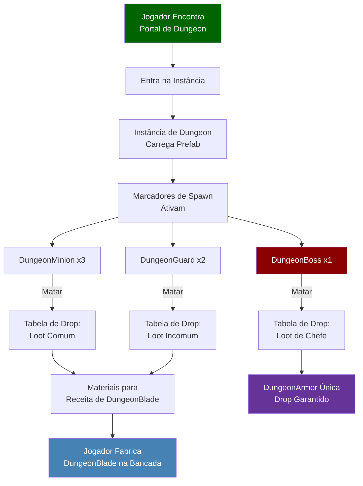
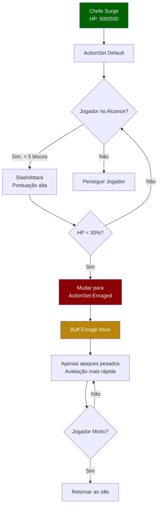

## Visão Geral

Este showcase percorre a estrutura de um mod completo do Hytale chamado **Dude VS Dungeon**. Ele demonstra como múltiplos sistemas se conectam: NPCs personalizados com comportamentos de IA, armas e armaduras únicas, receitas de fabricação, instâncias de dungeon com portais e tabelas de loot que unem tudo.

Este não é um tutorial passo a passo — é um tour guiado de um mod finalizado para mostrar como as peças se encaixam.

## Estrutura do Mod

```
dude_vs_dungeon/
├── manifest.json
├── Server/
│   ├── NPC/
│   │   ├── Roles/
│   │   │   ├── DungeonGuard.json
│   │   │   ├── DungeonBoss.json
│   │   │   └── DungeonMinion.json
│   │   ├── Spawn/
│   │   │   └── Markers/
│   │   │       └── Dungeon_Spawns.json
│   │   └── Balancing/
│   │       ├── CAE_DungeonGuard.json
│   │       └── CAE_DungeonBoss.json
│   ├── Item/
│   │   ├── Items/
│   │   │   ├── Weapon/
│   │   │   │   └── DungeonBlade.json
│   │   │   └── Armor/
│   │   │       └── DungeonArmor_Chest.json
│   │   └── Recipes/
│   │       └── DungeonBlade_Recipe.json
│   ├── Drops/
│   │   ├── Drop_DungeonGuard.json
│   │   ├── Drop_DungeonBoss.json
│   │   └── Drop_DungeonChest.json
│   ├── Instances/
│   │   └── DungeonInstance.json
│   ├── PortalTypes/
│   │   └── DungeonPortal.json
│   └── Models/
│       ├── DungeonGuard.json
│       ├── DungeonBoss.json
│       └── DungeonMinion.json
└── Common/
    └── NPC/
        ├── DungeonGuard/
        ├── DungeonBoss/
        └── DungeonMinion/
```

## Interações entre Sistemas



## Arquivos Principais Explicados

### 1. O Papel do NPC Chefe

O DungeonBoss herda do template de monstro e sobrescreve atributos de combate:

```json
{
  "Reference": "Template_Beasts_Aggressive_Monster",
  "Modify": {
    "Appearance": "dude_vs_dungeon:DungeonBoss",
    "Health": {
      "Parameter": "BossHealth",
      "Compute": { "Base": 500 }
    },
    "MovementSpeed": {
      "Parameter": "BossSpeed",
      "Compute": { "Base": 1.8 }
    },
    "Drops": {
      "Reference": "dude_vs_dungeon:Drop_DungeonBoss"
    },
    "CombatActionEvaluator": "dude_vs_dungeon:CAE_DungeonBoss"
  }
}
```

### 2. IA de Combate do Chefe

O chefe tem múltiplas fases de combate controladas por limites de vida:

```json
{
  "EvaluationInterval": 0.5,
  "AvailableActions": {
    "SlashAttack": {
      "ActionId": "MeleeAttack_Heavy",
      "Conditions": [
        { "Type": "TargetDistance", "Curve": { "ResponseCurve": "SimpleDescendingLogistic", "XRange": [0, 5] } },
        { "Type": "TimeSinceLastUsed", "Curve": { "ResponseCurve": "Linear", "XRange": [0, 3] } }
      ]
    },
    "Enrage": {
      "ActionId": "Buff_Enrage",
      "RunConditions": [
        { "Type": "OwnStatPercent", "Stat": "Health", "Curve": "ReverseLinear" }
      ],
      "Conditions": [
        { "Type": "OwnStatPercent", "Stat": "Health", "Curve": { "Type": "Switch", "SwitchPoint": 0.3 } }
      ]
    }
  },
  "ActionSets": {
    "Default": {
      "Actions": ["SlashAttack"],
      "BasicAttackType": "MeleeAttack_Light"
    },
    "Enraged": {
      "Actions": ["SlashAttack", "Enrage"],
      "BasicAttackType": "MeleeAttack_Heavy"
    }
  }
}
```

### Fluxo de Combate



### 3. Tabela de Loot do Chefe

Drop de armadura única garantido + recompensas de materiais aleatórias:

```json
{
  "Container": {
    "Type": "Multiple",
    "Children": [
      {
        "Type": "Single",
        "Item": "dude_vs_dungeon:DungeonArmor_Chest",
        "Count": 1
      },
      {
        "Type": "Choice",
        "Children": [
          { "Weight": 40, "Type": "Single", "Item": "hytale:Diamond", "Count": [2, 5] },
          { "Weight": 35, "Type": "Single", "Item": "hytale:Gold_Ingot", "Count": [3, 8] },
          { "Weight": 25, "Type": "Single", "Item": "dude_vs_dungeon:DungeonShard", "Count": [1, 3] }
        ]
      }
    ]
  }
}
```

### 4. Instância de Dungeon

O arquivo de instância une tudo — o prefab, marcadores de spawn e portal:

```json
{
  "Prefab": "dude_vs_dungeon:Prefab_DungeonArena",
  "SpawnPoint": { "X": 8, "Y": 1, "Z": 8 },
  "Portal": "dude_vs_dungeon:DungeonPortal",
  "MaxPlayers": 4,
  "ResetTime": "PT30M",
  "Objectives": [
    {
      "Type": "KillNPC",
      "Target": "dude_vs_dungeon:DungeonBoss",
      "Count": 1
    }
  ]
}
```

### 5. A Arma Fabricada

Uma DungeonBlade fabricada a partir de materiais dropados por mobs da dungeon:

```json
{
  "Parent": "Template_Weapon_Sword",
  "Modify": {
    "TranslationKey": "dude_vs_dungeon.item.name.dungeon_blade",
    "BaseDamage": { "Slashing": 25, "Fire": 10 },
    "AttackSpeed": 1.2,
    "Durability": 500,
    "Quality": "Legendary"
  }
}
```

Receita que requer drops da dungeon:

```json
{
  "Inputs": [
    { "Item": "dude_vs_dungeon:DungeonShard", "Count": 5 },
    { "Item": "hytale:Diamond", "Count": 3 },
    { "Item": "hytale:Iron_Ingot", "Count": 10 }
  ],
  "Output": {
    "Item": "dude_vs_dungeon:DungeonBlade",
    "Count": 1
  },
  "BenchRequirement": [
    { "Id": "WorkBench", "RequiredTierLevel": 3 }
  ],
  "ProcessingTime": 10
}
```

## Sistemas Utilizados

Este mod demonstra os seguintes sistemas trabalhando juntos:

| Sistema | Páginas |
|---------|---------|
| Papéis e Templates de NPC | [Papéis de NPC](/hytale-modding-docs/reference/npc-system/npc-roles/), [Templates de NPC](/hytale-modding-docs/reference/npc-system/npc-templates/) |
| IA de Combate | [Tomada de Decisão de NPC](/hytale-modding-docs/reference/npc-system/npc-decision-making/), [Balanceamento de Combate de NPC](/hytale-modding-docs/reference/npc-system/npc-combat-balancing/) |
| Sistema de Spawn | [Regras de Spawn de NPC](/hytale-modding-docs/reference/npc-system/npc-spawn-rules/) |
| Itens e Fabricação | [Definições de Itens](/hytale-modding-docs/reference/item-system/item-definitions/), [Receitas](/hytale-modding-docs/reference/crafting-system/recipes/) |
| Loot | [Tabelas de Drop](/hytale-modding-docs/reference/economy-and-progression/drop-tables/) |
| Dungeons | [Instâncias](/hytale-modding-docs/reference/game-configuration/instances/), [Tipos de Portal](/hytale-modding-docs/reference/world-and-environment/portal-types/) |
| Empacotamento de Mod | [Empacotamento de Mod](/hytale-modding-docs/tutorials/advanced/mod-packaging/) |

## Conclusões

1. **Use herança** — o chefe e as armas estendem templates base, não são construídos do zero
2. **Conecte sistemas** — drops alimentam receitas, marcadores de spawn ativam em instâncias, portais controlam acesso ao conteúdo
3. **Adicione complexidade ao combate em camadas** — o chefe usa action sets baseados em condições para transições de fase
4. **Balanceie com pesos** — loot usa escolhas ponderadas para recompensas variadas mas controladas
5. **Aplique namespace em tudo** — o prefixo `dude_vs_dungeon:` previne conflitos com outros mods
