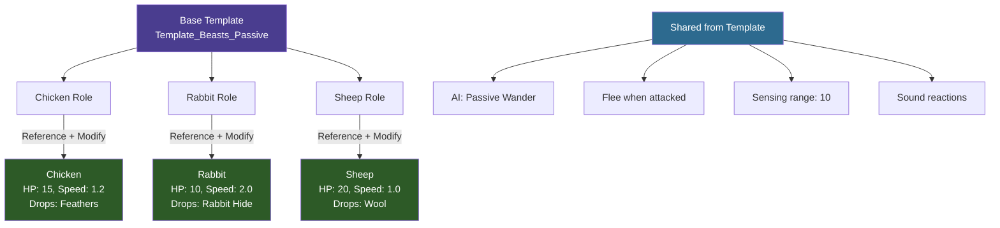
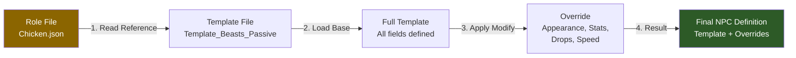

## Overview

Hytale's configuration system uses a template inheritance model. Instead of defining every field for each entity, you create base templates with shared properties, then extend them with specific overrides. This pattern appears across NPC roles, items, gameplay configs, and damage types.

## How Inheritance Works



### Resolution Order



## Inheritance Mechanisms

### Reference + Modify (NPC Roles)

The most common pattern for NPCs. The `Reference` field points to a template, and `Modify` overrides specific fields:

```json
{
  "Reference": "Template_Beasts_Passive_Critter",
  "Modify": {
    "Appearance": "Chicken",
    "MaxHealth": 10,
    "MaxSpeed": 3.0,
    "DropList": "Drop_Chicken",
    "NameTranslationKey": "server.npc.chicken.name"
  }
}
```

The resulting NPC inherits all properties from `Template_Beasts_Passive_Critter` (AI behavior, view range, hearing, flock patterns, etc.) and only overrides the five fields listed in `Modify`.

### Parent (Items, Configs)

Items and gameplay configs use a `Parent` field for single-level inheritance:

```json
{
  "Parent": "Template_Food",
  "TranslationProperties": {
    "Name": "server.items.food_bread.name",
    "Description": "server.items.food_bread.description"
  },
  "Quality": "Uncommon",
  "Recipe": {
    "Input": [{ "ItemId": "Ingredient_Dough", "Quantity": 1 }],
    "Output": [{ "ItemId": "Food_Bread", "Quantity": 1 }],
    "BenchRequirement": { "Type": "Processing", "Id": "Cookingbench" },
    "TimeSeconds": 8
  }
}
```

### Inherits (Damage Types)

Damage types use `Inherits` for classification hierarchies:

```json
{
  "Inherits": "Physical"
}
```

This creates a chain: `Bludgeoning` inherits from `Physical`, which inherits from the base `Damage` type.

### Variant Type

Some NPC files use `"Type": "Variant"` to define multiple variations of the same base entity:

```json
{
  "Type": "Variant",
  "Reference": "Template_Livestock_Cow",
  "Modify": {
    "Appearance": "Cow_Brown"
  }
}
```

## Parameters and Compute

Templates can define parameters with default values, which concrete entities can override:

```json
{
  "Parameters": {
    "BaseHealth": {
      "Value": 100,
      "Description": "Base health for this NPC tier"
    },
    "SpeedMultiplier": {
      "Value": 1.0,
      "Description": "Movement speed modifier"
    }
  },
  "MaxHealth": { "Compute": "BaseHealth" },
  "MaxSpeed": { "Compute": "4.0 * SpeedMultiplier" }
}
```

A child entity overrides parameters to change computed values without redefining the formulas.

## Template Hierarchy

Templates are typically organized in `_Core/Templates/` directories:

```
Server/NPC/Roles/
├── _Core/
│   └── Templates/
│       ├── Template_Beasts_Passive_Critter.json
│       ├── Template_Beasts_Hostile.json
│       ├── Template_Livestock_Cow.json
│       └── Template_Intelligent_Villager.json
├── Critter/
│   ├── Chicken.json          (References Template_Beasts_Passive_Critter)
│   └── Rabbit.json           (References Template_Beasts_Passive_Critter)
└── Beast/
    ├── Bear_Grizzly.json     (References Template_Beasts_Hostile)
    └── Wolf.json             (References Template_Beasts_Hostile)
```

## Best Practices

- **Always reference a template** when creating new entities — don't define every field from scratch
- **Override only what's different** — keep `Modify` blocks small
- **Use Parameters for tuning** — makes balancing easier without touching formulas
- **Check the template first** — read the template file to understand what defaults you inherit

## Related Pages

- [NPC Roles](/hytale-modding-docs/reference/npc-system/npc-roles/) — where Reference/Modify is most used
- [NPC Templates](/hytale-modding-docs/reference/npc-system/npc-templates/) — available base templates
- [Item Definitions](/hytale-modding-docs/reference/item-system/item-definitions/) — Parent inheritance for items
- [Damage Types](/hytale-modding-docs/reference/combat-and-projectiles/damage-types/) — Inherits hierarchy
