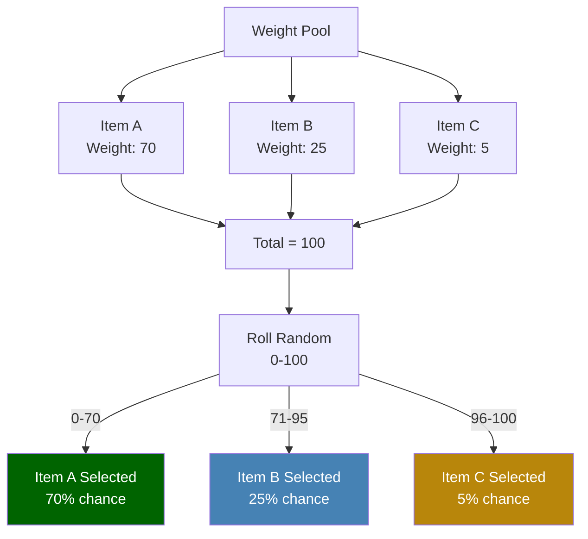
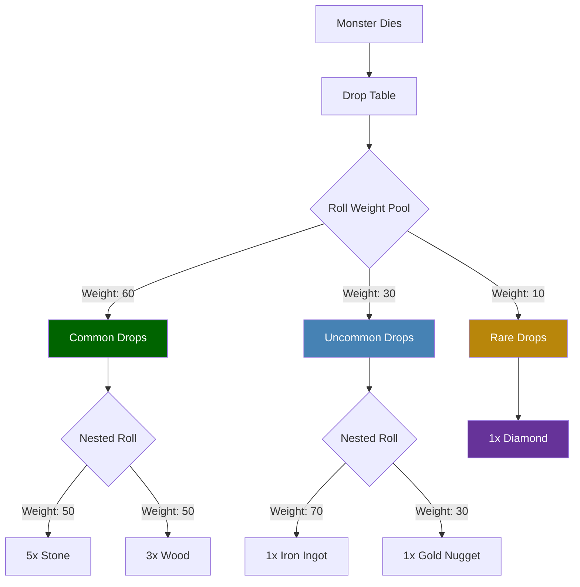

## Overview

Many Hytale systems use weighted random selection to determine outcomes. Weights are relative numbers — a higher weight means a higher probability of being selected. The total doesn't need to equal 100.

## How Weights Work

Given items with weights `[70, 25, 5]`, the probabilities are:
- Item A: 70/100 = 70%
- Item B: 25/100 = 25%
- Item C: 5/100 = 5%

## How Weight Selection Works



### Nested Weight Example (Drop Tables)



## Systems Using Weights

### Drop Tables

Loot drops use weights within `Choice` containers:

```json
{
  "Container": {
    "Type": "Choice",
    "Containers": [
      { "Weight": 80, "Item": { "ItemId": "Coin_Gold", "QuantityMin": 1, "QuantityMax": 3 } },
      { "Weight": 15, "Item": { "ItemId": "Gem_Ruby" } },
      { "Weight": 5, "Item": { "ItemId": "Sword_Rare" } }
    ]
  }
}
```

### NPC Spawning

Spawn rules weight which NPC appears:

```json
{
  "NPCs": [
    { "Weight": 10, "Id": "Chicken", "Flock": "One_Or_Two" },
    { "Weight": 10, "Id": "Rabbit", "Flock": "Group_Small" },
    { "Weight": 5, "Id": "Deer", "Flock": "One_Or_Two" }
  ]
}
```

### Barter Shops (Pool Slots)

Shop inventory pools select trades by weight:

```json
{
  "Type": "Pool",
  "SlotCount": 2,
  "Trades": [
    { "Weight": 10, "Trade": { "Output": [{ "ItemId": "Food_Apple" }], "Input": [{ "ItemId": "Coin_Gold", "Quantity": 5 }] } },
    { "Weight": 5, "Trade": { "Output": [{ "ItemId": "Food_Pie" }], "Input": [{ "ItemId": "Coin_Gold", "Quantity": 12 }] } }
  ]
}
```

### Weather Forecasts

Hourly weather selection uses weights:

```json
{
  "WeatherForecasts": {
    "6": [
      { "WeatherId": "Zone1_Sunny", "Weight": 60 },
      { "WeatherId": "Zone1_Cloudy", "Weight": 30 },
      { "WeatherId": "Zone1_Rain", "Weight": 10 }
    ]
  }
}
```

## Related Pages

- [Drop Tables](/hytale-modding-docs/reference/economy-and-progression/drop-tables/) — loot weight system
- [NPC Spawn Rules](/hytale-modding-docs/reference/npc-system/npc-spawn-rules/) — spawn weights
- [Barter Shops](/hytale-modding-docs/reference/economy-and-progression/barter-shops/) — trade pool weights
