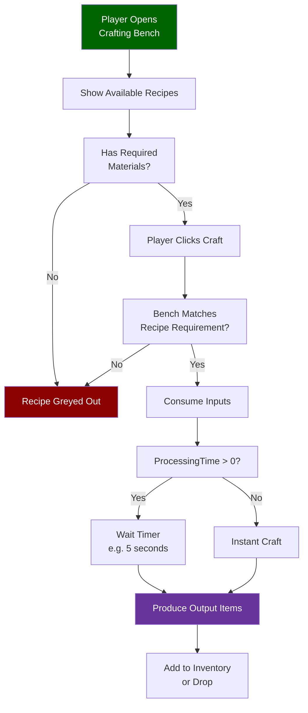
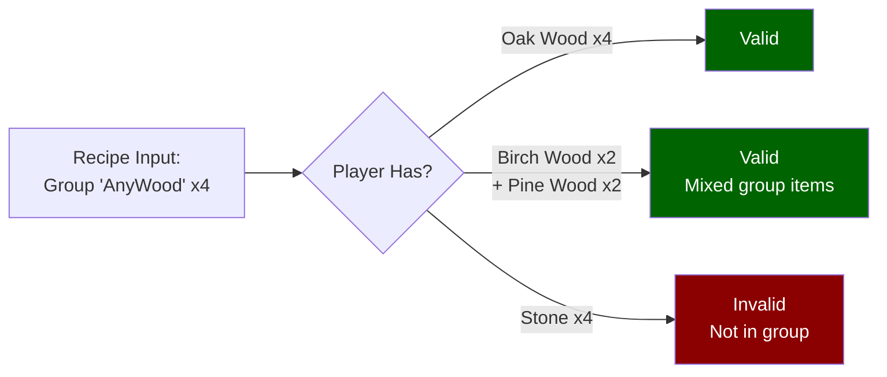

## Overview

Crafting recipes define the transformation of input items or resources into output items. Every recipe specifies what materials are consumed, what is produced, which bench (if any) must be present, and how long the craft takes. Recipes live under `Assets/Server/Item/Recipes/` and are loaded by the item system at runtime.

## How Crafting Works



### Recipe Resolution with Groups



## File Location

```
Assets/Server/Item/Recipes/
```

Salvage recipes are in the sub-directory:

```
Assets/Server/Item/Recipes/Salvage/
```

Some items embed their own recipe directly in their item definition file under `Assets/Server/Item/Items/` using the same schema.

## Schema

### Top-level fields

| Field | Type | Required | Default | Description |
|-------|------|----------|---------|-------------|
| `Input` | `InputEntry[]` | Yes | — | List of items or resource types consumed by the recipe. |
| `Output` | `OutputEntry[]` | No | — | Full list of all items produced. When omitted the item carrying the recipe is the sole output. |
| `PrimaryOutput` | `OutputEntry` | No | — | The "headline" output shown in crafting UI when multiple outputs exist. |
| `BenchRequirement` | `BenchRequirement[]` | No | `[]` | Benches (or fieldcraft) required to perform the craft. |
| `TimeSeconds` | `number` | No | `0` | How many real-world seconds the craft takes. |

### InputEntry

| Field | Type | Required | Default | Description |
|-------|------|----------|---------|-------------|
| `ItemId` | `string` | No¹ | — | Specific item ID to consume. Mutually exclusive with `ResourceTypeId`. |
| `ResourceTypeId` | `string` | No¹ | — | Resource tag to consume (e.g. `"Wood_Trunk"`, `"Rock"`). Any item tagged with this resource type satisfies the slot. |
| `Quantity` | `number` | Yes | — | Number of items or resource units consumed. |

¹ Exactly one of `ItemId` or `ResourceTypeId` must be present per entry.

### OutputEntry

| Field | Type | Required | Default | Description |
|-------|------|----------|---------|-------------|
| `ItemId` | `string` | Yes | — | ID of the item produced. |
| `Quantity` | `number` | No | `1` | Stack size of the produced item. |

### BenchRequirement

| Field | Type | Required | Default | Description |
|-------|------|----------|---------|-------------|
| `Type` | `"Crafting" \| "Processing"` | Yes | — | Whether the bench is a crafting station or a processing station. |
| `Id` | `string` | Yes | — | The bench ID (e.g. `"Workbench"`, `"Campfire"`, `"Fieldcraft"`). |
| `Categories` | `string[]` | No | — | Optional list of category slots on the bench that must be active for this recipe to appear. |

## Example

**Salvage recipe** (`Assets/Server/Item/Recipes/Salvage/Salvage_Armor_Adamantite_Chest.json`):

```json
{
  "Input": [
    {
      "ItemId": "Armor_Adamantite_Chest",
      "Quantity": 1
    }
  ],
  "PrimaryOutput": {
    "ItemId": "Ore_Adamantite",
    "Quantity": 6
  },
  "Output": [
    {
      "ItemId": "Ore_Adamantite",
      "Quantity": 6
    },
    {
      "ItemId": "Ingredient_Hide_Heavy",
      "Quantity": 2
    },
    {
      "ItemId": "Ingredient_Fabric_Scrap_Cindercloth",
      "Quantity": 2
    }
  ],
  "BenchRequirement": [
    {
      "Type": "Processing",
      "Id": "Salvagebench"
    }
  ],
  "TimeSeconds": 4
}
```

**Inline recipe in an item file** (from `Assets/Server/Item/Items/Bench/Bench_Campfire.json`):

```json
{
  "Recipe": {
    "TimeSeconds": 1,
    "Input": [
      { "ItemId": "Ingredient_Stick", "Quantity": 4 },
      { "ResourceTypeId": "Rubble", "Quantity": 2 }
    ],
    "BenchRequirement": [
      { "Type": "Crafting", "Categories": ["Tools"], "Id": "Fieldcraft" },
      { "Id": "Workbench", "Type": "Crafting", "Categories": ["Workbench_Survival"] }
    ]
  }
}
```

## Related Pages

- [Bench Definitions](/hytale-modding-docs/reference/crafting-system/bench-definitions) — how benches are defined and configured
- [Salvage](/hytale-modding-docs/reference/crafting-system/salvage) — salvage-specific recipe format
- [Drop Tables](/hytale-modding-docs/reference/economy-and-progression/drop-tables) — loot from world containers
