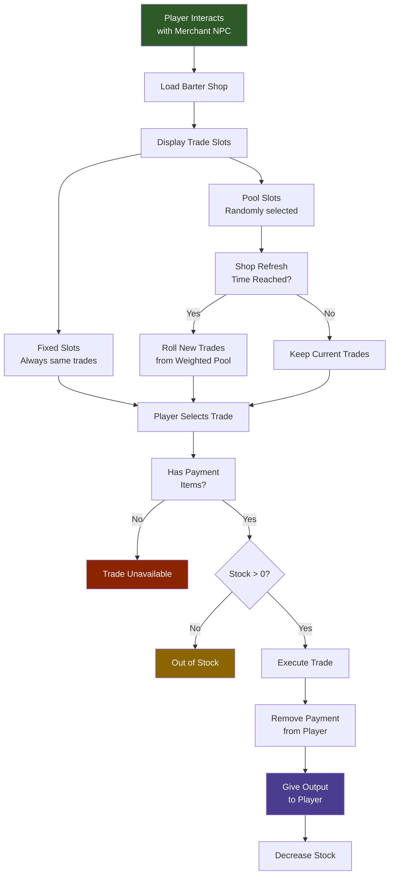

## Overview

Barter shops define the inventory of NPC merchants: what they sell, what they accept as payment, how much stock is available, and when it refreshes. Each shop file contains a list of `TradeSlots` that are either `Fixed` (always the same trade) or `Pool` (randomly selected from a weighted list of possible trades at each refresh). The shop stock resets on a configurable daily schedule.

## How NPC Trading Works



## File Location

```
Assets/Server/BarterShops/
  Klops_Merchant.json
  Kweebec_Merchant.json
```

## Schema

### Top-level

| Field | Type | Required | Default | Description |
|-------|------|----------|---------|-------------|
| `DisplayNameKey` | `string` | Yes | — | Localisation key for the shop's display name shown in the UI. |
| `RefreshInterval` | `RefreshInterval` | Yes | — | How often the shop's stock resets. |
| `RestockHour` | `number` | Yes | — | In-game hour (0–23) at which the stock refreshes each cycle. |
| `TradeSlots` | `TradeSlot[]` | Yes | — | Ordered list of trade slots displayed in the shop UI. |

### RefreshInterval

| Field | Type | Required | Default | Description |
|-------|------|----------|---------|-------------|
| `Days` | `number` | No | — | Number of in-game days between restocks. |

### TradeSlot

| Field | Type | Required | Default | Description |
|-------|------|----------|---------|-------------|
| `Type` | `"Fixed" \| "Pool"` | Yes | — | `Fixed` always shows the same trade. `Pool` randomly picks trades from a weighted list. |
| `Trade` | `Trade` | No | — | The single trade for `Fixed` slots. |
| `SlotCount` | `number` | No | — | `Pool` only. Number of trades randomly selected from `Trades` to display. |
| `Trades` | `PoolTrade[]` | No | — | `Pool` only. Weighted list of possible trades to sample from. |

### Trade (Fixed)

| Field | Type | Required | Default | Description |
|-------|------|----------|---------|-------------|
| `Output` | `TradeItem` | Yes | — | The item the player receives. |
| `Input` | `TradeItem[]` | Yes | — | Items the player must provide as payment (one or more). |
| `Stock` | `number` | Yes | — | Number of times this trade can be completed before the slot runs out of stock. |

### PoolTrade

| Field | Type | Required | Default | Description |
|-------|------|----------|---------|-------------|
| `Weight` | `number` | Yes | — | Relative probability this trade is selected when the pool is sampled. |
| `Output` | `TradeItem` | Yes | — | The item the player receives. |
| `Input` | `TradeItem[]` | Yes | — | Items the player must provide as payment. |
| `Stock` | `number \| [number, number]` | Yes | — | Fixed stock count, or `[min, max]` range for randomised stock on each refresh. |

### TradeItem

| Field | Type | Required | Default | Description |
|-------|------|----------|---------|-------------|
| `ItemId` | `string` | Yes | — | ID of the item. |
| `Quantity` | `number` | Yes | — | Stack size of the item. |

## Examples

**Simple fixed shop** (`Assets/Server/BarterShops/Klops_Merchant.json`):

```json
{
  "DisplayNameKey": "server.barter.klops_merchant.title",
  "RefreshInterval": {
    "Days": 1
  },
  "RestockHour": 6,
  "TradeSlots": [
    {
      "Type": "Fixed",
      "Trade": {
        "Output": { "ItemId": "Furniture_Construction_Sign", "Quantity": 1 },
        "Input": [{ "ItemId": "Furniture_Construction_Sign", "Quantity": 1 }],
        "Stock": 1
      }
    }
  ]
}
```

**Mixed fixed and pool shop** (`Assets/Server/BarterShops/Kweebec_Merchant.json`, condensed):

```json
{
  "DisplayNameKey": "server.barter.kweebec_merchant.title",
  "RefreshInterval": {
    "Days": 3
  },
  "RestockHour": 6,
  "TradeSlots": [
    {
      "Type": "Fixed",
      "Trade": {
        "Output": { "ItemId": "Ingredient_Spices", "Quantity": 3 },
        "Input": [{ "ItemId": "Ingredient_Life_Essence", "Quantity": 20 }],
        "Stock": 10
      }
    },
    {
      "Type": "Pool",
      "SlotCount": 3,
      "Trades": [
        {
          "Weight": 50,
          "Output": { "ItemId": "Plant_Crop_Berry_Block", "Quantity": 1 },
          "Input": [{ "ItemId": "Ingredient_Life_Essence", "Quantity": 30 }],
          "Stock": [10, 20]
        },
        {
          "Weight": 30,
          "Output": { "ItemId": "Plant_Crop_Berry_Winter_Block", "Quantity": 1 },
          "Input": [{ "ItemId": "Ingredient_Life_Essence", "Quantity": 50 }],
          "Stock": [10, 20]
        },
        {
          "Weight": 20,
          "Output": { "ItemId": "Food_Salad_Berry", "Quantity": 1 },
          "Input": [{ "ItemId": "Ingredient_Life_Essence", "Quantity": 15 }],
          "Stock": [4, 8]
        }
      ]
    }
  ]
}
```

In the pool slot above, 3 trades are randomly chosen from the weighted list each time the shop refreshes every 3 days at hour 6. Stock is randomised between the min and max values.

## Related Pages

- [Drop Tables](/hytale-modding-docs/reference/economy-and-progression/drop-tables) — loot from containers and NPCs
- [Farming & Coops](/hytale-modding-docs/reference/economy-and-progression/farming-coops) — alternative resource production
