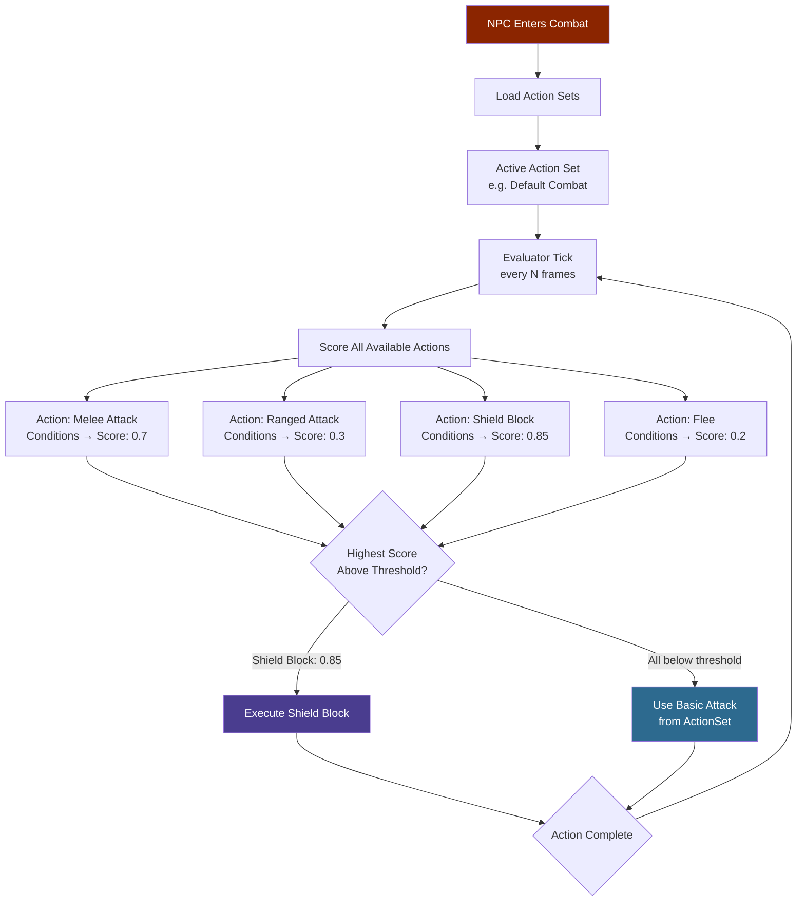
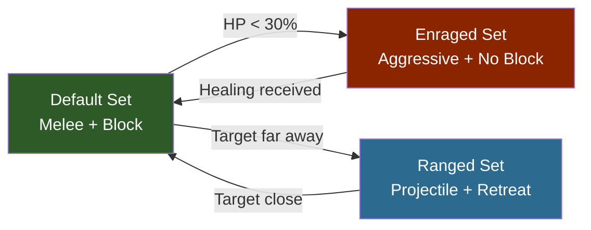

## Overview

Combat Action Evaluator (CAE) files configure the utility-AI system that drives NPC combat. Each file defines how frequently the evaluator runs, a set of named available actions with scoring conditions, and one or more action sets that group which actions and basic attacks are active in a given combat state. The evaluator scores all available actions each tick and executes the highest-scoring one above a minimum threshold.

## Combat AI Flow



### Action Set Transitions



## File Location

- `Assets/Server/NPC/Balancing/Beast/*.json` — Animal and creature CAEs
- `Assets/Server/NPC/Balancing/Intelligent/*.json` — Faction NPC CAEs
- `Assets/Server/NPC/Balancing/CAE_Test_*.json` — Test and reference CAEs

## Schema

### Top-level fields

| Field | Type | Required | Default | Description |
|-------|------|----------|---------|-------------|
| `Type` | `"CombatActionEvaluator"` | Yes | — | Identifies this as a CAE file. |
| `TargetMemoryDuration` | number | No | — | How many seconds the NPC remembers a target after losing sight of it. |
| `CombatActionEvaluator` | object | Yes | — | The evaluator configuration block (see below). |

### CombatActionEvaluator block

| Field | Type | Required | Default | Description |
|-------|------|----------|---------|-------------|
| `RunConditions` | array | No | — | Conditions evaluated before running the full evaluator. All must pass for the evaluator to proceed this tick. |
| `MinRunUtility` | number | No | — | Minimum combined utility score from `RunConditions` required to run the evaluator. |
| `MinActionUtility` | number | No | — | Minimum utility score an action must reach to be considered for execution. |
| `AvailableActions` | object | Yes | — | Named action definitions. Keys are action IDs referenced by `ActionSets`. |
| `ActionSets` | object | Yes | — | Named sets of active actions and basic attacks. The active set is controlled by the NPC's combat sub-state. |

### RunConditions array entry

Each entry is a condition object (see [NPC Decision Making](/hytale-modding-docs/reference/npc-system/npc-decision-making)). Commonly used:

| Type | Purpose |
|------|---------|
| `TimeSinceLastUsed` | Throttles how often the evaluator fires. |
| `Randomiser` | Adds randomness to prevent perfectly predictable behavior. |

### AvailableActions entry

Each key in `AvailableActions` is a named action. The action object fields:

| Field | Type | Required | Default | Description |
|-------|------|----------|---------|-------------|
| `Type` | string | Yes | — | Action type. See action types table below. |
| `Description` | string | No | — | Human-readable description of the action. |
| `Target` | string | No | — | Target category: `"Hostile"`, `"Friendly"`, `"Self"`. |
| `WeaponSlot` | number | No | — | Weapon slot index used for this action. |
| `SubState` | string | No | — | Combat sub-state to activate when this action runs (maps to an `ActionSets` key). |
| `Ability` | string | No | — | Ability ID to execute. |
| `AttackDistanceRange` | [number, number] | No | — | `[min, max]` distance in blocks within which this action can be used. |
| `PostExecuteDistanceRange` | [number, number] | No | — | Distance range the NPC tries to maintain after executing. |
| `ChargeFor` | number | No | — | Seconds to charge before executing. |
| `WeightCoefficient` | number | No | `1.0` | Multiplier applied to this action's final utility score. |
| `InteractionVars` | object | No | — | Interaction variable overrides applied when this action fires. |
| `Conditions` | array | No | — | Scoring conditions for this specific action (see [NPC Decision Making](/hytale-modding-docs/reference/npc-system/npc-decision-making)). |

### Action Types

| Type | Description |
|------|-------------|
| `SelectBasicAttackTarget` | Selects a target for basic attacks using the conditions to score candidates. |
| `Ability` | Executes a named ability (melee swing, ranged throw, heal, etc.). |

### ActionSets entry

Each key in `ActionSets` is a sub-state name (e.g. `"Default"`, `"Ranged"`, `"Attack"`). The value:

| Field | Type | Required | Default | Description |
|-------|------|----------|---------|-------------|
| `BasicAttacks` | object | No | — | Basic attack configuration for this sub-state (see below). |
| `Actions` | string[] | No | — | List of action IDs from `AvailableActions` that are evaluated in this sub-state. |

### BasicAttacks object

| Field | Type | Required | Default | Description |
|-------|------|----------|---------|-------------|
| `Attacks` | string[] | Yes | — | Ability IDs used as basic attacks. |
| `Randomise` | boolean | No | `false` | If `true`, selects randomly from the `Attacks` list each cycle. |
| `MaxRange` | number | No | — | Maximum range in blocks for basic attacks. |
| `Timeout` | number | No | — | Seconds to wait for the attack to land before cancelling. |
| `CooldownRange` | [number, number] | No | — | `[min, max]` cooldown in seconds between basic attacks. |
| `UseProjectedDistance` | boolean | No | `false` | If `true`, uses projected (predicted) distance instead of current distance. |
| `InteractionVars` | object | No | — | Interaction variable overrides for all basic attacks in this set. |

## Examples

### Simple beast CAE (Rat)

A rat with a single bite attack, no special abilities:

```json
{
  "Type": "CombatActionEvaluator",
  "TargetMemoryDuration": 10,
  "CombatActionEvaluator": {
    "RunConditions": [
      {
        "Type": "TimeSinceLastUsed",
        "Curve": { "ResponseCurve": "Linear", "XRange": [0, 10] }
      },
      {
        "Type": "Randomiser",
        "MinValue": 0.9,
        "MaxValue": 1
      }
    ],
    "MinRunUtility": 0.5,
    "MinActionUtility": 0.01,
    "AvailableActions": {
      "SelectTarget": {
        "Type": "SelectBasicAttackTarget",
        "Description": "Select a target",
        "Conditions": [
          {
            "Type": "TargetDistance",
            "Curve": { "ResponseCurve": "SimpleDescendingLogistic", "XRange": [0, 15] }
          }
        ]
      }
    },
    "ActionSets": {
      "Default": {
        "BasicAttacks": {
          "Attacks": ["Rat_Bite"],
          "Randomise": false,
          "MaxRange": 2,
          "Timeout": 0.5,
          "CooldownRange": [0.001, 0.001]
        },
        "Actions": ["SelectTarget"]
      }
    }
  }
}
```

### Intelligent NPC CAE (Goblin Scrapper) — multiple action sets

A goblin that switches between melee and ranged sub-states:

```json
{
  "Type": "CombatActionEvaluator",
  "TargetMemoryDuration": 5,
  "CombatActionEvaluator": {
    "RunConditions": [
      {
        "Type": "TimeSinceLastUsed",
        "Curve": { "ResponseCurve": "Linear", "XRange": [0, 5] }
      },
      { "Type": "Randomiser", "MinValue": 0.9, "MaxValue": 1 }
    ],
    "MinRunUtility": 0.5,
    "MinActionUtility": 0.01,
    "AvailableActions": {
      "Melee": {
        "Type": "Ability",
        "Description": "Quick melee swing",
        "WeaponSlot": 0,
        "SubState": "Default",
        "Ability": "Goblin_Scrapper_Attack",
        "Target": "Hostile",
        "AttackDistanceRange": [2.5, 2.5],
        "PostExecuteDistanceRange": [2.5, 2.5],
        "Conditions": [
          {
            "Type": "TimeSinceLastUsed",
            "Curve": { "ResponseCurve": "Linear", "XRange": [0, 1] }
          }
        ]
      },
      "Ranged": {
        "Type": "Ability",
        "Description": "Throw rubble from range",
        "WeaponSlot": 0,
        "SubState": "Ranged",
        "Ability": "Goblin_Scrapper_Rubble_Throw",
        "Target": "Hostile",
        "AttackDistanceRange": [15, 15],
        "PostExecuteDistanceRange": [2.5, 2.5],
        "Conditions": [
          {
            "Type": "TimeSinceLastUsed",
            "Curve": { "ResponseCurve": "Linear", "XRange": [0, 2] }
          },
          {
            "Type": "TargetDistance",
            "Curve": { "ResponseCurve": "SimpleLogistic", "XRange": [0, 15] }
          }
        ]
      }
    },
    "ActionSets": {
      "Default": {
        "BasicAttacks": {
          "Attacks": ["Goblin_Scrapper_Attack"],
          "Randomise": false,
          "MaxRange": 2.5,
          "Timeout": 0.5,
          "CooldownRange": [0.001, 0.001]
        },
        "Actions": ["SwingDown", "Ranged"]
      },
      "Ranged": {
        "BasicAttacks": {
          "Attacks": ["Goblin_Scrapper_Rubble_Throw"],
          "Randomise": false,
          "MaxRange": 15,
          "Timeout": 0.5,
          "CooldownRange": [0.8, 2]
        },
        "Actions": ["Melee"]
      }
    }
  }
}
```

## Related Pages

- [NPC Decision Making](/hytale-modding-docs/reference/npc-system/npc-decision-making) — Condition types used in `RunConditions` and `AvailableActions[*].Conditions`
- [NPC Roles](/hytale-modding-docs/reference/npc-system/npc-roles) — Role files that reference CAE files via the `_CombatConfig` field in `Modify`
- [NPC Templates](/hytale-modding-docs/reference/npc-system/npc-templates) — Templates that wire up the combat evaluator via the `Instructions` tree
