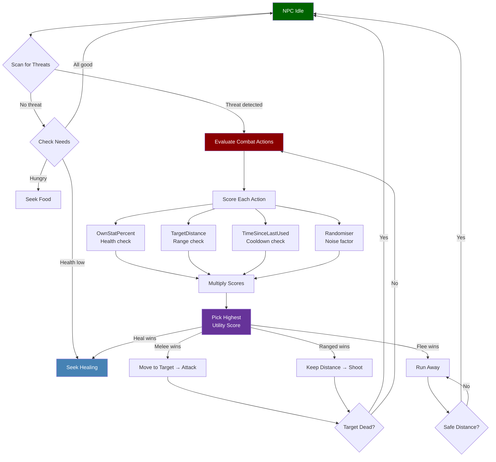
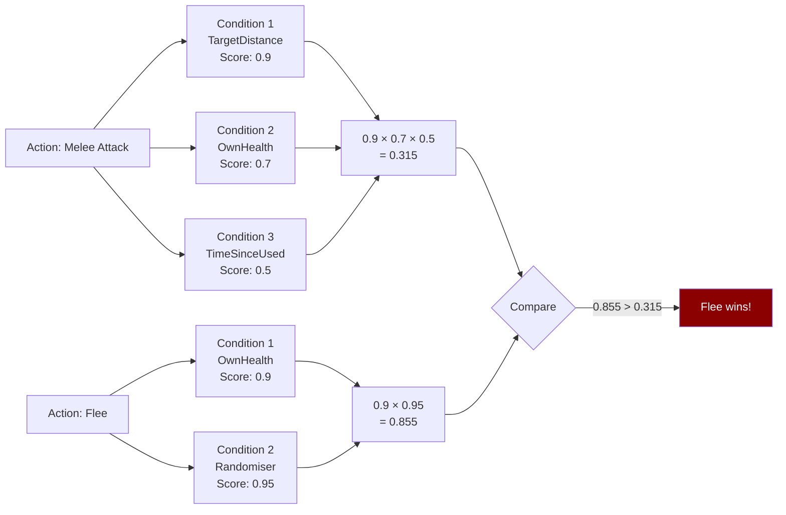

## Overview

Decision making condition files define reusable scoring functions that the NPC AI evaluates to decide what to do next. Each condition has a `Type` that names the metric being measured, a `Stat` specifying which game stat to read (where applicable), and a `Curve` controlling how raw values are mapped to utility scores between 0 and 1. These conditions appear inside both `DecisionMaking/Conditions/` standalone files and inline within Combat Action Evaluator action definitions.

## File Location

`Assets/Server/NPC/DecisionMaking/Conditions/*.json`

Conditions are also used inline inside `AvailableActions[*].Conditions` arrays within balancing files. See [NPC Combat Balancing](/hytale-modding-docs/reference/npc-system/npc-combat-balancing).

## Schema

### Condition object

| Field | Type | Required | Default | Description |
|-------|------|----------|---------|-------------|
| `Type` | string | Yes | — | The condition type (see table below). |
| `Stat` | string | No | — | The stat to read. Used by stat-based condition types. |
| `Curve` | string \| object | No | — | How to map the raw value to a 0–1 utility score. Can be a named curve string or an inline curve object. |
| `MinValue` | number | No | — | Minimum clamp for the raw value (used by `Randomiser`). |
| `MaxValue` | number | No | — | Maximum clamp for the raw value (used by `Randomiser`). |

### Condition Types

| Type | Description | Key Fields |
|------|-------------|------------|
| `OwnStatPercent` | Scores based on this NPC's own stat as a percentage of its maximum. | `Stat`, `Curve` |
| `TargetStatPercent` | Scores based on the target NPC's stat as a percentage of its maximum. | `Stat`, `Curve` |
| `TargetDistance` | Scores based on the distance to the current target. | `Curve` |
| `TimeSinceLastUsed` | Scores based on how long ago this action was last used. | `Curve` |
| `Randomiser` | Adds a random score component between `MinValue` and `MaxValue`. | `MinValue`, `MaxValue` |

### Stat values

| Stat | Description |
|------|-------------|
| `Health` | Current hit points. |

### Curve values

A `Curve` can be a named string shorthand or an inline object:

**Named string shorthand:**

| Value | Shape | Use case |
|-------|-------|----------|
| `"Linear"` | Linearly increases from 0 to 1 as the stat increases. | Prefer actions when stat is high. |
| `"ReverseLinear"` | Linearly decreases from 1 to 0 as the stat increases. | Prefer actions when stat is low (e.g. heal when hurt). |

**Inline curve object:**

| Field | Type | Description |
|-------|------|-------------|
| `ResponseCurve` | string | Named response curve shape (see below). |
| `XRange` | [number, number] | The input range `[min, max]` for the raw value. Values outside this range are clamped. |
| `Type` | `"Switch"` | Alternative inline form for a hard threshold. |
| `SwitchPoint` | number | For `Type: "Switch"` — the raw value at which the score flips from 0 to 1. |

**Named response curves (`ResponseCurve`):**

| Value | Shape |
|-------|-------|
| `"Linear"` | Straight line from 0 to 1 across `XRange`. |
| `"SimpleLogistic"` | S-curve increasing toward 1. Useful for "prefer when close". |
| `"SimpleDescendingLogistic"` | S-curve decreasing toward 0. Useful for "prefer when far". |

## How NPC Decision Making Works



### How Utility Scoring Works

Each available action has a list of `Conditions`. The NPC evaluates every condition to produce a score between 0 and 1, then **multiplies** all scores together. The action with the highest final score wins.



## Examples

### Standalone condition file — Linear HP

Scores an NPC's own health linearly: full health = score 1, dead = score 0.

```json
{
  "Type": "OwnStatPercent",
  "Stat": "Health",
  "Curve": "Linear"
}
```

### Inline condition — target distance (descending)

Prefers this action when the target is close; score drops as distance increases toward 15 blocks.

```json
{
  "Type": "TargetDistance",
  "Curve": {
    "ResponseCurve": "SimpleDescendingLogistic",
    "XRange": [0, 15]
  }
}
```

### Inline condition — time since last used

Scores an action higher the longer it has been since it was used, over a 10-second window.

```json
{
  "Type": "TimeSinceLastUsed",
  "Curve": {
    "ResponseCurve": "Linear",
    "XRange": [0, 10]
  }
}
```

### Inline condition — switch threshold

Scores 1 once 10 seconds have passed, 0 before that (hard gating).

```json
{
  "Type": "TimeSinceLastUsed",
  "Curve": {
    "Type": "Switch",
    "SwitchPoint": 10
  }
}
```

### Inline condition — randomiser

Adds a random noise component between 0.9 and 1.0 to the action's utility score.

```json
{
  "Type": "Randomiser",
  "MinValue": 0.9,
  "MaxValue": 1
}
```

### Inline condition — reverse linear HP (heal when hurt)

Scores highest when health is low, so the NPC prefers healing actions when damaged.

```json
{
  "Type": "OwnStatPercent",
  "Stat": "Health",
  "Curve": "ReverseLinear"
}
```

## Related Pages

- [NPC Combat Balancing](/hytale-modding-docs/reference/npc-system/npc-combat-balancing) — Where conditions appear inside `AvailableActions[*].Conditions` and `RunConditions`
- [NPC Roles](/hytale-modding-docs/reference/npc-system/npc-roles) — Role files that reference decision making via the `Instructions` tree
- [NPC Templates](/hytale-modding-docs/reference/npc-system/npc-templates) — Templates that embed behavior driven by these conditions
