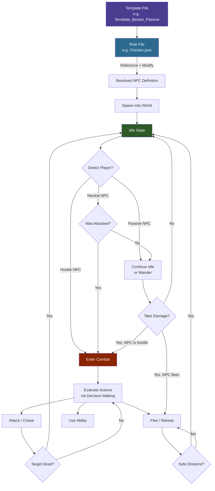

## Overview

An NPC Role file defines everything about a specific NPC: its visual appearance, health and movement stats, sensing ranges, drop tables, flock membership, tameable status, and the AI instruction tree that drives its behavior. Roles are typically `Variant` files that inherit from a template via the `Reference` + `Modify` pattern, overriding only the fields that differ from the base template.

## NPC Role Lifecycle



## File Location

`Assets/Server/NPC/Roles/**/*.json`

Roles are organized into subdirectories by category:

- `_Core/` — Base templates and shared components
- `Aquatic/` — Fish, marine creatures
- `Avian/` — Birds
- `Boss/` — Boss NPCs
- `Creature/Critter/`, `Creature/Livestock/`, `Creature/Mammal/`, `Creature/Mythic/`, `Creature/Reptile/`, `Creature/Vermin/` — Overworld animals
- `Elemental/` — Elemental NPCs
- `Intelligent/Aggressive/`, `Intelligent/Neutral/`, `Intelligent/Passive/` — Faction NPCs and merchants
- `Undead/` — Undead NPCs
- `Void/` — Void creatures

## Schema

### Top-level fields

| Field | Type | Required | Default | Description |
|-------|------|----------|---------|-------------|
| `Type` | `"Abstract"` \| `"Variant"` \| `"Generic"` | Yes | — | `Abstract` = base template (not spawnable). `Variant` = inherits from a `Reference`. `Generic` = standalone, no inheritance. |
| `Reference` | string | For `Variant` | — | The name of the template this role inherits from (e.g. `"Template_Predator"`). |
| `Modify` | object | For `Variant` | — | Fields to override from the referenced template. Any top-level role field can appear here. |
| `StartState` | string | No | Template default | The initial AI state name (e.g. `"Idle"`). |
| `Appearance` | string | No | Template default | The model/rig ID to use for this NPC. Can also be set via `{ "Compute": "Appearance" }` to pull from `Parameters`. |
| `MaxHealth` | number \| Compute | No | Template default | Maximum hit points. Often set via `{ "Compute": "MaxHealth" }`. |
| `MaxSpeed` | number | No | Template default | Maximum movement speed in blocks per second. |
| `ViewRange` | number | No | Template default | Detection range using line-of-sight, in blocks. Set to `0` to disable sight. |
| `ViewSector` | number | No | Template default | The field-of-view arc in degrees (e.g. `180` = half sphere in front). |
| `HearingRange` | number | No | Template default | Detection range using sound, in blocks. Set to `0` to disable hearing. |
| `AlertedRange` | number | No | Template default | Extended detection range when the NPC is already aware of a threat, in blocks. |
| `DropList` | string \| Compute | No | Template default | ID of the loot table used when this NPC is killed. |
| `FlockArray` | string[] \| Compute | No | `[]` | NPC role IDs that belong to this flock type. Used for coordinated group behavior. |
| `AttractiveItemSet` | string[] \| Compute | No | `[]` | Item IDs that this NPC is attracted to when held by a player nearby. |
| `IsTameable` | boolean | No | `false` | Whether this NPC can be tamed by a player. |
| `TameRoleChange` | string | No | — | The role ID to switch to when this NPC is successfully tamed. |
| `ProduceItem` | string | No | — | Item ID produced by this NPC on a timer (e.g. eggs from chickens). |
| `ProduceTimeout` | [string, string] | No | — | ISO 8601 duration range `[min, max]` between produce cycles (e.g. `["PT18H", "PT48H"]`). |
| `MemoriesCategory` | string \| Compute | No | `"Other"` | Category used by the memories system (e.g. `"Predator"`, `"Undead"`, `"Goblin"`). |
| `NameTranslationKey` | string \| Compute | No | — | Translation key for the NPC's display name (e.g. `"server.npcRoles.Fox.name"`). |
| `Parameters` | object | No | — | Named parameter definitions with `Value` and `Description`. Used with `{ "Compute": "<key>" }` references. |
| `Instructions` | array | No | — | The AI instruction tree. Each entry is a selector or step object evaluated each tick. |
| `Sensors` | array | No | — | Sensor configuration for detecting entities and world state. |
| `Actions` | array | No | — | List of action definitions available to the AI. |
| `DisableDamageGroups` | string[] | No | — | Damage source group IDs that cannot damage this NPC (e.g. `["Self", "Player"]`). |
| `Invulnerable` | boolean \| Compute | No | `false` | If `true`, the NPC takes no damage. |
| `KnockbackScale` | number | No | `1.0` | Multiplier for knockback received. `0` = no knockback. |
| `MotionControllerList` | array | No | — | Physics and locomotion controllers (e.g. Walk, Fly). |
| `IsMemory` | boolean \| Compute | No | `false` | Whether this NPC is tracked in the memories system. |
| `MemoriesNameOverride` | string \| Compute | No | `""` | Overrides the displayed memory name when set. |
| `DefaultNPCAttitude` | string | No | — | Default attitude toward other NPCs (e.g. `"Ignore"`, `"Neutral"`). |
| `DefaultPlayerAttitude` | string | No | — | Default attitude toward players (e.g. `"Neutral"`, `"Hostile"`). |

### Compute shorthand

Any field that reads `{ "Compute": "ParameterKey" }` resolves its value from the `Parameters` block. This allows templates to declare defaults that concrete roles can override in their `Modify.Parameters` section.

## Examples

### Variant role (Fox)

Inherits from `Template_Predator` and overrides only the fields specific to a fox.

```json
{
  "Type": "Variant",
  "Reference": "Template_Predator",
  "Modify": {
    "Appearance": "Fox",
    "DropList": "Drop_Fox",
    "MaxHealth": 38,
    "MaxSpeed": 8,
    "ViewRange": 12,
    "HearingRange": 8,
    "AlertedRange": 18,
    "AlertedTime": [2, 3],
    "FleeRange": 15,
    "IsMemory": true,
    "MemoriesCategory": "Predator",
    "NameTranslationKey": { "Compute": "NameTranslationKey" }
  },
  "Parameters": {
    "NameTranslationKey": {
      "Value": "server.npcRoles.Fox.name",
      "Description": "Translation key for NPC name display"
    }
  }
}
```

### Livestock role with taming and production (Chicken)

```json
{
  "Type": "Variant",
  "Reference": "Template_Animal_Neutral",
  "Modify": {
    "Appearance": "Chicken",
    "FlockArray": ["Chicken", "Chicken_Chick"],
    "AttractiveItemSet": ["Plant_Crop_Corn_Item"],
    "AttractiveItemSetParticles": "Want_Food_Corn",
    "DropList": "Drop_Chicken",
    "MaxHealth": 29,
    "MaxSpeed": 5,
    "ViewRange": 8,
    "ViewSector": 300,
    "HearingRange": 4,
    "AlertedRange": 12,
    "AbsoluteDetectionRange": 1.5,
    "ProduceItem": "Food_Egg",
    "ProduceTimeout": ["PT18H", "PT48H"],
    "IsTameable": true,
    "TameRoleChange": "Tamed_Chicken",
    "IsMemory": true,
    "MemoriesNameOverride": "Chicken",
    "NameTranslationKey": { "Compute": "NameTranslationKey" }
  },
  "Parameters": {
    "NameTranslationKey": {
      "Value": "server.npcRoles.Chicken.name",
      "Description": "Translation key for NPC name display"
    }
  }
}
```

### Generic role (Klops Merchant) — no template inheritance

```json
{
  "Type": "Generic",
  "StartState": "Idle",
  "Appearance": "Klops_Merchant",
  "DropList": "Drop_Klops_Merchant",
  "MaxHealth": 74,
  "DefaultNPCAttitude": "Ignore",
  "DefaultPlayerAttitude": "Neutral",
  "NameTranslationKey": "server.npcRoles.Klops_Merchant.name"
}
```

## Related Pages

- [NPC Templates](/hytale-modding-docs/reference/npc-system/npc-templates) — Base templates and the `Reference`/`Modify` inheritance system
- [NPC Spawn Rules](/hytale-modding-docs/reference/npc-system/npc-spawn-rules) — Where and how NPCs are spawned into the world
- [NPC Groups](/hytale-modding-docs/reference/npc-system/npc-groups) — Logical groupings of roles for spawn tables and attitude lookups
- [NPC Attitudes](/hytale-modding-docs/reference/npc-system/npc-attitudes) — How NPCs feel about other NPCs and items
- [NPC Combat Balancing](/hytale-modding-docs/reference/npc-system/npc-combat-balancing) — Combat AI evaluator configuration
