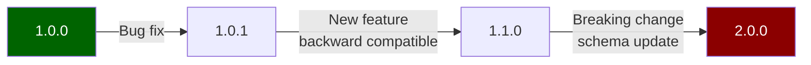
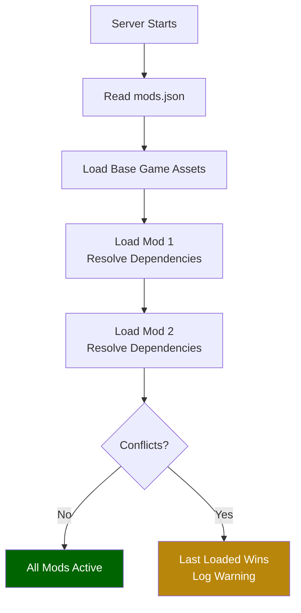

## What You'll Learn

- Structure a complete mod package
- Write a `manifest.json` for your mod
- Organize assets by namespace
- Version your mod correctly
- Distribute and install mods on servers

## Prerequisites

- Completed at least one beginner tutorial
- Familiarity with [Project Structure](/hytale-modding-docs/getting-started/project-structure/)
- A working mod with at least one custom asset

## Step 1: Mod Folder Structure

A distributable Hytale mod follows a specific folder layout that mirrors the game's asset structure:

```
my_awesome_mod/
├── manifest.json
├── Server/
│   ├── NPC/
│   │   ├── Roles/
│   │   │   └── MyCreature.json
│   │   └── Spawn/
│   │       └── MyCreature_Spawn.json
│   ├── Item/
│   │   ├── Items/
│   │   │   └── MyItem.json
│   │   └── Recipes/
│   │       └── MyItem_Recipe.json
│   ├── Drops/
│   │   └── Drop_MyCreature.json
│   └── Models/
│       └── MyCreature.json
└── Common/
    ├── BlockTextures/
    │   └── My_Custom_Block.png
    └── Blocks/
        └── MyBlock/
            ├── MyBlock.blockymodel
            └── MyBlock.blockyanim
```

Key rules:
- The folder structure **must match** the game's `Assets/` layout
- Server-side configs go in `Server/`
- Client-side models, textures, and animations go in `Common/`
- Keep a clean namespace to avoid conflicts with other mods

## Step 2: Create the Manifest

The `manifest.json` identifies your mod to the server:

```json
{
  "Name": "My Awesome Mod",
  "Namespace": "my_awesome_mod",
  "Version": "1.0.0",
  "Description": "Adds new creatures, items, and blocks to Hytale.",
  "Author": "YourName",
  "Dependencies": [],
  "ServerSide": true,
  "ClientSide": true
}
```

### Manifest Fields

| Field | Type | Required | Description |
|-------|------|----------|-------------|
| `Name` | string | Yes | Human-readable mod name. |
| `Namespace` | string | Yes | Unique identifier (lowercase, underscores). Used to prefix all asset IDs. |
| `Version` | string | Yes | Semantic version (`MAJOR.MINOR.PATCH`). |
| `Description` | string | No | Short description of what the mod does. |
| `Author` | string | No | Creator name or team. |
| `Dependencies` | string[] | No | List of required mod namespaces (e.g. `["base_game"]`). |
| `ServerSide` | boolean | No | Whether the mod includes server-side assets. |
| `ClientSide` | boolean | No | Whether the mod includes client-side assets. |

## Step 3: Namespace Your Assets

All asset references should use your mod namespace to avoid conflicts:

```json
{
  "Reference": "Template_Beasts_Passive_Critter",
  "Modify": {
    "Appearance": "my_awesome_mod:MyCreature",
    "Drops": {
      "Reference": "my_awesome_mod:Drop_MyCreature"
    }
  }
}
```

### Naming Conventions

| Asset Type | Convention | Example |
|------------|-----------|---------|
| NPC Roles | `PascalCase` | `MyCreature.json` |
| Items | `PascalCase` | `MagicSword.json` |
| Blocks | `PascalCase` | `GlowingCrystal.json` |
| Textures | `PascalCase_Suffix` | `My_Block_Side.png`, `My_Block_Top.png` |
| Recipes | `PascalCase` | `MagicSword_Recipe.json` |
| Drop Tables | `Drop_PascalCase` | `Drop_MyCreature.json` |

## Step 4: Versioning

Follow semantic versioning:



- **PATCH** (1.0.0 → 1.0.1): Bug fixes, typo corrections, balance tweaks
- **MINOR** (1.0.0 → 1.1.0): New content (NPCs, items, blocks) without breaking existing saves
- **MAJOR** (1.0.0 → 2.0.0): Breaking changes to existing content (renamed IDs, restructured files)

## Step 5: Testing Checklist

Before distributing, verify:

- [ ] Server starts without errors with your mod loaded
- [ ] All NPCs spawn correctly in their defined environments
- [ ] All items appear in crafting menus and can be crafted
- [ ] All blocks can be placed and broken
- [ ] Drop tables produce expected loot
- [ ] No namespace conflicts with base game assets
- [ ] Textures and models render correctly in-game
- [ ] `manifest.json` has correct version and metadata

## Step 6: Distribution

### Packaging

1. Zip the mod folder (including `manifest.json` at the root)
2. Name the archive: `my_awesome_mod_v1.0.0.zip`
3. Include a `README.txt` with installation instructions

### Installation

Users install your mod by:

1. Extracting the zip into the server's `mods/` directory
2. Adding your mod namespace to `mods.json` in the server config
3. Restarting the server

```
hytale-server/
├── mods/
│   └── my_awesome_mod/
│       ├── manifest.json
│       ├── Server/
│       └── Common/
└── mods.json
```

### Mod Load Order



Mods are loaded in the order listed in `mods.json`. If two mods define the same asset ID, the last one loaded takes priority.

## Tips for Clean Mods

1. **Keep it focused** — one mod should do one thing well
2. **Use inheritance** — extend base game templates with `Reference`/`Modify` instead of duplicating
3. **Document your changes** — include a changelog in your README
4. **Test with other mods** — check for namespace conflicts
5. **Keep file sizes small** — optimize textures, avoid unnecessary assets

## Related Pages

- [Installation & Setup](/hytale-modding-docs/getting-started/installation/) — Initial mod folder setup
- [Project Structure](/hytale-modding-docs/getting-started/project-structure/) — Understanding the asset tree
- [Inheritance & Templates](/hytale-modding-docs/reference/concepts/inheritance-and-templates/) — Extending base game assets
- [JSON Basics](/hytale-modding-docs/getting-started/json-basics/) — Common JSON patterns
