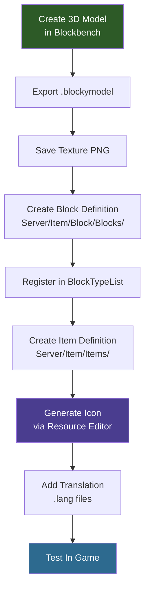

## What You'll Build

A glowing crystal block called **Block_Crystal_Glow** — a custom-model block with its own texture, light emission, sound set, and inventory icon.


## Prerequisites

- A mod folder with a valid `manifest.json` (see [Installation & Setup](/hytale-modding-docs/getting-started/installation/))
- [Blockbench](https://www.blockbench.net/) for authoring the 3D model
- A Hytale build compatible with your `TargetServerVersion`
- Basic familiarity with JSON (see [JSON Basics](/hytale-modding-docs/getting-started/json-basics/))

## Git Repository

The complete working mod is available as a GitHub repository you can clone and use directly:

```text
https://github.com/nevesb/hytale-mods-custom-block
```

Clone it and copy the contents into your Hytale mods directory to test immediately. The repository contains every file described in this tutorial in the correct folder structure:

```
hytale-mods-custom-block/
├── manifest.json
├── Common/
│   ├── Blocks/HytaleModdingManual/
│   │   └── Crystal_Glow.blockymodel
│   ├── BlockTextures/HytaleModdingManual/
│   │   └── Crystal_Glow.png
│   └── Icons/ItemsGenerated/
│       └── Block_Crystal_Glow.png
├── Server/
│   ├── BlockTypeList/
│   │   └── HytaleModdingManual_Blocks.json
│   ├── Item/
│   │   ├── Block/Blocks/HytaleModdingManual/
│   │   │   └── Block_Crystal_Glow.json
│   │   └── Items/HytaleModdingManual/
│   │       └── Block_Crystal_Glow.json
│   └── Languages/
│       └── en-US/server.lang
└── ...
```

For an asset-only tutorial mod, your manifest should look like this:

```json
{
  "Group": "HytaleModdingManual",
  "Name": "CreateACustomBlock",
  "Version": "1.0.0",
  "Description": "Implements the Create A Block tutorial with a custom crystal block",
  "Authors": [
    {
      "Name": "HytaleModdingManual"
    }
  ],
  "Dependencies": {},
  "OptionalDependencies": {},
  "IncludesAssetPack": true,
  "TargetServerVersion": "2026.02.19-1a311a592"
}
```

---

## Step 1: Build the Block in Blockbench

Open [Blockbench](https://www.blockbench.net/) and create your block model. For the crystal example, the model is a cluster of rectangular prisms arranged to look like natural crystal formations on a flat base.


Export the model as a `.blockymodel` file and save it to:

```text
Common/Blocks/HytaleModdingManual/Crystal_Glow.blockymodel
```

The `.blockymodel` format is Hytale's runtime model format. Blockbench can export directly to this format using the Hytale plugin.

---

## Step 2: Create the Texture

Paint or export your texture in Blockbench and save the PNG file to:

```text
Common/BlockTextures/HytaleModdingManual/Crystal_Glow.png
```

This is the texture atlas referenced by the `.blockymodel`. The UV mapping in Blockbench determines how this texture wraps around the model faces.

---

## Step 3: Create the Block Definition

The block definition controls how the block behaves in the world — its physics, rendering, light, sound, and gathering behavior.

Create the file at:

```text
Server/Item/Block/Blocks/HytaleModdingManual/Block_Crystal_Glow.json
```

```json
{
  "Material": "Solid",
  "DrawType": "Model",
  "Opacity": "Transparent",
  "VariantRotation": "NESW",
  "CustomModel": "Blocks/HytaleModdingManual/Crystal_Glow.blockymodel",
  "CustomModelTexture": [
    {
      "Texture": "BlockTextures/HytaleModdingManual/Crystal_Glow.png",
      "Weight": 1
    }
  ],
  "HitboxType": "Full",
  "Gathering": {
    "Breaking": {
      "GatherType": "Rocks",
      "ItemId": "Block_Crystal_Glow"
    }
  },
  "Light": {
    "Color": "#88ccff",
    "Level": 14
  },
  "BlockSoundSetId": "Crystal",
  "ParticleColor": "#88ccff"
}
```

### Block Definition Fields

| Field | Type | Required | Default | Description |
|-------|------|----------|---------|-------------|
| `Material` | string | Yes | — | Physics material for the block. Controls collision and tool interaction. Values: `Solid`, `Liquid`, `Gas`, `NonSolid`. |
| `DrawType` | string | Yes | `Block` | How the block is rendered. `Block` = standard cube, `Model` = custom `.blockymodel` mesh, `Cross` = X-shaped plant sprite. |
| `Opacity` | string | No | `Opaque` | Light behavior. `Opaque` blocks light fully, `Transparent` lets light pass through, `SemiTransparent` for partial opacity. |
| `VariantRotation` | string | No | — | Rotation variants when placing. `NESW` = 4 cardinal directions, `None` = fixed orientation. |
| `CustomModel` | string | No | — | Path to the `.blockymodel` file (relative to `Common/`). Required when `DrawType` is `Model`. |
| `CustomModelTexture` | array | No | — | List of texture objects for the custom model. Each entry has `Texture` (path) and `Weight` (for random selection). |
| `CustomModelTexture[].Texture` | string | Yes | — | Path to the PNG texture file (relative to `Common/`). |
| `CustomModelTexture[].Weight` | number | No | 1 | Weight for random texture selection. If multiple textures are listed, Hytale picks one based on weight. |
| `HitboxType` | string | No | `Full` | Collision hitbox shape. `Full` = entire block space, `None` = no collision (walkthrough), `Custom` = defined per-model. |
| `Gathering` | object | No | — | Defines what happens when the block is broken. Contains a `Breaking` sub-object. |
| `Gathering.Breaking.GatherType` | string | No | — | Tool category needed to break efficiently. Values: `Rocks`, `Wood`, `Dirt`, `Plant`, etc. |
| `Gathering.Breaking.ItemId` | string | No | — | Item ID dropped when the block is broken. Use the block's own ID to make it drop itself. |
| `Light` | object | No | — | Light emission configuration. |
| `Light.Color` | string | No | `#ffffff` | Hex color of the emitted light. |
| `Light.Level` | number | No | 0 | Light intensity from 0 (no light) to 15 (maximum, like sunlight). |
| `BlockSoundSetId` | string | No | — | Sound set used for placing, breaking, and walking on the block. Values: `Stone`, `Wood`, `Crystal`, `Metal`, `Dirt`, etc. |
| `ParticleColor` | string | No | — | Hex color of particles emitted when the block is broken. |
| `BlockParticleSetId` | string | No | — | Particle set used when the block is broken or interacted with. Values: `Stone`, `Wood`, `Dirt`, etc. |
| `Flags` | object | No | `{}` | Bitfield flags for special block behaviors (e.g., `Flammable`, `Replaceable`). |

---

## Step 4: Register the Block in a BlockTypeList

Create the list file at:

```text
Server/BlockTypeList/HytaleModdingManual_Blocks.json
```

```json
{
  "Blocks": [
    "Block_Crystal_Glow"
  ]
}
```

Hytale merges block lists from all loaded mods automatically. You do not need to modify any vanilla file — just create your own list and the game discovers it.

---

## Step 5: Create the Item Definition

The item definition makes the block appear in inventory and controls how the player interacts with it. This is separate from the block definition — the item is what the player holds, and the block is what exists in the world.

Create the file at:

```text
Server/Item/Items/HytaleModdingManual/Block_Crystal_Glow.json
```

```json
{
  "TranslationProperties": {
    "Name": "server.items.Block_Crystal_Glow.name",
    "Description": "server.items.Block_Crystal_Glow.description"
  },
  "Interactions": {
    "Primary": "Block_Primary",
    "Secondary": "Block_Secondary"
  },
  "Quality": "Uncommon",
  "Icon": "Icons/ItemsGenerated/Block_Crystal_Glow.png",
  "PlayerAnimationsId": "Block",
  "BlockType": {
    "Material": "Solid",
    "DrawType": "Model",
    "Opacity": "Transparent",
    "VariantRotation": "NESW",
    "CustomModel": "Blocks/HytaleModdingManual/Crystal_Glow.blockymodel",
    "CustomModelTexture": [
      {
        "Texture": "BlockTextures/HytaleModdingManual/Crystal_Glow.png",
        "Weight": 1
      }
    ],
    "HitboxType": "Full",
    "Flags": {},
    "Gathering": {
      "Breaking": {
        "GatherType": "Rocks",
        "ItemId": "Block_Crystal_Glow"
      }
    },
    "Light": {
      "Color": "#88ccff",
      "Level": 14
    },
    "BlockParticleSetId": "Stone",
    "BlockSoundSetId": "Crystal",
    "ParticleColor": "#88ccff"
  },
  "MaxStack": 64,
  "IconProperties": {
    "Scale": 0.58823,
    "Rotation": [22.5, 45, 22.5],
    "Translation": [0, -13.5]
  }
}
```

### Item Definition Fields

| Field | Type | Required | Default | Description |
|-------|------|----------|---------|-------------|
| `TranslationProperties` | object | No | — | Contains translation keys for the item name and description. |
| `TranslationProperties.Name` | string | No | — | Translation key for the item's display name (e.g., `server.items.Block_Crystal_Glow.name`). |
| `TranslationProperties.Description` | string | No | — | Translation key for the item's tooltip description. |
| `Interactions` | object | No | — | Defines what happens on left-click (`Primary`) and right-click (`Secondary`). |
| `Interactions.Primary` | string | No | — | Primary interaction when the player left-clicks. `Block_Primary` = break block behavior. |
| `Interactions.Secondary` | string | No | — | Secondary interaction when the player right-clicks. `Block_Secondary` = place block behavior. |
| `Quality` | string | No | `Common` | Item rarity tier. Affects the color of the item name in the UI. Values: `Common`, `Uncommon`, `Rare`, `Epic`, `Legendary`. |
| `Icon` | string | No | — | Path to the inventory icon PNG (relative to `Common/`). |
| `PlayerAnimationsId` | string | No | — | Animation set used when the player holds this item. `Block` = block placement animations, `Sword` = melee swing, etc. |
| `BlockType` | object | No | — | Embedded block definition. When the player places the item, this block is created in the world. Contains the same fields as the standalone Block Definition. |
| `MaxStack` | number | No | 1 | Maximum stack size in inventory (1–64). |
| `IconProperties` | object | No | — | Controls how the 3D model is rendered as an inventory icon. |
| `IconProperties.Scale` | number | No | 1.0 | Scale factor for the icon render. Adjust to fit the model within the icon frame. |
| `IconProperties.Rotation` | array | No | `[0,0,0]` | Euler rotation `[X, Y, Z]` in degrees for the icon render. `[22.5, 45, 22.5]` gives a standard isometric view. |
| `IconProperties.Translation` | array | No | `[0,0]` | Pixel offset `[X, Y]` to center the model in the icon frame. |
| `Parent` | string | No | — | Inherit fields from another item definition. Useful for creating variants without duplicating the entire JSON. |
| `Tags` | array | No | `[]` | List of tag strings for categorization and filtering (e.g., `["Decorative", "Light_Source"]`). |
| `Categories` | array | No | `[]` | Item categories for crafting menu grouping. |
| `ItemLevel` | number | No | 0 | Numeric tier level used for progression gating. |
| `MaxStack` | number | No | 1 | Maximum number of items per inventory slot. |
| `SoundEventId` | string | No | — | Sound played on specific item events (equip, use). |
| `ItemSoundSetId` | string | No | — | Sound set for general item interactions. |

---

## Step 6: Generate the Icon with the Resource Editor

Hytale includes a built-in **Resource Editor** accessible from Creative Mode. You can use it to automatically generate the inventory icon for your block instead of creating one manually.


To generate the icon:

1. Open Hytale in **Creative Mode**
2. Open the **Resource Editor** (top-right corner: "Editor" button)
3. Navigate to **Item** in the left panel and find your mod group (e.g., `HytaleModdingManual`)
4. Select your block item (`Block_Crystal_Glow`)
5. In the properties panel on the right, find the **Icon** field
6. Click the pencil icon next to the Icon field — the editor will render the 3D model and save a PNG icon automatically
7. The generated icon is saved to `Icons/ItemsGenerated/Block_Crystal_Glow.png`

The Resource Editor also lets you adjust `IconProperties` (Scale, Rotation, Translation) visually to get the perfect isometric view for your icon.

The `IconProperties` in the item JSON control how the 3D model is positioned for the icon render:
- **Scale**: `0.58823` shrinks the crystal to fit within the icon frame
- **Rotation**: `[22.5, 45, 22.5]` gives the standard isometric angle
- **Translation**: `[0, -13.5]` shifts the model down to center it

---

## Step 7: Add Translations

Hytale uses `.lang` files for translating item names and descriptions. Create a language file for each locale you want to support:

```text
Server/Languages/en-US/server.lang
Server/Languages/pt-BR/server.lang
Server/Languages/es/server.lang
```

### How Translation Works

The item JSON references translation keys through `TranslationProperties`:

```json
{
  "TranslationProperties": {
    "Name": "server.items.Block_Crystal_Glow.name",
    "Description": "server.items.Block_Crystal_Glow.description"
  }
}
```

The game looks up these keys in the `.lang` file matching the player's language. The key format is:

```text
items.<ItemId>.<property> = <translated text>
```

### English (`Server/Languages/en-US/server.lang`)

```text
items.Block_Crystal_Glow.name = Glowing Crystal Block
items.Block_Crystal_Glow.description = A crystal block that radiates soft blue light.
```

### Portuguese (`Server/Languages/pt-BR/server.lang`)

```text
items.Block_Crystal_Glow.name = Bloco de Cristal Brilhante
items.Block_Crystal_Glow.description = Um bloco de cristal que irradia uma suave luz azul.
```

### Spanish (`Server/Languages/es/server.lang`)

```text
items.Block_Crystal_Glow.name = Bloque de Cristal Brillante
items.Block_Crystal_Glow.description = Un bloque de cristal que irradia una suave luz azul.
```

If a translation key is missing for a locale, Hytale falls back to `en-US`. If the key is missing entirely, the raw key string (e.g., `server.items.Block_Crystal_Glow.name`) is displayed instead of the translated name.

For more details on the localization system, see [Localization Keys](/hytale-modding-docs/reference/concepts/localization-keys/).

---

## Step 8: Package and Test

Your final mod folder should look like this:

```text
CreateACustomBlock/
├── manifest.json
├── Common/
│   ├── Blocks/HytaleModdingManual/
│   │   └── Crystal_Glow.blockymodel
│   ├── BlockTextures/HytaleModdingManual/
│   │   └── Crystal_Glow.png
│   └── Icons/ItemsGenerated/
│       └── Block_Crystal_Glow.png
├── Server/
│   ├── BlockTypeList/
│   │   └── HytaleModdingManual_Blocks.json
│   ├── Item/
│   │   ├── Block/Blocks/HytaleModdingManual/
│   │   │   └── Block_Crystal_Glow.json
│   │   └── Items/HytaleModdingManual/
│   │       └── Block_Crystal_Glow.json
│   └── Languages/
│       ├── en-US/server.lang
│       ├── pt-BR/server.lang
│       └── es/server.lang
```

To test:

1. Copy the mod folder into your Hytale mods directory
2. Start the game or reload the mod environment
3. Spawn `Block_Crystal_Glow` from the inventory
4. Place the block in the world
5. Confirm:
   - The custom crystal model appears (not a default cube)
   - The block emits blue light (`Level: 14`)
   - Crystal sounds play when placing and breaking
   - The block drops itself when broken
   - The translated name appears in the inventory tooltip

---

## Block Creation Flow



---

## Related Pages

- [Create a Custom Item](/hytale-modding-docs/tutorials/beginner/create-an-item/) — Items without block placement
- [Create a Custom NPC](/hytale-modding-docs/tutorials/beginner/create-an-npc/) — Spawn creatures in the world
- [Block Definitions Reference](/hytale-modding-docs/reference/item-system/block-definitions/) — Full block schema
- [Item Definitions Reference](/hytale-modding-docs/reference/item-system/item-definitions/) — Full item schema
- [Block Textures](/hytale-modding-docs/reference/models-and-visuals/block-textures/) — Texture conventions
- [Localization Keys](/hytale-modding-docs/reference/concepts/localization-keys/) — Translation system
- [Mod Packaging](/hytale-modding-docs/tutorials/advanced/mod-packaging/) — Distribution guide
