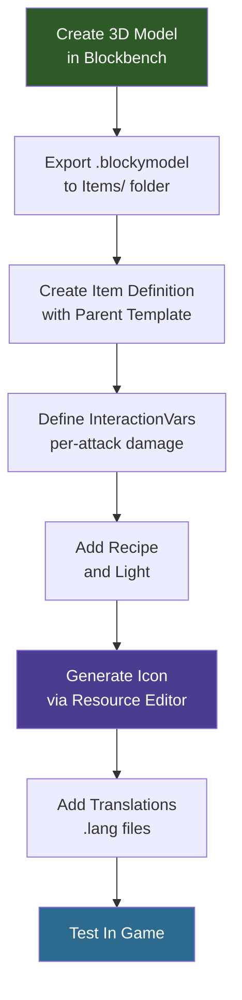

## What You'll Build

A **Crystal Sword** — a custom melee weapon crafted from glowing crystal blocks. It inherits Hytale's sword combat system (swing combos, guard, signature attack), has its own 3D voxel model, hand-painted crystal texture, light emission, crafting recipe, and multilingual translations.


## Prerequisites

- A mod folder with a valid `manifest.json` (see [Installation & Setup](/hytale-modding-docs/getting-started/installation/))
- [Blockbench](https://www.blockbench.net/) with the Hytale plugin for authoring the 3D model
- The [Create a Block](/hytale-modding-docs/tutorials/beginner/create-a-block/) tutorial completed (the Crystal Sword uses `Block_Crystal_Glow` as a crafting ingredient)
- Basic familiarity with JSON (see [JSON Basics](/hytale-modding-docs/getting-started/json-basics/))

## Git Repository

The complete working mod is available as a GitHub repository:

```text
https://github.com/nevesb/hytale-mods-custom-weapon
```

Clone it and copy the contents into your Hytale mods directory. The repository contains every file described in this tutorial:

```
hytale-mods-custom-weapon/
├── manifest.json
├── Crystal_Sword.bbmodel              (Blockbench source file)
├── Common/
│   ├── Items/Weapons/Crystal/
│   │   ├── Crystal_Sword.blockymodel  (exported runtime model)
│   │   └── Crystal_Sword.png          (texture)
│   └── Icons/ItemsGenerated/
│       └── Crystal_Sword.png
├── Server/
│   ├── Item/Items/HytaleModdingManual/
│   │   └── Crystal_Sword.json
│   └── Languages/
│       ├── en-US/server.lang
│       ├── pt-BR/server.lang
│       └── es/server.lang
```

Your manifest:

```json
{
  "Group": "HytaleModdingManual",
  "Name": "CreateACustomWeapon",
  "Version": "1.0.0",
  "Description": "Implements the Create A Weapon tutorial with a custom crystal sword",
  "Authors": [
    {
      "Name": "HytaleModdingManual"
    }
  ],
  "Dependencies": {},
  "OptionalDependencies": {},
  "IncludesAssetPack": true,
  "TargetServerVersion": "2026.02.19-1a311a592"
}
```

---

## Step 1: Model the Sword in Blockbench

Open Blockbench and create a new **Hytale Character** format project. The sword is built from five sections, bottom to top:

| Section | Description | Dimensions |
|---------|-------------|------------|
| **Pommel** | Small crystal at the base | 3x6x3 |
| **Handle** | Dark leather-wrapped shaft with metal rings | 6x18x6 (shaft) + 7.5x1.5x7.5 (wraps) |
| **Guard** | Crystal base with diamond center and side blades | 27x6x4.5 (base) + 6x6x9 (diamond) + 4.5x9x1.5 (sides) |
| **Blade** | Main crystal prism with inner core | 9x36x3 (main) + 3x57x6 (core) |
| **Tip** | Tapered faceted point | 6x4.5x3 + 3x4.5x1.5 |


**Modeling tips:**
- Set the pivot point at the handle grip area (around Y=15) — Hytale uses this for hand positioning and light origin
- Use separate cubes for each crystal prism to create the faceted look
- Rotate guard crystals slightly outward (15-25 degrees) for a natural cluster appearance
- Total height should be ~72 voxels to match official Hytale weapon scale
- Use per-face UV (not box UV) for large cubes — box UV is limited to 32x32 UV space
- Set crystal blade and tip cubes to **fullbright** shading for the glow effect

**Texturing:**
- Use a hand-painted style with directional color blocking, not smooth gradients
- Crystal parts: vertical streaks of `#d9ffff` (top) to `#00bbee` (mid) to `#003050` (base), core lighter than edges
- Handle uses warm leather tones: `#2a2520` with `#3a3228` stitch highlights
- Wraps use metallic gray: `#484440` with `#5a5550` shine
- Texture resolution must match UV size: **128x128** (pixel density 64 / blockSize 64 = 1:1 ratio)

Export as **Hytale Blocky Model** and save to:

```text
Common/Items/Weapons/Crystal/Crystal_Sword.blockymodel
```

Copy the texture PNG next to the blockymodel:

```text
Common/Items/Weapons/Crystal/Crystal_Sword.png
```

:::caution[Common Asset Paths]
All `Common/` asset paths referenced in the item JSON must start with an allowed root directory: `Blocks/`, `Items/`, `Resources/`, `NPC/`, `VFX/`, or `Consumable/`. Placing models or textures outside these roots (e.g., `Models/`) will cause a validation error.
:::

---

## Step 2: Create the Item Definition

Hytale weapons use the `Parent` template system to inherit base combat animations, interactions, and sound effects. By setting `"Parent": "Template_Weapon_Sword"`, our Crystal Sword automatically gets the full sword moveset: swing combos, guard, and the Vortexstrike signature ability.

Create the file at:

```text
Server/Item/Items/HytaleModdingManual/Crystal_Sword.json
```

```json
{
  "Parent": "Template_Weapon_Sword",
  "TranslationProperties": {
    "Name": "server.items.Crystal_Sword.name",
    "Description": "server.items.Crystal_Sword.description"
  },
  "Model": "Items/Weapons/Crystal/Crystal_Sword.blockymodel",
  "Texture": "Items/Weapons/Crystal/Crystal_Sword.png",
  "Icon": "Icons/ItemsGenerated/Crystal_Sword.png",
  "Quality": "Rare",
  "ItemLevel": 30,
  "Tags": {
    "Type": [
      "Weapon"
    ],
    "Family": [
      "Sword"
    ]
  },
  "IconProperties": {
    "Scale": 0.5,
    "Rotation": [0, 180, 45],
    "Translation": [-23, -23]
  },
  "InteractionVars": {
    "Swing_Left_Damage": {
      "Interactions": [
        {
          "Parent": "Weapon_Sword_Primary_Swing_Left_Damage",
          "DamageCalculator": {
            "BaseDamage": {
              "Physical": 14
            }
          }
        }
      ]
    },
    "Swing_Right_Damage": {
      "Interactions": [
        {
          "Parent": "Weapon_Sword_Primary_Swing_Right_Damage",
          "DamageCalculator": {
            "BaseDamage": {
              "Physical": 14
            }
          }
        }
      ]
    },
    "Swing_Down_Damage": {
      "Interactions": [
        {
          "Parent": "Weapon_Sword_Primary_Swing_Down_Damage",
          "DamageCalculator": {
            "BaseDamage": {
              "Physical": 24
            }
          }
        }
      ]
    },
    "Thrust_Damage": {
      "Interactions": [
        {
          "Parent": "Weapon_Sword_Primary_Thrust_Damage",
          "DamageCalculator": {
            "BaseDamage": {
              "Physical": 36
            }
          }
        }
      ]
    },
    "Vortexstrike_Spin_Damage": {
      "Interactions": [
        {
          "Parent": "Weapon_Sword_Signature_Vortexstrike_Spin_Damage",
          "DamageCalculator": {
            "BaseDamage": {
              "Physical": 26
            }
          }
        }
      ]
    },
    "Vortexstrike_Stab_Damage": {
      "Interactions": [
        {
          "Parent": "Weapon_Sword_Signature_Vortexstrike_Stab_Damage",
          "DamageCalculator": {
            "BaseDamage": {
              "Physical": 72
            }
          }
        }
      ]
    },
    "Guard_Wield": {
      "Interactions": [
        {
          "Parent": "Weapon_Sword_Secondary_Guard_Wield",
          "StaminaCost": {
            "Value": 8,
            "CostType": "Damage"
          }
        }
      ]
    }
  },
  "Recipe": {
    "TimeSeconds": 5.0,
    "KnowledgeRequired": false,
    "Input": [
      {
        "ItemId": "Block_Crystal_Glow",
        "Quantity": 4
      },
      {
        "ItemId": "Ingredient_Bar_Iron",
        "Quantity": 2
      }
    ],
    "BenchRequirement": [
      {
        "Type": "Crafting",
        "Categories": [
          "Weapon_Sword"
        ],
        "Id": "Weapon_Bench"
      }
    ]
  },
  "Light": {
    "Radius": 2,
    "Color": "#468"
  },
  "MaxDurability": 450,
  "DurabilityLossOnHit": 0.18
}
```

### Key Item Fields

| Field | Type | Description |
|-------|------|-------------|
| `Parent` | string | Inherit from a template. `Template_Weapon_Sword` gives full sword combat: swing combos, guard, Vortexstrike signature. |
| `TranslationProperties` | object | `Name` and `Description` translation keys for the UI. |
| `Model` | string | Path to `.blockymodel` (relative to `Common/`). Must start with an allowed root: `Items/`, `Blocks/`, etc. |
| `Texture` | string | Path to texture PNG (relative to `Common/`). Must start with an allowed root. |
| `Icon` | string | Path to inventory icon PNG (relative to `Common/`). |
| `Quality` | string | Rarity tier. Controls name color: `Common`, `Uncommon`, `Rare`, `Epic`, `Legendary`. |
| `ItemLevel` | number | Progression tier for loot table weighting. |
| `Tags` | object | Categorized tag groups. `Type` for item category, `Family` for weapon family. |
| `IconProperties` | object | Controls 3D icon rendering: `Scale`, `Rotation` [X,Y,Z], `Translation` [X,Y]. |
| `InteractionVars` | object | Override damage values for each attack in the inherited combo chain. |
| `Recipe` | object | Crafting recipe with `Input` items, `BenchRequirement`, and `TimeSeconds`. |
| `Light` | object | Emitted light. `Radius` (integer) and `Color` (hex shorthand). |
| `MaxDurability` | number | Total hits before the weapon breaks. |
| `DurabilityLossOnHit` | number | Fraction of durability lost per hit. |

### Damage via InteractionVars

Unlike a simple `Damage` field, Hytale weapons define damage **per attack** in the combo chain using `InteractionVars`. Each variable name (e.g., `Swing_Left_Damage`) maps to a specific animation frame, and you override the `DamageCalculator.BaseDamage` to set how much damage that swing deals:

| Attack | Animation | Crystal Sword Damage |
|--------|-----------|---------------------|
| `Swing_Left_Damage` | Left horizontal swing | 14 Physical |
| `Swing_Right_Damage` | Right horizontal swing | 14 Physical |
| `Swing_Down_Damage` | Overhead downward swing | 24 Physical |
| `Thrust_Damage` | Forward thrust (combo finisher) | 36 Physical |
| `Vortexstrike_Spin_Damage` | Signature spin attack | 26 Physical |
| `Vortexstrike_Stab_Damage` | Signature stab finisher | 72 Physical |

### Light Emission

Items can emit light using the `Light` field with `Radius` (integer, in blocks) and `Color` (hex shorthand). The Crystal Sword uses `"Color": "#468"` — a dim cyan glow at half the intensity of the Crystal Glow Block (`#88ccff`).

:::caution[Radius Must Be an Integer]
The `Radius` field only accepts whole numbers. Using a decimal like `1.5` will cause a `NumberFormatException` and the mod will fail to load.
:::

---

## Step 3: Generate the Icon

Use the **Resource Editor** in Creative Mode to generate the inventory icon, just like the block tutorial:

1. Open Hytale in Creative Mode
2. Open the Resource Editor (top-right "Editor" button)
3. Navigate to **Item** > `HytaleModdingManual` > `Crystal_Sword`
4. Click the pencil icon next to the **Icon** field
5. Adjust `IconProperties` for the best isometric view
6. The generated icon saves to `Icons/ItemsGenerated/Crystal_Sword.png`

---

## Step 4: Add Translations

Create language files for each locale:

### English (`Server/Languages/en-US/server.lang`)

```text
items.Crystal_Sword.name = Crystal Sword
items.Crystal_Sword.description = A blade forged from enchanted crystal. Radiates a soft blue glow.
```

### Portuguese (`Server/Languages/pt-BR/server.lang`)

```text
items.Crystal_Sword.name = Espada de Cristal
items.Crystal_Sword.description = Uma lâmina forjada de cristal encantado. Irradia um brilho azul suave.
```

### Spanish (`Server/Languages/es/server.lang`)

```text
items.Crystal_Sword.name = Espada de Cristal
items.Crystal_Sword.description = Una espada forjada de cristal encantado. Irradia un brillo azul suave.
```

The key format is `items.<ItemId>.<property>`. If a key is missing for a locale, Hytale falls back to `en-US`.

---

## Step 5: Package and Test

Your final mod folder:

```text
CreateACustomWeapon/
├── manifest.json
├── Common/
│   ├── Items/Weapons/Crystal/
│   │   ├── Crystal_Sword.blockymodel
│   │   └── Crystal_Sword.png
│   └── Icons/ItemsGenerated/
│       └── Crystal_Sword.png
├── Server/
│   ├── Item/Items/HytaleModdingManual/
│   │   └── Crystal_Sword.json
│   └── Languages/
│       ├── en-US/server.lang
│       ├── pt-BR/server.lang
│       └── es/server.lang
```

To test:

1. Copy the mod folder into your Hytale mods directory (`%APPDATA%/Hytale/UserData/Mods/`)
2. Start the game or reload the mod environment
3. Grant yourself operator permissions and spawn the sword using chat commands:
   ```text
   /op self
   /spawnitem Crystal_Sword
   ```
4. Confirm:
   - The crystal sword model renders correctly when held
   - The crystal blade and tip glow with fullbright shading
   - The sword emits a soft blue light around the player
   - Sword swing animations play on left-click (4-hit combo)
   - Guard activates on right-click
   - The Vortexstrike signature ability works when energy is full
   - The translated name and description appear in the tooltip
   - The crafting recipe works at a Weapon Bench (4x Crystal Glow Block + 2x Iron Bar)
   - Durability decreases on hit (450 max)

---

## Weapon Creation Flow



---

## Common Pitfalls

| Problem | Cause | Fix |
|---------|-------|-----|
| `Unexpected character: 5b, '['` | `Tags` defined as array `[]` instead of object `{}` | Use `{"Type": ["Weapon"], "Family": ["Sword"]}` |
| `Common Asset must be within the root` | Model/Texture path doesn't start with `Items/`, `Blocks/`, etc. | Move files under an allowed root like `Items/Weapons/` |
| `Common Asset doesn't exist` | Icon file missing from `Common/Icons/` | Generate icon via Resource Editor or place a PNG manually |
| `NumberFormatException` in Light | `Radius` is a decimal like `1.5` | Use an integer: `1`, `2`, `3`, etc. |
| Texture looks broken in game | Texture resolution doesn't match UV size | For Hytale Character format: texture must be UV size x (pixelDensity / blockSize). With defaults: texture = UV size |

---

## Related Pages

- [Create a Custom Block](/hytale-modding-docs/tutorials/beginner/create-a-block/) — Build the crystal block used as ingredient
- [Create a Custom NPC](/hytale-modding-docs/tutorials/beginner/create-an-npc/) — Create creatures that drop your weapon
- [Item Definitions Reference](/hytale-modding-docs/reference/item-system/item-definitions/) — Full item schema
- [Crafting Recipes](/hytale-modding-docs/reference/crafting-system/recipes/) — Recipe system reference
- [Localization Keys](/hytale-modding-docs/reference/concepts/localization-keys/) — Translation system
- [Mod Packaging](/hytale-modding-docs/tutorials/advanced/mod-packaging/) — Distribution guide
