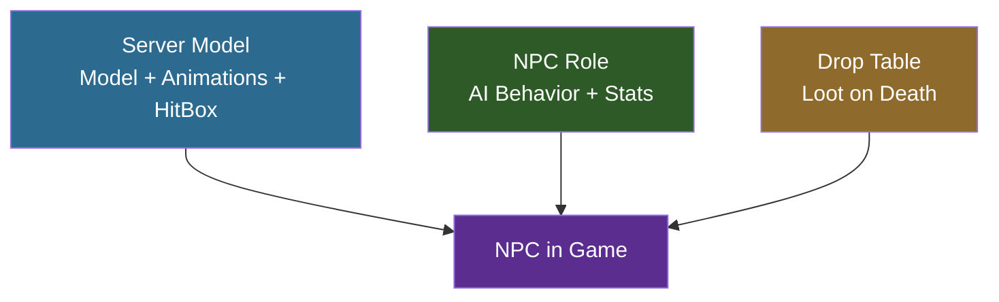

## Goal

Create a **Slime** — a hostile NPC that chases and attacks players on sight. You will set up a 3D model with animations, define its AI behavior through template inheritance, configure a weighted drop table, and add multilingual translations. By the end, you will have a fully working NPC mod you can spawn in Creative Mode.

## What You'll Learn

- How NPCs are structured across three JSON layers (Server Model, NPC Role, Drop Table)
- How to set up a model with 9 animation sets
- How template inheritance (`Template_Predator`) provides AI behavior
- How weighted drop tables control loot
- How to add translations for EN, ES, and PT-BR

## Prerequisites

- A mod folder with a valid `manifest.json` (see [Setup Your Dev Environment](/hytale-modding-docs/tutorials/beginner/setup-dev-environment/))
- Blockbench with the Hytale plugin installed
- Familiarity with JSON template inheritance (see [Inheritance and Templates](/hytale-modding-docs/reference/concepts/inheritance-and-templates/))

---

## NPC Architecture Overview

Unlike blocks and items which each use a single JSON file, NPCs require **three separate definitions** that work together:



| Layer | File Location | Purpose |
|-------|--------------|---------|
| **Server Model** | `Server/Models/` | Links the `.blockymodel` file, texture, animations, hitbox, and camera settings |
| **NPC Role** | `Server/NPC/Roles/` | Defines AI behavior via template inheritance, health, knockback, and translation keys |
| **Drop Table** | `Server/Drops/` | Controls what loot drops when the NPC dies, using weighted random selection |

The **Server Model** `Appearance` name connects all three — the NPC Role references it, and the engine uses it to find the correct model, texture, and animations.

---

## Step 1: Create the Model and Texture in Blockbench

Open Blockbench and create a new **Hytale Character** project:

- **Block Size**: 64
- **Pixel Density**: 64
- **UV Size**: 128×128 (texture must match: 128×128 pixels)

Build the slime body using cubes organized in groups. For the Slime, the structure is:

| Group | Purpose |
|-------|---------|
| `Body` | Main slime body (large cube) |
| `Head` | Top portion (used by camera tracking) |
| `Eyes` | Face details |
| `Arm_Left` / `Arm_Right` | Small appendages for attack animations |
| `Leg_Left` / `Leg_Right` | Base stubs for walk animations |

Paint the texture in the **Paint** tab — green tones with darker spots work well for a slime creature.


### Export the Model

1. **File > Export > Export Hytale Blocky Model** → save as `Model_Slime.blockymodel`
2. Save the texture separately as `Texture.png` (128×128)

### Create Animations

NPCs need animation files for each movement state. Create these 9 animations in Blockbench's **Animate** tab:

| Animation | File | Loop | Purpose |
|-----------|------|------|---------|
| Idle | `Idle.blockyanim` | Yes | Standing still — subtle bounce |
| Walk | `Walk.blockyanim` | Yes | Moving forward |
| Walk_Backward | `Walk_Backward.blockyanim` | Yes | Moving backward |
| Run | `Run.blockyanim` | Yes | Chasing the player |
| Attack | `Attack.blockyanim` | Yes | Melee strike |
| Death | `Death.blockyanim` | **No** | Plays once on death |
| Crouch | `Crouch.blockyanim` | Yes | Crouching idle |
| Crouch_Walk | `Crouch_Walk.blockyanim` | Yes | Crouching forward |
| Crouch_Walk_Backward | `Crouch_Walk_Backward.blockyanim` | Yes | Crouching backward |

Export each animation with **File > Export > Export Hytale Block Animation**.

:::tip[Death Animation]
Set `"Loop": false` for the Death animation in the Server Model — all other animations loop by default.
:::

---

## Step 2: Set Up the Mod File Structure

Place your files in the mod folder following this exact structure:

```text
CreateACustomNPC/
├── manifest.json
├── Common/
│   ├── Icons/
│   │   └── ModelsGenerated/
│   │       └── Slime.png
│   └── NPC/
│       └── Beast/
│           └── Slime/
│               ├── Model/
│               │   ├── Model_Slime.blockymodel
│               │   └── Texture.png
│               └── Animations/
│                   └── Default/
│                       ├── Idle.blockyanim
│                       ├── Walk.blockyanim
│                       ├── Walk_Backward.blockyanim
│                       ├── Run.blockyanim
│                       ├── Attack.blockyanim
│                       ├── Death.blockyanim
│                       ├── Crouch.blockyanim
│                       ├── Crouch_Walk.blockyanim
│                       └── Crouch_Walk_Backward.blockyanim
├── Server/
│   ├── Models/
│   │   └── Beast/
│   │       └── Slime.json
│   ├── NPC/
│   │   └── Roles/
│   │       └── Slime.json
│   ├── Drops/
│   │   └── Drop_Slime.json
│   └── Languages/
│       ├── en-US/
│       │   └── server.lang
│       ├── es/
│       │   └── server.lang
│       └── pt-BR/
│           └── server.lang
```

All paths in `Common/` must start with an allowed root: `NPC/`, `Icons/`, `Items/`, `Blocks/`, etc. The model and animations go under `NPC/`, and the spawn icon goes under `Icons/`.

---

## Step 3: Create the manifest.json

```json
{
  "Group": "HytaleModdingManual",
  "Name": "CreateACustomNPC",
  "Version": "1.0.0",
  "Description": "Implements the Create A NPC tutorial with a custom slime",
  "Authors": [
    {
      "Name": "HytaleModdingManual"
    }
  ],
  "Dependencies": {},
  "OptionalDependencies": {},
  "IncludesAssetPack": true,
  "TargetServerVersion": "2026.02.19-1a311a592"
}
```

---

## Step 4: Define the Server Model

The Server Model is the bridge between the 3D assets in `Common/` and the game engine. It tells Hytale where to find the model, texture, and every animation.

Create `Server/Models/Beast/Slime.json`:

```json
{
  "Model": "NPC/Beast/Slime/Model/Model_Slime.blockymodel",
  "Texture": "NPC/Beast/Slime/Model/Texture.png",
  "EyeHeight": 1.5,
  "CrouchOffset": -0.15,
  "HitBox": {
    "Max": { "X": 0.8, "Y": 2.0, "Z": 0.8 },
    "Min": { "X": -0.8, "Y": 0, "Z": -0.8 }
  },
  "Camera": {
    "Pitch": {
      "AngleRange": { "Max": 15, "Min": -15 },
      "TargetNodes": ["Head"]
    },
    "Yaw": {
      "AngleRange": { "Max": 15, "Min": -15 },
      "TargetNodes": ["Head"]
    }
  },
  "AnimationSets": {
    "Walk": {
      "Animations": [
        { "Animation": "NPC/Beast/Slime/Animations/Default/Walk.blockyanim" }
      ]
    },
    "Attack": {
      "Animations": [
        { "Animation": "NPC/Beast/Slime/Animations/Default/Attack.blockyanim" }
      ]
    },
    "Idle": {
      "Animations": [
        { "Animation": "NPC/Beast/Slime/Animations/Default/Idle.blockyanim" }
      ]
    },
    "Death": {
      "Animations": [
        {
          "Animation": "NPC/Beast/Slime/Animations/Default/Death.blockyanim",
          "Loop": false
        }
      ]
    },
    "Walk_Backward": {
      "Animations": [
        { "Animation": "NPC/Beast/Slime/Animations/Default/Walk_Backward.blockyanim" }
      ]
    },
    "Run": {
      "Animations": [
        { "Animation": "NPC/Beast/Slime/Animations/Default/Run.blockyanim" }
      ]
    },
    "Crouch": {
      "Animations": [
        { "Animation": "NPC/Beast/Slime/Animations/Default/Crouch.blockyanim" }
      ]
    },
    "Crouch_Walk": {
      "Animations": [
        { "Animation": "NPC/Beast/Slime/Animations/Default/Crouch_Walk.blockyanim" }
      ]
    },
    "Crouch_Walk_Backward": {
      "Animations": [
        { "Animation": "NPC/Beast/Slime/Animations/Default/Crouch_Walk_Backward.blockyanim" }
      ]
    }
  },
  "Icon": "Icons/ModelsGenerated/Slime.png",
  "IconProperties": {
    "Scale": 0.25,
    "Rotation": [0, -45, 0],
    "Translation": [0, -61]
  }
}
```

### Server Model Fields

| Field | Type | Purpose |
|-------|------|---------|
| `Model` | String | Path to `.blockymodel` file (relative to `Common/`) |
| `Texture` | String | Path to texture `.png` (relative to `Common/`) |
| `EyeHeight` | Number | Vertical position of the NPC's eyes in blocks — affects camera and line of sight |
| `CrouchOffset` | Number | How far the model drops when crouching |
| `HitBox` | Object | Bounding box for damage detection. `Min`/`Max` define the corners in blocks |
| `Camera` | Object | How the NPC's head tracks targets. `TargetNodes` must match group names in the model |
| `AnimationSets` | Object | Maps game states to animation files. Each set can have multiple weighted animations |
| `Icon` | String | Spawn menu icon path (relative to `Common/`) |
| `IconProperties` | Object | Scale, rotation, and translation for the icon render |

:::caution[Animation Set Names Are Fixed]
The engine expects specific animation set names: `Idle`, `Walk`, `Walk_Backward`, `Run`, `Attack`, `Death`, `Crouch`, `Crouch_Walk`, `Crouch_Walk_Backward`. Using different names will cause the NPC to freeze in its idle pose during that action.
:::

---

## Step 5: Define the NPC Role

The NPC Role defines behavior and stats. Instead of writing AI from scratch, Hytale uses **template inheritance** — you pick a behavior template and override only what differs.

Create `Server/NPC/Roles/Slime.json`:

```json
{
  "Type": "Variant",
  "Reference": "Template_Predator",
  "Modify": {
    "Appearance": "Slime",
    "MaxHealth": 75,
    "KnockbackScale": 0.5,
    "IsMemory": true,
    "MemoriesCategory": "Beast",
    "NameTranslationKey": {
      "Compute": "NameTranslationKey"
    }
  },
  "Parameters": {
    "NameTranslationKey": {
      "Value": "server.npcRoles.Slime.name",
      "Description": "Translation key for NPC name display"
    }
  }
}
```

### How Template Inheritance Works

The `"Type": "Variant"` + `"Reference": "Template_Predator"` pattern means:

1. **Start with** all fields from `Template_Predator` (hostile AI, chase logic, attack patterns, view range)
2. **Override** only the fields listed in `"Modify"` (appearance, health, knockback, etc.)
3. **Everything else** (decision making, combat logic, movement speeds) comes from the template

### Available NPC Templates

| Template | Behavior | Use For |
|----------|----------|---------|
| `Template_Predator` | Hostile — chases and attacks players on sight | Enemies, hostile creatures |
| `Template_Prey` | Passive — flees when threatened | Rabbits, deer, small animals |
| `Template_Neutral` | Neutral — attacks only when provoked | Bears, wolves |
| `Template_Domestic` | Tame — follows owner, can be penned | Farm animals, pets |
| `Template_Beasts_Passive_Critter` | Passive critter — wanders, flees | Squirrels, frogs, bugs |

### NPC Role Fields

| Field | Type | Purpose |
|-------|------|---------|
| `Appearance` | String | Must match the Server Model filename (without `.json`). This is how the engine links the Role to the Model |
| `MaxHealth` | Number | Hit points. Vanilla enemies range from 30 (Skeleton) to 500+ (bosses) |
| `KnockbackScale` | Number | Resistance to knockback. `1.0` = normal, `0.5` = half knockback, `0` = immovable |
| `IsMemory` | Boolean | Whether the NPC appears in the player's Memories bestiary |
| `MemoriesCategory` | String | Bestiary tab: `Critter`, `Beast`, `Boss`, `Other` |
| `NameTranslationKey` | Compute | Translation key for the name shown above the NPC's head |

### The Compute Pattern

```json
"NameTranslationKey": {
  "Compute": "NameTranslationKey"
}
```

This tells the engine: "get the value of `NameTranslationKey` from the `Parameters` block." The `Parameters` section then provides the actual value:

```json
"Parameters": {
  "NameTranslationKey": {
    "Value": "server.npcRoles.Slime.name",
    "Description": "Translation key for NPC name display"
  }
}
```

This indirection exists because templates use `Compute` to read values that each variant defines differently. Every variant provides its own `NameTranslationKey` value, but the template's logic for using it stays the same.

---

## Step 6: Create the Drop Table

The drop table controls what loot falls when the NPC dies. Hytale uses a **weighted random selection** system.

Create `Server/Drops/Drop_Slime.json`:

```json
{
  "Container": {
    "Type": "Choice",
    "Containers": [
      {
        "Type": "Single",
        "Item": {
          "ItemId": "Ore_Crystal_Slime",
          "QuantityMin": 1,
          "QuantityMax": 1
        },
        "Weight": 100
      },
      {
        "Type": "Single",
        "Item": {
          "ItemId": "Consumable_Potion_Health_Large"
        },
        "Weight": 60
      },
      {
        "Type": "Empty",
        "Weight": 40
      }
    ]
  }
}
```

### How Weighted Selection Works

The root `"Type": "Choice"` picks **one** child container at random, proportional to weight:

| Drop | Weight | Probability |
|------|--------|-------------|
| Crystal Slime Ore (1) | 100 | 100/200 = **50%** |
| Health Potion (Large) | 60 | 60/200 = **30%** |
| Nothing | 40 | 40/200 = **20%** |

Total weight = 100 + 60 + 40 = 200. Each weight is divided by the total to get the probability.

### Drop Container Types

| Type | Behavior |
|------|----------|
| `Choice` | Picks **one** child at random (weighted) |
| `Multiple` | Evaluates **all** children (use for guaranteed + bonus drops) |
| `Single` | Yields the specified `Item` with quantity between `QuantityMin` and `QuantityMax` |
| `Empty` | Drops nothing — use as a "no drop" option in `Choice` containers |

:::tip[Multiple Guaranteed Drops]
To always drop one item AND have a chance at a second, use `Multiple` at the root with two `Choice` children — one guaranteed, one with an `Empty` option. See [Drop Tables Reference](/hytale-modding-docs/reference/economy-and-progression/drop-tables/) for advanced patterns.
:::

---

## Step 7: Add Translations

Create a `server.lang` file for each language under `Server/Languages/`:

**`Server/Languages/en-US/server.lang`**
```properties
npcRoles.Slime.name = Slime
```

**`Server/Languages/es/server.lang`**
```properties
npcRoles.Slime.name = Slime
```

**`Server/Languages/pt-BR/server.lang`**
```properties
npcRoles.Slime.name = Slime
```

The translation key in the `.lang` file must match the `Parameters.NameTranslationKey.Value` in the NPC Role — but **without** the `server.` prefix. The engine adds the prefix automatically when resolving server-side language files.

---

## Step 8: Package and Test

1. Copy the `CreateACustomNPC/` folder to `%APPDATA%/Hytale/UserData/Mods/`

2. Launch Hytale and enter **Creative Mode**

3. Check the log at `%APPDATA%/Hytale/UserData/Logs/` for your mod loading:
   ```text
   [Hytale] Loading assets from: ...\Mods\CreateACustomNPC\Server
   [AssetRegistryLoader] Loading assets from ...\Mods\CreateACustomNPC\Server
   ```

4. Grant yourself operator permissions and spawn the Slime using chat commands:
   ```text
   /op self
   /npc spawn Slime
   ```

5. Verify:


   - The model renders correctly with the slime texture
   - The NPC is hostile and chases you on sight
   - Attack, walk, run, and death animations play correctly
   - The name "Slime" appears above its head
   - Killing it drops one of: Crystal Slime Ore (50%), Health Potion (30%), or nothing (20%)

---

## Common Pitfalls

| Problem | Cause | Fix |
|---------|-------|-----|
| `Common Asset 'path' must be within the root` | Model/texture path doesn't start with `NPC/`, `Icons/`, etc. | Move files under an allowed root directory in `Common/` |
| `Common Asset 'path' doesn't exist` | Path in JSON doesn't match the actual file location | Double-check every path in the Server Model — they're relative to `Common/` |
| NPC spawns but is invisible | Server Model `Model` path is wrong or `.blockymodel` is corrupted | Re-export from Blockbench, verify the path |
| NPC stands still, won't attack | Wrong template or missing animations | Verify `Reference` is `Template_Predator` and all 9 animation sets exist |
| NPC slides without animation | Animation set name doesn't match expected name | Use exact names: `Walk`, `Run`, `Idle`, `Attack`, `Death`, etc. |
| Name doesn't show above NPC | Translation key mismatch | Ensure `.lang` key matches `Parameters.NameTranslationKey.Value` minus the `server.` prefix |
| Death animation loops | Missing `"Loop": false` on Death animation | Add `"Loop": false` to the Death entry in `AnimationSets` |
| Drop table not working | `DropList` field missing from NPC Role | Add `"DropList": "Drop_Slime"` to the `Modify` block (omitted here since `Template_Predator` handles it) |

---

## Next Steps

- [Create a Custom Block](/hytale-modding-docs/tutorials/beginner/create-a-block/) — Build a glowing crystal block to use as an NPC drop
- [Create a Custom Weapon](/hytale-modding-docs/tutorials/beginner/create-an-item/) — Create a sword to fight your new NPC
- [NPC Roles Reference](/hytale-modding-docs/reference/npc-system/npc-roles/) — Complete schema reference for NPC role definitions
- [Drop Tables Reference](/hytale-modding-docs/reference/economy-and-progression/drop-tables/) — Advanced drop table patterns with nested containers
