## Goal

Install the tools you need, create a mod folder with a valid `manifest.json`, and confirm Hytale recognizes it on startup. By the end you will have a working foundation for every tutorial that follows.

## Prerequisites

- Hytale installed (game client with access to Creative Mode)
- Write access to the mods directory at `%APPDATA%/Hytale/UserData/Mods/`

---

## Step 1: Install Required Tools

### Hytale

The game is required to load and test mods. Mods are loaded from:

```text
%APPDATA%/Hytale/UserData/Mods/
```

On Windows, this resolves to `C:\Users\<you>\AppData\Roaming\Hytale\UserData\Mods\`. Each subfolder with a valid `manifest.json` is loaded as a mod on startup.

### Visual Studio Code

VS Code is the recommended editor for Hytale JSON files. It provides syntax highlighting, error detection, and auto-formatting.

Download from: **https://code.visualstudio.com/**

After installing, add these extensions from the Extensions panel (`Ctrl+Shift+X`):

| Extension | Purpose |
|-----------|---------|
| **JSON** (built-in) | Syntax highlighting and bracket matching |
| **Error Lens** | Shows JSON validation errors inline |
| **Prettier** | Auto-formats JSON on save |

### Blockbench

Blockbench is the 3D modelling tool used to create `.blockymodel` files for blocks, items, and NPCs.

Download from: **https://www.blockbench.net/**

After installing:

1. Open Blockbench
2. Go to **File > Plugins**
3. Search for `Hytale`
4. Install the **Hytale Exporter** plugin
5. Restart Blockbench

The plugin adds **Hytale Character** and **Hytale Blocky Model** format options when creating new projects.

---

## Step 2: Understand the Mod Structure

Every Hytale mod is a folder with a `manifest.json` at its root. The folder has two main subdirectories:

```text
MyFirstMod/
├── manifest.json
├── Common/                    (client-side assets)
│   ├── Blocks/                (block models)
│   ├── BlockTextures/         (block textures)
│   ├── Items/                 (item/weapon models + textures)
│   ├── Icons/                 (inventory icons)
│   │   └── ItemsGenerated/
│   └── NPC/                   (NPC models)
└── Server/                    (server-side definitions)
    ├── Item/
    │   ├── Block/
    │   │   └── Blocks/        (block type definitions)
    │   └── Items/             (item definitions)
    ├── BlockTypeList/         (registers blocks)
    ├── NPC/
    │   └── Roles/             (NPC behavior)
    └── Languages/             (translations)
        ├── en-US/server.lang
        ├── pt-BR/server.lang
        └── es/server.lang
```

**Key rules:**
- `Common/` holds assets the client renders: models (`.blockymodel`), textures (`.png`), and icons
- `Server/` holds JSON definitions the server processes: items, blocks, NPCs, recipes, languages
- Asset paths in JSON are **relative to `Common/`** and must start with an allowed root: `Blocks/`, `BlockTextures/`, `Items/`, `Icons/`, `NPC/`, `Resources/`, `VFX/`, or `Consumable/`
- Language files go in `Server/Languages/<locale>/server.lang`
- Your mod's namespace folder (e.g., `HytaleModdingManual/`) goes inside each asset directory to avoid name collisions

:::caution[No Assets/ Wrapper]
Unlike the vanilla game's internal file layout, mod folders do **not** have an `Assets/` wrapper. Place `Common/` and `Server/` directly inside your mod root, next to `manifest.json`.
:::

---

## Step 3: Create manifest.json

The `manifest.json` identifies your mod to the engine. Create a folder and its manifest:

```text
MyFirstMod/manifest.json
```

```json
{
  "Group": "MyStudio",
  "Name": "MyFirstMod",
  "Version": "1.0.0",
  "Description": "A minimal Hytale mod to validate the development setup",
  "Authors": [
    {
      "Name": "MyStudio"
    }
  ],
  "Dependencies": {},
  "OptionalDependencies": {},
  "IncludesAssetPack": true,
  "TargetServerVersion": "2026.02.19-1a311a592"
}
```

### Manifest Fields

| Field | Required | Description |
|-------|----------|-------------|
| `Group` | Yes | Author or organization namespace. Use a unique identifier like your studio name. |
| `Name` | Yes | Mod identifier. ASCII-only, no spaces. Used in log messages and dependency references. |
| `Version` | No | Your mod version in semver format. |
| `Description` | No | Short description shown in diagnostics. |
| `Authors` | No | List of `{"Name": "..."}` objects. |
| `Dependencies` | No | Required mods: `{"ModGroup:ModName": ">=1.0.0"}`. |
| `OptionalDependencies` | No | Supported but non-required mods. |
| `IncludesAssetPack` | No | Set to `true` when the mod ships custom assets (models, textures, JSON definitions). |
| `TargetServerVersion` | No | Exact Hytale server build the mod targets. |

:::note[Group and Name]
`Group` and `Name` together form the mod's unique ID (`Group:Name`). If loading fails, the error message references this ID — e.g., `Mod MyStudio:MyFirstMod failed to load`.
:::

---

## Step 4: Configure VS Code

Open your mod folder in VS Code:

```text
File > Open Folder > select MyFirstMod/
```

Create `.vscode/settings.json` inside the mod folder for auto-formatting:

```json
{
  "editor.formatOnSave": true,
  "editor.defaultFormatter": "esbenp.prettier-vscode",
  "[json]": {
    "editor.defaultFormatter": "esbenp.prettier-vscode"
  },
  "files.associations": {
    "*.lang": "properties"
  }
}
```

This catches syntax errors before you try to load the mod. Hytale's JSON is **case-sensitive** — the engine rejects `"material": "solid"` but accepts `"Material": "Solid"`.

---

## Step 5: Load and Verify

1. Copy your `MyFirstMod/` folder into the mods directory:

   ```text
   %APPDATA%/Hytale/UserData/Mods/MyFirstMod/
   ```

2. Start Hytale and enter Creative Mode

3. Check the client log at `%APPDATA%/Hytale/UserData/Logs/` for your mod:

   ```text
   [Hytale] Loading assets from: ...\Mods\MyFirstMod\Server
   [AssetRegistryLoader] Loading assets from ...\Mods\MyFirstMod\Server
   ```

If you see these lines without a `SEVERE` error, your mod loaded successfully. An empty mod with just a manifest is valid — Hytale will load it and move on.

### Reading Startup Errors

Errors appear in the log with the `SEVERE` level and always include the file path and field that failed:

| Log Pattern | Meaning |
|-------------|---------|
| `Loading assets from: ...\MyFirstMod\Server` | Mod found and being loaded |
| `Loaded N entries for 'en-US'` | Language files loaded successfully |
| `Failed to decode asset: X` | JSON parse or schema error in asset X |
| `Common Asset 'path' must be within the root` | Asset path doesn't start with an allowed root |
| `Common Asset 'path' doesn't exist` | Referenced file is missing from `Common/` |
| `Unused key(s) in 'X': field` | Unrecognized field (warning, not fatal) |
| `Mod Group:Name failed to load` | Fatal error — check preceding `SEVERE` lines for details |
| `missing or invalid manifest.json` | Manifest is malformed or missing required fields |

:::tip[Log Location]
Client logs: `%APPDATA%/Hytale/UserData/Logs/`
Editor logs: `%APPDATA%/Hytale/EditorUserData/Logs/`

The most recent log has today's date in the filename (e.g., `2026-03-12_02-42-09_client.log`).
:::

---

## Step 6: Configure Blockbench

When creating models for Hytale:

1. Open Blockbench
2. **File > New** and select the Hytale format:
   - **Hytale Character** for items and NPCs (blockSize 64, pixel density 64)
   - **Hytale Blocky Model** for blocks (blockSize 16)
3. Build your model using cubes and groups
4. Paint the texture in the Paint tab
5. Export with **File > Export > Export Hytale Blocky Model**

### Important Conventions

| Convention | Detail |
|------------|--------|
| Texture resolution | Must match UV size for the format. Character format: texture = UV size (e.g., 128x128 UV = 128x128 texture) |
| Pivot point | Position at the grip/handle for weapons — affects hand placement and light origin |
| Per-face UV | Use for cubes larger than 32 voxels (box UV is limited to 32x32 UV space) |
| Shading modes | `standard` (default), `fullbright` (emissive glow), `flat` (no lighting), `reflective` |
| File format | `.blockymodel` for the model, `.png` for the texture (saved separately) |

---

## Dev Environment Flow

```mermaid
flowchart TD;
    A[Install Hytale<br>VS Code and Blockbench] --> B[Create Mod Folder<br>with manifest.json];
    B --> C[Configure VS Code<br>auto-format and linting];
    C --> D[Copy to Mods Folder<br>UserData/Mods/];
    D --> E[Launch Hytale<br>Creative Mode];
    E --> F{Check Logs};
    F -->|No errors| G[Ready to Build!];
    F -->|SEVERE error| H[Fix and Retry];
    H --> D;

    style A fill:#2d5a27,color:#fff;
    style G fill:#2d6a8f,color:#fff;
    style H fill:#8f2d2d,color:#fff;
```



---

## Next Steps

Your dev environment is ready. Continue with the beginner tutorials:

- [Create a Custom Block](/hytale-modding-docs/tutorials/beginner/create-a-block/) — Build a glowing crystal block with texture, model, recipe, and translations
- [Create a Custom Weapon](/hytale-modding-docs/tutorials/beginner/create-an-item/) — Create a crystal sword with combat stats, light emission, and crafting
- [Create a Custom NPC](/hytale-modding-docs/tutorials/beginner/create-an-npc/) — Spawn a creature with AI behavior and drop tables
