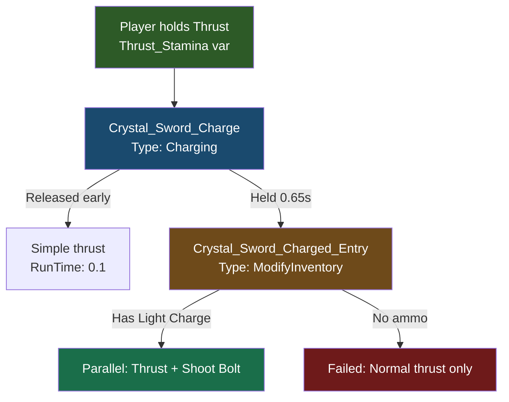

## Goal

Build a **Crystal Anvil** crafting bench, a **Crystal Sword** with a charged projectile attack, and **Light Charge** ammunition — all craftable from the bench. You will learn how crafting benches, interaction chains, the Charging interaction type, and projectile systems connect.

## What You'll Learn

- How crafting benches are defined using the `Bench` block type property
- How `State` with `Id: "crafting"` is **required** for the bench UI to open
- How to create categories that organise recipes within the bench UI
- How `InteractionVars` override vanilla sword behaviour to add custom attacks
- How the `Charging` interaction type creates hold-to-charge mechanics with visual effects
- How `ModifyInventory` consumes ammo and chains into `Parallel` interactions
- How to define projectiles, projectile configs, and a custom damage type

## Prerequisites

- A mod folder with a valid `manifest.json` (see [Setup Your Dev Environment](/hytale-modding-docs/tutorials/beginner/setup-dev-environment))
- Familiarity with block definitions (see [Create a Custom Block](/hytale-modding-docs/tutorials/beginner/create-a-block))
- Familiarity with item definitions (see [Create a Custom Item](/hytale-modding-docs/tutorials/beginner/create-an-item))

**Companion mod repository:** [hytale-guide-create-a-crafting-bench](https://github.com/nevesb/hytale-guide-create-a-crafting-bench)

---

## Crafting Bench Overview

Crafting benches in Hytale are **items** that contain an inline `BlockType` with a `Bench` configuration. Unlike pure blocks that need a separate Block JSON and `BlockTypeList`, benches define everything in a single Item JSON file — the same pattern used by vanilla benches like `Bench_Weapon` and `Bench_Armory`.

Key differences from regular blocks:
- **No separate Block JSON** in `Server/Item/Block/Blocks/`
- **No `BlockTypeList` entry** needed
- The `State` block with `Id: "crafting"` is **mandatory** for the crafting UI to work
- The `Bench` object defines the crafting type, categories, and tier levels

---

## Step 1: Set Up the Mod File Structure

```text
CreateACraftingBench/
├── manifest.json
├── Common/
│   ├── Blocks/HytaleModdingManual/
│   │   └── Armory_Crystal_Glow.blockymodel
│   ├── BlockTextures/HytaleModdingManual/
│   │   └── Armory_Crystal_Glow.png
│   └── Items/Weapons/Crystal/
│       ├── Weapon_Sword_Crystal_Glow.blockymodel
│       └── Weapon_Sword_Crystal_Glow.png
└── Server/
    ├── Entity/Damage/
    │   └── Crystal_Light.json
    ├── Item/
    │   ├── Interactions/HytaleModdingManual/
    │   │   ├── Crystal_Sword_Charge.json
    │   │   ├── Crystal_Sword_Charged_Entry.json
    │   │   ├── Crystal_Sword_Shoot_Bolt.json
    │   │   ├── Crystal_Sword_Special.json
    │   │   └── Crystal_Light_Bolt_Damage.json
    │   ├── Items/HytaleModdingManual/
    │   │   ├── Bench_Armory_Crystal_Glow.json
    │   │   ├── Weapon_Sword_Crystal_Glow.json
    │   │   └── Weapon_Arrow_Crystal_Glow.json
    │   └── RootInteractions/HytaleModdingManual/
    │       └── Crystal_Sword_Special.json
    ├── Projectiles/
    │   └── Crystal_Light_Bolt.json
    ├── ProjectileConfigs/HytaleModdingManual/
    │   └── Projectile_Config_Crystal_Light_Bolt.json
    └── Languages/
        ├── en-US/server.lang
        ├── es/server.lang
        └── pt-BR/server.lang
```

### manifest.json

```json
{
  "Group": "HytaleModdingManual",
  "Name": "CreateACraftingBench",
  "Version": "2.0.0",
  "Description": "Crystal Anvil bench, Crystal Sword with projectile attacks, Light Charges ammo, and Crystal Light element",
  "Authors": [
    {
      "Name": "HytaleModdingManual"
    }
  ],
  "Dependencies": {
    "HytaleModdingManual:CreateACustomBlock": "1.0.0",
    "HytaleModdingManual:CreateACustomTree": "1.0.0"
  },
  "OptionalDependencies": {},
  "IncludesAssetPack": true
}
```

`IncludesAssetPack` is `true` because we have Common assets (models and textures). The `Dependencies` list the mods that provide resources used in the recipes (Crystal Glow ore and Enchanted Wood).

---

## Step 2: Create the Bench Item Definition

Create the bench at `Server/Item/Items/HytaleModdingManual/Bench_Armory_Crystal_Glow.json`:

```json
{
  "TranslationProperties": {
    "Name": "server.items.Bench_Armory_Crystal_Glow.name",
    "Description": "server.items.Bench_Armory_Crystal_Glow.description"
  },
  "Quality": "Rare",
  "Icon": "Icons/ItemsGenerated/Bench_Armory_Crystal_Glow.png",
  "Categories": [
    "Furniture.Benches"
  ],
  "Recipe": {
    "TimeSeconds": 10.0,
    "KnowledgeRequired": false,
    "Input": [
      {
        "ItemId": "Ore_Crystal_Glow",
        "Quantity": 3
      },
      {
        "ItemId": "Wood_Enchanted_Trunk",
        "Quantity": 10
      },
      {
        "ItemId": "Ingredient_Bar_Gold",
        "Quantity": 5
      }
    ],
    "BenchRequirement": [
      {
        "Type": "Crafting",
        "Categories": [
          "Workbench_Crafting"
        ],
        "Id": "Workbench",
        "RequiredTierLevel": 2
      }
    ]
  },
  "BlockType": {
    "Material": "Solid",
    "DrawType": "Model",
    "Opacity": "Transparent",
    "CustomModel": "Blocks/HytaleModdingManual/Armory_Crystal_Glow.blockymodel",
    "CustomModelTexture": [
      {
        "Texture": "BlockTextures/HytaleModdingManual/Armory_Crystal_Glow.png",
        "Weight": 1
      }
    ],
    "VariantRotation": "NESW",
    "HitboxType": "Bench_Weapon",
    "State": {
      "Id": "crafting",
      "Definitions": {
        "CraftCompleted": {
          "Looping": true
        },
        "CraftCompletedInstant": {}
      }
    },
    "Gathering": {
      "Breaking": {
        "GatherType": "Benches",
        "ItemId": "Bench_Armory_Crystal_Glow"
      }
    },
    "Light": {
      "Color": "#88ccff"
    },
    "Bench": {
      "Type": "Crafting",
      "LocalOpenSoundEventId": "SFX_Weapon_Bench_Open",
      "LocalCloseSoundEventId": "SFX_Weapon_Bench_Close",
      "CompletedSoundEventId": "SFX_Weapon_Bench_Craft",
      "Id": "Armory_Crystal_Glow",
      "Categories": [
        {
          "Id": "Crystal_Glow_Sword",
          "Name": "server.benchCategories.crystal_glow_sword",
          "Icon": "Icons/CraftingCategories/Armory/Sword.png"
        }
      ],
      "TierLevels": [
        {
          "CraftingTimeReductionModifier": 0.0
        }
      ]
    },
    "BlockSoundSetId": "Crystal",
    "ParticleColor": "#88ccff",
    "Support": {
      "Down": [
        {
          "FaceType": "Full"
        }
      ]
    },
    "BlockParticleSetId": "Crystal"
  },
  "PlayerAnimationsId": "Block",
  "IconProperties": {
    "Scale": 0.5,
    "Rotation": [
      22.5,
      45,
      22.5
    ],
    "Translation": [
      13,
      -14
    ]
  },
  "Tags": {
    "Type": [
      "Bench"
    ]
  },
  "MaxStack": 1,
  "ItemSoundSetId": "ISS_Items_Gems"
}
```

### Key bench fields explained

| Field | Purpose |
|-------|---------|
| `Bench.Type` | Must be `"Crafting"` for recipe-based benches |
| `Bench.Id` | Unique identifier that recipes reference in their `BenchRequirement` |
| `Bench.Categories` | Array of category tabs shown in the bench UI. Each has an `Id`, `Icon`, and translation `Name` |
| `Bench.TierLevels` | Array of upgrade tiers. Each can have `CraftingTimeReductionModifier` (percentage faster) and `UpgradeRequirement` |
| `State` | **Required.** Must have `"Id": "crafting"` for the bench UI to open on interaction |
| `VariantRotation` | `"NESW"` lets the bench face four directions when placed |
| `HitboxType` | Reuses `"Bench_Weapon"` hitbox for the interaction area |
| `Light.Color` | Emits a soft blue glow (`#88ccff`) |
| `Support.Down` | Requires a full block face below to place |

:::caution[State is mandatory]
Without the `State` block, the bench will place in the world but **the crafting UI will not open** when you interact with it. There is no error in the logs — it silently fails. Every vanilla bench (`Bench_Weapon`, `Bench_Armory`, `Bench_Campfire`) includes this `State` configuration.
:::

### Category structure

Each category in the `Categories` array defines a tab in the crafting UI:

```json
{
  "Id": "Crystal_Glow_Sword",
  "Name": "server.benchCategories.crystal_glow_sword",
  "Icon": "Icons/CraftingCategories/Armory/Sword.png"
}
```

- **`Id`** — The category identifier that recipes reference to appear under this tab
- **`Icon`** — Path to the icon PNG displayed on the category tab (we reuse the vanilla Sword icon)
- **`Name`** — Translation key for the category label text

---

## Step 3: Create a Recipe That Uses the Bench

Any item with a `Recipe` can reference your bench through `BenchRequirement`. The connection is made by matching `BenchRequirement.Id` to your bench's `Bench.Id`, and `Categories` to the category tabs the recipe appears under.

For example, the Crystal Glow Sword recipe references our bench:

```json
{
  "Recipe": {
    "TimeSeconds": 8.0,
    "Input": [
      {
        "ItemId": "Ore_Crystal_Glow",
        "Quantity": 10
      },
      {
        "ItemId": "Wood_Enchanted_Trunk",
        "Quantity": 50
      },
      {
        "ItemId": "Ingredient_Leather_Heavy",
        "Quantity": 10
      }
    ],
    "BenchRequirement": [
      {
        "Type": "Crafting",
        "Id": "Armory_Crystal_Glow",
        "Categories": [
          "Crystal_Glow_Sword"
        ]
      }
    ]
  }
}
```

### BenchRequirement fields

| Field | Purpose |
|-------|---------|
| `Type` | Must be `"Crafting"` to match a crafting bench |
| `Id` | Must exactly match the `Bench.Id` from your bench definition (case-sensitive) |
| `Categories` | Array of category IDs this recipe appears under. Must match a category `Id` from the bench |
| `RequiredTierLevel` | Minimum bench tier required. Omit for tier 0 (no upgrade needed) |

---

## Step 4: Add Translation Keys

Create language files at `Server/Languages/<locale>/server.lang`:

### English (`en-US/server.lang`)

```
items.Bench_Armory_Crystal_Glow.name = Crystal Anvil
items.Bench_Armory_Crystal_Glow.description = A crystal anvil for forging crystal weapons.
benchCategories.crystal_glow_sword = Crystal Sword
```

### Spanish (`es/server.lang`)

```
items.Bench_Armory_Crystal_Glow.name = Yunque de Cristal
items.Bench_Armory_Crystal_Glow.description = Un yunque de cristal para forjar armas de cristal.
benchCategories.crystal_glow_sword = Espada de Cristal
```

### Portuguese BR (`pt-BR/server.lang`)

```
items.Bench_Armory_Crystal_Glow.name = Bigorna de Cristal
items.Bench_Armory_Crystal_Glow.description = Uma bigorna de cristal para forjar armas de cristal.
benchCategories.crystal_glow_sword = Espada de Cristal
```

Note the translation key format: `items.<ItemId>.name` and `benchCategories.<category_id>`. The `server.` prefix in the JSON (`"Name": "server.items.Bench_Armory_Crystal_Glow.name"`) maps to the lang file key without the `server.` prefix.

---

## Step 5: Add the Custom Model

The bench uses a custom `.blockymodel` and texture. Place them in the `Common/` folder:

- **Model:** `Common/Blocks/HytaleModdingManual/Armory_Crystal_Glow.blockymodel`
- **Texture:** `Common/BlockTextures/HytaleModdingManual/Armory_Crystal_Glow.png`

You can create the model using [Blockbench](https://www.blockbench.net/) with the **Hytale Block** format. The model should fit within the block boundary (32 units = 1 block). For a 2-block-wide bench, use the `"HitboxType": "Bench_Weapon"` hitbox which covers the wider area.

:::tip[Common Asset Paths]
Common assets must be inside one of these root directories: `Blocks/`, `BlockTextures/`, `Items/`, `Resources/`, `NPC/`, `VFX/`, or `Consumable/`. Putting files outside these folders causes a load error.
:::

---

## Step 6: Create the Crystal Sword

The sword inherits from `Template_Weapon_Sword` (vanilla sword template) and overrides specific behaviours through `InteractionVars`. Create `Server/Item/Items/HytaleModdingManual/Weapon_Sword_Crystal_Glow.json`:

```json
{
  "Parent": "Template_Weapon_Sword",
  "TranslationProperties": {
    "Name": "server.items.Weapon_Sword_Crystal_Glow.name",
    "Description": "server.items.Weapon_Sword_Crystal_Glow.description"
  },
  "Model": "Items/Weapons/Crystal/Weapon_Sword_Crystal_Glow.blockymodel",
  "Texture": "Items/Weapons/Crystal/Weapon_Sword_Crystal_Glow.png",
  "Icon": "Icons/ItemsGenerated/Weapon_Sword_Crystal_Glow.png",
  "Quality": "Rare",
  "ItemLevel": 35,
  "Tags": {
    "Type": ["Weapon"],
    "Family": ["Sword"]
  },
  "Interactions": {
    "Primary": "Root_Weapon_Sword_Primary",
    "Secondary": "Root_Weapon_Sword_Secondary_Guard",
    "Ability1": "Crystal_Sword_Special"
  },
  "InteractionVars": {
    "Swing_Left_Damage": {
      "Interactions": [{
        "Parent": "Weapon_Sword_Primary_Swing_Left_Damage",
        "DamageCalculator": { "BaseDamage": { "Physical": 12 } }
      }]
    },
    "Swing_Right_Damage": {
      "Interactions": [{
        "Parent": "Weapon_Sword_Primary_Swing_Right_Damage",
        "DamageCalculator": { "BaseDamage": { "Physical": 12 } }
      }]
    },
    "Swing_Down_Damage": {
      "Interactions": [{
        "Parent": "Weapon_Sword_Primary_Swing_Down_Damage",
        "DamageCalculator": { "BaseDamage": { "Physical": 22 } }
      }]
    },
    "Thrust_Damage": {
      "Interactions": [{
        "Parent": "Weapon_Sword_Primary_Thrust_Damage",
        "DamageCalculator": {
          "BaseDamage": { "Physical": 20, "Crystal_Light": 12 }
        }
      }]
    },
    "Thrust_Stamina": {
      "Interactions": ["Crystal_Sword_Charge"]
    },
    "Guard_Wield": {
      "Interactions": [{
        "Parent": "Weapon_Sword_Secondary_Guard_Wield",
        "StaminaCost": { "Value": 8, "CostType": "Damage" }
      }]
    }
  },
  "Weapon": {
    "EntityStatsToClear": ["SignatureEnergy"],
    "StatModifiers": {
      "SignatureEnergy": [{ "Amount": 20, "CalculationType": "Additive" }]
    }
  },
  "Recipe": {
    "TimeSeconds": 5.0,
    "KnowledgeRequired": false,
    "Input": [
      { "ItemId": "Ore_Crystal_Glow", "Quantity": 10 },
      { "ItemId": "Wood_Enchanted_Trunk", "Quantity": 50 },
      { "ItemId": "Ingredient_Leather_Heavy", "Quantity": 10 }
    ],
    "BenchRequirement": [{
      "Type": "Crafting",
      "Categories": ["Crystal_Glow"],
      "Id": "Armory_Crystal_Glow"
    }]
  },
  "Light": { "Radius": 2, "Color": "#88ccff" },
  "MaxDurability": 150,
  "DurabilityLossOnHit": 0.18
}
```

### Key concepts

| Field | Purpose |
|-------|---------|
| `Parent` | Inherits all vanilla sword behaviour (swing combos, guard, thrust) from `Template_Weapon_Sword` |
| `InteractionVars` | Overrides specific parts of the inherited interaction chain. Each key replaces a named variable in the vanilla chain |
| `Thrust_Stamina` | The vanilla thrust combo ends with a stamina-consuming charged thrust. We replace it with `Crystal_Sword_Charge` to add our projectile mechanic |
| `Thrust_Damage` | Adds `Crystal_Light` damage alongside `Physical` on thrust attacks |
| `Weapon.StatModifiers` | Builds `SignatureEnergy` (+20 per hit) — used by the special ability |
| `Light` | The sword emits a blue glow when held |

:::tip[InteractionVars pattern]
`InteractionVars` is how Hytale lets individual items customise shared interaction chains. The vanilla `Root_Weapon_Sword_Primary` chain references variables like `Thrust_Damage` and `Thrust_Stamina`. Each weapon provides its own values for these variables without needing to duplicate the entire chain.
:::

---

## Step 7: Create the Light Charge Ammunition

The Crystal Sword's charged thrust consumes **Light Charges** from the player's inventory. Create `Server/Item/Items/HytaleModdingManual/Weapon_Arrow_Crystal_Glow.json`:

```json
{
  "TranslationProperties": {
    "Name": "server.items.Weapon_Arrow_Crystal_Glow.name",
    "Description": "server.items.Weapon_Arrow_Crystal_Glow.description"
  },
  "Categories": ["Items.Weapons"],
  "Quality": "Uncommon",
  "ItemLevel": 25,
  "Model": "Items/Projectiles/Ice_Bolt.blockymodel",
  "Texture": "Items/Projectiles/Ice_Bolt_Texture.png",
  "Icon": "Icons/ItemsGenerated/Weapon_Arrow_Crystal_Glow.png",
  "Recipe": {
    "TimeSeconds": 5.0,
    "KnowledgeRequired": false,
    "Input": [
      { "ItemId": "Plant_Fruit_Enchanted", "Quantity": 1 },
      { "ItemId": "Ore_Crystal_Glow", "Quantity": 1 },
      { "ItemId": "Weapon_Arrow_Crude", "Quantity": 10 }
    ],
    "OutputQuantity": 50,
    "BenchRequirement": [{
      "Type": "Crafting",
      "Categories": ["Crystal_Glow"],
      "Id": "Armory_Crystal_Glow"
    }]
  },
  "MaxStack": 100,
  "Tags": {
    "Type": ["Weapon"],
    "Family": ["Arrow"]
  },
  "Weapon": {},
  "Light": { "Radius": 1, "Color": "#88ccff" }
}
```

Note `OutputQuantity: 50` — crafting one batch produces 50 charges. The `Family: Arrow` tag and `Weapon: {}` block are required so the game treats this item as consumable ammunition.

---

## Step 8: Build the Charged Attack Interaction Chain

The charged attack uses a chain of interactions that flow into each other. Here is how they connect:



### 8a. The Charging interaction

Create `Server/Item/Interactions/HytaleModdingManual/Crystal_Sword_Charge.json`:

```json
{
  "Type": "Charging",
  "AllowIndefiniteHold": false,
  "DisplayProgress": false,
  "HorizontalSpeedMultiplier": 0.5,
  "Effects": {
    "ItemAnimationId": "StabDashCharging",
    "Particles": [
      {
        "PositionOffset": { "X": 0, "Y": 0, "Z": 0 },
        "RotationOffset": { "Pitch": 0, "Roll": 0, "Yaw": 0 },
        "TargetNodeName": "blade",
        "SystemId": "Sword_Charging"
      }
    ]
  },
  "Next": {
    "0": {
      "Type": "Simple",
      "RunTime": 0.1
    },
    "0.65": "Crystal_Sword_Charged_Entry"
  }
}
```

| Field | Purpose |
|-------|---------|
| `Type: "Charging"` | Hold-to-charge mechanic — the player holds the attack button |
| `DisplayProgress: false` | Hides the charge bar. The particle effect provides visual feedback instead |
| `HorizontalSpeedMultiplier` | Slows player movement to 50% while charging |
| `Effects.ItemAnimationId` | Plays the `StabDashCharging` preparation animation on the sword |
| `Effects.Particles` | Spawns `Sword_Charging` particles on the sword's `blade` node — a glowing circular effect |
| `Next."0"` | If released before 0.65s, performs a quick thrust (no projectile) |
| `Next."0.65"` | If held for 0.65s or more, transitions to `Crystal_Sword_Charged_Entry` |

:::caution[TargetNodeName must match your model]
The `TargetNodeName` must match a group name in your sword's `.blockymodel` file. Vanilla swords use `"Handle"` but custom models may have different node names. Check your model in Blockbench to find the correct group name.
:::

### 8b. The ammo check and parallel execution

Create `Server/Item/Interactions/HytaleModdingManual/Crystal_Sword_Charged_Entry.json`:

```json
{
  "Type": "ModifyInventory",
  "ItemToRemove": {
    "Id": "Weapon_Arrow_Crystal_Glow",
    "Quantity": 1
  },
  "AdjustHeldItemDurability": -0.3,
  "Next": {
    "Type": "Parallel",
    "Interactions": [
      {
        "Interactions": [
          "Weapon_Sword_Primary_Thrust_Force",
          "Weapon_Sword_Primary_Thrust_Selector"
        ]
      },
      {
        "Interactions": [
          { "Type": "Simple", "RunTime": 0 },
          "Crystal_Sword_Shoot_Bolt"
        ]
      }
    ]
  },
  "Failed": {
    "Type": "Serial",
    "Interactions": [
      "Weapon_Sword_Primary_Thrust_Force",
      "Weapon_Sword_Primary_Thrust_Selector"
    ]
  }
}
```

| Field | Purpose |
|-------|---------|
| `Type: "ModifyInventory"` | Checks and removes items from the player's inventory |
| `ItemToRemove` | Consumes 1 Light Charge. If the player has none, jumps to `Failed` |
| `AdjustHeldItemDurability` | Reduces sword durability by 0.3 when firing a projectile |
| `Next` (Parallel) | Runs the thrust attack and projectile firing simultaneously |
| `Failed` | If no ammo, performs a normal thrust with no projectile |

:::caution[Avoid chaining to Weapon_Sword_Primary_Thrust]
`Weapon_Sword_Primary_Thrust` is itself a `Charging` type interaction. If you chain to it from another Charging interaction, the player sees a double animation. Instead, reference the inner components directly: `Weapon_Sword_Primary_Thrust_Force` (movement) and `Weapon_Sword_Primary_Thrust_Selector` (hit detection).
:::

### 8c. The projectile interaction

Create `Server/Item/Interactions/HytaleModdingManual/Crystal_Sword_Shoot_Bolt.json`:

```json
{
  "Type": "Projectile",
  "Config": "Projectile_Config_Crystal_Light_Bolt",
  "Next": {
    "Type": "Simple",
    "RunTime": 0.2
  }
}
```

---

## Step 9: Configure the Projectile

### 9a. Projectile definition

Create `Server/Projectiles/Crystal_Light_Bolt.json`:

```json
{
  "Appearance": "Ice_Bolt",
  "Radius": 0.2,
  "Height": 0.2,
  "MuzzleVelocity": 55,
  "TerminalVelocity": 60,
  "Gravity": 2,
  "TimeToLive": 10,
  "Damage": 18,
  "HitParticles": { "SystemId": "Impact_Ice" },
  "DeathParticles": { "SystemId": "Impact_Ice" },
  "HitSoundEventId": "SFX_Divine_Respawn",
  "DeathSoundEventId": "SFX_Ice_Bolt_Death"
}
```

### 9b. Projectile config

Create `Server/ProjectileConfigs/HytaleModdingManual/Projectile_Config_Crystal_Light_Bolt.json`:

```json
{
  "Parent": "Projectile_Config_Arrow_Base",
  "Model": "Ice_Bolt",
  "Physics": {
    "Type": "Standard",
    "Gravity": 2,
    "TerminalVelocityAir": 60,
    "TerminalVelocityWater": 15,
    "RotationMode": "VelocityDamped",
    "Bounciness": 0.0
  },
  "LaunchForce": 55,
  "SpawnOffset": { "X": 0.3, "Y": -0.3, "Z": 1.5 },
  "Interactions": {
    "ProjectileHit": {
      "Interactions": [
        "Crystal_Light_Bolt_Damage",
        "Common_Projectile_Despawn"
      ]
    },
    "ProjectileMiss": {
      "Interactions": [
        "Common_Projectile_Miss",
        "Common_Projectile_Despawn"
      ]
    }
  }
}
```

The config inherits from `Projectile_Config_Arrow_Base` and overrides the physics, launch force, and hit interactions. `SpawnOffset` controls where the bolt appears relative to the player.

### 9c. Projectile damage

Create `Server/Item/Interactions/HytaleModdingManual/Crystal_Light_Bolt_Damage.json`:

```json
{
  "Parent": "DamageEntityParent",
  "DamageCalculator": {
    "BaseDamage": {
      "Crystal_Light": 18
    }
  },
  "DamageEffects": {
    "Knockback": {
      "Type": "Force",
      "Direction": { "X": 0.0, "Y": 1, "Z": -3 },
      "Force": 8,
      "VelocityType": "Add"
    },
    "WorldParticles": [{ "SystemId": "Impact_Ice", "Scale": 1 }],
    "WorldSoundEventId": "SFX_Ice_Bolt_Death",
    "EntityStatsOnHit": [
      { "EntityStatId": "SignatureEnergy", "Amount": 5 }
    ]
  }
}
```

The bolt deals `Crystal_Light` damage (our custom damage type), applies knockback, and grants 5 `SignatureEnergy` on hit — helping charge the sword's special ability.

---

## Step 10: Add the Custom Damage Type

Create `Server/Entity/Damage/Crystal_Light.json`:

```json
{
  "Parent": "Elemental",
  "Inherits": "Elemental",
  "DamageTextColor": "#88ccff"
}
```

This registers `Crystal_Light` as a new damage type inheriting from `Elemental`. The `DamageTextColor` controls the colour of damage numbers shown on hit.

---

## Step 11: Test In-Game

1. Place the mod folder in your mods directory (`%APPDATA%/Hytale/UserData/Mods/`).
2. Start the server and check the logs for validation errors.
3. Use `/spawnitem Bench_Armory_Crystal_Glow` to get the bench, then `/spawnitem Weapon_Sword_Crystal_Glow` and `/spawnitem Weapon_Arrow_Crystal_Glow 50` for testing.
4. Place the bench and right-click to verify the crafting UI opens with the Crystal Light category.
5. Equip the sword and test the basic combo (left-click swings, hold for thrust).
6. With Light Charges in your inventory, hold the thrust — you should see the charging glow on the blade, then a crystal bolt fires after 0.65 seconds.
7. Without Light Charges, the charged thrust should perform a normal thrust with no projectile.

**Common errors and fixes:**

| Error | Cause | Fix |
|-------|-------|-----|
| Bench places but UI doesn't open | Missing `State` block | Add `"State": { "Id": "crafting", ... }` to the bench's `BlockType` |
| Recipe not appearing in bench | `BenchRequirement.Id` mismatch | Ensure `Id` exactly matches `Bench.Id` (case-sensitive) |
| `StackOverflowError` on load | Using `Parent` inheritance with `State` | Make the bench standalone — copy all fields instead of inheriting from `Bench_Weapon` |
| Double charge animation | Chaining to `Weapon_Sword_Primary_Thrust` | Use `Thrust_Force` + `Thrust_Selector` directly instead |
| Particles on player, not sword | Wrong `TargetNodeName` | Must match a group name in your `.blockymodel` file |
| Projectile doesn't fire | Missing `ItemToRemove` item in inventory | Ensure the player has Light Charges; check the `Failed` branch works |
| Charge bar visible | `DisplayProgress` not set | Add `"DisplayProgress": false` to the Charging interaction |

---

## Vanilla Bench Reference

For reference, here are the bench types used in the vanilla game:

| Bench | `Bench.Type` | `Bench.Id` | Categories |
|-------|-------------|------------|------------|
| Weapon Bench | `Crafting` | `Weapon_Bench` | Sword, Mace, Battleaxe, Daggers, Bow |
| Armory | `DiagramCrafting` | `Armory` | Weapons (Sword, Club, Axe, etc.), Armor (Head, Chest, etc.) |
| Campfire | `Crafting` | `Campfire` | Cooking |
| Workbench | `Crafting` | `Workbench` | Workbench_Crafting |

---

## Next Steps

- [Create a Custom Block](/hytale-modding-docs/tutorials/beginner/create-a-block) — learn how blocks and items connect
- [Custom Loot Tables](/hytale-modding-docs/tutorials/intermediate/custom-loot-tables) — set up drops that include your crafted items
- [NPC Shops and Trading](/hytale-modding-docs/tutorials/intermediate/npc-shops-and-trading) — sell bench-crafted items through NPC merchants
