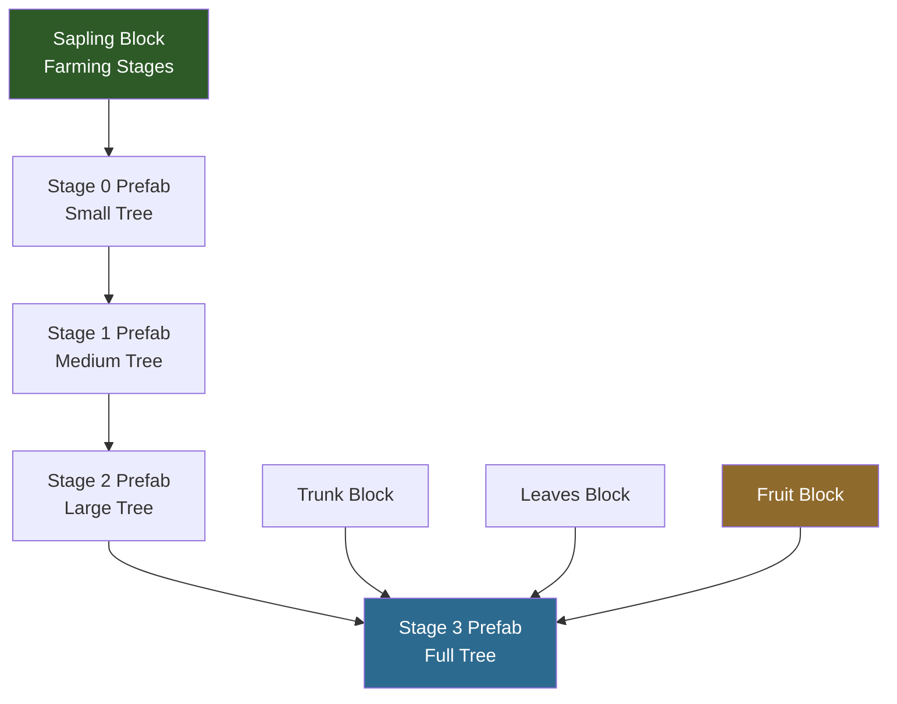
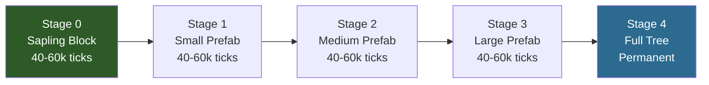

## What You'll Build

A **Crystal Tree** — a custom tree type that players can grow from a sapling. When fully grown, the tree provides **Crystal Wood** (trunk blocks) for crafting weapon handles and **Light Shards** (glowing fruit) for crossbow ammunition. The tree uses Azure tree models as a base with custom textures.

## What You'll Learn

- How Hytale trees are composed of multiple block types (trunk, leaves, fruit, sapling)
- How `Parent` inheritance creates tree variants from existing types
- How the `Farming` system drives sapling growth through prefab stages
- How to configure light-emitting fruit blocks
- How `PrefabList` registers tree structures for the engine

## Prerequisites

- A mod folder with a valid `manifest.json` (see [Setup Your Dev Environment](/hytale-modding-docs/tutorials/beginner/setup-dev-environment/))
- Familiarity with block definitions (see [Create a Custom Block](/hytale-modding-docs/tutorials/beginner/create-a-block/))
- Custom textures for trunk, leaves, and fruit (or reuse Azure textures for testing)

---

## Tree System Overview

A Hytale tree is not a single asset — it is a **composition of four block types** plus a **growth system** that assembles them into a tree shape:



| Component | File Location | Purpose |
|-----------|--------------|---------|
| **Trunk** | `Server/Item/Items/Wood/` | The wood block — drops when chopped, used as building material |
| **Leaves** | `Server/Item/Items/Plant/Leaves/` | Decorative canopy — decays when trunk is removed |
| **Fruit** | `Server/Item/Items/Plant/Fruit/` | Harvestable item that grows on the tree — can glow, be consumed, or used as crafting material |
| **Sapling** | `Server/Item/Items/Plant/` | Plantable block with `Farming` stages that grows into a tree over time |
| **PrefabList** | `Server/PrefabList/` | Registry that tells the engine where to find the tree prefab files for each growth stage |

Each prefab (`.prefab.json`) is a blueprint containing the exact block positions that form the tree shape at that stage. The sapling's `Farming` system transitions through these prefabs over time.

---

## Step 1: Create the Trunk Block

The trunk is what players chop to get wood. We inherit from `Wood_Oak_Trunk` and override only the textures and particle color.

Create `Server/Item/Items/Wood/Crystal/Wood_Crystal_Trunk.json`:

```json
{
  "TranslationProperties": {
    "Name": "server.items.Wood_Crystal_Trunk.name",
    "Description": "server.items.Wood_Crystal_Trunk.description"
  },
  "Parent": "Wood_Oak_Trunk",
  "Icon": "Icons/ItemsGenerated/Wood_Crystal_Trunk.png",
  "BlockType": {
    "Textures": [
      {
        "Sides": "BlockTextures/Wood_Trunk_Crystal_Side.png",
        "UpDown": "BlockTextures/Wood_Trunk_Crystal_Top.png",
        "Weight": 1
      }
    ],
    "Gathering": {
      "Breaking": {
        "ItemId": "Wood_Crystal_Trunk",
        "GatherType": "Woods"
      }
    },
    "ParticleColor": "#5e3b56"
  },
  "ResourceTypes": [
    { "Id": "Wood_Trunk" },
    { "Id": "Wood_All" },
    { "Id": "Fuel" },
    { "Id": "Charcoal" }
  ]
}
```

### Trunk Fields

| Field | Type | Purpose |
|-------|------|---------|
| `Parent` | String | Inherits all block properties from `Wood_Oak_Trunk` (hardness, tool requirements, physics) |
| `BlockType.Textures` | Array | Texture configuration. `Sides` for the bark, `UpDown` for the cross-section when viewed from top/bottom |
| `BlockType.Textures[].Weight` | Number | For multiple texture variants — `1` means this is the only option |
| `BlockType.Gathering.Breaking` | Object | What drops when the block is broken. `GatherType: "Woods"` means axes break it faster |
| `BlockType.ParticleColor` | String | Hex color of particles when the block is hit or broken |
| `ResourceTypes` | Array | Tags this block as wood for crafting recipes. `Wood_Trunk` and `Wood_All` let it be used in any recipe requiring wood |

:::tip[Texture Files]
The texture paths are relative to `Common/`. You need two PNG files:
- `Common/BlockTextures/Wood_Trunk_Crystal_Side.png` — bark texture (side faces)
- `Common/BlockTextures/Wood_Trunk_Crystal_Top.png` — ring texture (top/bottom faces)

For testing, copy the Azure textures (`Wood_Trunk_Azure_Side.png` and `Wood_Trunk_Azure_Top.png`) and adjust the hue.
:::

---

## Step 2: Create the Leaves Block

Leaves use a shared 3D model (`Ball.blockymodel`) with a custom texture for color. They inherit all decay and physics behavior from the Oak template.

Create `Server/Item/Items/Plant/Leaves/Plant_Leaves_Crystal.json`:

```json
{
  "TranslationProperties": {
    "Name": "server.items.Plant_Leaves_Crystal.name"
  },
  "Icon": "Icons/ItemsGenerated/Plant_Crystal_Leaves.png",
  "Parent": "Plant_Leaves_Oak",
  "BlockType": {
    "CustomModel": "Blocks/Foliage/Leaves/Ball.blockymodel",
    "CustomModelTexture": [
      {
        "Texture": "Blocks/Foliage/Leaves/Ball_Textures/Crystal.png",
        "Weight": 1
      }
    ],
    "ParticleColor": "#1c7baf"
  }
}
```

### Leaves Fields

| Field | Type | Purpose |
|-------|------|---------|
| `Parent` | String | Inherits from `Plant_Leaves_Oak` — gets leaf decay, transparency, and break behavior |
| `BlockType.CustomModel` | String | Shared leaf model. All tree types use the same `Ball.blockymodel` shape |
| `BlockType.CustomModelTexture` | Array | Color texture applied to the model. Change this PNG to change the leaf color |
| `BlockType.ParticleColor` | String | Color of particles when leaves are broken. Use a color that matches the texture |

The `Ball.blockymodel` is a shared vanilla model at `Common/Blocks/Foliage/Leaves/Ball.blockymodel`. You only need to provide a custom texture in `Common/Blocks/Foliage/Leaves/Ball_Textures/Crystal.png`.

---

## Step 3: Create the Fruit Block (Light Shards)

The fruit is the key crafting material — **Light Shards** that glow on the tree and drop when harvested. This block emits light, is transparent, and can be consumed as food.

Create `Server/Item/Items/Plant/Fruit/Plant_Fruit_Crystal.json`:

```json
{
  "TranslationProperties": {
    "Name": "server.items.Plant_Fruit_Crystal.name",
    "Description": "server.items.Plant_Fruit_Crystal.description"
  },
  "Icon": "Icons/ItemsGenerated/Plant_Fruit_Crystal.png",
  "Parent": "Template_Fruit",
  "BlockType": {
    "CustomModel": "Resources/Ingredients/Crystal_Fruit.blockymodel",
    "CustomModelTexture": [
      {
        "Texture": "Resources/Ingredients/Crystal_Fruit_Texture.png",
        "Weight": 1
      }
    ],
    "VariantRotation": "UpDown",
    "Opacity": "Transparent",
    "Light": {
      "Color": "#469"
    },
    "BlockSoundSetId": "Mushroom",
    "BlockParticleSetId": "Dust",
    "ParticleColor": "#326ea7"
  },
  "InteractionVars": {
    "Consume_Charge": {
      "Interactions": [
        {
          "Parent": "Consume_Charge_Food_T1_Inner",
          "Effects": {
            "Particles": [
              {
                "SystemId": "Food_Eat",
                "Color": "#326ea7",
                "TargetNodeName": "Mouth",
                "TargetEntityPart": "Entity"
              }
            ]
          }
        }
      ]
    }
  },
  "Scale": 1.75,
  "DropOnDeath": true,
  "Quality": "Common"
}
```

### Fruit Fields

| Field | Type | Purpose |
|-------|------|---------|
| `Parent` | String | Inherits from `Template_Fruit` — gets harvesting behavior, food consumption logic |
| `BlockType.CustomModel` | String | 3D model for the fruit. Create in Blockbench or reuse `Azure_Fruit.blockymodel` |
| `BlockType.Opacity` | String | `"Transparent"` — the fruit block doesn't block light or vision |
| `BlockType.Light.Color` | String | Hex color of emitted light. `"#469"` gives a soft blue glow matching the crystal theme |
| `BlockType.VariantRotation` | String | `"UpDown"` — the fruit hangs in different orientations for natural variety |
| `InteractionVars` | Object | Defines what happens when consumed. Inherits from `Consume_Charge_Food_T1_Inner` for basic food healing |
| `Scale` | Number | Visual scale multiplier. `1.75` makes the fruit more visible on the tree |
| `DropOnDeath` | Boolean | `true` — the fruit drops as an item when the block is destroyed (tree chopped or leaves decay) |

:::caution[Light Color Format]
`Light.Color` uses a **3-character hex shorthand** where each character represents R, G, B. `"#469"` expands to `#446699` — a muted blue. Unlike `Light.Radius` on items (which must be an integer), block light uses only `Color` and the engine determines the radius from block light level rules.
:::

---

## Step 4: Create the Sapling

The sapling is the most complex piece — it's a plantable block that uses the `Farming` system to grow through prefab stages over time.

Create `Server/Item/Items/Plant/Plant_Sapling_Crystal.json`:

```json
{
  "TranslationProperties": {
    "Name": "server.items.Plant_Sapling_Crystal.name",
    "Description": "server.items.Plant_Sapling_Crystal.description"
  },
  "Icon": "Icons/ItemsGenerated/Plant_Crystal_Sapling.png",
  "Categories": [
    "Blocks.Plants"
  ],
  "Interactions": {
    "Primary": "Block_Primary",
    "Secondary": "Block_Secondary"
  },
  "ItemLevel": 6,
  "BlockType": {
    "DrawType": "Model",
    "CustomModel": "Blocks/Foliage/Tree/Sapling.blockymodel",
    "CustomModelTexture": [
      {
        "Texture": "Blocks/Foliage/Tree/Sapling_Textures/Crystal.png",
        "Weight": 1
      }
    ],
    "Group": "Wood",
    "HitboxType": "Plant_Large",
    "Flags": {},
    "RandomRotation": "YawStep1",
    "BlockEntity": {
      "Components": {
        "FarmingBlock": {}
      }
    },
    "Farming": {
      "Stages": {
        "Default": [
          {
            "Block": "Plant_Sapling_Crystal",
            "Duration": {
              "Min": 40000,
              "Max": 60000
            },
            "Type": "BlockType"
          },
          {
            "Prefabs": [
              {
                "Path": "Trees/Crystal/Stage_0/Crystal_Stage0_001.prefab.json",
                "Weight": 1
              }
            ],
            "Duration": {
              "Min": 40000,
              "Max": 60000
            },
            "Type": "Prefab",
            "ReplaceMaskTags": [
              "Soil"
            ],
            "SoundEventId": "SFX_Crops_Grow"
          },
          {
            "Prefabs": [
              {
                "Path": "Trees/Crystal/Stage_1/Crystal_Stage1_001.prefab.json",
                "Weight": 1
              }
            ],
            "Duration": {
              "Min": 40000,
              "Max": 60000
            },
            "Type": "Prefab",
            "ReplaceMaskTags": [
              "Soil"
            ],
            "SoundEventId": "SFX_Crops_Grow"
          },
          {
            "Prefabs": [
              {
                "Path": "Trees/Crystal/Stage_2/Crystal_Stage2_001.prefab.json",
                "Weight": 1
              }
            ],
            "Duration": {
              "Min": 40000,
              "Max": 60000
            },
            "Type": "Prefab",
            "ReplaceMaskTags": [
              "Soil"
            ],
            "SoundEventId": "SFX_Crops_Grow"
          },
          {
            "Prefabs": [
              {
                "Path": "Trees/Crystal/Stage_3/Crystal_Stage3_001.prefab.json",
                "Weight": 1
              }
            ],
            "Type": "Prefab",
            "ReplaceMaskTags": [
              "Soil"
            ],
            "SoundEventId": "SFX_Crops_Grow"
          }
        ]
      },
      "StartingStageSet": "Default",
      "ActiveGrowthModifiers": [
        "Fertilizer",
        "Water",
        "LightLevel"
      ]
    },
    "Gathering": {
      "Soft": {
        "ItemId": "Plant_Sapling_Crystal"
      }
    },
    "Support": {
      "Down": [
        {
          "TagId": "Type=Soil"
        }
      ]
    },
    "BlockParticleSetId": "Flower",
    "BlockSoundSetId": "Bush",
    "ParticleColor": "#44aacc"
  },
  "PlayerAnimationsId": "Item",
  "Tags": {
    "Type": [
      "Plant"
    ],
    "Family": [
      "Sapling"
    ]
  },
  "ItemSoundSetId": "ISS_Items_Foliage"
}
```

### How Farming Stages Work

The `Farming.Stages.Default` array defines the growth progression:



| Stage | Type | What Happens |
|-------|------|-------------|
| 0 | `BlockType` | The sapling block itself sits in the world. After 40,000–60,000 ticks, it transitions to the first prefab |
| 1 | `Prefab` | The engine replaces the sapling with a small tree prefab (a few trunk + leaf blocks) |
| 2 | `Prefab` | Replaces with a medium tree prefab (taller, more leaves) |
| 3 | `Prefab` | Replaces with a large tree prefab (branches, fruit start appearing) |
| 4 | `Prefab` | The final, fully grown tree. **No `Duration`** — it stays permanently |

### Key Farming Fields

| Field | Type | Purpose |
|-------|------|---------|
| `Stages.Default[].Type` | String | `"BlockType"` for the sapling block, `"Prefab"` for tree model stages |
| `Stages.Default[].Block` | String | For `BlockType` stages: the block ID (usually the sapling itself) |
| `Stages.Default[].Prefabs` | Array | For `Prefab` stages: list of prefab paths with weights for random selection |
| `Stages.Default[].Duration` | Object | `Min`/`Max` in game ticks. The engine picks a random value. Omit on the final stage to make it permanent |
| `Stages.Default[].ReplaceMaskTags` | Array | Block tags that prefabs can replace. `"Soil"` lets roots push into dirt |
| `Stages.Default[].SoundEventId` | String | Sound played when transitioning to this stage |
| `StartingStageSet` | String | Which stage set to begin with. `"Default"` is standard |
| `ActiveGrowthModifiers` | Array | What speeds up growth: `"Fertilizer"`, `"Water"`, `"LightLevel"` |

### Required Components

Two `BlockType` properties are essential for the sapling to work:

**FarmingBlock component** — tells the engine this block uses the farming system:
```json
"BlockEntity": {
  "Components": {
    "FarmingBlock": {}
  }
}
```

**Support rule** — sapling must be placed on soil:
```json
"Support": {
  "Down": [{ "TagId": "Type=Soil" }]
}
```

**Gathering** — breaking the sapling returns it to the player:
```json
"Gathering": {
  "Soft": { "ItemId": "Plant_Sapling_Crystal" }
}
```

:::tip[Multiple Prefab Variants]
To add visual variety, include multiple entries in a stage's `Prefabs` array with equal `Weight`. The engine picks one at random:
```json
"Prefabs": [
  { "Path": "Trees/Crystal/Stage_2/Crystal_Stage2_001.prefab.json", "Weight": 1 },
  { "Path": "Trees/Crystal/Stage_2/Crystal_Stage2_002.prefab.json", "Weight": 1 }
]
```
:::

---

## Step 5: Register the PrefabList

The `PrefabList` tells the engine where to scan for your tree's prefab files. Each growth stage has its own directory.

Create `Server/PrefabList/Trees_Crystal.json`:

```json
{
  "Prefabs": [
    {
      "RootDirectory": "Asset",
      "Path": "Trees/Crystal/Stage_0/",
      "Recursive": true
    },
    {
      "RootDirectory": "Asset",
      "Path": "Trees/Crystal/Stage_1/",
      "Recursive": true
    },
    {
      "RootDirectory": "Asset",
      "Path": "Trees/Crystal/Stage_2/",
      "Recursive": true
    },
    {
      "RootDirectory": "Asset",
      "Path": "Trees/Crystal/Stage_3/",
      "Recursive": true
    }
  ]
}
```

### PrefabList Fields

| Field | Type | Purpose |
|-------|------|---------|
| `Prefabs` | Array | List of directory entries to scan |
| `RootDirectory` | String | `"Asset"` — relative to the mod's `Server/Prefabs/` directory |
| `Path` | String | Subdirectory containing `.prefab.json` files for one growth stage |
| `Recursive` | Boolean | `true` — scan subdirectories as well |

The actual `.prefab.json` files contain block position data that forms the tree shape. These are typically created using the Hytale prefab editor in Creative Mode, not written by hand.

---

## Step 6: Add Translations

Create language files under `Server/Languages/`:

**`Server/Languages/en-US/server.lang`**
```properties
items.Wood_Crystal_Trunk.name = Crystal Wood
items.Wood_Crystal_Trunk.description = Shimmering wood harvested from a Crystal Tree.
items.Plant_Leaves_Crystal.name = Crystal Leaves
items.Plant_Fruit_Crystal.name = Light Shard
items.Plant_Fruit_Crystal.description = A glowing fruit from the Crystal Tree. Used to craft light-infused ammunition.
items.Plant_Sapling_Crystal.name = Crystal Sapling
items.Plant_Sapling_Crystal.description = Plant on soil to grow a Crystal Tree.
```

**`Server/Languages/es/server.lang`**
```properties
items.Wood_Crystal_Trunk.name = Madera Cristalina
items.Wood_Crystal_Trunk.description = Madera reluciente cosechada de un Árbol de Cristal.
items.Plant_Leaves_Crystal.name = Hojas de Cristal
items.Plant_Fruit_Crystal.name = Fragmento de Luz
items.Plant_Fruit_Crystal.description = Una fruta brillante del Árbol de Cristal. Se usa para fabricar munición infundida con luz.
items.Plant_Sapling_Crystal.name = Brote de Cristal
items.Plant_Sapling_Crystal.description = Planta en tierra para hacer crecer un Árbol de Cristal.
```

**`Server/Languages/pt-BR/server.lang`**
```properties
items.Wood_Crystal_Trunk.name = Madeira Cristalina
items.Wood_Crystal_Trunk.description = Madeira reluzente colhida de uma Árvore de Cristal.
items.Plant_Leaves_Crystal.name = Folhas de Cristal
items.Plant_Fruit_Crystal.name = Fragmento de Luz
items.Plant_Fruit_Crystal.description = Uma fruta brilhante da Árvore de Cristal. Usada para fabricar munição infundida com luz.
items.Plant_Sapling_Crystal.name = Muda de Cristal
items.Plant_Sapling_Crystal.description = Plante em solo para cultivar uma Árvore de Cristal.
```

---

## Step 7: Complete Mod Structure

```text
CreateACustomTree/
├── manifest.json
├── Common/
│   ├── BlockTextures/
│   │   ├── Wood_Trunk_Crystal_Side.png
│   │   └── Wood_Trunk_Crystal_Top.png
│   ├── Blocks/Foliage/
│   │   └── Leaves/Ball_Textures/
│   │       └── Crystal.png
│   ├── Resources/Ingredients/
│   │   ├── Crystal_Fruit.blockymodel
│   │   └── Crystal_Fruit_Texture.png
│   ├── Blocks/Foliage/Tree/
│   │   └── Sapling_Textures/
│   │       └── Crystal.png
│   └── Icons/ItemsGenerated/
│       ├── Wood_Crystal_Trunk.png
│       ├── Plant_Crystal_Leaves.png
│       ├── Plant_Fruit_Crystal.png
│       └── Plant_Crystal_Sapling.png
├── Server/
│   ├── Item/Items/
│   │   ├── Wood/Crystal/
│   │   │   └── Wood_Crystal_Trunk.json
│   │   └── Plant/
│   │       ├── Leaves/
│   │       │   └── Plant_Leaves_Crystal.json
│   │       ├── Fruit/
│   │       │   └── Plant_Fruit_Crystal.json
│   │       └── Plant_Sapling_Crystal.json
│   ├── PrefabList/
│   │   └── Trees_Crystal.json
│   ├── Prefabs/Trees/Crystal/
│   │   ├── Stage_0/Crystal_Stage0_001.prefab.json
│   │   ├── Stage_1/Crystal_Stage1_001.prefab.json
│   │   ├── Stage_2/Crystal_Stage2_001.prefab.json
│   │   └── Stage_3/Crystal_Stage3_001.prefab.json
│   └── Languages/
│       ├── en-US/server.lang
│       ├── es/server.lang
│       └── pt-BR/server.lang
```

---

## Step 8: Test In-Game

1. Copy the mod folder to `%APPDATA%/Hytale/UserData/Mods/`
2. Launch Hytale and enter **Creative Mode**
3. Grant yourself operator permissions and spawn the blocks:
   ```text
   /op self
   /spawnitem Wood_Crystal_Trunk
   /spawnitem Plant_Sapling_Crystal
   /spawnitem Plant_Fruit_Crystal
   ```
4. Place the trunk and verify the custom texture appears
5. Place the sapling on a dirt block and confirm:
   - It renders with the crystal sapling texture
   - It requires soil below (breaks if soil is removed)
   - Breaking it returns the sapling item
6. Wait for growth stages or use time acceleration to verify prefab transitions
7. Check that the fruit block glows with blue light when placed

---

## Common Pitfalls

| Problem | Cause | Fix |
|---------|-------|-----|
| Sapling places but never grows | Missing `FarmingBlock` component | Add `"BlockEntity": { "Components": { "FarmingBlock": {} } }` to `BlockType` |
| `Unknown prefab path` | Prefab file missing or wrong path | Verify `.prefab.json` files exist at the paths referenced in `Farming.Stages` |
| Sapling floats in air | Missing `Support` | Add `"Support": { "Down": [{ "TagId": "Type=Soil" }] }` |
| Fruit doesn't glow | Wrong `Light` format | Use `"Light": { "Color": "#469" }` inside `BlockType` (not at root level) |
| Leaves use wrong model | `CustomModel` path incorrect | Shared models like `Ball.blockymodel` are at `Blocks/Foliage/Leaves/Ball.blockymodel` |
| Growth too fast/slow | `Duration` values off | Vanilla uses 40,000–60,000 ticks per stage. Lower = faster growth |
| Variant inherits wrong stages | `Parent` not overriding `Farming` | The variant must provide the complete `Farming.Stages` object |

---

## How This Connects

The Crystal Tree provides two key materials for the rest of the tutorial series:

- **Crystal Wood** → used as the handle material when crafting the [Crystal Sword](/hytale-modding-docs/tutorials/beginner/create-an-item/) and [Crystal Crossbow](/hytale-modding-docs/tutorials/intermediate/projectile-weapons/)
- **Light Shards** → used as ammunition for the Crystal Crossbow's light bolts

Next tutorial: [Custom Loot Tables](/hytale-modding-docs/tutorials/intermediate/custom-loot-tables/) — configure advanced drop tables so the Crystal Tree and Slime drop the right materials with proper weights.
