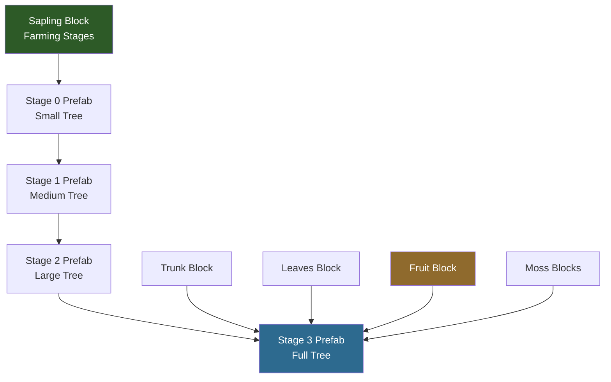

## What You'll Build

An **Enchanted Tree** — a custom tree type that players can grow from a sapling near Crystal Glow blocks. When fully grown, the tree provides **Enchanted Wood** (trunk blocks) for crafting, **Light Shards** (glowing fruit), and **Crystal Moss** decorative blocks. The tree uses Azure tree leaf models and Ash trunk as a base with custom textures and a unique crystal-light growth mechanic.


## What You'll Learn

- How Hytale trees are composed of multiple block types (trunk, leaves, fruit, sapling, moss)
- How `Parent` inheritance creates tree variants from existing types
- How the `Farming` system drives sapling growth through prefab stages
- How to create a custom `Growth Modifier` that responds to specific light colors
- How to configure light-emitting fruit blocks
- How `PrefabList` registers tree structures for the engine

## Prerequisites

- Complete the [Create a Custom Block](/hytale-modding-docs/tutorials/beginner/create-a-block/) tutorial first — this mod **depends on the Crystal Glow Block** created in that tutorial for its growth mechanic
- A mod folder with a valid `manifest.json` (see [Setup Your Dev Environment](/hytale-modding-docs/tutorials/beginner/setup-dev-environment/))
- The [Crystal Glow Block mod](https://github.com/nevesb/hytale-mods-custom-block) installed and working in your mods folder
- Custom textures for trunk, leaves, and fruit (or reuse Azure/Ash textures for testing)

## Git Repository

The complete working mod is available as a GitHub repository:

```text
https://github.com/nevesb/hytale-mods-custom-tree
```

Clone it and copy the contents to your Hytale mods directory to test immediately.

---

## Tree System Overview

A Hytale tree is not a single asset — it is a **composition of multiple block types** plus a **growth system** that assembles them into a tree shape:



| Component | File Location | Purpose |
|-----------|--------------|---------|
| **Trunk** | `Server/Item/Items/Wood/` | The wood block — drops when chopped, used as building material |
| **Leaves** | `Server/Item/Items/Plant/Leaves/` | Decorative canopy — decays when trunk is removed |
| **Fruit** | `Server/Item/Items/Plant/Fruit/` | Harvestable item that grows on the tree — can glow, be consumed, or used as crafting material |
| **Sapling** | `Server/Item/Items/Plant/` | Plantable block with `Farming` stages that grows into a tree over time |
| **Moss** | `Server/Item/Items/Plant/Moss/` | Decorative blocks that grow on the trunk — wall moss and rug moss |
| **Growth Modifier** | `Server/Farming/Modifiers/` | Controls what environmental conditions speed up growth |
| **PrefabList** | `Server/PrefabList/` | Registry that tells the engine where to find the tree prefab files for each growth stage |

Each prefab (`.prefab.json`) is a blueprint containing the exact block positions that form the tree shape at that stage. The sapling's `Farming` system transitions through these prefabs over time.

---

## Step 1: Create the Trunk Block

The trunk is what players chop to get wood. We inherit from `Wood_Ash_Trunk` and override only the textures, gathering, and particle color.

Create `Server/Item/Items/Wood/Enchanted/Wood_Enchanted_Trunk.json`:

```json
{
  "TranslationProperties": {
    "Name": "server.items.Wood_Enchanted_Trunk.name",
    "Description": "server.items.Wood_Enchanted_Trunk.description"
  },
  "Parent": "Wood_Ash_Trunk",
  "BlockType": {
    "Textures": [
      {
        "Sides": "BlockTextures/Wood_Trunk_Crystal_Side.png",
        "UpDown": "BlockTextures/Wood_Trunk_Crystal_Top.png",
        "Weight": 1
      }
    ],
    "Gathering": {
      "Breaking": {
        "ItemId": "Wood_Enchanted_Trunk",
        "GatherType": "Woods"
      }
    },
    "ParticleColor": "#5e3b56"
  },
  "ResourceTypes": [
    { "Id": "Wood_Trunk" },
    { "Id": "Wood_All" },
    { "Id": "Fuel" },
    { "Id": "Charcoal" }
  ],
  "Icon": "Icons/ItemsGenerated/Wood_Enchanted_Trunk.png",
  "IconProperties": {
    "Scale": 0.58823,
    "Rotation": [22.5, 45, 22.5],
    "Translation": [0, -13.5]
  }
}
```

### Trunk Fields

| Field | Type | Purpose |
|-------|------|---------|
| `Parent` | String | Inherits all block properties from `Wood_Ash_Trunk` (hardness, tool requirements, physics) |
| `BlockType.Textures` | Array | Texture configuration. `Sides` for the bark, `UpDown` for the cross-section when viewed from top/bottom |
| `BlockType.Textures[].Weight` | Number | For multiple texture variants — `1` means this is the only option |
| `BlockType.Gathering.Breaking` | Object | What drops when the block is broken. `GatherType: "Woods"` means axes break it faster |
| `BlockType.ParticleColor` | String | Hex color of particles when the block is hit or broken |
| `ResourceTypes` | Array | Tags this block as wood for crafting recipes. `Wood_Trunk` and `Wood_All` let it be used in any recipe requiring wood |
| `IconProperties` | Object | Controls how the 3D model renders as an inventory icon (scale, rotation, position) |

:::tip[Texture Files]
The texture paths are relative to `Common/`. You need two PNG files:
- `Common/BlockTextures/Wood_Trunk_Crystal_Side.png` — bark texture (side faces)
- `Common/BlockTextures/Wood_Trunk_Crystal_Top.png` — ring texture (top/bottom faces)

Since we inherit from Ash, you can start by copying the Ash trunk textures and adjusting the hue to a crystal blue/purple.
:::

---

## Step 2: Create the Leaves Block

Leaves use a shared 3D model (`Ball.blockymodel`) with a custom texture for color. They inherit all decay and physics behavior from the Azure leaves template.

Create `Server/Item/Items/Plant/Leaves/Plant_Leaves_Enchanted.json`:

```json
{
  "TranslationProperties": {
    "Name": "server.items.Plant_Leaves_Enchanted.name"
  },
  "Parent": "Plant_Leaves_Azure",
  "Icon": "Icons/ItemsGenerated/Plant_Leaves_Enchanted.png",
  "BlockType": {
    "CustomModel": "Blocks/Foliage/Leaves/Ball.blockymodel",
    "CustomModelTexture": [
      {
        "Texture": "Blocks/Foliage/Leaves/Ball_Textures/Crystal.png",
        "Weight": 1
      }
    ],
    "ParticleColor": "#1c7baf"
  }
}
```

### Leaves Fields

| Field | Type | Purpose |
|-------|------|---------|
| `Parent` | String | Inherits from `Plant_Leaves_Azure` — gets leaf decay, transparency, and break behavior |
| `BlockType.CustomModel` | String | Shared leaf model. All tree types use the same `Ball.blockymodel` shape |
| `BlockType.CustomModelTexture` | Array | Color texture applied to the model. Change this PNG to change the leaf color |
| `BlockType.ParticleColor` | String | Color of particles when leaves are broken. Use a color that matches the texture |

The `Ball.blockymodel` is a shared vanilla model at `Common/Blocks/Foliage/Leaves/Ball.blockymodel`. You only need to provide a custom texture in `Common/Blocks/Foliage/Leaves/Ball_Textures/Crystal.png`.

---

## Step 3: Create the Fruit Block (Light Shards)

The fruit is the key crafting material — **Light Shards** that glow on the tree and drop when harvested. This block emits light, is transparent, and can be consumed as food.

Create `Server/Item/Items/Plant/Fruit/Plant_Fruit_Enchanted.json`:

```json
{
  "TranslationProperties": {
    "Name": "server.items.Plant_Fruit_Enchanted.name",
    "Description": "server.items.Plant_Fruit_Enchanted.description"
  },
  "Parent": "Template_Fruit",
  "BlockType": {
    "CustomModel": "Resources/Ingredients/Crystal_Fruit.blockymodel",
    "CustomModelTexture": [
      {
        "Texture": "Resources/Ingredients/Crystal_Fruit_Texture.png",
        "Weight": 1
      }
    ],
    "VariantRotation": "UpDown",
    "Opacity": "Transparent",
    "Light": {
      "Color": "#469"
    },
    "BlockSoundSetId": "Mushroom",
    "BlockParticleSetId": "Dust",
    "ParticleColor": "#326ea7",
    "Gathering": {
      "Harvest": {
        "ItemId": "Plant_Fruit_Enchanted"
      },
      "Soft": {
        "ItemId": "Plant_Fruit_Enchanted"
      }
    }
  },
  "InteractionVars": {
    "Consume_Charge": {
      "Interactions": [
        {
          "Parent": "Consume_Charge_Food_T1_Inner",
          "Effects": {
            "Particles": [
              {
                "SystemId": "Food_Eat",
                "Color": "#326ea7",
                "TargetNodeName": "Mouth",
                "TargetEntityPart": "Entity"
              }
            ]
          }
        }
      ]
    }
  },
  "Icon": "Icons/ItemsGenerated/Plant_Fruit_Enchanted.png",
  "Scale": 1.75,
  "DropOnDeath": true,
  "Quality": "Common"
}
```

### Fruit Fields

| Field | Type | Purpose |
|-------|------|---------|
| `Parent` | String | Inherits from `Template_Fruit` — gets harvesting behavior, food consumption logic |
| `BlockType.CustomModel` | String | 3D model for the fruit. Create in Blockbench or reuse an existing fruit model |
| `BlockType.Opacity` | String | `"Transparent"` — the fruit block doesn't block light or vision |
| `BlockType.Light.Color` | String | Hex color of emitted light. `"#469"` gives a soft blue glow matching the crystal theme |
| `BlockType.VariantRotation` | String | `"UpDown"` — the fruit hangs in different orientations for natural variety |
| `BlockType.Gathering.Harvest` | Object | What drops when right-clicking the fruit. Allows collecting without breaking the block |
| `BlockType.Gathering.Soft` | Object | What drops when breaking the fruit block. Same item, but the block is destroyed |
| `InteractionVars` | Object | Defines what happens when consumed. Inherits from `Consume_Charge_Food_T1_Inner` for basic food healing |
| `Scale` | Number | Visual scale multiplier. `1.75` makes the fruit more visible on the tree |
| `DropOnDeath` | Boolean | `true` — the fruit drops as an item when the block is destroyed (tree chopped or leaves decay) |

:::caution[Light Color Format]
`Light.Color` uses a **3-character hex shorthand** where each character represents R, G, B. `"#469"` expands to `#446699` — a muted blue. Unlike `Light.Radius` on items (which must be an integer), block light uses only `Color` and the engine determines the radius from block light level rules.
:::

---

## Step 4: Create the Moss Blocks

Moss blocks grow on and around the tree trunk, adding visual detail. We create two types: **wall moss** (attaches to trunk sides) and **rug moss** (spreads on the ground near the base). Both use `Tint` to recolor the vanilla blue moss textures to match our crystal theme.

### Wall Moss

Create `Server/Item/Items/Plant/Moss/Plant_Moss_Wall_Crystal.json`:

```json
{
  "TranslationProperties": {
    "Name": "server.items.Plant_Moss_Wall_Crystal.name"
  },
  "Parent": "Plant_Moss_Wall_Blue",
  "BlockType": {
    "Gathering": {
      "Soft": {
        "ItemId": "Plant_Moss_Wall_Crystal"
      },
      "UseDefaultDropWhenPlaced": true
    },
    "Tint": ["#88ccff"],
    "ParticleColor": "#88ccff"
  },
  "Icon": "Icons/ItemsGenerated/Plant_Moss_Wall_Crystal.png",
  "IconProperties": {
    "Scale": 0.58823,
    "Rotation": [22.5, 45, 22.5],
    "Translation": [10, -14]
  }
}
```

### Rug Moss

Create `Server/Item/Items/Plant/Moss/Plant_Moss_Rug_Crystal.json`:

```json
{
  "TranslationProperties": {
    "Name": "server.items.Plant_Moss_Rug_Crystal.name"
  },
  "Parent": "Plant_Moss_Rug_Blue",
  "BlockType": {
    "Gathering": {
      "Soft": {
        "ItemId": "Plant_Moss_Rug_Crystal"
      },
      "UseDefaultDropWhenPlaced": true
    },
    "Light": {
      "Color": "#246"
    },
    "Tint": ["#88ccff"],
    "ParticleColor": "#88ccff"
  },
  "Icon": "Icons/ItemsGenerated/Plant_Moss_Rug_Crystal.png",
  "IconProperties": {
    "Scale": 0.58823,
    "Rotation": [22.5, 45, 22.5],
    "Translation": [0, -7]
  }
}
```

### Moss Fields

| Field | Type | Purpose |
|-------|------|---------|
| `Parent` | String | `Plant_Moss_Wall_Blue` or `Plant_Moss_Rug_Blue` — inherits model, placement rules, and decay behavior |
| `BlockType.Tint` | Array | Color tint applied over the parent texture. `"#88ccff"` shifts the blue moss to a crystal blue matching the tree theme |
| `BlockType.Light.Color` | String | Rug moss emits a faint `"#246"` glow, adding subtle ground lighting around the tree base |
| `BlockType.Gathering.Soft` | Object | What drops when breaking the moss. Returns itself |
| `BlockType.Gathering.UseDefaultDropWhenPlaced` | Boolean | `true` — uses the vanilla default drop behavior when the block is placed by a player |

:::tip[Using Tint for Color Variants]
The `Tint` field is a powerful shortcut — instead of creating new textures, you apply a color filter over the parent's existing textures. This is ideal for moss, grass, and flower variants where only the hue needs to change.
:::

---

## Step 5: Create the Sapling

The sapling is the most complex piece — it's a plantable block that inherits from `Plant_Sapling_Oak` and uses the `Farming` system to grow through prefab stages over time. It also uses a custom **CrystalGlow** growth modifier that makes the tree grow only near Crystal Glow block light.

Create `Server/Item/Items/Plant/Plant_Sapling_Enchanted.json`:

```json
{
  "TranslationProperties": {
    "Name": "server.items.Plant_Sapling_Enchanted.name",
    "Description": "server.items.Plant_Sapling_Enchanted.description"
  },
  "Parent": "Plant_Sapling_Oak",
  "BlockType": {
    "CustomModelTexture": [
      {
        "Texture": "Blocks/Foliage/Tree/Sapling_Textures/Crystal.png",
        "Weight": 1
      }
    ],
    "ParticleColor": "#44aacc",
    "Farming": {
      "Stages": {
        "Default": [
          {
            "Block": "Plant_Sapling_Enchanted",
            "Duration": {
              "Min": 500000,
              "Max": 800000
            },
            "Type": "BlockType"
          },
          {
            "Prefabs": [
              {
                "Path": "Trees/Enchanted/Stage_0/Enchanted_Stage0_001.prefab.json",
                "Weight": 1
              }
            ],
            "Duration": {
              "Min": 500000,
              "Max": 800000
            },
            "Type": "Prefab",
            "ReplaceMaskTags": ["Soil"],
            "SoundEventId": "SFX_Crops_Grow"
          },
          {
            "Prefabs": [
              {
                "Path": "Trees/Enchanted/Stage_1/Enchanted_Stage1_001.prefab.json",
                "Weight": 1
              }
            ],
            "Duration": {
              "Min": 500000,
              "Max": 800000
            },
            "Type": "Prefab",
            "ReplaceMaskTags": ["Soil"],
            "SoundEventId": "SFX_Crops_Grow"
          },
          {
            "Prefabs": [
              {
                "Path": "Trees/Enchanted/Stage_2/Enchanted_Stage2_001.prefab.json",
                "Weight": 1
              }
            ],
            "Duration": {
              "Min": 500000,
              "Max": 800000
            },
            "Type": "Prefab",
            "ReplaceMaskTags": ["Soil"],
            "SoundEventId": "SFX_Crops_Grow"
          },
          {
            "Prefabs": [
              {
                "Path": "Trees/Enchanted/Stage_3/Enchanted_Stage3_001.prefab.json",
                "Weight": 1
              }
            ],
            "Type": "Prefab",
            "ReplaceMaskTags": ["Soil"],
            "SoundEventId": "SFX_Crops_Grow"
          }
        ]
      },
      "StartingStageSet": "Default",
      "ActiveGrowthModifiers": ["CrystalGlow"]
    },
    "Gathering": {
      "Soft": {
        "ItemId": "Plant_Sapling_Enchanted"
      }
    }
  },
  "Icon": "Icons/ItemsGenerated/Plant_Sapling_Enchanted.png",
  "IconProperties": {
    "Scale": 0.58823,
    "Rotation": [0, 0, 0],
    "Translation": [0, -13.5]
  }
}
```

### How Farming Stages Work

The `Farming.Stages.Default` array defines the growth progression:


| Stage | Type | What Happens |
|-------|------|-------------|
| 0 | `BlockType` | The sapling block itself sits in the world. After 500,000–800,000 ticks, it transitions to the first prefab |
| 1 | `Prefab` | The engine replaces the sapling with a small tree prefab (a few trunk + leaf blocks) |
| 2 | `Prefab` | Replaces with a medium tree prefab (taller, more leaves) |
| 3 | `Prefab` | Replaces with a large tree prefab (branches, fruit start appearing) |
| 4 | `Prefab` | The final, fully grown tree. **No `Duration`** — it stays permanently |

### Sapling Key Differences from Scratch

Because we inherit from `Plant_Sapling_Oak`, the sapling already has:
- `DrawType: "Model"` and `CustomModel: "Blocks/Foliage/Tree/Sapling.blockymodel"`
- `BlockEntity.Components.FarmingBlock: {}`
- `Support.Down` requiring soil
- `HitboxType: "Plant_Large"`
- `Group: "Wood"` and `RandomRotation: "YawStep1"`
- Categories, tags, interactions, and sound sets

We only need to override: the **texture**, **particle color**, **farming stages** (to point to our own prefabs), **gathering** (to drop our sapling), and the **growth modifier**.

### Key Farming Fields

| Field | Type | Purpose |
|-------|------|---------|
| `Stages.Default[].Type` | String | `"BlockType"` for the sapling block, `"Prefab"` for tree model stages |
| `Stages.Default[].Block` | String | For `BlockType` stages: the block ID (the sapling itself) |
| `Stages.Default[].Prefabs` | Array | For `Prefab` stages: list of prefab paths with weights for random selection |
| `Stages.Default[].Duration` | Object | `Min`/`Max` in game ticks. The engine picks a random value. Omit on the final stage to make it permanent |
| `Stages.Default[].ReplaceMaskTags` | Array | Block tags that prefabs can replace. `"Soil"` lets roots push into dirt |
| `Stages.Default[].SoundEventId` | String | Sound played when transitioning to this stage |
| `StartingStageSet` | String | Which stage set to begin with. `"Default"` is standard |
| `ActiveGrowthModifiers` | Array | Growth modifier IDs. `"CrystalGlow"` is our custom modifier defined in the next step |

:::tip[Multiple Prefab Variants]
To add visual variety, include multiple entries in a stage's `Prefabs` array with equal `Weight`. The engine picks one at random:
```json
"Prefabs": [
  { "Path": "Trees/Enchanted/Stage_2/Enchanted_Stage2_001.prefab.json", "Weight": 1 },
  { "Path": "Trees/Enchanted/Stage_2/Enchanted_Stage2_002.prefab.json", "Weight": 1 }
]
```
:::

---

## Step 6: Create the Crystal Glow Growth Modifier

This is what makes the Enchanted Tree unique — it only grows near **Crystal Glow blocks** (`#88ccff` light). The modifier filters light by RGB color to ensure only the right light source triggers growth.

Create `Server/Farming/Modifiers/CrystalGlow.json`:

```json
{
  "Type": "LightLevel",
  "Modifier": 2500,
  "ArtificialLight": {
    "Red": {
      "Min": 0,
      "Max": 5
    },
    "Green": {
      "Min": 1,
      "Max": 127
    },
    "Blue": {
      "Min": 1,
      "Max": 127
    }
  },
  "Sunlight": {
    "Min": 0,
    "Max": 5
  },
  "RequireBoth": true
}
```

### Growth Modifier Fields

| Field | Type | Purpose |
|-------|------|---------|
| `Type` | String | `"LightLevel"` — this modifier checks light conditions at the sapling's position |
| `Modifier` | Number | Growth speed multiplier. `2500` gives a massive boost, making the tree grow fast near crystal light |
| `ArtificialLight.Red` | Object | RGB filter — Red `0-5` filters out torches and other warm light sources (high red component) |
| `ArtificialLight.Green` | Object | Green `1-127` accepts the green component of Crystal Glow light |
| `ArtificialLight.Blue` | Object | Blue `1-127` accepts the blue component of Crystal Glow light |
| `Sunlight` | Object | `0-5` — the tree only grows in darkness or deep shade (sunlight inhibits growth) |
| `RequireBoth` | Boolean | `true` — **both** artificial light AND sunlight conditions must be met simultaneously |

:::caution[How the RGB Filter Works]
The Crystal Glow block emits `#88ccff` light, which has RGB values of approximately R:136, G:204, B:255. The modifier accepts this because:
- Red `0-5`: The filter checks the **ambient red level** at the sapling, not the light source's color directly. In a dark area lit only by Crystal Glow, the red level is low.
- Green/Blue `1-127`: Ensures some artificial light is present (not zero).
- Sunlight `0-5`: Forces underground/nighttime planting.

Torches and other warm lights have high red components, so they **fail** the Red filter and don't trigger growth.
:::

---

## Step 7: Register the PrefabList

The `PrefabList` tells the engine where to scan for your tree's prefab files. Each growth stage has its own directory.

Create `Server/PrefabList/Trees_Enchanted.json`:

```json
{
  "Prefabs": [
    {
      "RootDirectory": "Asset",
      "Path": "Trees/Enchanted/Stage_0/",
      "Recursive": true
    },
    {
      "RootDirectory": "Asset",
      "Path": "Trees/Enchanted/Stage_1/",
      "Recursive": true
    },
    {
      "RootDirectory": "Asset",
      "Path": "Trees/Enchanted/Stage_2/",
      "Recursive": true
    },
    {
      "RootDirectory": "Asset",
      "Path": "Trees/Enchanted/Stage_3/",
      "Recursive": true
    }
  ]
}
```

### PrefabList Fields

| Field | Type | Purpose |
|-------|------|---------|
| `Prefabs` | Array | List of directory entries to scan |
| `RootDirectory` | String | `"Asset"` — relative to the mod's `Server/Prefabs/` directory |
| `Path` | String | Subdirectory containing `.prefab.json` files for one growth stage |
| `Recursive` | Boolean | `true` — scan subdirectories as well |

The actual `.prefab.json` files contain block position data that forms the tree shape. These are created using the Hytale prefab editor in Creative Mode and contain references to the block types we defined above (trunk, leaves, fruit, moss). The prefabs are included in the [companion repository](https://github.com/nevesb/hytale-mods-custom-tree).

---

## Step 8: Add Translations

Create language files under `Server/Languages/`:

**`Server/Languages/en-US/server.lang`**
```properties
items.Wood_Enchanted_Trunk.name = Enchanted Wood
items.Wood_Enchanted_Trunk.description = Shimmering wood harvested from an Enchanted Tree.
items.Plant_Leaves_Enchanted.name = Enchanted Leaves
items.Plant_Fruit_Enchanted.name = Light Shard
items.Plant_Fruit_Enchanted.description = A glowing fruit from the Enchanted Tree. Used to craft light-infused ammunition.
items.Plant_Sapling_Enchanted.name = Enchanted Sapling
items.Plant_Sapling_Enchanted.description = Plant on soil to grow an Enchanted Tree.
items.Plant_Moss_Wall_Crystal.name = Crystal Wall Moss
items.Plant_Moss_Rug_Crystal.name = Crystal Moss Rug
```

**`Server/Languages/es/server.lang`**
```properties
items.Wood_Enchanted_Trunk.name = Madera Encantada
items.Wood_Enchanted_Trunk.description = Madera reluciente cosechada de un Arbol Encantado.
items.Plant_Leaves_Enchanted.name = Hojas Encantadas
items.Plant_Fruit_Enchanted.name = Fragmento de Luz
items.Plant_Fruit_Enchanted.description = Una fruta brillante del Arbol Encantado. Se usa para fabricar municion infundida con luz.
items.Plant_Sapling_Enchanted.name = Brote Encantado
items.Plant_Sapling_Enchanted.description = Planta en tierra para hacer crecer un Arbol Encantado.
items.Plant_Moss_Wall_Crystal.name = Musgo de Pared Cristalino
items.Plant_Moss_Rug_Crystal.name = Alfombra de Musgo Cristalino
```

**`Server/Languages/pt-BR/server.lang`**
```properties
items.Wood_Enchanted_Trunk.name = Madeira Encantada
items.Wood_Enchanted_Trunk.description = Madeira reluzente colhida de uma Arvore Encantada.
items.Plant_Leaves_Enchanted.name = Folhas Encantadas
items.Plant_Fruit_Enchanted.name = Fragmento de Luz
items.Plant_Fruit_Enchanted.description = Uma fruta brilhante da Arvore Encantada. Usada para fabricar municao infundida com luz.
items.Plant_Sapling_Enchanted.name = Muda Encantada
items.Plant_Sapling_Enchanted.description = Plante em solo para cultivar uma Arvore Encantada.
items.Plant_Moss_Wall_Crystal.name = Musgo de Parede Cristalino
items.Plant_Moss_Rug_Crystal.name = Tapete de Musgo Cristalino
```

---

## Step 9: Complete Mod Structure

```text
CreateACustomTree/
├── manifest.json
├── Common/
│   ├── BlockTextures/
│   │   ├── Wood_Trunk_Crystal_Side.png
│   │   └── Wood_Trunk_Crystal_Top.png
│   ├── Blocks/Foliage/
│   │   ├── Leaves/
│   │   │   ├── Ball.blockymodel
│   │   │   └── Ball_Textures/
│   │   │       └── Crystal.png
│   │   └── Tree/
│   │       ├── Sapling.blockymodel
│   │       └── Sapling_Textures/
│   │           └── Crystal.png
│   ├── Resources/Ingredients/
│   │   ├── Crystal_Fruit.blockymodel
│   │   └── Crystal_Fruit_Texture.png
│   └── Icons/ItemsGenerated/
│       ├── Wood_Enchanted_Trunk.png
│       ├── Plant_Sapling_Enchanted.png
│       ├── Plant_Fruit_Enchanted.png
│       ├── Plant_Leaves_Enchanted.png
│       ├── Plant_Moss_Wall_Crystal.png
│       └── Plant_Moss_Rug_Crystal.png
├── Server/
│   ├── Farming/Modifiers/
│   │   └── CrystalGlow.json
│   ├── Item/Items/
│   │   ├── Wood/Enchanted/
│   │   │   └── Wood_Enchanted_Trunk.json
│   │   └── Plant/
│   │       ├── Leaves/
│   │       │   └── Plant_Leaves_Enchanted.json
│   │       ├── Fruit/
│   │       │   └── Plant_Fruit_Enchanted.json
│   │       ├── Moss/
│   │       │   ├── Plant_Moss_Wall_Crystal.json
│   │       │   └── Plant_Moss_Rug_Crystal.json
│   │       └── Plant_Sapling_Enchanted.json
│   ├── PrefabList/
│   │   └── Trees_Enchanted.json
│   ├── Prefabs/Trees/Enchanted/
│   │   ├── Stage_0/Enchanted_Stage0_001.prefab.json
│   │   ├── Stage_1/Enchanted_Stage1_001.prefab.json
│   │   ├── Stage_2/Enchanted_Stage2_001.prefab.json
│   │   └── Stage_3/Enchanted_Stage3_001.prefab.json
│   └── Languages/
│       ├── en-US/server.lang
│       ├── es/server.lang
│       └── pt-BR/server.lang
```

---

## Step 10: Test In-Game

1. Copy the mod folder to `%APPDATA%/Hytale/UserData/Mods/`
2. Also install the [Crystal Glow Block mod](https://github.com/nevesb/hytale-mods-custom-block) — it's required for the growth mechanic
3. Launch Hytale and enter **Creative Mode**
4. Grant yourself operator permissions and spawn the items:
   ```text
   /op self
   /spawnitem Wood_Enchanted_Trunk
   /spawnitem Plant_Sapling_Enchanted
   /spawnitem Plant_Fruit_Enchanted
   /spawnitem Block_Crystal_Glow
   ```
5. Place the trunk and verify the custom texture appears
6. Place Crystal Glow blocks in a dark area (underground or at night)
7. Place the sapling on soil near the Crystal Glow blocks and confirm:
   - It renders with the crystal sapling texture
   - It requires soil below (breaks if soil is removed)
   - Breaking it returns the sapling item
8. Wait for growth — the CrystalGlow modifier gives a 2500x speed boost, so growth should be fast near the crystal light
9. Verify the fully grown tree has:
   - Enchanted trunk blocks with crystal-blue textures
   - Crystal leaves in ice-blue color
   - Glowing Light Shard fruit
   - Crystal Moss on the trunk and ground

---

## Common Pitfalls

| Problem | Cause | Fix |
|---------|-------|-----|
| Sapling places but never grows | Missing `FarmingBlock` component or no crystal light | Ensure sapling inherits from `Plant_Sapling_Oak` (has `FarmingBlock`) and place Crystal Glow blocks nearby in darkness |
| `Unknown prefab path` | Prefab file missing or wrong path | Verify `.prefab.json` files exist at the paths referenced in `Farming.Stages` |
| Sapling floats in air | Missing `Support` | Inherited from `Plant_Sapling_Oak` — ensure parent is correct |
| Fruit doesn't glow | Wrong `Light` format | Use `"Light": { "Color": "#469" }` inside `BlockType` (not at root level) |
| Leaves use wrong model | `CustomModel` path incorrect | Shared models like `Ball.blockymodel` are at `Blocks/Foliage/Leaves/Ball.blockymodel` |
| Growth too slow | `CrystalGlow` modifier not activating | Check that Crystal Glow blocks are placed nearby, area is dark (sunlight 0-5), and no warm lights (torches) are near |
| Moss color wrong | `Tint` not applied | Ensure `Tint` is an array: `["#88ccff"]`, not a string |
| Tree grows with any light | Wrong `ActiveGrowthModifiers` | Use `["CrystalGlow"]` not generic `["LightLevel"]` |

---

## How This Connects

The Enchanted Tree provides key materials for the rest of the tutorial series:

- **Enchanted Wood** → used as the handle material when crafting the [Crystal Sword](/hytale-modding-docs/tutorials/beginner/create-an-item/) and [Crystal Crossbow](/hytale-modding-docs/tutorials/intermediate/projectile-weapons/)
- **Light Shards** → used as ammunition for the Crystal Crossbow's light bolts

Next tutorial: [Custom Loot Tables](/hytale-modding-docs/tutorials/intermediate/custom-loot-tables/) — configure advanced drop tables so the Enchanted Tree and Slime drop the right materials with proper weights.
